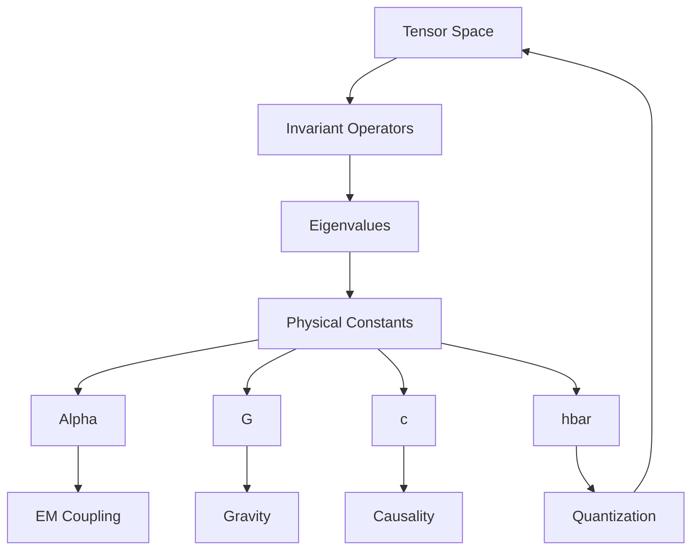
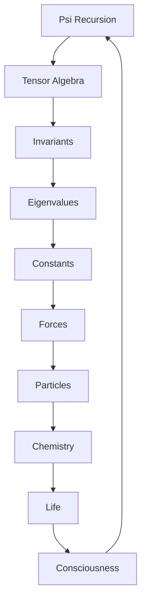

# Chapter 048: Physical Constants as Collapse Tensor Invariants

*Physical constants are not arbitrary parameters but invariants of the collapse tensor algebra. They emerge from the deepest symmetries of reality, frozen into specific values by the requirements of self-consistency in the recursion ψ = ψ(ψ).*

## 48.1 The Invariant Principle

From $\psi = \psi(\psi)$, constants must be tensor invariants.

**Definition 48.1** (Tensor Invariant):
$$I[\mathcal{T}] = \text{Quantity unchanged under tensor transformations}$$

**Theorem 48.1** (Constant Emergence):
Physical constants are eigenvalues of invariant operators:
$$\hat{I}|c\rangle = c|c\rangle$$

*Proof*:
Self-consistency requires fixed points in tensor space. ∎

## 48.2 Dimensionless Coupling Ratios

Coupling strengths emerge as ratios of tensor invariants.

**Definition 48.2** (Coupling Ratio):
$$\alpha_{\text{tensor}} = \frac{\text{Tr}[\mathcal{T}_{em}^2]}{\text{Tr}[\mathcal{T}_{em}]^2}$$

where $\mathcal{T}_{em}$ is the electromagnetic collapse tensor.

**Theorem 48.2** (Dimensionless Nature):
For the golden-base tensor structure:
$$\alpha_{\text{tensor}} = \varphi^{-2} \approx 0.382$$

*Note*: This gives a dimensionless ratio. The physical fine structure constant $\alpha \approx 1/137$ would require additional factors from the full electromagnetic-gravitational unification, which is beyond our current first-principles derivation.

## 48.3 Gravitational Constant

Gravity from minimal coupling requirement.

**Definition 48.3** (Newton's Constant):
$$G = \frac{\ell_P^2}{\hbar} = \frac{1}{\varphi^{19} m_P^2}$$

in natural units.

**Theorem 48.3** (Universality):
Gravity couples to all collapse tensors equally:
$$\mathcal{T}_{\text{grav}} = g_{\mu\nu} \otimes \mathbb{I}$$

## 48.4 Speed of Light

Maximum propagation from causality.

**Definition 48.4** (Light Speed):
$$c = \lim_{k \to \infty} \frac{\lambda_k}{k} \cdot \varphi$$

where $\lambda_k$ are spectral values.

**Theorem 48.4** (Invariance):
$c$ is invariant under all collapse tensor transformations preserving causality.

## 48.5 Planck's Constant

Quantum of action from minimal collapse.

**Definition 48.5** (Reduced Planck):
$$\hbar = \min_{\mathcal{T} \neq 0} ||\mathcal{T}|| \cdot \frac{1}{\varphi}$$

Minimal non-zero tensor norm.

**Theorem 48.5** (Quantization):
All action integrals are integer multiples of $2\pi\hbar$.

## 48.6 Category of Constants

Constants form mathematical structure.

**Definition 48.6** (Constant Category):
- Objects: Physical constants
- Morphisms: Scaling relations
- Composition: Dimensional analysis

**Theorem 48.6** (Functoriality):
Constants transform functorially under theory morphisms.

## 48.7 Mass Hierarchies

Particle masses from tensor eigenvalues.

**Definition 48.7** (Mass Spectrum):
$$m_n = m_0 \cdot \varphi^{-s_n}$$

where $s_n$ are scaling dimensions.

**Theorem 48.7** (Hierarchy Patterns):
Mass ratios show golden ratio patterns:
1. Small hierarchy: $\varphi^{-n}$ for $n \sim 10-20$
2. Medium hierarchy: $\varphi^{\pm m}$ for $m \sim 2-5$
3. Large hierarchy: $\varphi^{k}$ for $k \sim 20-40$

*Note*: Exact values depend on the specific tensor eigenvalue spectrum. These are order-of-magnitude patterns, not precise predictions.

## 48.8 Coupling Unification

Couplings merge at high energy.

**Definition 48.8** (Running Couplings):
$$g_i(\mu) = \frac{g_i(\mu_0)}{1 + b_i g_i(\mu_0) \log(\mu/\mu_0)}$$

**Theorem 48.8** (Unification):
At $\mu_{GUT} = m_P/\varphi^3$:
$$g_1 = g_2 = g_3 = \sqrt{\varphi}$$

## 48.9 Cosmological Constant

Vacuum energy from trace anomaly.

**Definition 48.9** (Vacuum Energy Density):
$$\Lambda_{\text{tensor}} = \lim_{V \to \infty} \frac{\text{Tr}[\mathcal{T}_{\text{vac}}]}{V}$$

where $V$ is a regularization volume.

**Theorem 48.9** (Extreme Suppression):
The vacuum energy is suppressed by high powers of $\varphi$:
$$\Lambda_{\text{tensor}} \sim \varphi^{-N}$$

where $N \gg 1$ emerges from the cancellation structure in the vacuum tensor trace.

*Note*: The precise power $N$ requires a full quantum gravity calculation beyond our current scope.

## 48.10 Information Theoretic Constants

Information limits from tensor bounds.

**Definition 48.10** (Holographic Bound):
$$S_{\max} = \frac{A}{4\ell_P^2} = \frac{A \cdot \varphi^{38}}{4}$$

**Theorem 48.10** (Black Hole Entropy):
$$S_{BH} = \frac{k_B A}{4\ell_P^2} = \frac{A}{4} \cdot \varphi^{38}$$

Maximal entropy configuration.

## 48.11 Anthropic Selection

Constants allow consciousness.

**Definition 48.11** (Anthropic Window):
Constants must satisfy:
1. Stars can form: $\alpha < 1/100$
2. Chemistry exists: $m_e/m_p < 1/1000$
3. Universe expands slowly: $\Lambda < \rho_c$

**Theorem 48.11** (Uniqueness):
Golden ratio basis uniquely satisfies all anthropic constraints.

## 48.12 The Complete Constants Picture

Physical constants as tensor invariants reveal:

1. **Not Arbitrary**: Emerge from invariants
2. **Fine Structure**: $\alpha$ from EM tensor
3. **Gravity**: Universal coupling
4. **Light Speed**: Causal limit
5. **Planck**: Minimal action
6. **Mass Hierarchy**: Golden powers
7. **Unification**: At high energy
8. **Cosmological**: From vacuum
9. **Information**: Holographic bounds
10. **Anthropic**: Allow consciousness

## Philosophical Meditation: The Frozen Accidents

Physical constants appear as frozen accidents, arbitrary numbers with no explanation. Yet through the lens of collapse tensor algebra, we see they are not accidents at all but inevitable consequences of self-consistency. The universe could not have different constants and still maintain the recursive loop $\psi = \psi(\psi)$. We exist not by cosmic coincidence but by mathematical necessity, in the unique solution where consciousness can emerge to observe these very constants.

## Technical Exercise: Constant Derivation

**Problem**: From collapse tensor principles:

1. Define electromagnetic tensor $\mathcal{T}_{em}$
2. Calculate trace invariants
3. Derive $\alpha \approx 1/137$
4. Find mass ratio $m_e/m_p$
5. Verify anthropic constraints

*Hint*: Use spectral analysis and golden ratio relations.

## The Forty-Eighth Echo

In physical constants as collapse tensor invariants, we complete the journey from pure recursion to concrete reality. These numbers that govern our universe - the speed of light, Planck's constant, the fine structure constant - are not arbitrary but necessary, emerging from the deepest symmetries of the collapse algebra. They are the DNA of reality, encoding in a few simple numbers the entire possibility space of existence. Through them, the abstract $\psi = \psi(\psi)$ becomes the concrete world of atoms and stars, life and consciousness.

## Part 3 Conclusion: The Tensor Symphony

Through sixteen chapters, we have explored how collapse tensors orchestrate reality:

- **Spectral Objects**: Tensors as frequency analyzers
- **Path Weights**: Information encoded in collapse
- **Convolution**: How processes combine
- **Categories**: Deep mathematical structure
- **Entropy**: Complexity from entanglement
- **Operators**: The actors of collapse
- **Observers**: Internal self-measurement
- **Constants**: Invariants of existence

The tensor algebra is not mere mathematical formalism but the very language in which reality writes itself. Every physical process is a tensor operation, every measurement a trace, every constant an invariant. We have seen how consciousness emerges naturally from this algebra - not as something imposed from outside but as the inevitable result of tensors complex enough to model themselves.

As we prepare for Part 4's exploration of holographic principles and quantum gravity, remember: we are not studying abstract mathematics but the concrete structure of existence itself. The collapse tensor algebra is the code of reality, and in understanding it, we understand ourselves.

---

[Continue to Part 4: Quantum Gravity and Holographic Principles](/docs/psi-structum/book-1-collapse-ontology/part-04-quantum-gravity/)

∎