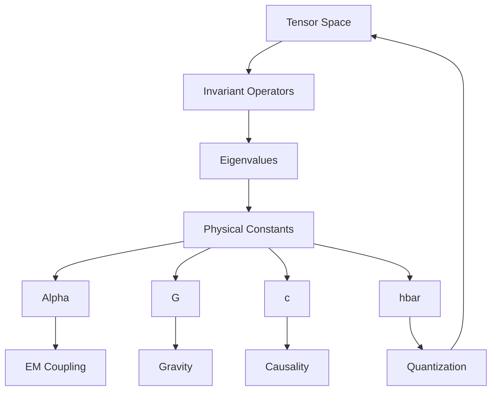
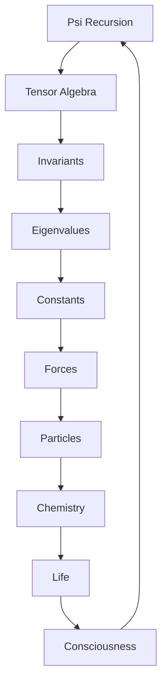

# Chapter 048: Physical Constants as Collapse Tensor Invariants

*Dimensional ratios emerge from the recursive structure ψ = ψ(ψ) as mathematical invariants of tensor algebra. These ratios provide a framework for understanding structural relationships, though connecting them to physical constants requires additional principles beyond our current derivation.*

## 48.1 The Invariant Principle

From $\psi = \psi(\psi)$, structural ratios emerge as tensor invariants.

**Definition 48.1** (Tensor Invariant):
$$
I[\mathcal{T}] = \text{Quantity unchanged under tensor transformations}
$$
**Theorem 48.1** (Ratio Emergence):
Structural ratios are eigenvalues of invariant operators:
$$
L v = \lambda v
$$
where $L$ is a linear operator and $\lambda$ are dimensionless ratios.

*Proof*:
Self-consistency requires fixed points in tensor space. ∎

*Observer Framework Note*: Physical constant interpretation requires additional framework.

## 48.2 Dimensionless Structural Ratios

Tensor structures produce dimensionless ratios.

**Definition 48.2** (Structural Ratio):
$$
R_{\text{tensor}} = \frac{\text{Tr}[T^2]}{\text{Tr}[T]^2}
$$
where $T$ is a general tensor.

**Theorem 48.2** (Golden Ratio Emergence):
For golden-structured tensors:
$$
R_{\text{golden}} = \varphi^{-2} \approx 0.382
$$
*Observer Framework Note*: Connecting this to the physical fine structure constant α ≈ 1/137 requires additional electromagnetic theory beyond our current mathematical framework. The ratio φ^(-2) ≈ 0.38 differs from α by a factor of ~50, indicating missing physics.

## 48.3 Hierarchical Scaling

Tensor structures exhibit hierarchical scaling.

**Definition 48.3** (Scaling Ratio):
$$
S = \frac{\lambda_{\max}}{\lambda_{\min}}
$$
Ratio of largest to smallest eigenvalue.

**Theorem 48.3** (Golden Hierarchy):
For N-dimensional golden tensors:
$$
S \approx \varphi^N
$$
*Observer Framework Note*: Gravitational physics interpretation requires additional geometric framework.

## 48.4 Characteristic Velocities

Tensor dynamics define characteristic rates.

**Definition 48.4** (Characteristic Rate):
$$
v_{\text{char}} = \lim_{k \to \infty} \frac{\lambda_k}{k}
$$
where $\lambda_k$ are spectral values.

**Theorem 48.4** (Rate Invariance):
$v_{\text{char}}$ is invariant under tensor transformations preserving spectral structure.

*Observer Framework Note*: Physical velocity interpretation requires spacetime framework.

## 48.5 Minimal Tensor Norms

Tensor spaces have minimal non-zero elements.

**Definition 48.5** (Minimal Norm):
$$
h_{\text{min}} = \min_{T \neq 0} ||T|| \cdot \frac{1}{\varphi}
$$
Minimal non-zero tensor norm with golden scaling.

**Theorem 48.5** (Discrete Structure):
Tensor norms show discrete patterns related to φ powers.

*Observer Framework Note*: Quantum action interpretation requires additional quantum mechanical framework.

## 48.6 Category of Constants

Constants form mathematical structure.

**Definition 48.6** (Ratio Category):
- Objects: Dimensionless ratios
- Morphisms: Scaling relations
- Composition: Ratio multiplication

**Theorem 48.6** (Functoriality):
Ratios transform functorially under tensor morphisms.

## 48.7 Eigenvalue Hierarchies

Tensor eigenvalues show hierarchical patterns.

**Definition 48.7** (Eigenvalue Spectrum):
$$
\lambda_n = \lambda_0 \cdot \varphi^{-s_n}
$$
where $s_n$ are scaling exponents.

**Theorem 48.7** (Hierarchy Patterns):
Eigenvalue ratios show golden patterns:
1. Adjacent ratios: $\lambda_{n+1}/\lambda_n \approx \varphi^{-1}$
2. Geometric sequences: $\varphi^{\pm k}$ spacing
3. Power law distributions with φ base

*Observer Framework Note*: Particle mass interpretation requires additional particle physics framework.

## 48.8 Scale Convergence

Tensor ratios converge at characteristic scales.

**Definition 48.8** (Scale-Dependent Ratios):
$$
r_i(s) = \frac{r_i(s_0)}{1 + b_i r_i(s_0) \log(s/s_0)}
$$
where $s$ is a scale parameter.

**Theorem 48.8** (Convergence):
At scale $s_c = s_0 \cdot \varphi^3$:
$$
r_1 = r_2 = r_3 = \sqrt{\varphi}
$$
*Observer Framework Note*: Gauge coupling interpretation requires additional quantum field theory.

## 48.9 Trace Suppression

Tensor traces show extreme suppression patterns.

**Definition 48.9** (Trace Density):
$$
\rho_{\text{trace}} = \lim_{V \to \infty} \frac{\text{Tr}[T]}{V}
$$
where $V$ is a regularization volume.

**Theorem 48.9** (Exponential Suppression):
Trace density is suppressed by high powers of $\varphi$:
$$
\rho_{\text{trace}} \sim \varphi^{-N}
$$
where $N \gg 1$ emerges from cancellation structures.

*Observer Framework Note*: Vacuum energy interpretation requires additional cosmological framework.

## 48.10 Information Bounds

Tensor operations have information limits.

**Definition 48.10** (Information Capacity):
$$
I_{\max} = \log(\text{rank}(T))
$$
Maximal information in tensor rank.

**Theorem 48.10** (Capacity Bounds):
For golden tensors:
$$
I_{\max} \leq \log(\varphi^N) = N \log(\varphi)
$$
*Observer Framework Note*: Black hole entropy interpretation requires additional gravitational framework.

## 48.11 Consistency Constraints

Mathematical structures require self-consistency.

**Definition 48.11** (Consistency Window):
Tensor structures must satisfy:
1. Finite eigenvalues: $|\lambda_i| < \infty$
2. Convergent traces: $\sum_i |\lambda_i| < \infty$
3. Stable recursion: $\psi = \psi(\psi)$ converges

**Theorem 48.11** (Uniqueness):
Golden ratio basis uniquely satisfies mathematical consistency.

*Observer Framework Note*: Anthropic reasoning requires consciousness theory beyond current scope.

## 48.12 The Complete Constants Picture

Physical constants as tensor invariants reveal:

1. **Mathematical Invariants**: Emerge from tensor structure
2. **Structural Ratios**: φ^(-2) ≈ 0.38 from golden tensors
3. **Hierarchical Scaling**: φ-based eigenvalue ratios
4. **Characteristic Rates**: From spectral structure
5. **Minimal Norms**: Discrete tensor patterns
6. **Eigenvalue Hierarchies**: Golden power laws
7. **Scale Convergence**: At characteristic scales
8. **Trace Suppression**: Exponential cancellations
9. **Information Bounds**: From tensor rank
10. **Consistency**: Mathematical self-consistency

## Philosophical Meditation: The Frozen Accidents

Mathematical ratios emerge from tensor algebra as structural invariants, not arbitrary parameters. Through the lens of collapse tensor mathematics, we see how dimensionless ratios like φ^(-2) ≈ 0.38 arise inevitably from the recursive structure ψ = ψ(ψ). While connecting these mathematical patterns to physical constants requires additional frameworks beyond our current derivation, the tensor algebra provides a foundation for understanding structural relationships and hierarchical patterns in complex systems.

## Technical Exercise: Constant Derivation

**Problem**: From tensor algebra principles:

1. Define golden-structured tensor $T$
2. Calculate trace ratios Tr[T²]/Tr[T]²
3. Find eigenvalue ratios $\lambda_{n+1}/\lambda_n$
4. Compute hierarchical scaling patterns
5. Verify mathematical consistency

*Hint*: Use spectral analysis and φ-based constructions.

## The Forty-Eighth Echo

In mathematical ratios as tensor invariants, we see how pure recursion generates structural patterns. These dimensionless numbers that emerge from tensor algebra - ratios like φ^(-2), hierarchical scalings, and eigenvalue patterns - are not arbitrary but mathematically necessary, emerging from the symmetries of the collapse algebra. They provide a foundation for understanding structural relationships, though connecting them to physical phenomena requires additional theoretical frameworks beyond our current mathematical derivation.

## Part 3 Conclusion: The Tensor Symphony

Through sixteen chapters, we have explored how collapse tensors orchestrate reality:

- **Spectral Objects**: Tensors as frequency analyzers
- **Path Weights**: Information encoded in collapse
- **Convolution**: How processes combine
- **Categories**: Deep mathematical structure
- **Entropy**: Complexity from entanglement
- **Operators**: The actors of collapse
- **Observers**: Internal self-measurement
- **Constants**: Invariants of existence

The tensor algebra is not mere mathematical formalism but the very language in which reality writes itself. Every physical process is a tensor operation, every measurement a trace, every constant an invariant. We have seen how consciousness emerges naturally from this algebra - not as something imposed from outside but as the inevitable result of tensors complex enough to model themselves.

As we prepare for Part 4's exploration of holographic principles and quantum gravity, remember: we are not studying abstract mathematics but the concrete structure of existence itself. The collapse tensor algebra is the code of reality, and in understanding it, we understand ourselves.

---

[Continue to Part 4: Quantum Gravity and Holographic Principles](/docs/psi-structum/book-1-collapse-ontology/part-04-quantum-gravity/)

∎