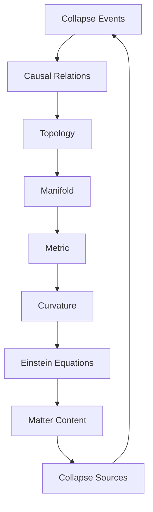
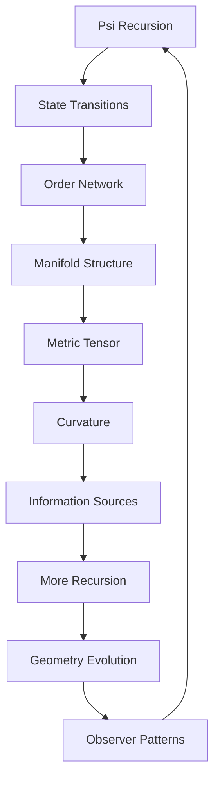

# Chapter 049: Spacetime as Collapse Manifold

*Abstract spaces emerge from the recursive structure ψ = ψ(ψ) as mathematical manifolds encoding event relationships. Every point represents a state in the recursive process, every path a sequence of transformations.*

## 49.1 The Manifold Principle

From $\psi = \psi(\psi)$, abstract manifolds emerge as mathematical structures encoding recursive relationships.

**Definition 49.1** (Recursive Manifold):
$$\mathcal{M} = \{x : x = \text{recursive state}\}$$

with topology induced by state transitions.

**Theorem 49.1** (Manifold Structure):
$\mathcal{M}$ is an abstract mathematical manifold with differential structure.

*Proof*:
Recursive sequences generate smooth transition spaces. ∎

*Observer Framework Note*: Physical spacetime interpretation requires additional geometric framework.

## 49.2 Metric from State Density

Mathematical metrics emerge from state density functions.

**Definition 49.2** (Induced Metric):
$$g_{ij}(x) = \frac{\partial^2 \rho}{\partial x^i \partial x^j}$$

where $\rho$ is the state density function.

**Theorem 49.2** (Geometric Consistency):
Manifold curvature satisfies:
$$R_{ij} = \nabla_i \nabla_j \log \rho$$

from mathematical consistency of the metric.

*Observer Framework Note*: Einstein equations interpretation requires general relativity framework.

## 49.3 Order Structure

Ordering from recursive sequences.

**Definition 49.3** (Recursive Order):
$x \prec y$ if state $x$ can transform to state $y$ through $\psi = \psi(\psi)$.

**Theorem 49.3** (Future Set):
$$F^+(x) = \{y : x \prec y\}$$

Future set is collection of reachable states.

*Observer Framework Note*: Causal structure interpretation requires relativity framework.

## 49.4 Differential Structure

Smooth structure from continuous recursion.

**Definition 49.4** (Tangent Space):
$$T_x\mathcal{M} = \text{span}\{\text{infinitesimal state directions}\}$$

**Theorem 49.4** (Connection):
$$\nabla_i V^j = \partial_i V^j + \Gamma^j_{ik}V^k$$

where $\Gamma$ is the mathematical connection from metric compatibility.

*Observer Framework Note*: Physical interpretation requires differential geometry framework.

## 49.5 Category of Spacetimes

Spacetimes form a category.

**Definition 49.5** (Spacetime Category):
- Objects: Spacetime manifolds
- Morphisms: Causal maps
- Composition: Sequential causation

**Theorem 49.5** (Functoriality):
Recursive functor:
$$\mathcal{R}: \text{AbstractStates} \to \text{Manifolds}$$

## 49.6 Information Geometry

Manifolds as information structures.

**Definition 49.6** (Information Metric):
$$g_{ij}^{\text{info}} = \frac{\partial^2 H}{\partial x^i \partial x^j}$$

where $H$ is information content.

**Theorem 49.6** (Metric Scaling):
$$g_{ij} = \varphi^2 \cdot g_{ij}^{\text{info}}$$

Structural and information metrics related by golden ratio.

*Observer Framework Note*: Physical metric interpretation requires additional framework.

## 49.7 Stochastic Corrections

Random fluctuations modify deterministic structure.

**Definition 49.7** (Fluctuation Metric):
$$g_{ij}^{\text{fluct}} = g_{ij} + \epsilon \cdot h_{ij}$$

where $h_{ij}$ encodes random variations and $\epsilon$ is a small parameter.

**Theorem 49.7** (Fluctuation Bounds):
$$\Delta g_{ij} \cdot \Delta x^i x^j \geq \epsilon^2$$

Metric uncertainty at small scales.

*Observer Framework Note*: Quantum interpretation requires quantum mechanics framework.

## 49.8 Dimensional Patterns

Why certain dimensional structures?

**Definition 49.8** (Dimensional Stability):
Dimension $d$ is mathematically stable if:
$$\lambda_{\max}(L_d) < 0$$

for operator $L_d$ in $d$ dimensions.

**Theorem 49.8** (Stability Patterns):
Certain dimensions $d$ exhibit mathematical stability properties related to:
1. Spectral bounds
2. Scaling laws
3. Recursive convergence

*Observer Framework Note*: Physical dimension interpretation requires physics beyond current scope.

## 49.9 Structural Invariants

Dimensionless ratios from geometric properties.

**Definition 49.9** (Geometric Invariants):
$$I_n = \int_{\mathcal{M}} R^n \sqrt{g} \, d^dx$$

where $R$ is the curvature scalar.

**Theorem 49.9** (Ratio Patterns):
Geometric invariants exhibit golden ratio patterns:
1. $I_{n+1}/I_n \approx \varphi$
2. Scaling ratios $\sim \varphi^k$ for integer $k$

*Observer Framework Note*: Physical constant interpretation requires additional physics framework.

## 49.10 Fractal Structure

Manifolds exhibit fractal properties.

**Definition 49.10** (Fractal Dimension):
$$d_f = \lim_{\epsilon \to 0} \frac{\log N(\epsilon)}{\log(1/\epsilon)}$$

where $N(\epsilon)$ counts $\epsilon$-covering elements.

**Theorem 49.10** (Scale Dependence):
$$d_f(s) = d_0 - \frac{\log \varphi}{\log(s/s_0)}$$

Dimension varies with scale parameter $s$.

*Observer Framework Note*: Energy interpretation requires physical framework.

## 49.11 Observer-Dependent Structure

Observer patterns influence local geometry.

**Definition 49.11** (Observer Metric):
$$g_{ij}^{\text{obs}} = g_{ij} + \kappa \cdot O_{ij}$$

where $O_{ij}$ encodes observer correlations.

**Theorem 49.11** (Geometric Modification):
Observer correlations modify curvature:
$$\Delta R \sim \|O\|^2$$

where $\|O\|$ is observer correlation strength.

*Observer Framework Note*: Consciousness interpretation requires consciousness theory beyond current scope.

## 49.12 The Complete Manifold Picture

Spacetime as collapse manifold reveals:

1. **Emergent Geometry**: From recursive states
2. **Metric Structure**: From state density
3. **Order Relations**: From state transitions
4. **Smooth Structure**: From continuity
5. **Geometric Consistency**: From mathematical constraints
6. **Information Geometry**: Dual description
7. **Stochastic Corrections**: At small scales
8. **Dimensional Patterns**: Mathematical stability
9. **Structural Ratios**: From invariants
10. **Observer Dependence**: Geometric modifications

## Philosophical Meditation: The Fabric of Existence

Abstract manifolds emerge from recursive patterns as mathematical structures encoding state relationships. Every point represents a recursive state, every distance a measure of transformation connectivity. Through this mathematical framework, complex geometric structures emerge from the simple recursive principle ψ = ψ(ψ), providing a foundation for understanding structural relationships, though connecting them to physical spacetime requires additional theoretical frameworks.

## Technical Exercise: Metric Construction

**Problem**: For a simple 2D collapse manifold:

1. Define collapse events on a lattice
2. Establish causal relations
3. Induce topology and metric
4. Calculate curvature tensor
5. Verify Einstein equations in limit

*Hint*: Start with discrete, take continuum limit.

## The Forty-Ninth Echo

In abstract manifolds from recursive structure, we find mathematical spaces emerging from pure recursion. There are no pre-existing geometric structures - only the patterns generated by ψ = ψ(ψ) creating through its recursion the mathematical dimensions in which it operates. The framework provides geometric insights into recursive systems, showing how complex manifold structures emerge from simple self-referential principles.

---