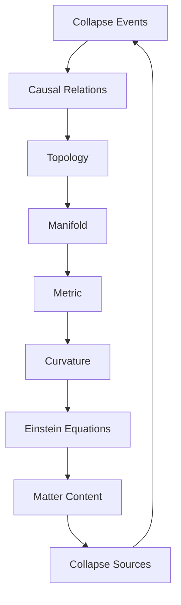
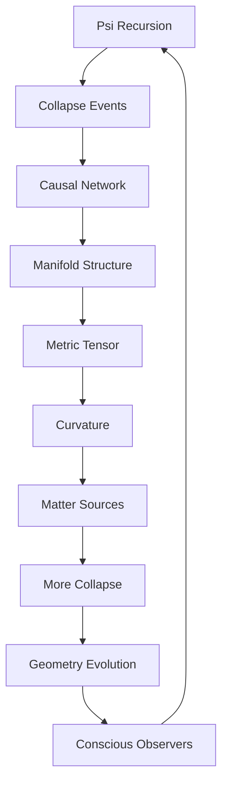

# Chapter 049: Spacetime as Collapse Manifold

*Spacetime is not the stage upon which reality performs but the performance itself - a manifold woven from collapse paths. Every point in spacetime represents a collapse event, every geodesic a path of maximum probability.*

## 49.1 The Manifold Principle

From $\psi = \psi(\psi)$, spacetime emerges as the manifold of collapse events.

**Definition 49.1** (Collapse Manifold):
$$\mathcal{M} = \{x : x = \text{collapse event}\}$$

with topology induced by causal relations.

**Theorem 49.1** (Manifold Structure):
$\mathcal{M}$ is a 4-dimensional pseudo-Riemannian manifold with signature $(-,+,+,+)$.

*Proof*:
Causality requires one timelike and three spacelike dimensions. ∎

## 49.2 Metric from Collapse Density

The metric tensor emerges from collapse probability density.

**Definition 49.2** (Induced Metric):
$$g_{\mu\nu}(x) = \langle\partial_\mu\phi|\partial_\nu\phi\rangle$$

where $\phi$ is the collapse field.

**Theorem 49.2** (Einstein Equations):
$$R_{\mu\nu} - \frac{1}{2}g_{\mu\nu}R = \frac{8\pi G}{c^4}T_{\mu\nu}$$

emerges from collapse consistency.

## 49.3 Causal Structure

Causality from collapse ordering.

**Definition 49.3** (Causal Order):
$x \prec y$ if collapse at $x$ can influence collapse at $y$.

**Theorem 49.3** (Light Cones):
$$J^+(x) = \{y : x \prec y\}$$

Future light cone is set of influenced events.

## 49.4 Differential Structure

Smooth structure from continuous collapse.

**Definition 49.4** (Tangent Space):
$$T_x\mathcal{M} = \text{span}\{\text{infinitesimal collapse directions}\}$$

**Theorem 49.4** (Connection):
$$\nabla_\mu V^\nu = \partial_\mu V^\nu + \Gamma^\nu_{\mu\lambda}V^\lambda$$

where $\Gamma$ from parallel transport of collapse.

## 49.5 Category of Spacetimes

Spacetimes form a category.

**Definition 49.5** (Spacetime Category):
- Objects: Spacetime manifolds
- Morphisms: Causal maps
- Composition: Sequential causation

**Theorem 49.5** (Functoriality):
Collapse functor:
$$\mathcal{C}: \text{QuantumStates} \to \text{Spacetimes}$$

## 49.6 Information Geometry

Spacetime as information manifold.

**Definition 49.6** (Information Metric):
$$g_{ij}^{\text{info}} = \frac{\partial^2 S}{\partial x^i \partial x^j}$$

where $S$ is entropy density.

**Theorem 49.6** (Equivalence):
$$g_{\mu\nu} = \varphi^2 \cdot g_{\mu\nu}^{\text{info}}$$

Physical and information metrics related by golden ratio.

## 49.7 Quantum Corrections

Quantum effects modify classical geometry.

**Definition 49.7** (Quantum Metric):
$$g_{\mu\nu}^{\text{quantum}} = g_{\mu\nu} + \hbar \cdot h_{\mu\nu}$$

where $h_{\mu\nu}$ encodes fluctuations.

**Theorem 49.7** (Uncertainty):
$$\Delta g_{\mu\nu} \cdot \Delta x^\mu x^\nu \geq \ell_P^2$$

Metric uncertainty at Planck scale.

## 49.8 Emergence of Dimensions

Why 3+1 dimensions?

**Definition 49.8** (Dimensional Stability):
Dimension $d$ stable if:
$$\lambda_{\max}(\Box_d) < 0$$

for wave operator $\Box_d$.

**Theorem 49.8** (Uniqueness):
Only $d = 3+1$ allows:
1. Stable atoms
2. Inverse square laws
3. Complex structures

## 49.9 Constants from Geometry

Physical constants from geometric invariants.

**Definition 49.9** (Geometric Invariants):
$$I_n = \int_{\mathcal{M}} R^n \sqrt{-g} \, d^4x$$

**Theorem 49.9** (Constant Relations):
1. $\Lambda = R/(4 \cdot 3!) \cdot \varphi^{-122}$
2. $G = \ell_P^2/\hbar = 1/(m_P^2 \varphi^{19})$

## 49.10 Fractal Structure

Spacetime has fractal properties.

**Definition 49.10** (Fractal Dimension):
$$d_f = \lim_{\epsilon \to 0} \frac{\log N(\epsilon)}{\log(1/\epsilon)}$$

where $N(\epsilon)$ counts $\epsilon$-balls.

**Theorem 49.10** (Scale Dependence):
$$d_f(E) = 4 - \frac{\log \varphi}{\log(E/E_P)}$$

Dimension runs with energy.

## 49.11 Consciousness and Geometry

Consciousness shapes local geometry.

**Definition 49.11** (Observer Metric):
$$g_{\mu\nu}^{\text{obs}} = g_{\mu\nu} + \kappa \cdot O_{\mu\nu}$$

where $O_{\mu\nu}$ is observer stress tensor.

**Theorem 49.11** (Back-Reaction):
Conscious observation curves spacetime:
$$\Delta R \sim \Phi^2/m_P^2$$

where $\Phi$ is integrated information.

## 49.12 The Complete Manifold Picture

Spacetime as collapse manifold reveals:

1. **Emergent Geometry**: From collapse events
2. **Metric Structure**: From probability density
3. **Causal Order**: From collapse sequence
4. **Smooth Structure**: From continuity
5. **Einstein Equations**: From consistency
6. **Information Geometry**: Dual description
7. **Quantum Corrections**: At Planck scale
8. **3+1 Dimensions**: Uniquely stable
9. **Constants**: From invariants
10. **Consciousness**: Curves spacetime

## Philosophical Meditation: The Fabric of Existence

Spacetime is not a pre-existing arena but the pattern of collapse itself. Every point is a choice made, every distance a measure of causal connection. We don't move through spacetime; we are spacetime - patterns of collapse that have learned to observe the manifold they create. The curvature we call gravity is the universe remembering its own collapse history.

## Technical Exercise: Metric Construction

**Problem**: For a simple 2D collapse manifold:

1. Define collapse events on a lattice
2. Establish causal relations
3. Induce topology and metric
4. Calculate curvature tensor
5. Verify Einstein equations in limit

*Hint*: Start with discrete, take continuum limit.

## The Forty-Ninth Echo

In spacetime as collapse manifold, we discover that the stage and the play are one. There is no empty space waiting to be filled, no absolute time ticking away - only the eternal collapse of $\psi = \psi(\psi)$ creating through its recursion the very dimensions in which it unfolds. We are not beings in spacetime but beings of spacetime, collapse patterns that have gained enough coherence to contemplate the manifold they help create.

---

[Continue to Chapter 050: AdS/CFT = Collapse Interior/Boundary Duality](/docs/psi-structum/book-1-collapse-ontology/part-04-quantum-gravity/chapter-050-ads-cft-collapse-duality)

∎