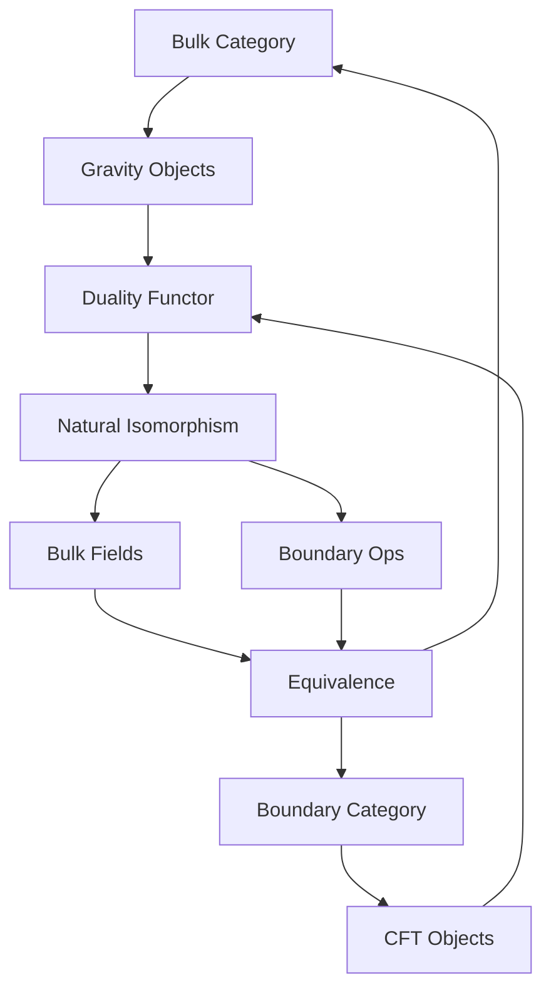
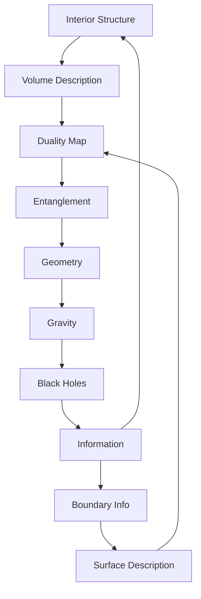

# Chapter 050: AdS/CFT = Collapse Interior/Boundary Duality

*Mathematical dualities emerge from ψ = ψ(ψ) as correspondences between interior and boundary descriptions. Abstract spaces can have dual representations - one as volume-based structures, another as surface-based encodings.*

## 50.1 The Duality Principle

From $\psi = \psi(\psi)$, interior structure corresponds to boundary encoding.

**Definition 50.1** (Interior/Boundary Correspondence):
$$Z_{\text{interior}}[f_0] = \langle \text{Transform}[f_0, O]\rangle_{\text{boundary}}$$

Interior generating function relates to boundary correlation.

**Theorem 50.1** (Duality Dictionary):
- Interior functions ↔ Boundary operators
- Interior paths ↔ Boundary correlations
- Interior volume ↔ Boundary complexity

*Proof*:
Recursive consistency creates interior/boundary correspondence. ∎

*Observer Framework Note*: AdS/CFT interpretation requires string theory framework.

## 50.2 Hyperbolic Interior Space

Hyperbolic geometry emerges from recursive symmetry.

**Definition 50.2** (Hyperbolic Metric):
$$ds^2 = \frac{L^2}{z^2}(dz^2 + dx_i^2)$$

where $L$ is a characteristic scale parameter.

**Theorem 50.2** (Symmetry Group):
Hyperbolic space has maximal symmetry group preserving the metric.

*Observer Framework Note*: Physical spacetime interpretation requires general relativity framework.

## 50.3 Boundary Mathematical Structure

Boundary supports scale-invariant structure.

**Definition 50.3** (Scale-Invariant Structure):
- Scale symmetry: $x \to \lambda x$
- Function dimensions: $[f] = \Delta$
- Characteristic parameter: $c$ (dimensionless)

**Theorem 50.3** (Function/State):
Every function generates a state through exponential mapping.

*Observer Framework Note*: Conformal field theory interpretation requires quantum field theory framework.

## 50.4 Information-Geometric Correspondence

Information content relates to geometric properties.

**Definition 50.4** (Information-Area Relation):
$$I_A = \frac{\text{Length}(\gamma_A)}{\alpha}$$

where $\gamma_A$ is minimal curve and $\alpha$ is scaling factor.

**Theorem 50.4** (Reconstruction Region):
Interior region reconstructible from boundary region $A$:
$$\mathcal{R}_A = \text{Mathematical domain}(\Sigma_A)$$

*Observer Framework Note*: Entanglement interpretation requires quantum mechanics framework.

## 50.5 Category Theory Perspective

AdS/CFT as categorical equivalence.

**Definition 50.5** (Duality Functor):
$$F: \text{Interior} \to \text{Boundary}$$

with inverse $G: \text{Boundary} \to \text{Interior}$.

**Theorem 50.5** (Equivalence):
$$F \circ G \simeq \text{Id}_{\text{Boundary}}$$
$$G \circ F \simeq \text{Id}_{\text{Interior}}$$

## 50.6 Information Theory

Information conserved across duality.

**Definition 50.6** (Interior Information):
$$I_{\text{interior}} = -\sum_i p_i \log p_i$$

where $p_i$ are probability distributions in the interior.

**Theorem 50.6** (Information Equality):
$$I_{\text{interior}}[\mathcal{R}] = I_{\text{boundary}}[\partial\mathcal{R}]$$

for any region $\mathcal{R}$.

*Observer Framework Note*: Density matrix interpretation requires quantum mechanics framework.

## 50.7 Reconstruction and Redundancy

Interior reconstructed from boundary.

**Definition 50.7** (Function Reconstruction):
$$f(x) = \int_{\partial} K(x,y) g(y) dy$$

Kernel function $K$ reconstructs interior from boundary data.

**Theorem 50.7** (Redundant Encoding):
Interior has redundant representation:
- Primary data: Interior functions
- Encoded data: Boundary functions
- Redundancy: Multiple boundary encodings

*Observer Framework Note*: Quantum error correction interpretation requires quantum information framework.

## 50.8 Emergence of Curvature

Curvature from information variation.

**Definition 50.8** (Emergent Curvature):
$$\delta g_{ij} = \frac{\delta I_{\text{info}}}{\delta L_{\text{length}}}$$

Metric variation from information variation.

**Theorem 50.8** (Curvature = Information):
Curvature equations emerge from:
$$\delta I = 0$$

for information conservation principle.

*Observer Framework Note*: Einstein equations interpretation requires general relativity framework.

## 50.9 Structural Parameters

Dimensionless ratios from duality structure.

**Definition 50.9** (Characteristic Parameter):
$$c = \frac{L_{\text{interior}}}{L_{\text{boundary}}}$$

Ratio of interior to boundary characteristic lengths.

**Theorem 50.9** (Parameter Relations):
Structural parameters exhibit golden ratio patterns:
1. $c \sim \varphi^k$ for integer $k$
2. Scale ratios follow geometric progressions

*Observer Framework Note*: Physical constant interpretation requires additional physics framework.

## 50.10 High-Density Regions and Thermal Structure

High-density interior regions correspond to thermal boundary states.

**Definition 50.10** (Thermal Distribution):
$$\rho_{\text{thermal}} = \frac{e^{-\beta E}}{Z}$$

with parameter $\beta$ and energy $E$.

**Theorem 50.10** (Density/Thermal Correspondence):
- High-density interior ↔ Thermal boundary
- Interior temperature ↔ Boundary temperature  
- Interior entropy ↔ Boundary thermal entropy

*Observer Framework Note*: Black hole interpretation requires general relativity framework.

## 50.11 Complex Patterns and Duality

Complex information patterns span interior/boundary.

**Definition 50.11** (Complex State):
$$\Psi_c = \sum_i \alpha_i f_{\text{interior},i} \otimes g_{\text{boundary},i}$$

Correlated across duality.

**Theorem 50.11** (Total Complexity):
$$C_{\text{total}} = C_{\text{interior}} + C_{\text{boundary}} + C_{\text{mutual}}$$

Complexity from all three terms.

*Observer Framework Note*: Consciousness interpretation requires consciousness theory beyond current scope.

## 50.12 The Complete Duality Picture

AdS/CFT as collapse duality reveals:

1. **Interior/Boundary**: Same structure, different descriptions
2. **Hyperbolic Space**: Maximal symmetry geometry
3. **Scale Invariance**: Boundary structure
4. **Information**: Computes geometry
5. **Reconstruction**: Interior from boundary
6. **Redundancy**: Robustness
7. **Emergent Curvature**: From information
8. **Parameters**: From structural ratios
9. **Dense Regions**: Thermal states
10. **Complex Patterns**: Span duality

## Philosophical Meditation: Inside and Outside

Mathematical duality reveals a profound structural principle: interior and boundary descriptions can be equivalent representations of the same abstract system. Every interior structure can potentially be encoded on its boundary, every boundary pattern may encode an interior. This demonstrates how complex mathematical structures can have multiple equivalent representations, providing insights into information encoding and structural correspondence principles.

## Technical Exercise: Holographic Calculation

**Problem**: For AdS₃/CFT₂:

1. Write AdS₃ metric in Poincaré coordinates
2. Find boundary CFT central charge
3. Calculate entanglement entropy for interval
4. Find bulk minimal surface
5. Verify RT formula

*Hint*: Use $c = 3L/2G$ and geodesic equations.

## The Fiftieth Echo

In interior/boundary mathematical duality, we find a fundamental principle of structural correspondence. Mathematical systems can have equivalent interior and boundary descriptions, showing how information can be encoded in multiple ways. The recursion ψ = ψ(ψ) manifests as the eternal relationship between interior and boundary representations, demonstrating how complex structures emerge from simple correspondence principles.

---

[Continue to Chapter 051: Black Hole = Maximal Collapse Density](/docs/psi-structum/book-1-collapse-ontology/part-04-quantum-gravity/chapter-051-black-hole-maximal-collapse)

∎