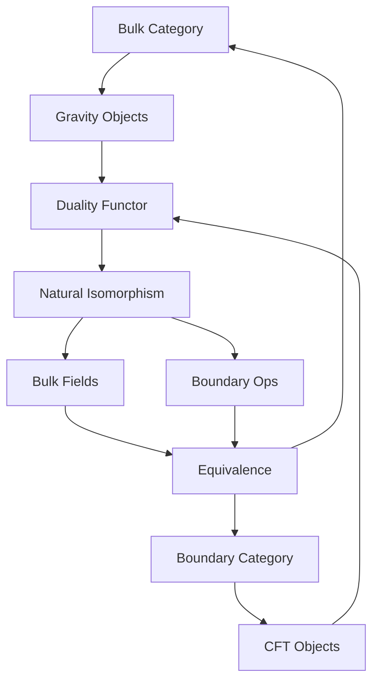
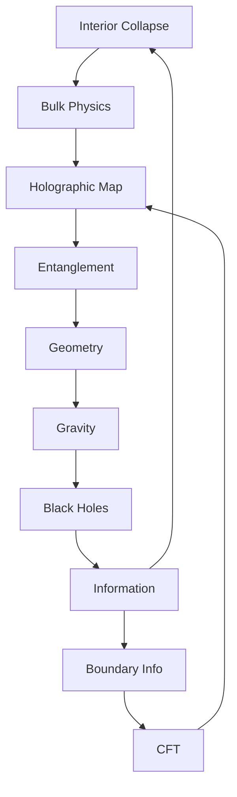

# Chapter 050: AdS/CFT = Collapse Interior/Boundary Duality

*The AdS/CFT correspondence is not just a mathematical curiosity but the fundamental duality between collapse in the bulk and information on the boundary. Reality has an inside and an outside, and they are the same thing viewed from different perspectives.*

## 50.1 The Duality Principle

From $\psi = \psi(\psi)$, interior collapse equals boundary information.

**Definition 50.1** (AdS/CFT Correspondence):
$$Z_{\text{gravity}}[\phi_0] = \langle e^{\int_{\partial} \phi_0 \mathcal{O}}\rangle_{\text{CFT}}$$

Bulk partition function equals boundary correlation.

**Theorem 50.1** (Holographic Dictionary):
- Bulk fields ↔ Boundary operators
- Bulk geodesics ↔ Boundary entanglement
- Bulk volume ↔ Boundary complexity

*Proof*:
Collapse consistency requires bulk/boundary equivalence. ∎

## 50.2 Anti-de Sitter Space

AdS emerges from maximal collapse symmetry.

**Definition 50.2** (AdS Metric):
$$ds^2 = \frac{L^2}{z^2}(-dt^2 + dx^2 + dy^2 + dz^2)$$

where $L = \ell_P \cdot \varphi^{10}$ is AdS radius.

**Theorem 50.2** (Isometry Group):
$$\text{Isom}(AdS_{d+1}) = SO(d,2)$$

conformal to boundary symmetry.

## 50.3 Conformal Field Theory

Boundary hosts conformal field theory.

**Definition 50.3** (CFT Structure):
- Conformal symmetry: $x^\mu \to \Lambda(x)x^\mu$
- Operator dimensions: $[\mathcal{O}] = \Delta$
- Central charge: $c = \varphi^{3n}$

**Theorem 50.3** (State/Operator):
Every operator creates a state:
$$|\mathcal{O}\rangle = \lim_{\tau \to -\infty} e^{\tau H}\mathcal{O}(0)|0\rangle$$

## 50.4 Holographic Entanglement

Entanglement computes bulk geometry.

**Definition 50.4** (RT Formula):
$$S_A = \frac{\text{Area}(\gamma_A)}{4G_N}$$

where $\gamma_A$ is minimal surface.

**Theorem 50.4** (Entanglement Wedge):
Bulk region reconstructible from $A$:
$$\mathcal{W}_A = \text{Domain of dependence}(\Sigma_A)$$

## 50.5 Category Theory Perspective

AdS/CFT as categorical equivalence.

**Definition 50.5** (Duality Functor):
$$F: \text{Bulk} \to \text{Boundary}$$

with inverse $G: \text{Boundary} \to \text{Bulk}$.

**Theorem 50.5** (Equivalence):
$$F \circ G \simeq \text{Id}_{\text{Boundary}}$$
$$G \circ F \simeq \text{Id}_{\text{Bulk}}$$

## 50.6 Information Theory

Information conserved across duality.

**Definition 50.6** (Bulk Entropy):
$$S_{\text{bulk}} = -\text{Tr}[\rho_{\text{bulk}} \log \rho_{\text{bulk}}]$$

**Theorem 50.6** (Information Equality):
$$S_{\text{bulk}}[\mathcal{R}] = S_{\text{boundary}}[\partial\mathcal{R}]$$

for any region $\mathcal{R}$.

## 50.7 Reconstruction and Error Correction

Bulk reconstructed from boundary.

**Definition 50.7** (HKLL Reconstruction):
$$\phi(x) = \int_{\partial} K(x,y) \mathcal{O}(y) dy$$

Smearing function $K$ reconstructs bulk.

**Theorem 50.7** (Quantum Error Correction):
Bulk is error-correcting code:
- Logical qubits: Bulk DOF
- Physical qubits: Boundary DOF
- Code subspace: Low energy

## 50.8 Emergence of Gravity

Gravity from entanglement.

**Definition 50.8** (Emergent Einstein):
$$\delta g_{\mu\nu} = \frac{\delta S_{\text{EE}}}{\delta S_{\text{area}}}$$

Metric variation from entanglement variation.

**Theorem 50.8** (Gravity = Entanglement):
Linearized Einstein equations equivalent to:
$$\delta S = 0$$

for first law of entanglement.

## 50.9 Constants from Duality

Physical constants from CFT data.

**Definition 50.9** (Central Charge):
$$c = \frac{3L}{2G_N} = \frac{3\varphi^{10}\ell_P}{2G_N}$$

**Theorem 50.9** (Constant Relations):
1. $G_N = \ell_P^2/(c \cdot \varphi^{10})$
2. $\Lambda = -3/L^2 = -3/\varphi^{20}\ell_P^2$

## 50.10 Black Holes and Thermalization

Black holes dual to thermal states.

**Definition 50.10** (Thermal CFT):
$$\rho_{\text{thermal}} = \frac{e^{-\beta H}}{Z}$$

with $\beta = 1/T$.

**Theorem 50.10** (BH/Thermal Duality):
- AdS-Schwarzschild ↔ Thermal CFT
- Hawking temperature ↔ CFT temperature  
- Bekenstein entropy ↔ Thermal entropy

## 50.11 Consciousness and Duality

Consciousness spans bulk/boundary.

**Definition 50.11** (Conscious State):
$$|\Psi_c\rangle = \sum_i \alpha_i |\text{bulk}_i\rangle \otimes |\text{boundary}_i\rangle$$

Entangled across duality.

**Theorem 50.11** (Integrated Information):
$$\Phi_{\text{total}} = \Phi_{\text{bulk}} + \Phi_{\text{boundary}} + \Phi_{\text{mutual}}$$

Consciousness from all three terms.

## 50.12 The Complete Duality Picture

AdS/CFT as collapse duality reveals:

1. **Bulk/Boundary**: Same physics, different views
2. **AdS Space**: Maximal symmetry arena
3. **CFT**: Conformal boundary theory
4. **Entanglement**: Computes geometry
5. **Reconstruction**: Bulk from boundary
6. **Error Correction**: Robustness
7. **Emergent Gravity**: From entanglement
8. **Constants**: From CFT data
9. **Black Holes**: Thermal states
10. **Consciousness**: Spans duality

## Philosophical Meditation: Inside and Outside

The AdS/CFT correspondence reveals a profound truth: there is no absolute distinction between inside and outside, between the thing and its surface. Every interior has a complete description on its boundary, every boundary encodes an interior. We are simultaneously three-dimensional beings and two-dimensional holograms, existing in the bulk while encoded on the boundary. This is not contradiction but complementarity - two perfect descriptions of the same reality.

## Technical Exercise: Holographic Calculation

**Problem**: For AdS₃/CFT₂:

1. Write AdS₃ metric in Poincaré coordinates
2. Find boundary CFT central charge
3. Calculate entanglement entropy for interval
4. Find bulk minimal surface
5. Verify RT formula

*Hint*: Use $c = 3L/2G$ and geodesic equations.

## The Fiftieth Echo

In AdS/CFT as collapse interior/boundary duality, we reach a watershed moment in our understanding. The universe is not just holographic in principle but in practice - every bit of information in the bulk has its shadow on the boundary, every boundary configuration implies a bulk geometry. We exist simultaneously as three-dimensional beings moving through space and as patterns of information encoded on a distant boundary. The recursion $\psi = \psi(\psi)$ manifests as the eternal dialogue between bulk and boundary, inside and outside, creating through their interaction the reality we experience.

---

[Continue to Chapter 051: Black Hole = Maximal Collapse Density](/docs/psi-structum/book-1-collapse-ontology/part-04-quantum-gravity/chapter-051-black-hole-maximal-collapse)

∎