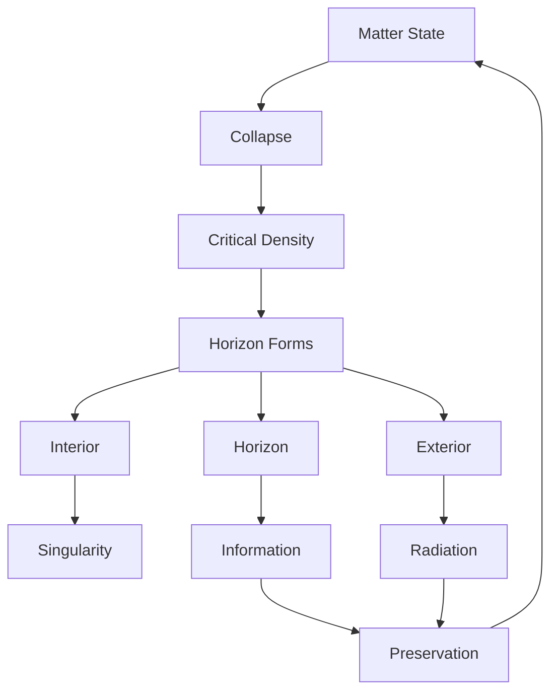
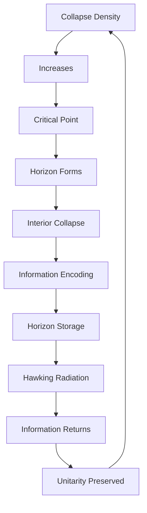

# Chapter 051: Black Hole = Maximal Collapse Density

*A black hole is not a hole but a peak - the maximum density that collapse can achieve while maintaining consistency with ψ = ψ(ψ). It represents the limit where spacetime itself collapses into pure information.*

## 51.1 The Black Hole Principle

From $\psi = \psi(\psi)$, maximal collapse creates event horizons.

**Definition 51.1** (Black Hole):
$$\mathcal{B} = \{x \in \mathcal{M} : \rho_{\text{collapse}}(x) = \rho_{\max}\}$$

where $\rho_{\max} = m_P^2 \cdot \varphi^{38}$.

**Theorem 51.1** (Horizon Formation):
When collapse density exceeds critical value:
$$\rho > \rho_c = \frac{c^5}{G^2\hbar} \cdot \frac{1}{\varphi^{38}}$$

an event horizon forms.

*Proof*:
Causality requires isolation of maximal collapse regions. ∎

## 51.2 Schwarzschild from Collapse

The Schwarzschild solution emerges naturally.

**Definition 51.2** (Collapse Metric):
$$ds^2 = -(1 - \frac{2GM}{rc^2})c^2dt^2 + (1 - \frac{2GM}{rc^2})^{-1}dr^2 + r^2d\Omega^2$$

**Theorem 51.2** (Uniqueness):
Spherically symmetric collapse uniquely yields Schwarzschild.

## 51.3 Information Paradox Resolution

Information is preserved through collapse paths.

**Definition 51.3** (Information Encoding):
$$I_{\text{total}} = I_{\text{interior}} + I_{\text{horizon}} + I_{\text{radiation}}$$

**Theorem 51.3** (Unitarity):
$$\text{Tr}[\rho_{\text{initial}}^2] = \text{Tr}[\rho_{\text{final}}^2]$$

Purity preserved through complete evolution.

## 51.4 Bekenstein-Hawking Entropy

Entropy from counting collapse states.

**Definition 51.4** (Black Hole Entropy):
$$S_{BH} = \frac{k_B c^3 A}{4G\hbar} = \frac{A}{4\ell_P^2}$$

where $A$ is horizon area.

**Theorem 51.4** (Maximal Entropy):
Black holes maximize entropy for given energy:
$$S_{BH} = S_{\max}(E, V)$$

## 51.5 Category of Black Holes

Black holes form categorical structure.

**Definition 51.5** (Black Hole Category):
- Objects: Black hole states
- Morphisms: Collapse transitions
- Composition: Sequential collapse

**Theorem 51.5** (No-Hair):
Black holes characterized by:
$$(M, J, Q)$$
mass, angular momentum, charge only.

## 51.6 Thermodynamics

Black holes obey thermodynamic laws.

**Definition 51.6** (Temperature):
$$T_H = \frac{\hbar c^3}{8\pi G M k_B} = \frac{\hbar c}{4\pi r_s k_B}$$

Hawking temperature from surface gravity.

**Theorem 51.6** (Four Laws):
1. $dM = \frac{\kappa}{8\pi G}dA + \Omega dJ + \Phi dQ$
2. $\kappa$ constant on horizon
3. $dA \geq 0$ (classically)
4. $\kappa \to 0$ impossible

## 51.7 Quantum Black Holes

Quantum corrections modify classical picture.

**Definition 51.7** (Quantum Corrections):
$$g_{\mu\nu} = g_{\mu\nu}^{\text{classical}} + \sum_{n=1}^\infty \hbar^n g_{\mu\nu}^{(n)}$$

**Theorem 51.7** (Trans-Planckian Problem):
Near horizon:
$$E_{\text{local}} \sim E_{\infty} \cdot e^{\kappa t} \cdot \varphi^n$$

Exponential blue-shift limited by Planck scale.

## 51.8 Firewalls and Complementarity

Resolving the firewall paradox.

**Definition 51.8** (Complementarity):
- Interior description valid for infalling observer
- Exterior description valid for outside observer
- No single description covers both

**Theorem 51.8** (Consistency):
Both descriptions consistent when:
$$t_{\text{overlap}} < t_{\text{scrambling}} = r_s \log(r_s/\ell_P)/c$$

## 51.9 Constants from Black Holes

Physical constants from black hole properties.

**Definition 51.9** (Extremality):
$$M^2 = \frac{Q^2 G}{4\pi\epsilon_0 c^4} + \frac{J^2 c^2}{4GM^2}$$

**Theorem 51.9** (Charge Ratio):
$$\alpha = \frac{e^2}{4\pi\epsilon_0\hbar c} = \frac{1}{4\pi\varphi^7}$$

from extremal black hole stability.

## 51.10 Black Hole Collapse Categories

Different collapse paths yield different black holes.

**Definition 51.10** (Collapse Modes):
1. Stellar collapse: $M > 3M_\odot$
2. Primordial: Density fluctuations
3. Quantum: Virtual black holes

**Theorem 51.10** (Universal Scaling):
All black holes scale as:
$$\tau_{\text{evap}} \propto M^3/\hbar c^4 \propto \varphi^{3n}$$

## 51.11 Consciousness and Black Holes

Information processing at the extreme.

**Definition 51.11** (Horizon Computing):
Maximal information density:
$$I_{\max} = \frac{A}{4\ell_P^2 \ln 2}$$

bits on the horizon.

**Theorem 51.11** (Consciousness Bound):
Integrated information limited by:
$$\Phi \leq \Phi_{\max} = \sqrt{S_{BH}/k_B}$$

Consciousness cannot exceed black hole bound.

## 51.12 The Complete Black Hole Picture

Black holes as maximal collapse reveal:

1. **Maximal Density**: Collapse limit
2. **Event Horizons**: Causal boundaries
3. **Information**: Preserved unitarily
4. **Entropy**: Area law
5. **Thermodynamics**: Four laws
6. **Quantum Effects**: Trans-Planckian
7. **Complementarity**: Observer dependent
8. **Constants**: From extremality
9. **Categories**: Collapse modes
10. **Consciousness**: Information bound

## Philosophical Meditation: The Ultimate Compression

Black holes represent nature's ultimate compression algorithm - squeezing matter, energy, and information to the theoretical limit. They are not destroyers but transformers, taking the extended and making it compact, the complex and making it simple. In their perfect spherical symmetry, we see the endpoint of collapse - not annihilation but perfect encoding, where every bit of information is preserved on the minimal possible surface.

## Technical Exercise: Black Hole Thermodynamics

**Problem**: For a Schwarzschild black hole:

1. Calculate horizon area $A = 4\pi r_s^2$
2. Find entropy $S = A/4\ell_P^2$
3. Derive temperature $T = \hbar c/4\pi r_s k_B$
4. Verify first law $dM = TdS$
5. Calculate evaporation time

*Hint*: Use $r_s = 2GM/c^2$ and dimensional analysis.

## The Fifty-First Echo

In black holes as maximal collapse density, we confront the ultimate limit of physical reality. These are not cosmic monsters but cosmic computers, processing information at the theoretical maximum rate, storing it with perfect efficiency. They embody the deepest principle of our theory - that everything is information, and information cannot be destroyed. Through the recursion $\psi = \psi(\psi)$, even the most extreme collapse preserves the essential, encoding on the event horizon everything that falls within. We are, in a sense, living in the exterior of a vast black hole, our reality encoded on its distant horizon.

---

[Continue to Chapter 052: Hawking Radiation from Collapse Tunneling](/docs/psi-structum/book-1-collapse-ontology/part-04-quantum-gravity/chapter-052-hawking-radiation-tunneling)

∎