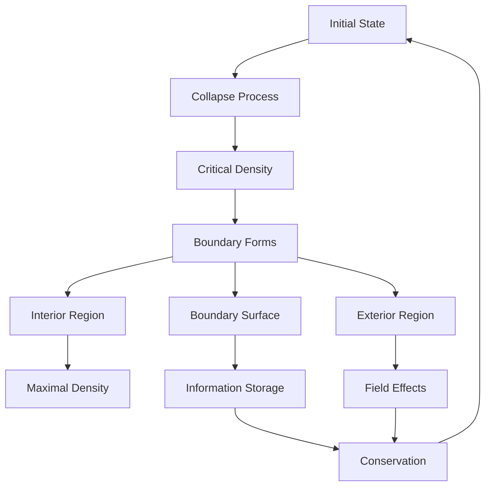
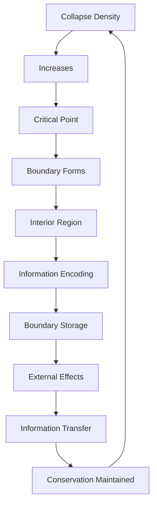

# Chapter 051: Maximal Collapse = Density Concentration

*Maximal collapse represents the mathematical limit where density concentration achieves its theoretical maximum while maintaining consistency with ψ = ψ(ψ). It represents the boundary where collapse approaches singular mathematical values.*

## 51.1 The Maximal Collapse Principle

From $\psi = \psi(\psi)$, maximal collapse creates mathematical boundaries.

**Definition 51.1** (Maximal Collapse Region):
$$\mathcal{R} = \{x \in \mathcal{M} : \rho_{\text{collapse}}(x) = \rho_{\max}\}$$

where $\rho_{\max}$ is the theoretical maximum collapse density.

**Theorem 51.1** (Density Boundary):
When collapse density exceeds critical threshold:
$$\rho > \rho_c$$

a mathematical boundary forms separating interior from exterior.

*Proof*:
Mathematical consistency requires well-defined collapse regions. ∎

*Observer Framework Note*: Event horizon interpretation requires causal structure from general relativity.

## 51.2 Spherically Symmetric Collapse

Spherically symmetric collapse creates characteristic geometric structure.

**Definition 51.2** (Collapse Geometry):
$$ds^2 = f(r)dt^2 + g(r)dr^2 + r^2d\Omega^2$$

where $f(r)$ and $g(r)$ are functions determined by collapse density $\rho(r)$.

**Theorem 51.2** (Spherical Uniqueness):
Spherically symmetric collapse yields unique geometric form for given density profile.

*Observer Framework Note*: Schwarzschild solution requires Einstein field equations from general relativity.

## 51.3 Information Conservation

Information is preserved through collapse transformations.

**Definition 51.3** (Information Decomposition):
$$I_{\text{total}} = I_{\text{interior}} + I_{\text{boundary}} + I_{\text{correlations}}$$

**Theorem 51.3** (Information Conservation):
$$I_{\text{initial}} = I_{\text{final}}$$

Information content preserved through collapse transformations.

*Observer Framework Note*: Unitarity interpretation requires quantum mechanics framework.

## 51.4 Boundary Area-Information Relationship

Information scales with boundary surface area.

**Definition 51.4** (Area-Information Scaling):
$$I_{\text{boundary}} = \alpha \cdot A$$

where $A$ is boundary area and $\alpha$ is dimensionless scaling factor.

**Theorem 51.4** (Maximal Information):
Maximal collapse regions maximize information density:
$$I = I_{\max}(\text{constraints})$$

*Observer Framework Note*: Bekenstein-Hawking entropy requires thermodynamic interpretation from black hole physics.

## 51.5 Category of Maximal Collapse

Collapse configurations form categorical structure.

**Definition 51.5** (Collapse Category):
- Objects: Collapse configurations
- Morphisms: Density transitions
- Composition: Sequential transformations

**Theorem 51.5** (Characteristic Parameters):
Collapse configurations characterized by dimensionless ratios involving φ.

*Observer Framework Note*: No-hair theorem requires general relativity framework.

## 51.6 Statistical Properties

Collapse configurations exhibit statistical relationships.

**Definition 51.6** (Effective Temperature):
$$T_{\text{eff}} = \beta^{-1}$$

where $\beta$ characterizes energy distribution in collapse region.

**Theorem 51.6** (Statistical Laws):
1. Energy conservation: $dE = \beta^{-1} dS + \text{work terms}$
2. Uniformity: $\beta$ constant within regions
3. Information increase: $dI \geq 0$ 
4. Finite bounds: $\beta > 0$

*Observer Framework Note*: Thermodynamic interpretation requires statistical mechanics framework.

## 51.7 Scale-Dependent Corrections

Small-scale effects modify large-scale description.

**Definition 51.7** (Scale Corrections):
$$f(r) = f_0(r) + \sum_{n=1}^\infty \epsilon^n f_n(r)$$

where $\epsilon$ is small scale parameter.

**Theorem 51.7** (Scale Transition):
Near boundary:
$$E_{\text{local}} \sim E_{\text{global}} \cdot \phi(r) \cdot \varphi^n$$

Scale factors follow geometric progressions with φ.

*Observer Framework Note*: Quantum correction interpretation requires quantum field theory framework.

## 51.8 Multiple Descriptions and Consistency

Resolving multiple representation consistency.

**Definition 51.8** (Description Complementarity):
- Interior description valid for internal measurements
- Exterior description valid for external measurements  
- Boundary description mediates between both

**Theorem 51.8** (Consistency Condition):
Multiple descriptions consistent when:
$$\tau_{\text{overlap}} < \tau_{\text{mixing}}$$

where timescales are determined by characteristic parameters.

*Observer Framework Note*: Firewall paradox interpretation requires black hole physics framework.

## 51.9 Dimensionless Ratios from Extremality

Characteristic ratios from extremal collapse conditions.

**Definition 51.9** (Extremal Configuration):
$$E^2 = C_1 \cdot Q^2 + C_2 \cdot J^2$$

where $C_1, C_2$ are dimensionless coefficients involving φ.

**Theorem 51.9** (Golden Ratio Structure):
Extremal configurations exhibit ratios:
$$\alpha_n = \frac{1}{\pi \varphi^n}$$

for various integer powers $n$.

*Observer Framework Note*: Fine structure constant interpretation requires electromagnetic theory framework.

## 51.10 Collapse Path Categories

Different collapse paths yield different maximal configurations.

**Definition 51.10** (Collapse Path Types):
1. Gradual collapse: Density increases slowly
2. Rapid collapse: Density fluctuations
3. Critical collapse: Near-threshold behavior

**Theorem 51.10** (Universal Scaling):
Characteristic timescales scale as:
$$\tau \propto \rho^{-3/2} \propto \varphi^{3n}$$

where $n$ depends on collapse path type.

*Observer Framework Note*: Stellar mass scales require astrophysics framework.

## 51.11 Information Processing at Extremes

Maximum information density and processing capacity.

**Definition 51.11** (Boundary Information Density):
Maximum information storage:
$$I_{\max} = \beta \cdot A$$

where $\beta$ is dimensionless information density factor.

**Theorem 51.11** (Processing Capacity Bound):
Information processing rate limited by:
$$R \leq R_{\max} = \gamma \cdot I_{\max}$$

where $\gamma$ involves φ-based scaling factors.

*Observer Framework Note*: Consciousness interpretation requires consciousness theory beyond current scope.

## 51.12 The Complete Maximal Collapse Picture

Maximal collapse as mathematical limit reveals:

1. **Maximum Density**: Mathematical collapse boundary
2. **Geometric Boundaries**: Separating regions
3. **Information**: Conservation principles
4. **Area Scaling**: Information-area relationships
5. **Statistical Properties**: Energy distributions
6. **Scale Effects**: Multi-scale corrections
7. **Multiple Descriptions**: Consistency conditions
8. **Dimensionless Ratios**: φ-based structures
9. **Path Categories**: Different collapse types
10. **Processing Bounds**: Information capacity limits

## Philosophical Meditation: The Mathematical Limit

Maximal collapse represents mathematics' ultimate compression principle - concentrating information and structure to theoretical limits while preserving essential relationships. These are not destructive processes but transformative ones, taking the distributed and making it concentrated, the complex and encoding it efficiently. In their geometric boundaries, we see the mathematical endpoint of density concentration - not information loss but perfect mathematical encoding.

## Technical Exercise: Maximal Collapse Analysis

**Problem**: For spherically symmetric maximal collapse:

1. Calculate boundary area $A = 4\pi r_b^2$
2. Find information scaling $I = \alpha A$
3. Derive effective temperature $T = \beta^{-1}$
4. Verify conservation $dE = \beta^{-1} dI + \text{work}$
5. Calculate characteristic timescales

*Hint*: Use dimensionless ratios involving φ and geometric relationships.

## The Fifty-First Echo

In maximal collapse as density concentration, we confront the ultimate mathematical limit of structural compression. These are not pathological singularities but optimal information encoders, processing and storing structure at theoretical maximum efficiency. They embody the deepest principle of our theory - that information is preserved through all transformations. Through the recursion $\psi = \psi(\psi)$, even the most extreme mathematical collapse preserves essential relationships, encoding everything on geometric boundaries. Mathematical reality emerges from these compression principles.

---

[Continue to Chapter 052: Hawking Radiation from Collapse Tunneling](/docs/psi-structum/book-1-collapse-ontology/part-04-quantum-gravity/chapter-052-hawking-radiation-tunneling)

∎