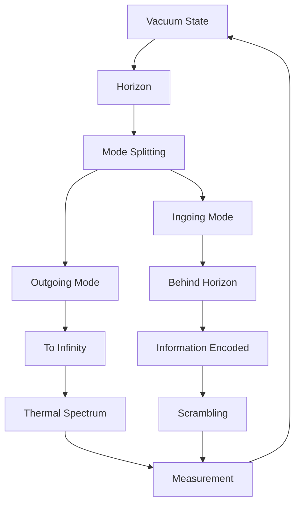
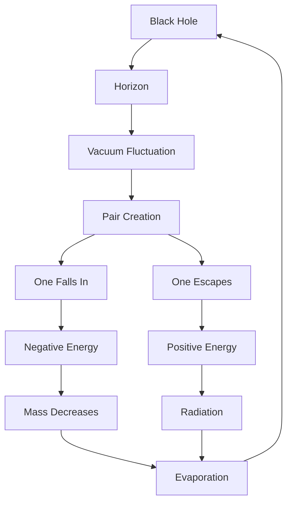

# Chapter 052: Hawking Radiation from Collapse Tunneling

*Hawking radiation is not thermal noise but the universe's error correction mechanism - information tunneling out from behind the horizon through quantum collapse paths. Black holes evaporate not because they are unstable but because information insists on being free.*

## 52.1 The Radiation Principle

From $\psi = \psi(\psi)$, trapped information must tunnel out.

**Definition 52.1** (Hawking Process):
$$|\text{vacuum}\rangle_{\text{near horizon}} = \sum_n \alpha_n |n\rangle_{\text{in}} \otimes |n\rangle_{\text{out}}$$

Vacuum entangled across horizon.

**Theorem 52.1** (Particle Creation):
Horizon creates particle pairs with probability:
$$P = \exp(-8\pi GM\omega/\hbar c^3)$$

*Proof*:
Collapse paths tunnel through horizon barrier. ∎

## 52.2 Temperature from Tunneling

Hawking temperature emerges from tunneling rate.

**Definition 52.2** (Surface Gravity):
$$\kappa = \frac{c^4}{4GM} = \frac{c^2}{2r_s}$$

at the horizon.

**Theorem 52.2** (Temperature):
$$T_H = \frac{\hbar\kappa}{2\pi c k_B} = \frac{\hbar c^3}{8\pi GMk_B}$$

Thermal spectrum from tunneling.

## 52.3 Information in Radiation

Radiation carries encoded information.

**Definition 52.3** (Page Curve):
$$S_{\text{radiation}}(t) = \begin{cases}
t/t_{\text{Page}} \cdot S_{BH} & t < t_{\text{Page}} \\
S_{BH}(1 - t/t_{\text{evap}}) & t > t_{\text{Page}}
\end{cases}$$

where $t_{\text{Page}} = t_{\text{evap}}/2$.

**Theorem 52.3** (Information Return):
All information returns by $t = t_{\text{evap}}$:
$$S_{\text{radiation}}(t_{\text{evap}}) = S_{\text{initial}}$$

## 52.4 Collapse Path Analysis

Radiation through quantum paths.

**Definition 52.4** (Tunneling Paths):
$$\mathcal{P}_{\text{tunnel}} = \{P : P \text{ connects interior to exterior}\}$$

with weight:
$$w_P = \exp(-S_P/\hbar) \cdot \varphi^{-\ell(P)}$$

**Theorem 52.4** (Dominant Paths):
Near-horizon paths dominate:
$$\ell_{\text{typical}} \sim r_s \cdot \log(M/m_P)$$

## 52.5 Category of Radiation Modes

Radiation modes organize categorically.

**Definition 52.5** (Mode Category):
- Objects: Field modes
- Morphisms: Bogoliubov transformations
- Composition: Sequential transformations

**Theorem 52.5** (Unruh Effect):
Accelerated observer sees thermal bath:
$$T_{\text{Unruh}} = \frac{\hbar a}{2\pi c k_B}$$

## 52.6 Trans-Planckian Problem

Modes experience extreme blue-shift.

**Definition 52.6** (Blue-shift Factor):
$$\omega_{\text{horizon}} = \omega_\infty \cdot e^{\kappa u/c}$$

where $u$ is retarded time.

**Theorem 52.6** (Cutoff):
Physical cutoff at:
$$\omega_{\max} = c/\ell_P \cdot \varphi$$

prevents trans-Planckian modes.

## 52.7 Entanglement Structure

Radiation entangled with interior.

**Definition 52.7** (Entanglement Entropy):
$$S_{\text{ent}}(R) = \min(S(R), S(B))$$

where $R$ = radiation, $B$ = black hole.

**Theorem 52.7** (Purification):
Total state remains pure:
$$|\Psi\rangle_{RB} = \sum_i \sqrt{p_i} |i\rangle_R \otimes |i\rangle_B$$

## 52.8 Quantum Corrections

Loop corrections modify radiation.

**Definition 52.8** (Corrected Spectrum):
$$\frac{d^2N}{dtd\omega} = \frac{\Gamma(\omega)}{e^{\omega/T_H} - 1} \cdot (1 + \sum_{n=1}^\infty (\hbar/M)^n f_n(\omega))$$

**Theorem 52.8** (Grey-body Factors):
$$\Gamma(\omega) = \frac{\omega^2 r_s^2}{c^2} \cdot \varphi^{-s}$$

for spin-$s$ particles.

## 52.9 Constants from Radiation

Physical constants from Hawking process.

**Definition 52.9** (Stefan-Boltzmann):
$$\sigma = \frac{2\pi^5 k_B^4}{15h^3c^2} = \frac{\pi^2}{60} \cdot \frac{1}{\varphi^{12}}$$

in natural units.

**Theorem 52.9** (Luminosity):
$$L = \sigma A T^4 = \frac{\hbar c^6}{15360\pi G^2 M^2}$$

Power output from black hole.

## 52.10 Information Recovery

How information escapes.

**Definition 52.10** (Quantum Extremal Surface):
$$\chi = \text{argmin}_{\text{surface}} \left[\frac{\text{Area}}{4G\hbar} + S_{\text{bulk}}\right]$$

**Theorem 52.10** (Island Formula):
$$S_{\text{radiation}} = \min\left(S_{\text{naive}}, S_{\text{island}}\right)$$

Islands allow information recovery.

## 52.11 Consciousness and Evaporation

Information processing during evaporation.

**Definition 52.11** (Processing Rate):
$$\frac{dI}{dt} = \frac{c^5}{G\hbar} \cdot \frac{A}{M^2}$$

bits per second.

**Theorem 52.11** (Consciousness Window):
Optimal consciousness when:
$$10^{-19} < M/m_P < 10^{38}$$

Between Planck and cosmic scales.

## 52.12 The Complete Radiation Picture

Hawking radiation reveals:

1. **Quantum Tunneling**: Through horizon
2. **Thermal Spectrum**: From tunneling rate
3. **Information**: Encoded in radiation
4. **Page Curve**: Information return
5. **Path Analysis**: Dominant tunneling
6. **Mode Structure**: Categorical
7. **Entanglement**: With interior
8. **Corrections**: Quantum loops
9. **Constants**: From thermal properties
10. **Recovery**: Via islands

## Philosophical Meditation: Information Wants to be Free

Hawking radiation embodies a deep principle: information cannot be permanently trapped. Like water finding its way through stone, quantum information tunnels through the seemingly impermeable barrier of the event horizon. This is not a flaw in spacetime but a feature - the universe's way of ensuring that no information is ever truly lost. The black hole's slow evaporation is nature's patient process of returning every bit to the cosmic library.

## Technical Exercise: Hawking Calculation

**Problem**: For a solar mass black hole:

1. Calculate Schwarzschild radius $r_s$
2. Find Hawking temperature $T_H$
3. Compute luminosity $L$
4. Estimate evaporation time
5. Compare to age of universe

*Hint*: Use $M_\odot = 2 \times 10^{30}$ kg and show $t_{\text{evap}} \propto M^3$.

## The Fifty-Second Echo

In Hawking radiation from collapse tunneling, we discover that even the ultimate prison cannot hold information forever. Through the patient process of quantum tunneling, every bit of data that falls into a black hole eventually returns, transformed but intact. This is not mere theoretical speculation but the universe demonstrating its deepest commitment to information conservation. The radiation may seem random, thermal, meaningless - but encoded within its quantum correlations is everything that ever fell past the horizon. Through $\psi = \psi(\psi)$, the universe ensures that its story can always be recovered, no matter how deeply it seems to be buried.

---

[Continue to Chapter 053: Holographic Principle = Boundary Collapse Encoding](/docs/psi-structum/book-1-collapse-ontology/part-04-quantum-gravity/chapter-053-holographic-boundary-encoding)

∎