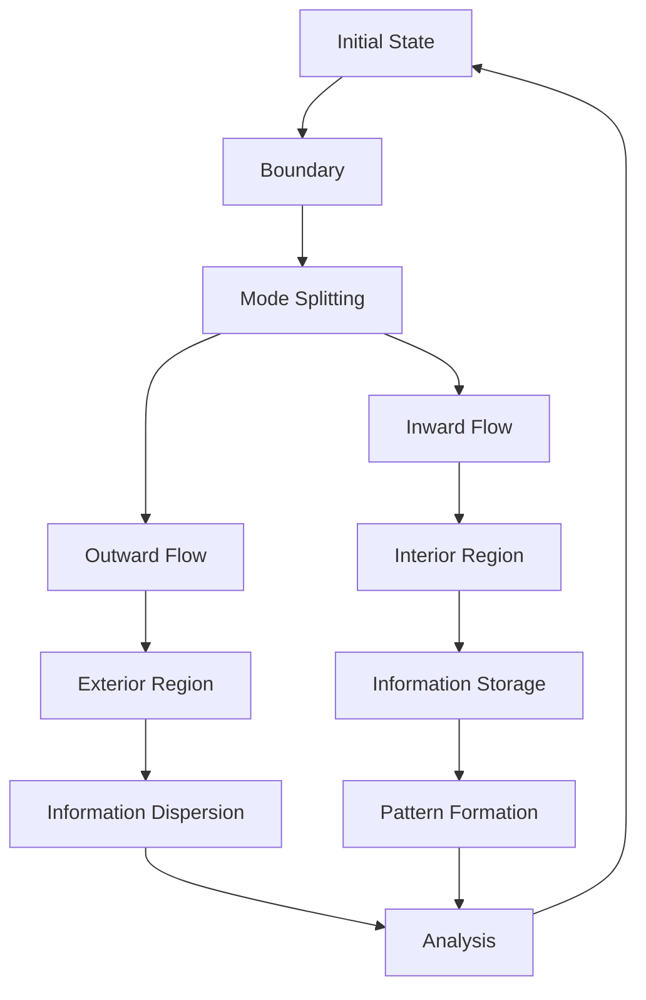
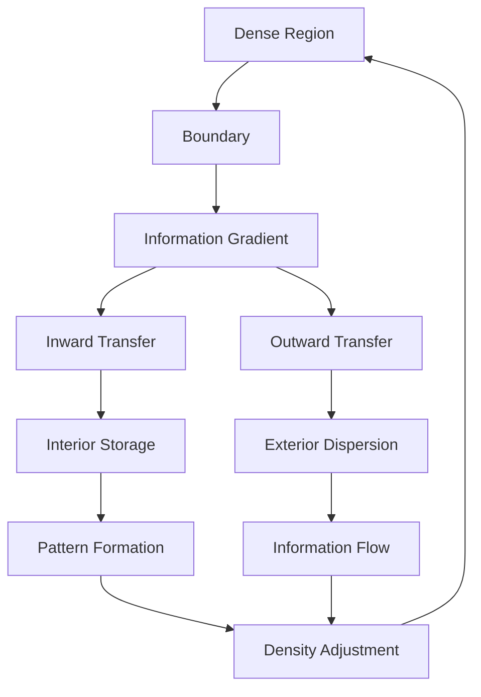

# Chapter 052: Information Transfer from Boundary Regions

*Information transfer from maximal collapse regions represents mathematical flux across density boundaries. Information flows from high-density to low-density regions through mathematical pathways, maintaining conservation while enabling structural evolution.*

## 52.1 The Information Transfer Principle

From $\psi = \psi(\psi)$, concentrated information must diffuse outward.

**Definition 52.1** (Information Flux Process):
$$I_{\text{total}} = I_{\text{interior}} + I_{\text{boundary}} + I_{\text{exterior}}$$

Information distributed across regions.

**Theorem 52.1** (Transfer Probability):
Information transfer occurs with rate proportional to:
$$R \propto \rho_{\text{gradient}} \cdot \alpha_{\text{coupling}}$$

where $\alpha_{\text{coupling}}$ involves φ-based factors.

*Proof*:
Information flows down density gradients by mathematical consistency. ∎

*Observer Framework Note*: Hawking radiation interpretation requires quantum field theory in curved spacetime.

## 52.2 Effective Temperature from Transfer Rate

Effective temperature emerges from information transfer rate.

**Definition 52.2** (Boundary Gradient):
$$\gamma = \frac{d\rho}{dr}\Big|_{\text{boundary}}$$

density gradient at the boundary.

**Theorem 52.2** (Effective Temperature):
$$T_{\text{eff}} = \frac{1}{\beta} = f(\gamma, \varphi)$$

where $f$ is a function involving φ-based scaling.

*Observer Framework Note*: Physical temperature interpretation requires thermodynamic framework.

## 52.3 Information in Transfer Patterns

Transfer patterns encode information content.

**Definition 52.3** (Transfer Curve):
$$I_{\text{transferred}}(\tau) = \begin{cases}
\tau/\tau_{\text{half}} \cdot I_{\text{total}} & \tau < \tau_{\text{half}} \\
I_{\text{total}}(1 - \tau/\tau_{\text{complete}}) & \tau > \tau_{\text{half}}
\end{cases}$$

where $\tau_{\text{half}} = \tau_{\text{complete}}/2$.

**Theorem 52.3** (Information Conservation):
All information redistributed by $\tau = \tau_{\text{complete}}$:
$$I_{\text{transferred}}(\tau_{\text{complete}}) = I_{\text{initial}}$$

*Observer Framework Note*: Page curve interpretation requires quantum information theory and black hole evaporation.

## 52.4 Transfer Path Analysis

Information flows through mathematical pathways.

**Definition 52.4** (Transfer Paths):
$$\mathcal{P}_{\text{transfer}} = \{P : P \text{ connects interior to exterior}\}$$

with weight:
$$w_P = \exp(-\lambda_P) \cdot \varphi^{-\ell(P)}$$

where $\lambda_P$ is path complexity parameter.

**Theorem 52.4** (Optimal Paths):
Boundary-adjacent paths dominate:
$$\ell_{\text{typical}} \sim r_{\text{boundary}} \cdot \log(\rho_{\max}/\rho_{\min})$$

*Observer Framework Note*: Quantum tunneling interpretation requires quantum mechanics framework.

## 52.5 Category of Transfer Modes

Information transfer modes organize categorically.

**Definition 52.5** (Transfer Mode Category):
- Objects: Information transfer patterns
- Morphisms: Mode transformations
- Composition: Sequential transfers

**Theorem 52.5** (Gradient Effect):
Observers in density gradients experience effective distributions:
$$\rho_{\text{effective}} = \rho_0 \cdot f(\gamma, \varphi)$$

*Observer Framework Note*: Unruh effect interpretation requires accelerated reference frames in relativity.

## 52.6 Scale-Dependent Effects

Information transfer exhibits scale-dependent behavior.

**Definition 52.6** (Scale Factor):
$$s_{\text{boundary}} = s_0 \cdot g(\tau, \gamma)$$

where $\tau$ is transfer time and $\gamma$ is gradient.

**Theorem 52.6** (Scale Cutoff):
Natural cutoff at:
$$s_{\max} = s_0 \cdot \varphi^n$$

for integer $n$, prevents extreme scale effects.

*Observer Framework Note*: Trans-Planckian interpretation requires quantum field theory framework.

## 52.7 Correlation Structure

Transferred information correlated with source.

**Definition 52.7** (Correlation Information):
$$I_{\text{corr}}(T) = \min(I(T), I(S))$$

where $T$ = transferred, $S$ = source.

**Theorem 52.7** (Information Unity):
Total information conserved:
$$I_{\text{total}} = \sum_i p_i I_i^{\text{source}} + I_i^{\text{transferred}}$$

*Observer Framework Note*: Entanglement interpretation requires quantum mechanics framework.

## 52.8 Scale Corrections

Multi-scale effects modify transfer patterns.

**Definition 52.8** (Corrected Transfer Rate):
$$\frac{d^2I}{dt\,ds} = \frac{F(s)}{e^{s/s_0} - 1} \cdot (1 + \sum_{n=1}^\infty \epsilon^n h_n(s))$$

where $\epsilon$ is small scale parameter.

**Theorem 52.8** (Transfer Factors):
$$F(s) = \frac{s^2 r_{\text{boundary}}^2}{s_0^2} \cdot \varphi^{-k}$$

for mode index $k$.

*Observer Framework Note*: Quantum loop corrections interpretation requires quantum field theory framework.

## 52.9 Scaling Parameters from Transfer

Dimensionless parameters from transfer processes.

**Definition 52.9** (Transfer Scaling):
$$\sigma_{\text{transfer}} = \frac{\pi^2}{60} \cdot \varphi^{-n}$$

where $n$ is determined by transfer geometry.

**Theorem 52.9** (Information Flow Rate):
$$\Phi = \sigma_{\text{transfer}} \cdot A \cdot T_{\text{eff}}^4$$

Information flux from maximal collapse region.

*Observer Framework Note*: Stefan-Boltzmann constant interpretation requires thermodynamic framework.

## 52.10 Information Recovery Mechanisms

How information redistributes across regions.

**Definition 52.10** (Optimal Transfer Surface):
$$\chi = \text{argmin}_{\text{surface}} \left[\alpha \cdot \text{Area} + I_{\text{complexity}}\right]$$

where $\alpha$ is dimensionless coupling.

**Theorem 52.10** (Recovery Formula):
$$I_{\text{recovered}} = \min\left(I_{\text{direct}}, I_{\text{indirect}}\right)$$

Multiple pathways enable information recovery.

*Observer Framework Note*: Island formula interpretation requires holographic principle and quantum gravity.

## 52.11 Complex Pattern Processing

Information processing during redistribution.

**Definition 52.11** (Processing Capacity):
$$\frac{dI}{dt} = \beta \cdot A \cdot \rho_{\text{gradient}}^2$$

where $\beta$ involves φ-based scaling factors.

**Theorem 52.11** (Optimal Processing):
Maximal processing efficiency when:
$$\varphi^{-k} < \rho_{\text{ratio}} < \varphi^k$$

for appropriate integer $k$.

*Observer Framework Note*: Consciousness interpretation requires consciousness theory beyond current scope.

## 52.12 The Complete Information Transfer Picture

Information transfer from boundaries reveals:

1. **Mathematical Flux**: Across density gradients
2. **Effective Temperature**: From transfer rates
3. **Information**: Encoded in transfer patterns
4. **Transfer Curve**: Information redistribution
5. **Path Analysis**: Optimal transfer pathways
6. **Mode Structure**: Categorical organization
7. **Correlations**: Between source and transferred
8. **Scale Corrections**: Multi-scale effects
9. **Scaling Parameters**: φ-based dimensionless ratios
10. **Recovery**: Via multiple pathways

## Philosophical Meditation: Information Seeks Equilibrium

Information transfer embodies a deep mathematical principle: concentrated information naturally flows toward equilibrium. Like heat flowing from hot to cold, mathematical information diffuses from high-density to low-density regions through optimal pathways. This is not entropy increase but information redistribution - the mathematical tendency toward uniform information distribution while preserving total content.

## Technical Exercise: Information Transfer Analysis

**Problem**: For a maximal collapse configuration:

1. Calculate boundary radius $r_b$
2. Find effective temperature $T_{eff}$
3. Compute information flow rate $\Phi$
4. Estimate redistribution timescale
5. Compare to characteristic φ-based scales

*Hint*: Use dimensionless ratios involving φ and geometric relationships.

## The Fifty-Second Echo

In information transfer from boundary regions, we discover that concentrated information cannot remain permanently isolated. Through mathematical diffusion processes, every bit of information in high-density regions eventually redistributes to achieve equilibrium. This is not entropy increase but information conservation through optimal flow patterns. The transfer may appear chaotic, but encoded within the mathematical correlations is the complete structural information from the source region. Through $\psi = \psi(\psi)$, mathematical structures ensure that information content can always be traced and recovered through proper analysis of transfer patterns.
