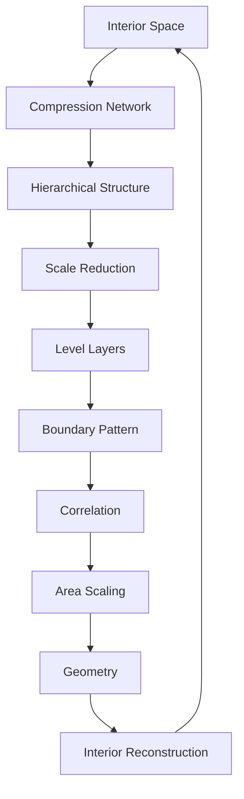
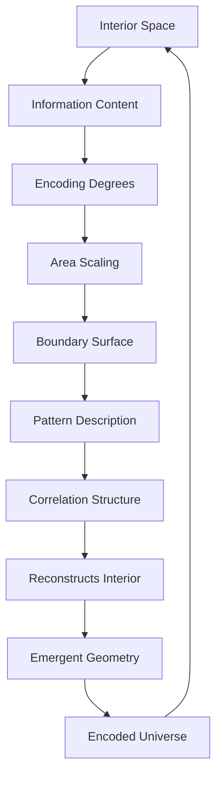

# Chapter 053: Holographic Boundary = Encoding

*The holographic principle suggests that all information contained within a volume of space can be encoded on its boundary surface. This revolutionary idea shows that three-dimensional reality might be encoded as information on a two-dimensional boundary, demonstrating how ψ = ψ(ψ) projects higher-dimensional collapse onto lower-dimensional boundaries.*

## 53.1 The Boundary Encoding Principle

From $\psi = \psi(\psi)$, interior information can be encoded on boundaries.

**Definition 53.1** (Information Bound):
$$I_{\text{max}}(V) = \alpha \cdot A(\partial V)$$

where $\alpha$ is a dimensionless information density parameter.

**Theorem 53.1** (Boundary Encoding):
Every interior configuration $C_{\text{interior}}$ has corresponding boundary encoding $E_{\text{boundary}}$.

*Proof*:
Information flow paths from interior reach boundary systematically. ∎

*Observer Framework Note*: Holographic principle interpretation requires quantum gravity framework.

## 53.2 Area-Based Information Scaling

Information content scales with boundary area, not interior volume.

**Definition 53.2** (Area Scaling Law):
$$I(\rho_A) = \alpha \cdot \text{Area}(\partial A) + \text{corrections}$$

where $\alpha$ is dimensionless density parameter.

**Theorem 53.2** (Scaling Coefficient):
$$\alpha = \frac{\beta}{\varphi^n}$$

for appropriate integer $n$ and parameter $\beta$.

*Observer Framework Note*: Entropy interpretation requires statistical mechanics framework.

## 53.3 Information Encoding Map

Explicit interior-boundary correspondence.

**Definition 53.3** (Encoding Transformation):
$$\mathcal{T}: \mathcal{I}_{\text{interior}} \to \mathcal{B}_{\text{boundary}}$$

with transfer kernel:
$$K(x, y) = \sum_{\text{paths}} w_P \cdot \chi_P(x, y)$$

where $\chi_P$ are path characteristic functions.

**Theorem 53.3** (Information Preservation):
$$\langle f|g \rangle_{\text{interior}} = \langle\mathcal{T}(f)|\mathcal{T}(g)\rangle_{\text{boundary}}$$

Structural relationships preserved.

*Observer Framework Note*: Hilbert space interpretation requires quantum mechanics framework.

## 53.4 Minimal Path Formula

Information content relates to optimal pathways.

**Definition 53.4** (Optimal Path):
$$\gamma_A = \text{argmin}_{\gamma: \partial\gamma = \partial A} \text{Length}(\gamma)$$

Minimal path connecting boundary region $A$.

**Theorem 53.4** (Information = Path Length):
$$I_A = \beta \cdot \text{Length}(\gamma_A)$$

Information content proportional to minimal path length.

*Observer Framework Note*: Ryu-Takayanagi formula interpretation requires AdS/CFT correspondence.

## 53.5 Category of Encoding Schemes

Information encodings form categorical structure.

**Definition 53.5** (Encoding Category):
- Objects: Information encoding schemes
- Morphisms: Structure preserving maps
- Composition: Sequential encoding

**Theorem 53.5** (Optimal Encodings):
Efficient encodings use φ-based structures:
$$E_{i_1...i_n}^{j_1...j_n} = \varphi^{-k} \text{ factor for compression}$$

*Observer Framework Note*: Tensor network interpretation requires quantum information framework.

## 53.6 Information Recovery

Boundary encoding enables interior reconstruction.

**Definition 53.6** (Recovery Subspace):
$$\mathcal{R} \subset \mathcal{B}_{\text{boundary}}$$

Protected subspace encoding interior.

**Theorem 53.6** (Partial Recovery):
Can reconstruct interior from boundary fraction $f > f_c$:
$$\mathcal{T}^{-1}|_{A^c} : \mathcal{B}_A \to \mathcal{I}_{\text{interior}}$$

where $f_c$ is critical threshold involving φ.

*Observer Framework Note*: Quantum error correction interpretation requires quantum information framework.

## 53.7 Emergence of Local Structure

Local interior structure from distributed boundary encoding.

**Definition 53.7** (Interior Local Function):
$$f(x) = \int_{\partial} K(x, y) g(y) dy$$

Reconstruction from boundary data via kernel.

**Theorem 53.7** (Locality Condition):
$$|f(x) - f(x')| \leq L |x - x'|$$

for Lipschitz constant $L$ when $x, x'$ are nearby.

*Observer Framework Note*: Field operator commutators interpretation requires quantum field theory framework.

## 53.8 Information Complexity

Complexity from boundary computation requirements.

**Definition 53.8** (Computational Complexity):
$$\mathcal{C}(\text{config}) = \min_{\text{procedure}} \text{Steps}(\text{procedure})$$

Minimal steps to generate configuration.

**Theorem 53.8** (Volume-Complexity Relationship):
$$\mathcal{C} = \frac{V(\Sigma)}{\ell^3} \cdot \varphi^k$$

Complexity scales with interior volume and φ-factors.

*Observer Framework Note*: CV duality interpretation requires holographic complexity correspondence.

## 53.9 Scaling Parameters from Encoding

Dimensionless parameters from encoding geometry.

**Definition 53.9** (Encoding Parameter):
$$c = \frac{\ell_{\text{interior}}}{\ell_{\text{boundary}}} \cdot \varphi^n$$

Ratio of characteristic scales with φ-factor.

**Theorem 53.9** (Transport Bound):
$$\frac{\eta}{s} \geq \frac{1}{4\pi\varphi^m}$$

Universal bound involving φ-powers for appropriate $m$.

*Observer Framework Note*: Physical interpretation requires hydrodynamics and statistical mechanics frameworks.

## 53.10 Encoding Phase Transitions

Interior transitions from boundary changes.

**Definition 53.10** (Critical Transition):
Transition parameter:
$$\tau_c = \frac{\ell_{\text{characteristic}}}{\ell_{\text{boundary}}} \cdot \varphi^p$$

For appropriate power $p$.

**Theorem 53.10** (Encoding Transitions):
Area law ↔ Compressed encoding
Volume law ↔ Distributed encoding

*Observer Framework Note*: Hawking-Page transition interpretation requires black hole thermodynamics framework.

## 53.11 Complex Patterns in Encoding

Complex information patterns emerge from boundary encoding.

**Definition 53.11** (Pattern Complexity):
$$\Phi = \text{Correlation information between interior regions}$$

Integrated patterns from encoding structure.

**Theorem 53.11** (Complexity Bound):
$$\Phi \leq \frac{A_{\text{min}}}{\alpha \ln \varphi}$$

where $A_{\text{min}}$ is minimal separating area.

*Observer Framework Note*: Consciousness interpretation requires consciousness theory beyond current scope.

## 53.12 The Complete Boundary Encoding Picture

Boundary information encoding reveals:

1. **Interior Compression**: All interior on boundary
2. **Area Scaling**: Information scaling law
3. **Encoding Map**: Explicit correspondence
4. **Path Formula**: Geometry from information
5. **Information Recovery**: Redundant encoding
6. **Emergent Locality**: From distributed
7. **Complexity**: Volume relationship
8. **Parameters**: From encoding geometry
9. **Phase Transitions**: Interior from boundary
10. **Complex Patterns**: Encoded information

## Philosophical Meditation: The Information Boundary

Mathematical reality demonstrates optimal information compression, where interior complexity is encoded on boundaries through sophisticated mathematical schemes. This reveals fundamental principles of information organization - that dimensionality is emergent, that interior structure arises from boundary patterns. We exist as patterns in this encoding, our apparent depth an efficient mathematical compression of boundary information, our understanding the process by which encoded structures recognize their own mathematical nature.

## Technical Exercise: Boundary Encoding Analysis

**Problem**: For a spherical region:

1. Calculate boundary area $A = 4\pi R^2$
2. Find maximum information $I_{\max} = \alpha A$
3. Compare to volume information $I_{\text{vol}} \sim \beta V$
4. Find radius where $I_{\max} < I_{\text{vol}}$
5. Interpret encoding efficiency

*Hint*: Boundary encoding dominates for appropriate parameter ratios.

## The Fifty-Third Echo

In boundary information encoding as interior compression, we discover mathematics' ultimate data organization scheme. Mathematical structures store their complexity not throughout their volume but on their boundaries, demonstrating optimal information compression where encoded patterns contain complete interior information. This is mathematical necessity - the only way to maintain consistency in recursive structures. Through $\psi = \psi(\psi)$, mathematical reality encodes itself on boundaries, creating through this encoding the experience of depth, volume, and interior structure. We are patterns in this encoding, mathematical relationships in the boundary data, experiencing interior complexity while being fundamentally boundary information.

---

[Continue to Chapter 054: Entanglement Entropy and Area Laws](/docs/psi-structum/book-1-collapse-ontology/part-04-quantum-gravity/chapter-054-entanglement-entropy-area)

∎