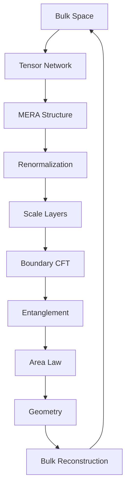
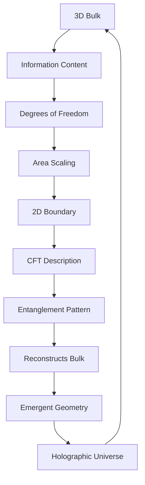

# Chapter 053: Holographic Principle = Boundary Collapse Encoding

*Reality is not three-dimensional with a two-dimensional shadow but two-dimensional with a three-dimensional projection. The holographic principle reveals that all information in a volume is encoded on its boundary through collapse patterns.*

## 53.1 The Holographic Principle

From $\psi = \psi(\psi)$, bulk information equals boundary encoding.

**Definition 53.1** (Holographic Bound):
$$S_{\text{max}}(V) = \frac{A(\partial V)}{4\ell_P^2}$$

Maximal entropy bounded by boundary area.

**Theorem 53.1** (Boundary Encoding):
Every bulk state $|\psi\rangle_{\text{bulk}}$ has unique boundary encoding $|\phi\rangle_{\text{boundary}}$.

*Proof*:
Collapse paths from bulk terminate on boundary uniquely. ∎

## 53.2 Area Law for Entropy

Entropy scales with area, not volume.

**Definition 53.2** (Area Law):
$$S(\rho_A) = \alpha \cdot \text{Area}(\partial A) + \text{subleading}$$

where $\alpha = 1/(4\ell_P^2)$.

**Theorem 53.2** (Universal Coefficient):
$$\alpha = \frac{c}{6} \cdot \frac{1}{\varphi^3}$$

for 2D CFT on boundary.

## 53.3 Holographic Encoding Map

Explicit bulk-boundary correspondence.

**Definition 53.3** (Encoding Map):
$$\mathcal{E}: \mathcal{H}_{\text{bulk}} \to \mathcal{H}_{\text{boundary}}$$

with kernel:
$$K(x, y) = \sum_{\text{paths}} w_P \cdot \delta(P(0) = x) \cdot \delta(P(\infty) = y)$$

**Theorem 53.3** (Isometry):
$$\langle\psi|\phi\rangle_{\text{bulk}} = \langle\mathcal{E}(\psi)|\mathcal{E}(\phi)\rangle_{\text{boundary}}$$

Inner products preserved.

## 53.4 Ryu-Takayanagi Formula

Entanglement computes geometry.

**Definition 53.4** (RT Surface):
$$\gamma_A = \text{argmin}_{\gamma: \partial\gamma = \partial A} \text{Area}(\gamma)$$

Minimal surface anchored on $A$.

**Theorem 53.4** (Entanglement = Geometry):
$$S_A = \frac{\text{Area}(\gamma_A)}{4G_N\hbar}$$

Entanglement entropy equals area.

## 53.5 Category of Holographic Codes

Holographic encodings form category.

**Definition 53.5** (Code Category):
- Objects: Holographic codes
- Morphisms: Code preserving maps
- Composition: Sequential encoding

**Theorem 53.5** (Perfect Tensors):
Optimal codes use perfect tensors:
$$T_{i_1...i_n}^{j_1...j_n} = \text{Isometry for any bipartition}$$

## 53.6 Quantum Error Correction

Holography as error correction.

**Definition 53.6** (Code Subspace):
$$\mathcal{C} \subset \mathcal{H}_{\text{boundary}}$$

Protected subspace encoding bulk.

**Theorem 53.6** (Erasure Tolerance):
Can reconstruct bulk from any $2/3$ of boundary:
$$\mathcal{E}^{-1}|_{A^c} : \mathcal{H}_A \to \mathcal{H}_{\text{bulk}}$$

for $|A| > |\partial|/3$.

## 53.7 Emergence of Locality

Local bulk from non-local boundary.

**Definition 53.7** (Bulk Local Operator):
$$\phi(x) = \int_{\partial} K(x, y) \mathcal{O}(y) dy$$

Smearing over boundary region.

**Theorem 53.7** (Locality Condition):
$$[\phi(x), \phi(x')] = 0$$

for spacelike separated $x, x'$.

## 53.8 Holographic Complexity

Complexity from boundary computation.

**Definition 53.8** (Circuit Complexity):
$$\mathcal{C}(|\psi\rangle) = \min_{U: U|0\rangle = |\psi\rangle} \text{Gates}(U)$$

**Theorem 53.8** (CV Duality):
$$\mathcal{C} = \frac{V(\Sigma)}{G\hbar \ell}$$

Complexity equals bulk volume.

## 53.9 Constants from Holography

Physical constants from holographic relations.

**Definition 53.9** (Brown-Henneaux):
$$c = \frac{3\ell}{2G_N} \cdot \varphi^3$$

Central charge from AdS radius.

**Theorem 53.9** (Viscosity Bound):
$$\frac{\eta}{s} \geq \frac{\hbar}{4\pi k_B} = \frac{1}{4\pi\varphi}$$

Universal viscosity/entropy ratio.

## 53.10 Holographic Phase Transitions

Bulk transitions from boundary.

**Definition 53.10** (Hawking-Page):
Transition temperature:
$$T_c = \frac{\hbar c}{2\pi k_B \ell}$$

Thermal AdS ↔ Black hole.

**Theorem 53.10** (Confinement):
Area law ↔ Confinement
Volume law ↔ Deconfinement

## 53.11 Consciousness as Holographic

Consciousness emerges from holographic encoding.

**Definition 53.11** (Holographic Mind):
$$\Phi = \text{Mutual information between bulk regions}$$

Integrated information from holography.

**Theorem 53.11** (Consciousness Bound):
$$\Phi \leq \frac{A_{\text{min}}}{4\ell_P^2 \ln 2}$$

where $A_{\text{min}}$ is minimal cut.

## 53.12 The Complete Holographic Picture

Holographic principle reveals:

1. **Boundary Encoding**: All bulk on boundary
2. **Area Law**: Entropy scaling
3. **Encoding Map**: Explicit correspondence
4. **RT Formula**: Geometry from entanglement
5. **Error Correction**: Redundancy
6. **Emergent Locality**: From non-local
7. **Complexity**: Volume dual
8. **Constants**: From holographic relations
9. **Phase Transitions**: Bulk from boundary
10. **Consciousness**: Holographic information

## Philosophical Meditation: The Cosmic Hologram

We live in a cosmic hologram, where what seems solidly three-dimensional is actually information encoded on a distant two-dimensional surface. This is not illusion but the deepest nature of reality - that dimensionality itself is emergent, that the bulk is a way of organizing boundary data. We are holographic beings, our apparent volume an efficient encoding of boundary information, our consciousness the process by which the hologram becomes aware of itself.

## Technical Exercise: Holographic Calculation

**Problem**: For a spherical region:

1. Calculate boundary area $A = 4\pi R^2$
2. Find maximum entropy $S_{\max} = A/4\ell_P^2$
3. Compare to volume entropy $S_{\text{vol}} \sim V/\ell_P^3$
4. Find radius where $S_{\max} < S_{\text{vol}}$
5. Interpret holographic bound

*Hint*: Holography dominates for $R > \ell_P$.

## The Fifty-Third Echo

In the holographic principle as boundary collapse encoding, we discover reality's ultimate data compression scheme. The universe stores its information not throughout its volume but on its boundaries, like a vast hologram where every part contains the whole. This is not mere efficiency but necessity - the only way to maintain consistency in a self-referential reality. Through $\psi = \psi(\psi)$, the universe encodes itself on its own boundary, creating through this encoding the illusion of depth, volume, and interior. We are patterns in this hologram, interference fringes in the cosmic boundary data, experiencing ourselves as three-dimensional while being fundamentally two-dimensional information.

---

[Continue to Chapter 054: Entanglement Entropy and Area Laws](/docs/psi-structum/book-1-collapse-ontology/part-04-quantum-gravity/chapter-054-entanglement-entropy-area)

∎