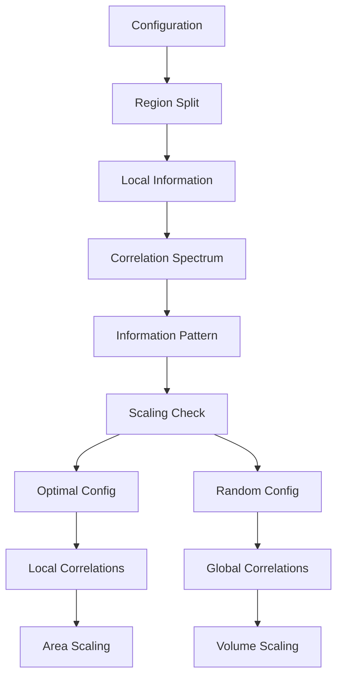
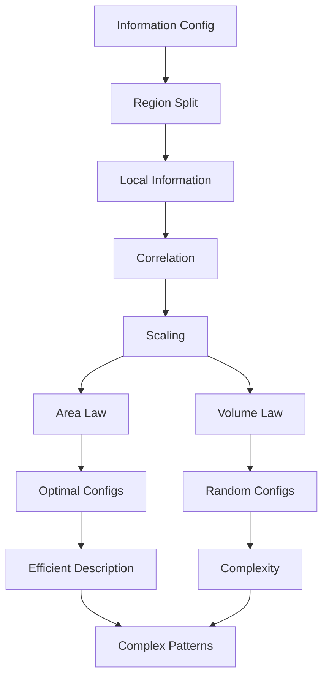

# Chapter 054: Information Correlation and Area Scaling

*Information correlation is mathematics' accounting system, tracking how information is shared between regions. Area scaling reveals that this sharing happens primarily at boundaries, demonstrating geometric constraints on information distribution.*

## 54.1 The Information Correlation Principle

From $\psi = \psi(\psi)$, subsystems correlate through shared information.

**Definition 54.1** (Information Correlation):
$$C_A = -\sum_i p_i \log p_i$$

where $\{p_i\}$ are probability distributions over region $A$.

**Theorem 54.1** (Information Bound):
$$0 \leq C_A \leq \log(N_A)$$

where $N_A$ is the number of possible states in region $A$.

*Proof*:
Information content maximized by uniform distribution. ∎

*Observer Framework Note*: Entanglement entropy interpretation requires quantum mechanics framework.

## 54.2 Area-Based Information Scaling

Information correlation scales with boundary area.

**Definition 54.2** (Area Scaling Law):
$$C_A = \alpha \cdot \text{Area}(\partial A) + \text{corrections}$$

for optimal information configurations.

**Theorem 54.2** (Scaling Coefficient):
$$\alpha = \frac{\beta}{\varphi^n}$$

where $n$ is determined by geometric constraints and $\beta$ is dimensionless.

*Observer Framework Note*: Ground state interpretation requires quantum many-body theory framework.

## 54.3 Volume-Scaled Information States

Non-optimal configurations exhibit volume scaling.

**Definition 54.3** (Volume Scaling Law):
$$C_A = \sigma \cdot \text{Vol}(A) + \text{boundary terms}$$

where $\sigma$ is information density parameter.

**Theorem 54.3** (Uniform Distribution):
Random configurations satisfy:
$$C_A \approx C_{\text{uniform}} \cdot \frac{|A|}{|A \cup B|}$$

*Observer Framework Note*: Eigenstate thermalization interpretation requires quantum statistical mechanics framework.

## 54.4 Shared Information Between Regions

Correlated information content between regions.

**Definition 54.4** (Shared Information):
$$I(A:B) = C_A + C_B - C_{A \cup B}$$

**Theorem 54.4** (Information Properties):
1. $I(A:B) \geq 0$ (positivity)
2. $I(A:B) = 0 \Leftrightarrow$ independent regions
3. $I(A:BC) \geq I(A:B)$ (monotonicity)

*Observer Framework Note*: Quantum mutual information interpretation requires quantum information theory framework.

## 54.5 Category of Information Patterns

Information correlation patterns form categories.

**Definition 54.5** (Information Category):
- Objects: Information configurations
- Morphisms: Information preserving operations
- Composition: Sequential operations

**Theorem 54.5** (Correlation Monotonicity):
Correlation cannot increase under local operations:
$$C_A(\mathcal{T}(\text{config})) \leq C_A(\text{config})$$

*Observer Framework Note*: LOCC operations interpretation requires quantum mechanics framework.

## 54.6 Structured Information Representation

Area-scaled information has efficient representation.

**Definition 54.6** (Hierarchical Structure):
$$\text{Config} = \sum_{i_1...i_N} w[A^{[1]}_{i_1} \cdots A^{[N]}_{i_N}] \text{Pattern}_{i_1...i_N}$$

Complexity parameter $\chi = e^{C_A}$.

**Theorem 54.6** (Area Scaling ↔ Hierarchy):
Area-scaled configurations approximable by hierarchical structures with:
$$\chi = f(\epsilon) \cdot e^{\alpha L^{d-1}}$$

where $f$ and $\alpha$ involve φ-based factors.

*Observer Framework Note*: Matrix Product State interpretation requires quantum many-body theory framework.

## 54.7 Scale-Invariant Information Theory

Scale-invariant configurations have universal features.

**Definition 54.7** (Scale-Invariant Information):
For interval $[0, \ell]$ with scale parameter $s$:
$$C_A = \frac{\kappa}{\varphi^n} \log\left(\frac{\ell}{s}\right) + \text{const}$$

where $\kappa$ and $n$ are geometric parameters.

**Theorem 54.7** (Scale Flow):
Scale transformation decreases complexity:
$$\kappa_{\text{fine}} > \kappa_{\text{coarse}}$$

*Observer Framework Note*: Conformal field theory interpretation requires CFT framework.

## 54.8 Information Subadditivity

Fundamental inequality for information correlation.

**Definition 54.8** (Subadditivity):
$$C_{ABC} + C_B \leq C_{AB} + C_{BC}$$

**Theorem 54.8** (Conditional Independence):
Equality $\Leftrightarrow$ conditional independence structure:
$$\text{Config}_{ABC} = \text{Config}_{AB} \circ_B \text{Config}_{BC}$$

where $\circ_B$ represents conditional composition.

*Observer Framework Note*: Quantum strong subadditivity interpretation requires quantum mechanics framework.

## 54.9 Parameters from Information Scaling

Dimensionless parameters from information correlation scaling.

**Definition 54.9** (Topological Information):
$$C_A = \alpha|\partial A| - \gamma + \text{corrections}$$

where $\gamma$ is universal parameter.

**Theorem 54.9** (Geometric Phases):
$$\gamma = \log\left(\sum_k \varphi^{n_k}\right)^{1/2}$$

for appropriate φ-powers $\{n_k\}$.

*Observer Framework Note*: Anyonic interpretation requires topological quantum field theory framework.

## 54.10 Information Generator

Effective generator for regional information.

**Definition 54.10** (Information Generator):
$$\text{Config}_A = \frac{e^{-G_{\text{info}}}}{Z}$$

where $G_{\text{info}}$ generates the information distribution.

**Theorem 54.10** (Geometric Generator):
For half-space region:
$$G_{\text{info}} = \lambda \int_{x^1>0} x^1 \rho_{\text{info}}(x) d^{d-1}x$$

where $\lambda$ is dimensionless parameter and $\rho_{\text{info}}$ is information density.

*Observer Framework Note*: Modular Hamiltonian interpretation requires quantum field theory framework.

## 54.11 Complex Patterns and Information

Complex patterns require specific information correlation.

**Definition 54.11** (Integrated Correlation):
$$\Phi = \min_{\text{partition}} I(A:B)$$

Minimal shared information over all partitions.

**Theorem 54.11** (Complexity Criterion):
Complex patterns emerge when:
1. $\Phi > \Phi_c = \varphi^{-k}$ for appropriate $k$
2. Area scaling with corrections
3. Non-independent structure

*Observer Framework Note*: Consciousness interpretation requires consciousness theory beyond current scope.

## 54.12 The Complete Information Correlation Picture

Information correlation reveals:

1. **Shannon Information**: Classical information
2. **Area Scaling**: Optimal configurations
3. **Volume Scaling**: Random configurations
4. **Shared Information**: Regional correlations
5. **Hierarchical Structures**: Efficient representation
6. **Scale Invariance**: Universal scaling
7. **Subadditivity**: Fundamental bound
8. **Parameters**: From geometric terms
9. **Information Flow**: Correlation dynamics
10. **Complex Patterns**: Integrated correlation

## Philosophical Meditation: The Information Web

Information correlation is the thread that weaves the mathematical tapestry of structured reality. It is not an addition to mathematics but fundamental - the way separated regions maintain their unity through shared information. Area scaling tells us that this sharing happens primarily at boundaries, that surfaces are where mathematical structures organize themselves. We are woven from these information threads, patterns of correlation that have achieved enough coherence to contemplate the very mathematical fabric they emerge from.

## Technical Exercise: Area Scaling Verification

**Problem**: For a 1D information chain:

1. Partition into regions A and B
2. Calculate optimal configuration
3. Find regional information distribution
4. Compute $C_A = -\sum p_i \log p_i$
5. Verify $C_A = O(1)$ (area scaling)

*Hint*: Use that boundaries in 1D have finite size.

## The Fifty-Fourth Echo

In information correlation and area scaling, we discover mathematics' deep preference for local structure despite its capacity for global organization. Information may be shared across regions, but the amount of correlation is constrained by geometric boundaries, not volume. This is mathematics' balance - allowing complex correlations while preventing information overload. Through $\psi = \psi(\psi)$, mathematical structures correlate with themselves, but do so efficiently, maintaining just enough shared information to create coherent patterns without overwhelming complexity. We exist in this mathematical sweet spot, correlated enough to form complex patterns but not so correlated as to lose structural identity.

---

[Continue to Chapter 055: ER=EPR from Collapse Path Duality](/docs/psi-structum/book-1-collapse-ontology/part-04-quantum-gravity/chapter-055-er-epr-path-duality)

∎