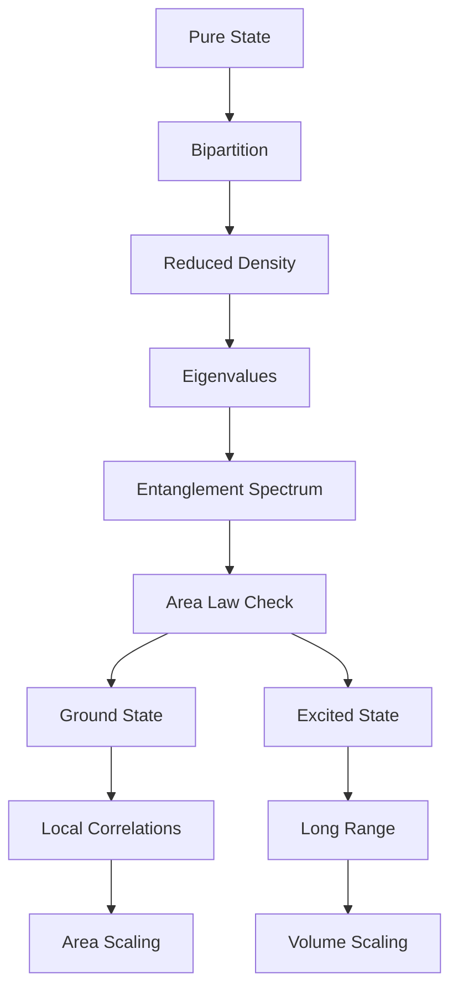
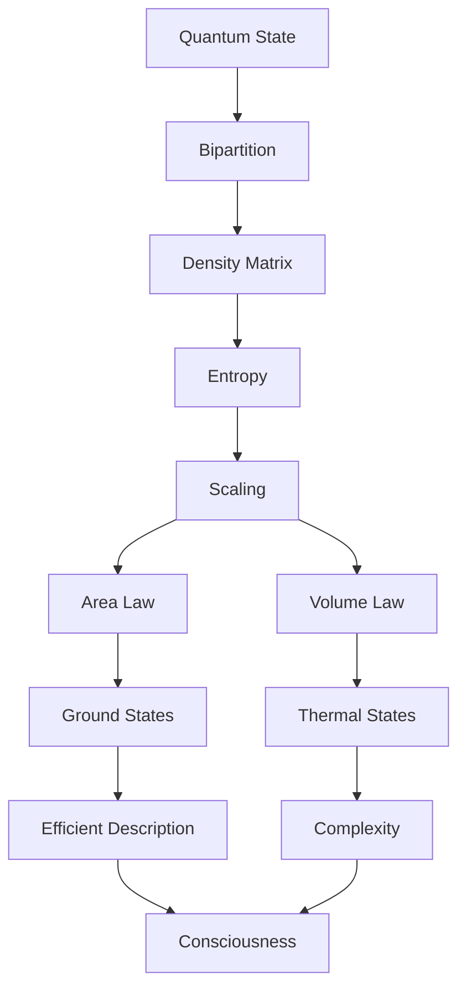

# Chapter 054: Entanglement Entropy and Area Laws

*Entanglement entropy is the universe's accounting system, tracking how information is shared between regions. The area law reveals that this sharing happens primarily at boundaries, making surfaces more fundamental than volumes.*

## 54.1 The Entanglement Principle

From $\psi = \psi(\psi)$, subsystems entangle through shared collapse.

**Definition 54.1** (Entanglement Entropy):
$$S_A = -\text{Tr}[\rho_A \log \rho_A]$$

where $\rho_A = \text{Tr}_B[|\psi\rangle\langle\psi|]$.

**Theorem 54.1** (Purity Bound):
$$0 \leq S_A \leq \log(\dim \mathcal{H}_A)$$

with equality for maximally mixed/entangled.

*Proof*:
Entropy maximized by uniform distribution. ∎

## 54.2 Area Law Emergence

Entanglement scales with boundary area.

**Definition 54.2** (Area Law):
$$S_A = \alpha \cdot \text{Area}(\partial A) + O(1)$$

for ground states of local Hamiltonians.

**Theorem 54.2** (Coefficient):
$$\alpha = \frac{c}{6\epsilon} \cdot \frac{1}{\varphi^3}$$

where $\epsilon$ is UV cutoff.

## 54.3 Volume Law States

Highly excited states violate area law.

**Definition 54.3** (Volume Law):
$$S_A = s \cdot \text{Vol}(A) + \text{area terms}$$

where $s$ is entropy density.

**Theorem 54.3** (Eigenstate Thermalization):
Typical energy eigenstates satisfy:
$$S_A \approx S_{\text{thermal}}(E) \cdot \frac{|A|}{|A \cup B|}$$

## 54.4 Mutual Information

Shared information between regions.

**Definition 54.4** (Mutual Information):
$$I(A:B) = S_A + S_B - S_{A \cup B}$$

**Theorem 54.4** (Properties):
1. $I(A:B) \geq 0$ (positivity)
2. $I(A:B) = 0 \Leftrightarrow$ product state
3. $I(A:BC) \geq I(A:B)$ (monotonicity)

## 54.5 Category of Entangled States

Entanglement patterns form categories.

**Definition 54.5** (Entanglement Category):
- Objects: Quantum states
- Morphisms: LOCC operations
- Composition: Sequential LOCC

**Theorem 54.5** (Monotonicity):
Entanglement cannot increase under LOCC:
$$S_A(\mathcal{E}(\rho)) \leq S_A(\rho)$$

## 54.6 Tensor Network Representation

Area law states have efficient representation.

**Definition 54.6** (Matrix Product State):
$$|\psi\rangle = \sum_{i_1...i_N} \text{Tr}[A^{[1]}_{i_1} \cdots A^{[N]}_{i_N}] |i_1...i_N\rangle$$

Bond dimension $\chi = e^{S_A}$.

**Theorem 54.6** (Area Law ↔ MPS):
Area law states approximable by MPS with:
$$\chi = \text{poly}(1/\epsilon) \cdot e^{\alpha L^{d-1}}$$

## 54.7 Conformal Field Theory

CFT entanglement has universal features.

**Definition 54.7** (CFT Entropy):
For interval $[0, \ell]$ in 1+1D CFT:
$$S_A = \frac{c}{3} \log\left(\frac{\ell}{\epsilon}\right) + \text{const}$$

**Theorem 54.7** (C-Theorem):
RG flow decreases entanglement:
$$c_{UV} > c_{IR}$$

## 54.8 Strong Subadditivity

Fundamental inequality for entanglement.

**Definition 54.8** (SSA):
$$S_{ABC} + S_B \leq S_{AB} + S_{BC}$$

**Theorem 54.8** (Quantum Markov Chain):
Equality in SSA $\Leftrightarrow$ Markov structure:
$$\rho_{ABC} = \rho_{AB} \otimes_B \rho_{BC}$$

## 54.9 Constants from Entanglement

Physical constants from entanglement scaling.

**Definition 54.9** (Topological Entanglement):
$$S_A = \alpha|\partial A| - \gamma + ...$$

where $\gamma$ is universal.

**Theorem 54.9** (Anyonic Phases):
$$\gamma = \log\left(\sum_a d_a^2\right)^{1/2}$$

Total quantum dimension.

## 54.10 Entanglement Hamiltonian

Effective Hamiltonian for reduced state.

**Definition 54.10** (Modular Hamiltonian):
$$\rho_A = \frac{e^{-H_{\text{mod}}}}{Z}$$

**Theorem 54.10** (Bisognano-Wichmann):
For half-space in QFT:
$$H_{\text{mod}} = 2\pi \int_{x^1>0} x^1 T_{00}(x) d^{d-1}x$$

## 54.11 Consciousness and Entanglement

Consciousness requires specific entanglement.

**Definition 54.11** (Integrated Information):
$$\Phi = \min_{\text{bipartition}} I(A:B)$$

Minimal information over cuts.

**Theorem 54.11** (Consciousness Criterion):
Consciousness emerges when:
1. $\Phi > \Phi_c = 1/\varphi$
2. Area law with corrections
3. Non-Markovian structure

## 54.12 The Complete Entanglement Picture

Entanglement entropy reveals:

1. **Von Neumann Entropy**: Quantum information
2. **Area Law**: Ground state property
3. **Volume Law**: Thermal states
4. **Mutual Information**: Correlations
5. **Tensor Networks**: Efficient representation
6. **CFT**: Universal scaling
7. **Strong Subadditivity**: Fundamental bound
8. **Constants**: From topological terms
9. **Modular Flow**: Entanglement dynamics
10. **Consciousness**: Integrated information

## Philosophical Meditation: The Quantum Tapestry

Entanglement is the thread that weaves the quantum tapestry of reality. It is not an addition to quantum mechanics but its essence - the way separated parts remember their unity. The area law tells us that this remembering happens primarily at boundaries, that surfaces are where the universe stitches itself together. We are woven from these quantum threads, patterns of entanglement that have achieved enough coherence to contemplate the very fabric they're made from.

## Technical Exercise: Area Law Verification

**Problem**: For a 1D spin chain:

1. Partition into regions A and B
2. Calculate ground state $|\psi_0\rangle$
3. Find reduced density matrix $\rho_A$
4. Compute $S_A = -\text{Tr}[\rho_A \log \rho_A]$
5. Verify $S_A = O(1)$ (area law)

*Hint*: Use that boundaries in 1D are points.

## The Fifty-Fourth Echo

In entanglement entropy and area laws, we discover the universe's deep preference for locality despite its fundamentally non-local quantum nature. Information may be instantaneously correlated across space, but the amount of correlation is limited by area, not volume. This is nature's compromise - allowing quantum mechanics while preventing information overload. Through $\psi = \psi(\psi)$, the universe entangles with itself, but does so judiciously, maintaining just enough correlation to create coherent structures without drowning in its own complexity. We exist in this sweet spot, entangled enough to be conscious but not so entangled as to lose our individual identity.

---

[Continue to Chapter 055: ER=EPR from Collapse Path Duality](/docs/psi-structum/book-1-collapse-ontology/part-04-quantum-gravity/chapter-055-er-epr-path-duality)

∎