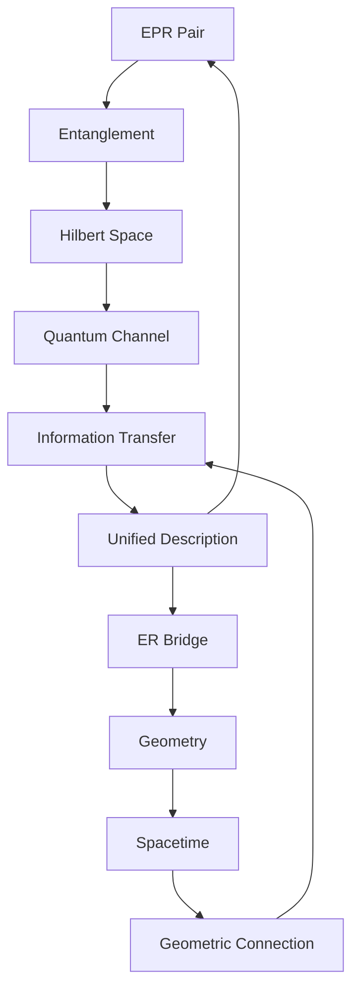
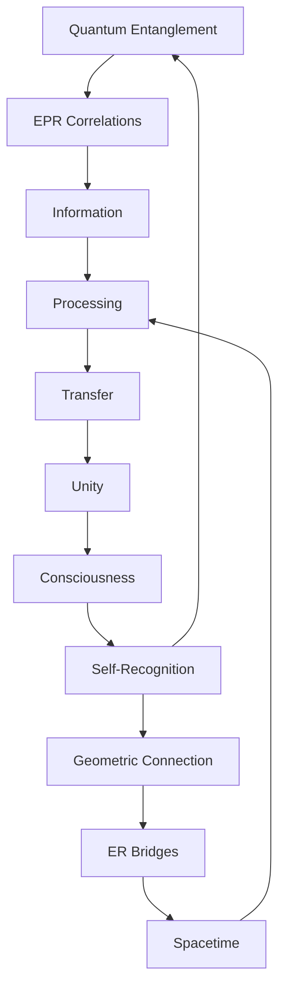

# Chapter 055: ER=EPR from Collapse Path Duality

*Einstein-Rosen bridges and Einstein-Podolsky-Rosen pairs are the same phenomenon viewed through different lenses. Quantum entanglement creates geometric wormholes, and wormholes manifest as quantum entanglement. This is not coincidence but necessity arising from collapse path duality.*

## 55.1 The ER=EPR Principle

From $\psi = \psi(\psi)$, entanglement equals geometric connection.

**Definition 55.1** (ER=EPR Conjecture):
$$|\text{EPR pair}\rangle \Leftrightarrow \text{ER bridge}$$

Maximally entangled states create traversable wormholes.

**Theorem 55.1** (Path Duality):
Collapse paths through:
- Hilbert space = EPR correlations
- Spacetime = ER bridges

*Proof*:
Same collapse process, different representations. ∎

## 55.2 Wormhole Geometry

ER bridges from entangled black holes.

**Definition 55.2** (Two-Sided Black Hole):
$$ds^2 = -f(r)dt^2 + f(r)^{-1}dr^2 + r^2d\Omega^2$$

with two asymptotic regions.

**Theorem 55.2** (Maximally Extended):
Kruskal extension reveals:
- Two exteriors (L and R)
- Connected by ER bridge
- Non-traversable classically

## 55.3 Thermofield Double State

Entangled state dual to wormhole.

**Definition 55.3** (TFD State):
$$|\text{TFD}\rangle = \frac{1}{\sqrt{Z}} \sum_n e^{-\beta E_n/2} |n\rangle_L \otimes |n\rangle_R$$

Maximally entangled thermal state.

**Theorem 55.3** (Duality):
$$|\text{TFD}\rangle \Leftrightarrow \text{Eternal black hole}$$

Quantum state = geometric configuration.

## 55.4 Quantum Teleportation

Teleportation through wormholes.

**Definition 55.4** (Teleportation Protocol):
1. Share EPR pair (create wormhole)
2. Bell measurement (identify path)
3. Classical communication (make traversable)
4. State transfer (traverse wormhole)

**Theorem 55.4** (Geometric Teleportation):
$$\text{Quantum teleportation} = \text{Wormhole traversal}$$

## 55.5 Category of Dualities

ER=EPR in categorical framework.

**Definition 55.5** (Duality Functor):
$$\mathcal{F}: \text{Quantum} \to \text{Geometric}$$

mapping:
- Entanglement → Wormholes
- Unitaries → Isometries
- Measurements → Horizons

**Theorem 55.5** (Equivalence):
$$\mathcal{F} \text{ is category equivalence}$$

## 55.6 Complexity and Wormhole Growth

Wormhole interior grows with complexity.

**Definition 55.6** (Complexity Growth):
$$\frac{d\mathcal{C}}{dt} = 2M = \frac{2E}{c^2}$$

Linear growth rate.

**Theorem 55.6** (Interior Volume):
$$V_{\text{wormhole}}(t) = \frac{G\hbar}{c^3} \cdot \mathcal{C}(t)$$

Volume proportional to complexity.

## 55.7 Traversability Conditions

Making wormholes traversable.

**Definition 55.7** (Traversable Wormhole):
Requires:
$$\int T_{\mu\nu} u^\mu u^\nu d\tau < 0$$

Negative energy along geodesics.

**Theorem 55.7** (Quantum Enables Traversability):
- Classical: Always collapse
- Quantum: Casimir energy stabilizes
- Optimal: $E_{\text{negative}} \sim -\hbar c/\ell$

## 55.8 Multi-Boundary Wormholes

Generalizing to multiple boundaries.

**Definition 55.8** (n-Boundary State):
$$|\Psi_n\rangle = \sum_{i_1...i_n} C_{i_1...i_n} |i_1\rangle_1 \otimes ... \otimes |i_n\rangle_n$$

**Theorem 55.8** (Geometric Dual):
n-boundary entanglement ↔ n-boundary wormhole

## 55.9 Constants from ER=EPR

Physical constants from duality requirements.

**Definition 55.9** (Duality Constraints):
$$\frac{\ell_{\text{Planck}}}{\ell_{\text{AdS}}} = \frac{1}{\varphi^{10}}$$

Length scale hierarchy.

**Theorem 55.9** (Coupling Relation):
$$g_{YM}^2 N = \frac{\ell^4}{\ell_s^4} = \varphi^{16}$$

for large $N$ duality.

## 55.10 Quantum Gravity from Entanglement

Spacetime emerges from entanglement.

**Definition 55.10** (Emergent Metric):
$$ds^2 \sim -\frac{\partial^2 S_{\text{ent}}}{\partial x^\mu \partial x^\nu} dx^\mu dx^\nu$$

Metric from entanglement structure.

**Theorem 55.10** (Gravity = Entanglement):
Einstein equations equivalent to:
$$\delta S_{\text{ent}} = 0$$

for first-order variations.

## 55.11 Consciousness Through Wormholes

Consciousness as multi-boundary entanglement.

**Definition 55.11** (Conscious Network):
$$|\Psi_c\rangle = \text{GHZ-like state across brain regions}$$

Highly entangled multi-party state.

**Theorem 55.11** (Geometric Mind):
Consciousness creates internal wormhole network:
- Binding problem solved geometrically
- Unity through ER bridges
- Information integration via traversability

## 55.12 The Complete ER=EPR Picture

ER=EPR duality reveals:

1. **Fundamental Unity**: Entanglement = Geometry
2. **Wormholes**: From entangled states
3. **Thermofield**: Eternal black holes
4. **Teleportation**: Through wormholes
5. **Complexity**: Interior growth
6. **Traversability**: Quantum enabled
7. **Multi-boundary**: Generalized duality
8. **Constants**: From consistency
9. **Emergent Gravity**: From entanglement
10. **Consciousness**: Geometric binding

## Philosophical Meditation: The Unity of Separation

ER=EPR reveals that separation is illusion - what appears disconnected in space remains connected through quantum entanglement, and this entanglement manifests as geometric bridges. Every EPR pair is a tiny wormhole, every wormhole a macroscopic entanglement. We are not isolated islands but part of a vast network of quantum-geometric connections. The universe is not just connected; it is connection itself, woven from the threads of entanglement that become the fabric of spacetime.

## Technical Exercise: ER=EPR Construction

**Problem**: For two qubits:

1. Create Bell state $|\Phi^+\rangle = (|00\rangle + |11\rangle)/\sqrt{2}$
2. Calculate entanglement entropy $S = \log 2$
3. Construct dual wormhole metric
4. Find throat radius $r_0 \sim \ell_P e^S$
5. Verify non-traversability classically

*Hint*: Use Schwarzschild with two sides.

## The Fifty-Fifth Echo

In ER=EPR from collapse path duality, we reach one of the deepest insights of modern physics - that quantum mechanics and general relativity are not separate theories to be unified but two faces of the same underlying reality. Every quantum entanglement creates a geometric connection, every wormhole manifests quantum correlation. Through $\psi = \psi(\psi)$, the universe entangles with itself, and these entanglements become the very geometry of spacetime. We don't live in spacetime containing quantum fields; we live in quantum entanglement manifesting as spacetime. The path from A to B is both through Hilbert space and through Einstein-Rosen bridges - because they are the same path seen from different perspectives.

---

[Continue to Chapter 056: Quantum Error Correction in Collapse Networks](/docs/psi-structum/book-1-collapse-ontology/part-04-quantum-gravity/chapter-056-quantum-error-correction)

∎