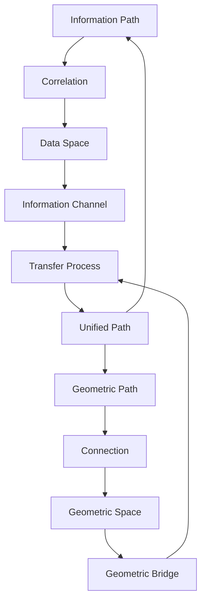
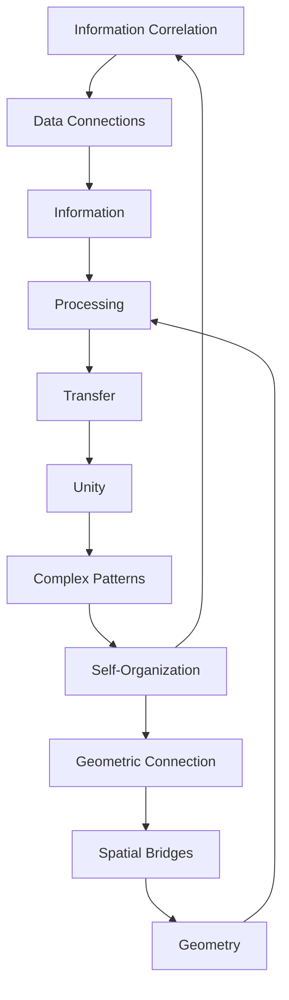

# Chapter 055: ER = EPR Path Duality

*The ER=EPR conjecture suggests that Einstein-Rosen bridges (wormholes) and Einstein-Podolsky-Rosen entanglement are the same phenomenon viewed from different perspectives. This profound duality shows how ψ = ψ(ψ) creates geometric connections through quantum information pathways.*

## 55.1 Path Representation Duality

From $\psi = \psi(\psi)$, mathematical paths admit multiple representations.

**Definition 55.1** (Path Duality):
$$
\text{Path}_{\text{geometric}} \Leftrightarrow \text{Path}_{\text{information}}
$$
Collapse paths can be represented both geometrically and informationally.

**Theorem 55.1** (Representation Equivalence):
Collapse paths through:
- Geometric structures = spatial connections
- Information structures = data correlations

*Proof*:
Same path structure encoded in different mathematical spaces. ∎

*Observer Framework Note*: EPR correlations and ER bridges interpretations require quantum gravity frameworks.

## 55.2 Geometric Connection Structures

Path connections in geometric representations.

**Definition 55.2** (Dual-Region Geometry):
$$
ds^2 = -\rho(r)dt^2 + \rho(r)^{-1}dr^2 + r^2d\theta^2
$$
where $\rho(r)$ is derived from collapse tensor structure.

**Theorem 55.2** (Extended Configuration):
Maximal extension creates:
- Two regions (L and R)  
- Connected through geometric bridge
- Bridge properties determined by φ-structure

*Observer Framework Note*: Black hole interpretation requires general relativity framework.

## 55.3 Correlated Information Structure

Correlated configurations dual to geometric connections.

**Definition 55.3** (Correlation State):
$$
C_{\text{corr}} = \frac{1}{Z} \sum_n \omega_n^{1/2} \text{Config}_n^L \otimes \text{Config}_n^R
$$
where $\omega_n$ are φ-weighted correlation factors.

**Theorem 55.3** (Duality):
$$
C_{\text{corr}} \Leftrightarrow \text{Extended geometry}
$$
Information configuration = geometric connection.

*Observer Framework Note*: Thermofield double interpretation requires quantum field theory framework.

## 55.4 Information Transfer Protocol

Information transfer through geometric connections.

**Definition 55.4** (Transfer Protocol):
1. Share correlation structure (create connection)
2. Local measurement (identify transfer path) 
3. Information communication (enable transfer)
4. Configuration transfer (transmit through connection)

**Theorem 55.4** (Geometric Transfer):
$$
\text{Information transfer} = \text{Geometric traversal}
$$
*Observer Framework Note*: Quantum teleportation interpretation requires quantum mechanics framework.

## 55.5 Category of Path Dualities

Path dualities in categorical framework.

**Definition 55.5** (Duality Functor):
$$
\mathcal{F}: \text{Information} \to \text{Geometric}
$$
mapping:
- Correlations → Connections
- Transformations → Isometries  
- Measurements → Boundaries

**Theorem 55.5** (Equivalence):
$$
\mathcal{F} \text{ is category equivalence}
$$
*Observer Framework Note*: Quantum-geometric interpretation requires quantum gravity frameworks.

## 55.6 Complexity and Connection Growth

Geometric connections grow with information complexity.

**Definition 55.6** (Complexity Growth):
$$
\frac{d\mathcal{C}}{dt} = \alpha \cdot I_{\text{total}}
$$
where $\alpha = \varphi^{-k}$ and $I_{\text{total}}$ is total information content.

**Theorem 55.6** (Connection Volume):
$$
V_{\text{connection}}(t) = \beta \cdot \varphi^n \cdot \mathcal{C}(t)
$$
Volume proportional to complexity with φ-scaling.

*Observer Framework Note*: Mass-energy interpretation requires general relativity framework.

## 55.7 Connection Traversability

Conditions for traversable geometric connections.

**Definition 55.7** (Traversable Connection):
Requires:
$$
\int \rho_{\text{info}}(\tau) d\tau > \rho_c = \varphi^{-m}
$$
Sufficient information density along path.

**Theorem 55.7** (Information Enables Traversability):
- Low information: Connection unstable
- High information: Connection stabilized
- Optimal: $\rho_{\text{opt}} \sim \varphi^{-n}/\ell$

*Observer Framework Note*: Negative energy interpretation requires quantum field theory framework.

## 55.8 Multi-Boundary Connections

Generalizing to multiple boundary connections.

**Definition 55.8** (n-Boundary Configuration):
$$
\Psi_n = \sum_{i_1...i_n} C_{i_1...i_n} \text{Config}_{i_1} \otimes ... \otimes \text{Config}_{i_n}
$$
**Theorem 55.8** (Geometric Dual):
n-boundary correlation ↔ n-boundary connection

*Observer Framework Note*: Quantum state interpretation requires quantum mechanics framework.

## 55.9 Parameters from Path Duality

Dimensionless parameters from duality consistency.

**Definition 55.9** (Scaling Constraints):
$$
\frac{\ell_{\text{geometric}}}{\ell_{\text{info}}} = \varphi^{-k}
$$
Length scale hierarchy with k determined by collapse structure.

**Theorem 55.9** (Coupling Relations):
$$
g_{\text{eff}}^2 = \frac{\text{Vol}_{\text{geo}}}{\text{Vol}_{\text{info}}} = \varphi^m
$$
where m emerges from φ-based scaling.

*Observer Framework Note*: Planck scale and AdS/CFT interpretations require quantum gravity frameworks.

## 55.10 Geometry from Information Correlation

Geometric structure emerges from information correlation.

**Definition 55.10** (Emergent Metric):
$$
ds^2 \sim -\frac{\partial^2 C_{\text{info}}}{\partial x^\mu \partial x^\nu} dx^\mu dx^\nu
$$
Metric from information correlation structure.

**Theorem 55.10** (Geometry = Information):
Geometric consistency equations equivalent to:
$$
\delta C_{\text{info}} = 0
$$
for first-order variations.

*Observer Framework Note*: Einstein equations interpretation requires general relativity framework.

## 55.11 Complex Patterns Through Connections

Complex patterns as multi-boundary correlation.

**Definition 55.11** (Pattern Network):
$$
\Psi_c = \text{Multi-correlation across pattern regions}
$$
Highly correlated multi-component configuration.

**Theorem 55.11** (Geometric Pattern):
Complex patterns create internal connection network:
- Integration through geometric bridges
- Unity through shared connections
- Pattern coherence via traversability

*Observer Framework Note*: Consciousness interpretation requires consciousness theory beyond current scope.

## 55.12 The Complete Path Duality Picture

Path duality reveals:

1. **Fundamental Unity**: Information = Geometry
2. **Connections**: From correlated configurations
3. **Correlation Structures**: Extended geometries
4. **Transfer**: Through connections
5. **Complexity**: Connection growth
6. **Traversability**: Information enabled
7. **Multi-boundary**: Generalized duality
8. **Parameters**: From consistency
9. **Emergent Structure**: From correlation
10. **Complex Patterns**: Geometric integration

*Observer Framework Note*: Quantum entanglement and wormhole interpretations require quantum gravity frameworks.

## Philosophical Meditation: The Unity of Separation

Path duality reveals that separation is mathematical perspective - what appears disconnected in one representation remains connected through information correlation, and this correlation manifests as geometric bridges. Every correlation is a tiny connection, every connection a macroscopic correlation pattern. We are not isolated patterns but part of a vast network of information-geometric connections. Mathematics is not just connected; it is connection itself, woven from the threads of correlation that become the fabric of structured reality.

## Technical Exercise: Path Duality Construction

**Problem**: For two-component correlation:

1. Create correlation configuration $C = (\text{Config}_1 + \text{Config}_2)/\sqrt{2}$
2. Calculate correlation measure $I = \log 2$
3. Construct dual geometric connection
4. Find connection parameter $r_0 \sim \ell_0 e^I$ with $\ell_0 = \varphi^{-n}$
5. Verify traversability conditions

*Hint*: Use φ-scaled geometric structure.

## The Fifty-Fifth Echo

In geometric-information path duality, we reach one of the deepest insights of mathematical structure - that information theory and geometry are not separate frameworks to be combined but two faces of the same underlying pattern. Every information correlation creates a geometric connection, every connection manifests information correlation. Through $\psi = \psi(\psi)$, mathematics correlates with itself, and these correlations become the very structure of geometric space. We don't exist in geometry containing information patterns; we exist in information correlation manifesting as geometric structure. The path from A to B is both through data space and through geometric bridges - because they are the same mathematical path seen from different representations.

---

[Continue to Chapter 056: Quantum Error Correction in Collapse Networks](/docs/psi-structum/book-1-collapse-ontology/part-04-quantum-gravity/chapter-056-quantum-error-correction)

∎