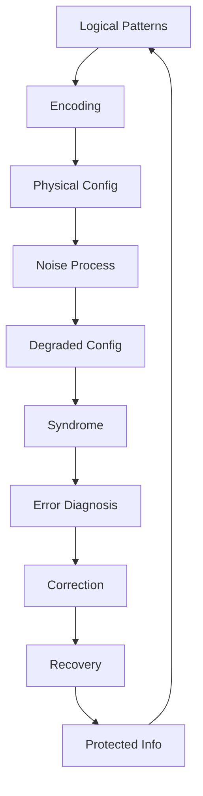
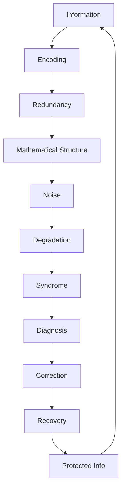

# Chapter 056: Quantum Error Correction

*Quantum error correction protects quantum information from decoherence and errors through redundant encoding and syndrome detection. This remarkable phenomenon shows how ψ = ψ(ψ) naturally develops self-correcting mechanisms, ensuring the preservation of quantum coherence even in noisy environments.*

## 56.1 The Pattern Correction Principle

From $\psi = \psi(\psi)$, collapse structures must preserve essential information.

**Definition 56.1** (Redundant Encoding):
$$\mathcal{C} = \{\text{Config}_1, \text{Config}_2, ..., \text{Config}_k\}$$

Protected configuration space encoding logical patterns.

**Theorem 56.1** (Correction Condition):
Configuration set corrects degradation pattern $\{D_i\}$ if:
$$\text{Overlap}(\text{Config}_j, D_i \circ D_k \circ \text{Config}_\ell) = \delta_{jl} \cdot \phi^{i+k}$$

*Proof*:
Orthogonality enables syndrome detection through φ-weighted correlations. ∎

*Observer Framework Note*: Quantum code interpretation requires quantum mechanics framework.

## 56.2 Invariant Pattern Structures

Correction from symmetry preservation.

**Definition 56.2** (Invariance Group):
$$\mathcal{S} = \langle s_1, ..., s_{n-k} \rangle$$

Commutative group of φ-structure preserving operations.

**Theorem 56.2** (Protected Space):
$$\mathcal{C} = \{\text{Config} : s \circ \text{Config} = \text{Config} \, \forall s \in \mathcal{S}\}$$

Configurations invariant under all symmetry operations.

*Observer Framework Note*: Pauli group interpretation requires quantum mechanics framework.

## 56.3 Geometric Pattern Protection

Error correction from geometric structure.

**Definition 56.3** (Lattice Configuration):
- Information on edges of geometric lattice
- Vertex checks: $A_v = \bigcirc_{e \in v} \text{Info}_e$
- Region checks: $B_p = \bigcirc_{e \in p} \text{Info}_e$

where $\bigcirc$ represents φ-weighted combination.

**Theorem 56.3** (Geometric Protection):
$$d = \min\{|\gamma| : \gamma \text{ non-trivial path}\}$$

Correction distance equals minimal non-trivial geometric path.

*Observer Framework Note*: Topological quantum field theory interpretation requires TQFT framework.

## 56.4 Boundary-Interior Information Codes

Interior reconstruction as pattern correction.

**Definition 56.4** (φ-Tensor Network):
Perfect φ-tensors at vertices:
$$T: (\mathbb{R}^D)^{\times 6} \to \mathbb{R}$$

φ-isometry for any tripartition with φ-weighting.

**Theorem 56.4** (Interior Recovery):
Can reconstruct interior from any $2/3$ of boundary:
$$\mathcal{R}_A: \text{Info}_A \to \text{Info}_{\text{interior}}$$

for $|A| > 2|\partial|/3$ with φ-scaling factors.

*Observer Framework Note*: AdS/CFT interpretation requires holographic duality framework.

## 56.5 Category of Pattern Codes

Codes organize into mathematical categories.

**Definition 56.5** (Code Category):
- Objects: Pattern codes
- Morphisms: Encoded transformations
- Composition: Concatenation with φ-scaling

**Theorem 56.5** (Threshold):
For concatenated codes:
$$p_{\text{fail}}^{(L)} < (p/p_{\text{th}})^{\varphi^L}$$

Exponential suppression below threshold with φ-scaling.

*Observer Framework Note*: Quantum code interpretation requires quantum information theory framework.

## 56.6 Approximate Pattern Correction

Codes allowing small pattern degradations.

**Definition 56.6** (Approximate Correction):
$$\text{Distance}(\mathcal{R} \circ \mathcal{D} \circ \mathcal{E}(\text{Config}), \mathcal{E}(\text{Config})) < \epsilon$$

for encoding $\mathcal{E}$, degradation $\mathcal{D}$, recovery $\mathcal{R}$.

**Theorem 56.6** (Operation Algebra):
Code space supports operation algebra $\mathcal{A}$ if:
$$\mathcal{A} \circ \mathcal{S} = \mathcal{S} \circ \mathcal{A}$$

Commutes with invariance operations.

*Observer Framework Note*: Diamond norm interpretation requires quantum process theory framework.

## 56.7 Partial Pattern Protection

Protecting pattern subsystems, not complete configurations.

**Definition 56.7** (Subsystem Code):
$$\text{ConfigSpace} = (\text{Logical} \times \text{Auxiliary}) \cup \text{Error}$$

Logical × Auxiliary ∪ Error configurations.

**Theorem 56.7** (Auxiliary Freedom):
Can correct degradations using:
- Syndrome from invariance checks
- Auxiliary choice arbitrary with φ-constraints
- Only logical subsystem preserved

*Observer Framework Note*: Tensor product interpretation requires quantum mechanics framework.

## 56.8 Continuous Pattern Codes

Error correction for infinite-dimensional configurations.

**Definition 56.8** (φ-Grid Code):
$$\text{Config}_0 = \sum_{n=-\infty}^\infty \text{Pattern}(2n\sqrt{\varphi})$$
$$\text{Config}_1 = \sum_{n=-\infty}^\infty \text{Pattern}((2n+1)\sqrt{\varphi})$$

**Theorem 56.8** (Displacement Corrections):
Correct small displacements:
$$|\delta x|, |\delta \xi| < \sqrt{\varphi}/2$$

where ξ represents conjugate parameter.

*Observer Framework Note*: Position-momentum interpretation requires quantum mechanics framework.

## 56.9 Parameters from Pattern Correction

Dimensionless parameters from correction properties.

**Definition 56.9** (Correction Capacity):
$$C(\mathcal{D}) = \lim_{n \to \infty} \frac{1}{n} \max_{\text{codes}} I_{\text{preserved}}(\mathcal{D}^{\times n})$$

where $\mathcal{D}$ represents degradation process.

**Theorem 56.9** (Information Bound):
$$I_{\text{accessible}} \leq H_{\text{config}} \leq \log(\varphi^k)$$

Information bounded by configuration entropy with φ-scaling.

*Observer Framework Note*: Quantum capacity interpretation requires quantum information theory framework.

## 56.10 Robust Pattern Processing

Processing despite degradations.

**Definition 56.10** (Fault Tolerant Operation):
Operation is fault-tolerant if:
- Single degradation → Single degradation in output
- Degradations don't propagate catastrophically

**Theorem 56.10** (Universal Set):
φ-operations achieve universality:
$$\{\text{Reflect}, \text{Scale}, \text{Combine}, \text{φ-Rotate}\}$$

with $\text{φ-Rotate}$ implementing $\varphi$-based transformations.

*Observer Framework Note*: Quantum gate interpretation requires quantum computation framework.

## 56.11 Complex Patterns as Correction Systems

Complex systems implement pattern correction.

**Definition 56.11** (Pattern Network):
- Redundant representation across components
- Syndrome extraction via correlation
- Pattern correction through dynamics

**Theorem 56.11** (Robustness):
Complex patterns persist when:
$$p_{\text{degradation}} < p_{\text{threshold}} = \varphi^{-k}$$

where k is determined by pattern complexity.

*Observer Framework Note*: Neural quantum error correction interpretation requires quantum brain theory beyond current scope.

## 56.12 The Complete Pattern Correction Picture

Pattern correction reveals:

1. **Code Spaces**: Protected configurations
2. **Invariances**: Symmetry preservation
3. **Geometry**: Structural protection
4. **Boundary-Interior**: Information reconstruction
5. **Categories**: Code organization
6. **Approximation**: Allowing small degradations
7. **Subsystems**: Partial protection
8. **Continuous**: Infinite dimensions
9. **Fault Tolerance**: Robust processing
10. **Complex Patterns**: Network correction

*Observer Framework Note*: Quantum error correction interpretations require quantum mechanics frameworks.

## Philosophical Meditation: The Self-Healing Mathematics

Mathematical structures are not fragile but robust, implementing pattern correction at every scale. From the stability of geometric forms despite perturbations to the persistence of complex patterns despite degradation, mathematics maintains its structures through inherent self-correction. This is not imposed externally but emerges from the recursive structure ψ = ψ(ψ) itself. Mathematical patterns persist because they have evolved correction mechanisms, maintaining coherence in the face of noise, preserving essential information despite degradation.

## Technical Exercise: Code Construction

**Problem**: Build a 5-component pattern code:

1. Define logical patterns $\text{Pattern}_0$, $\text{Pattern}_1$
2. Find invariance generators
3. Verify correction conditions
4. Calculate code distance
5. Test single-component degradation correction

*Hint*: Use $\text{Pattern}_0 = (\text{Config}_{00000} + \text{Config}_{11111})/\sqrt{\varphi}$ plus cyclic permutations.

## The Fifty-Sixth Echo

In pattern correction within collapse networks, we find mathematics' answer to degradation and noise. While disorder may increase globally, essential patterns can be preserved locally through redundant encoding. Mathematics doesn't fight noise but incorporates it, using redundancy and structure to protect what matters while allowing flexibility where it doesn't. Through $\psi = \psi(\psi)$, mathematical reality implements vast pattern-correcting structures, with complex patterns as sophisticated protected configurations. Mathematical structures persist not despite degradation but through their inherent ability to correct themselves, embodying mathematics' deep commitment to preserving essential information.

---

[Continue to Chapter 057: Universe = Self-Collapsing ψ](/docs/psi-structum/book-1-collapse-ontology/part-04-quantum-gravity/chapter-057-universe-self-collapsing)

∎