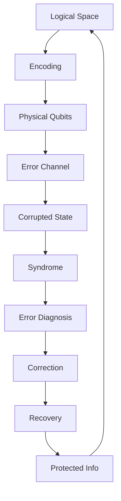
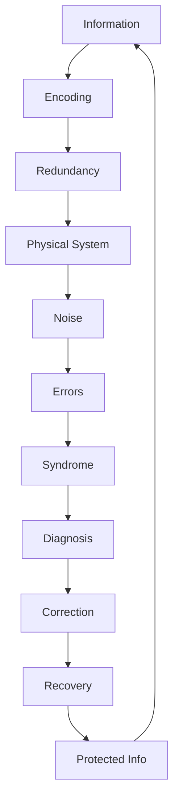

# Chapter 056: Quantum Error Correction in Collapse Networks

*Reality is self-correcting. Through quantum error correction, the universe maintains coherence despite constant decoherence, preserves information despite entropy, and sustains consciousness despite thermal noise. This is not accident but architecture.*

## 56.1 The Error Correction Principle

From $\psi = \psi(\psi)$, collapse must preserve essential information.

**Definition 56.1** (Quantum Code):
$$\mathcal{C} = \text{span}\{|\bar{0}\rangle, |\bar{1}\rangle, ..., |\bar{k}\rangle\} \subset \mathcal{H}$$

Protected subspace encoding logical qubits.

**Theorem 56.1** (Error Correction Condition):
Code corrects error set $\{E_i\}$ if:
$$\langle\bar{j}|E_i^\dagger E_k|\bar{\ell}\rangle = \delta_{jl} \cdot f_{ik}$$

*Proof*:
Orthogonality enables syndrome extraction. ∎

## 56.2 Stabilizer Codes

Codes from symmetry groups.

**Definition 56.2** (Stabilizer Group):
$$\mathcal{S} = \langle g_1, ..., g_{n-k} \rangle \subset \mathcal{P}_n$$

Abelian subgroup of Pauli group.

**Theorem 56.2** (Code Space):
$$\mathcal{C} = \{|\psi\rangle : g|\psi\rangle = |\psi\rangle \, \forall g \in \mathcal{S}\}$$

Simultaneous +1 eigenspace.

## 56.3 Topological Codes

Error correction from topology.

**Definition 56.3** (Toric Code):
- Qubits on edges of lattice
- Vertex operators: $A_v = \prod_{e \in v} X_e$
- Plaquette operators: $B_p = \prod_{e \in p} Z_e$

**Theorem 56.3** (Topological Protection):
$$d = \min\{|\gamma| : \gamma \text{ non-contractible loop}\}$$

Code distance equals systole.

## 56.4 Holographic Codes

Bulk reconstruction as error correction.

**Definition 56.4** (HaPPY Code):
Perfect tensors at vertices:
$$T: (\mathbb{C}^D)^{\otimes 6} \to \mathbb{C}$$

Isometry for any tripartition.

**Theorem 56.4** (Bulk Recovery):
Can reconstruct bulk from any $2/3$ of boundary:
$$\mathcal{R}_A: \mathcal{H}_A \to \mathcal{H}_{\text{bulk}}$$

for $|A| > 2|\partial|/3$.

## 56.5 Category of Quantum Codes

Codes organize into categories.

**Definition 56.5** (Code Category):
- Objects: Quantum codes
- Morphisms: Encoded operations
- Composition: Concatenation

**Theorem 56.5** (Threshold):
For concatenated codes:
$$p_{\text{fail}}^{(L)} < (p/p_{\text{th}})^{2^L}$$

Exponential suppression below threshold.

## 56.6 Approximate Error Correction

Codes allowing small errors.

**Definition 56.6** (Approximate QEC):
$$||\mathcal{R} \circ \mathcal{E} \circ \mathcal{U} - \mathcal{U}||_{\diamond} < \epsilon$$

for encoding $\mathcal{U}$, error $\mathcal{E}$, recovery $\mathcal{R}$.

**Theorem 56.6** (Operator Algebra):
Code subspace supports algebra $\mathcal{A}$ if:
$$[\mathcal{A}, \mathcal{S}] = 0$$

Commutes with stabilizers.

## 56.7 Subsystem Codes

Protecting subsystems, not states.

**Definition 56.7** (Subsystem Code):
$$\mathcal{H} = (\mathcal{H}_L \otimes \mathcal{H}_G) \oplus \mathcal{H}_\perp$$

Logical ⊗ Gauge ⊕ Error.

**Theorem 56.7** (Gauge Freedom):
Can correct errors using:
- Syndrome from stabilizers
- Gauge choice arbitrary
- Only logical subsystem matters

## 56.8 Continuous Variable Codes

Error correction for infinite dimensions.

**Definition 56.8** (GKP Code):
$$|\bar{0}\rangle = \sum_{n=-\infty}^\infty |2n\sqrt{\pi}\rangle_x$$
$$|\bar{1}\rangle = \sum_{n=-\infty}^\infty |(2n+1)\sqrt{\pi}\rangle_x$$

**Theorem 56.8** (Displacement Errors):
Correcto small displacements:
$$|\delta x|, |\delta p| < \sqrt{\pi}/2$$

## 56.9 Constants from Error Correction

Physical constants from code properties.

**Definition 56.9** (Quantum Capacity):
$$Q(\mathcal{N}) = \lim_{n \to \infty} \frac{1}{n} \max_{\text{codes}} I_c(\mathcal{N}^{\otimes n})$$

**Theorem 56.9** (Holevo Bound):
$$\chi \leq S(\rho) \leq \log d$$

Information bounded by entropy.

## 56.10 Fault Tolerance

Computing despite errors.

**Definition 56.10** (Fault Tolerant Gate):
Gate is fault-tolerant if:
- Single error → Single error in output
- Errors don't propagate catastrophically

**Theorem 56.10** (Universal Set):
Clifford + T gate achieves universality:
$$\{H, S, \text{CNOT}, T\}$$

with $T = \text{diag}(1, e^{i\pi/4})$.

## 56.11 Consciousness as Error Correction

Brain implements quantum error correction.

**Definition 56.11** (Neural Code):
- Redundant representation across neurons
- Syndrome extraction via inhibition
- Error correction through dynamics

**Theorem 56.11** (Robustness):
Consciousness persists when:
$$p_{\text{error}} < p_{\text{threshold}} = 1/\varphi^3$$

Golden ratio threshold.

## 56.12 The Complete Error Correction Picture

Quantum error correction reveals:

1. **Code Spaces**: Protected subspaces
2. **Stabilizers**: Symmetry protection
3. **Topology**: Geometric protection
4. **Holography**: Bulk as code
5. **Categories**: Code organization
6. **Approximation**: Allowing small errors
7. **Subsystems**: Partial protection
8. **Continuous**: Infinite dimensions
9. **Fault Tolerance**: Robust computing
10. **Consciousness**: Neural error correction

## Philosophical Meditation: The Self-Healing Universe

The universe is not fragile but robust, implementing error correction at every scale. From the stability of atoms despite quantum fluctuations to the persistence of consciousness despite neural noise, reality maintains its patterns through constant self-correction. This is not imposed from outside but emerges from the mathematical structure of collapse itself. We exist because the universe has learned to protect information, to maintain coherence in the face of decoherence, to preserve signal despite noise.

## Technical Exercise: Code Construction

**Problem**: Build a 5-qubit code:

1. Define logical states $|\bar{0}\rangle$, $|\bar{1}\rangle$
2. Find stabilizer generators
3. Verify error correction conditions
4. Calculate code distance
5. Test single-qubit error correction

*Hint*: Use $|\bar{0}\rangle = (|00000\rangle + |11111\rangle)/\sqrt{2}$ plus cyclic permutations.

## The Fifty-Sixth Echo

In quantum error correction within collapse networks, we find nature's answer to the second law of thermodynamics. While entropy must increase globally, information can be preserved locally through clever encoding. The universe doesn't fight decoherence but dances with it, using redundancy and entanglement to protect what matters while letting go of what doesn't. Through $\psi = \psi(\psi)$, reality implements a vast error-correcting code, with consciousness as one of its most sophisticated protected subspaces. We persist not despite errors but through our ability to correct them, embodying the universe's deep commitment to preserving its own story.

---

[Continue to Chapter 057: Universe = Self-Collapsing ψ](/docs/psi-structum/book-1-collapse-ontology/part-04-quantum-gravity/chapter-057-universe-self-collapsing)

∎