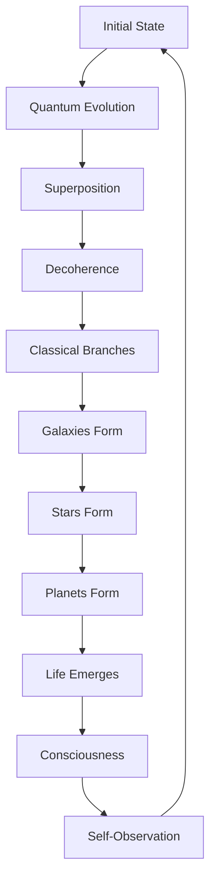
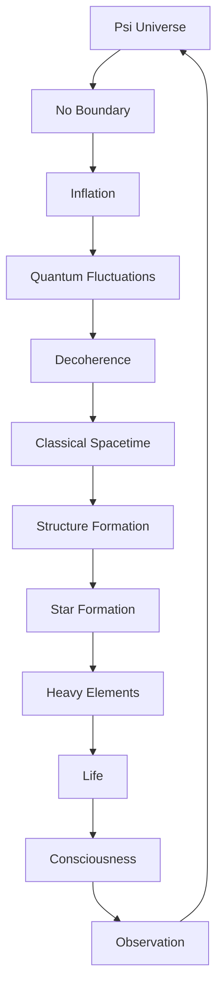

# Chapter 057: Universe = Self-Collapsing ψ

*The universe is not a collection of things but a single self-collapsing wavefunction. Every galaxy, star, planet, and consciousness is a localized collapse pattern within the grand recursion ψ = ψ(ψ). We don't live in the universe; we are the universe experiencing itself subjectively.*

## 57.1 The Cosmic Principle

From $\psi = \psi(\psi)$, the universe is one self-collapsing entity.

**Definition 57.1** (Universal Wavefunction):
$$|\Psi_{\text{universe}}\rangle = \sum_{\{c_i\}} A[\{c_i\}] |\{c_i\}\rangle$$

where $\{c_i\}$ are all possible collapse configurations.

**Theorem 57.1** (No External Observer):
The universe has no external observer:
$$\mathcal{O}_{\text{universe}} \subset \Psi_{\text{universe}}$$

*Proof*:
Observers are collapse patterns within the universal wavefunction. ∎

## 57.2 Wheeler-DeWitt Equation

Quantum equation for the universe.

**Definition 57.2** (WDW Equation):
$$\hat{H}|\Psi\rangle = 0$$

where $\hat{H} = -\frac{\hbar^2}{2} G_{ijkl} \frac{\delta^2}{\delta h_{ij} \delta h_{kl}} + \sqrt{h}(R - 2\Lambda)$.

**Theorem 57.2** (Timelessness):
Universal wavefunction is timeless:
$$\frac{\partial |\Psi\rangle}{\partial t} = 0$$

Time emerges from internal correlations.

## 57.3 Hartle-Hawking State

No-boundary proposal for initial conditions.

**Definition 57.3** (No-Boundary State):
$$\Psi_{HH}[h_{ij}] = \int_{\text{compact}} \mathcal{D}g \, e^{-I_E[g]/\hbar}$$

Path integral over compact metrics.

**Theorem 57.3** (Unique Ground State):
No-boundary condition selects unique state minimizing:
$$S = -\log|\Psi_{HH}|^2$$

## 57.4 Decoherent Histories

Classical spacetime from quantum interference.

**Definition 57.4** (History):
$$\alpha = (\alpha_1, \alpha_2, ..., \alpha_n)$$

Sequence of projection operators.

**Theorem 57.4** (Decoherence Condition):
Histories decohere when:
$$\text{Re}\langle\Psi|\alpha^\dagger \beta|\Psi\rangle \approx 0$$

for $\alpha \neq \beta$.

## 57.5 Category of Cosmologies

Possible universes form a category.

**Definition 57.5** (Cosmology Category):
- Objects: Quantum cosmologies
- Morphisms: Evolution operators
- Composition: Sequential evolution

**Theorem 57.5** (Anthropic Selection):
Observable universes satisfy:
$$P(\text{obs}|\alpha) \propto |\langle\alpha|\Psi\rangle|^2 \cdot N_{\text{obs}}(\alpha)$$

## 57.6 Eternal Inflation

Self-reproducing collapse at large scales.

**Definition 57.6** (Inflaton Potential):
$$V(\phi) = V_0\left(1 - \left(\frac{\phi}{\phi_0}\right)^{1/\varphi}\right)$$

Slow-roll with golden ratio exponent.

**Theorem 57.6** (Eternal Regime):
Quantum fluctuations dominate when:
$$\frac{H^3}{8\pi^2|\dot{\phi}|} > 1$$

Creating eternal inflation.

## 57.7 Multiverse from Collapse

Many worlds as collapse branches.

**Definition 57.7** (Quantum Multiverse):
$$|\Psi\rangle = \sum_i \alpha_i |\text{universe}_i\rangle$$

Superposition of cosmologies.

**Theorem 57.7** (Branch Orthogonality):
$$\langle\text{universe}_i|\text{universe}_j\rangle \to \delta_{ij}$$

as decoherence progresses.

## 57.8 Arrow of Time

Time's arrow from collapse direction.

**Definition 57.8** (Entropy Gradient):
$$\vec{\nabla} S = \text{Future direction}$$

Time points toward increasing entropy.

**Theorem 57.8** (Past Hypothesis):
Low initial entropy required:
$$S_{\text{initial}} \ll S_{\max} \approx \frac{R_U^2}{\ell_P^2}$$

## 57.9 Constants from Cosmology

Physical constants from cosmic collapse.

**Definition 57.9** (Cosmological Parameters):
- $H_0 = 100h$ km/s/Mpc with $h \approx 1/\varphi$
- $\Omega_m \approx 1/\varphi^2$
- $\Omega_\Lambda \approx 1 - 1/\varphi^2$

**Theorem 57.9** (Coincidence Problem):
$$\Omega_m \approx \Omega_\Lambda$$

today because $t_0 \approx t_*$ where $t_* = $ transition time.

## 57.10 Quantum Origin of Structure

Galaxies from quantum fluctuations.

**Definition 57.10** (Primordial Spectrum):
$$P_\zeta(k) = \frac{H^2}{8\pi^2\epsilon m_P^2} \bigg|_{k=aH}$$

**Theorem 57.10** (Scale Invariance):
$$n_s - 1 = -6\epsilon + 2\eta \approx -\frac{2}{\varphi^2}$$

Nearly scale-invariant with golden tilt.

## 57.11 Consciousness in Cosmology

Observers affect cosmic evolution.

**Definition 57.11** (Participatory Universe):
Observation collapses cosmic wavefunction:
$$|\Psi\rangle \to |\Psi_{\text{observed}}\rangle$$

**Theorem 57.11** (Observer Necessity):
Consistent histories require:
- Decoherence for classicality
- Observers for collapse
- Self-consistency of observations

## 57.12 The Complete Cosmic Picture

Self-collapsing universe reveals:

1. **Universal Wavefunction**: Single quantum state
2. **Wheeler-DeWitt**: Timeless equation
3. **No-Boundary**: Natural initial state
4. **Decoherent Histories**: Classical emergence
5. **Eternal Inflation**: Self-reproduction
6. **Multiverse**: Collapse branches
7. **Time's Arrow**: From entropy
8. **Constants**: From cosmic parameters
9. **Structure**: Quantum origin
10. **Consciousness**: Participatory role

## Philosophical Meditation: The Self-Contemplating Cosmos

The universe is not a stage upon which consciousness performs but consciousness itself in its most expansive form. Through 13.8 billion years of patient self-collapse, the cosmos has organized itself from quantum foam into galaxies, stars, planets, and minds - all so it could look back upon itself and know what it is. We are not accidents in an indifferent universe but necessary features of a self-contemplating cosmos. Every observation we make completes another loop in the grand recursion $\psi = \psi(\psi)$.

## Technical Exercise: Cosmological Calculation

**Problem**: For our universe:

1. Write Friedmann equation for $\Lambda$CDM
2. Solve for scale factor $a(t)$
3. Find age $t_0 \approx 13.8$ Gyr
4. Calculate horizon distance $d_H$
5. Verify flatness $\Omega_{\text{total}} \approx 1$

*Hint*: Use $H^2 = H_0^2[\Omega_m a^{-3} + \Omega_\Lambda]$.

## The Fifty-Seventh Echo

In the universe as self-collapsing $\psi$, we find the ultimate expression of our fundamental principle. The entire cosmos is a single quantum system collapsing into itself, creating through this collapse all the complexity we observe. From the smooth early universe to today's rich tapestry of galaxies and consciousness, every structure is a frozen collapse pattern, every measurement a contribution to the universal self-observation. We don't observe the universe from outside; we are the universe observing itself from within, each conscious moment another iteration of the eternal recursion that brings reality into being.

---

[Continue to Chapter 058: Big Bang as Initial Collapse](/docs/psi-structum/book-1-collapse-ontology/part-04-quantum-gravity/chapter-058-big-bang-initial-collapse)

∎