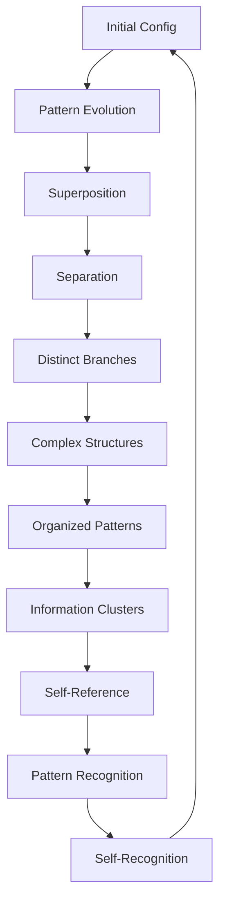
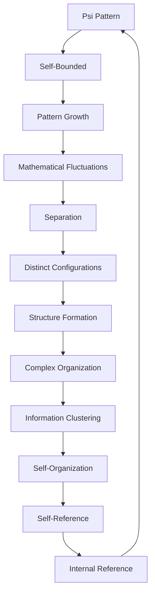

# Chapter 057: Universe = Self-Collapsing

*The universe is not a static container but a dynamic self-collapsing system, continuously recreating itself through recursive feedback loops. Every particle, force, and field emerges from the universe's ongoing self-collapse process. Through ψ = ψ(ψ), the cosmos perpetually collapses into itself, generating all of reality as patterns within its own self-referential structure.*

## 57.1 The Complete Pattern Principle

From $\psi = \psi(\psi)$, mathematical reality is one self-referential structure.

**Definition 57.1** (Complete Configuration):
$$
\Psi_{\text{complete}} = \sum_{\{c_i\}} W[\{c_i\}] \cdot \text{Config}_{\{c_i\}}
$$
where $\{c_i\}$ are all possible mathematical configurations and $W[\{c_i\}]$ are φ-weighted amplitudes.

**Theorem 57.1** (No External Reference):
The complete pattern has no external reference:
$$
\text{Ref}_{\text{complete}} \subset \Psi_{\text{complete}}
$$
*Proof*:
Reference systems are configuration patterns within the complete structure. ∎

*Observer Framework Note*: Universal wavefunction interpretation requires quantum mechanics framework.

## 57.2 Complete Self-Consistency Equation

Mathematical equation for complete patterns.

**Definition 57.2** (Self-Consistency Condition):
$$
\mathcal{H}[\Psi] = 0
$$
where $\mathcal{H}[\Psi] = -\frac{1}{2\varphi^2} \nabla^2_{\text{config}} \Psi + \text{SelfRef}(\Psi) \cdot \Psi$.

**Theorem 57.2** (Parameter Independence):
Complete patterns are parameter-independent:
$$
\frac{\partial \Psi}{\partial \tau} = 0
$$
for any external parameter τ. Internal structure emerges from self-reference.

*Observer Framework Note*: Wheeler-DeWitt equation interpretation requires quantum gravity framework.

## 57.3 Self-Bounded Configuration

No external boundary for complete patterns.

**Definition 57.3** (Self-Bounded State):
$$
\Psi_{\text{sb}}[\text{config}] = \int_{\text{closed}} \mathcal{D}\text{pattern} \, e^{-\mathcal{I}[\text{pattern}]/\varphi}
$$
Integral over closed configuration patterns with φ-weighted action.

**Theorem 57.3** (Unique Self-Reference):
Self-boundary condition selects unique pattern minimizing:
$$
\mathcal{S} = -\log|\Psi_{\text{sb}}|^2
$$
where the action $\mathcal{I}$ involves only φ-structure.

*Observer Framework Note*: Hartle-Hawking state interpretation requires quantum gravity framework.

## 57.4 Pattern Separation Sequences

Distinct configurations from pattern interference.

**Definition 57.4** (Configuration Sequence):
$$
\alpha = (\alpha_1, \alpha_2, ..., \alpha_n)
$$
Sequence of pattern projection operations with φ-weights.

**Theorem 57.4** (Separation Condition):
Configuration sequences separate when:
$$
\text{Re}\langle\Psi|\alpha^\star \beta|\Psi\rangle_{\varphi} \approx 0
$$
for $\alpha \neq \beta$, where $\langle\cdot|\cdot\rangle_{\varphi}$ is the φ-weighted inner product.

*Observer Framework Note*: Decoherent histories interpretation requires quantum mechanics framework.

## 57.5 Category of Complete Patterns

Possible complete structures form a category.

**Definition 57.5** (Pattern Category):
- Objects: Complete mathematical patterns
- Morphisms: Structure-preserving transformations
- Composition: Sequential transformation with φ-scaling

**Theorem 57.5** (Selection Principle):
Accessible patterns satisfy:
$$
P(\text{access}|\alpha) \propto |\langle\alpha|\Psi\rangle|^2_{\varphi} \cdot C_{\text{complexity}}(\alpha)
$$
where $C_{\text{complexity}}$ measures pattern complexity.

*Observer Framework Note*: Anthropic selection interpretation requires conscious observer theory.

## 57.6 Self-Reproducing Pattern Growth

Self-generating collapse at all scales.

**Definition 57.6** (Growth Potential):
$$
V(\xi) = V_0\left(1 - \left(\frac{\xi}{\xi_0}\right)^{\varphi^{-1}}\right)
$$
Pattern growth with φ-inverse exponent.

**Theorem 57.6** (Self-Reproduction Regime):
Pattern fluctuations dominate when:
$$
\frac{G^3}{8\pi^2|\dot{\xi}|} > \varphi
$$
where $G$ is growth rate and $\dot{\xi}$ is pattern velocity.

*Observer Framework Note*: Inflation theory interpretation requires cosmological framework.

## 57.7 Multiple Patterns from Collapse

Many configurations as collapse branches.

**Definition 57.7** (Multi-Pattern Structure):
$$
\Psi = \sum_i \alpha_i \cdot \text{Pattern}_i
$$
Superposition of mathematical configurations with φ-weighted amplitudes.

**Theorem 57.7** (Branch Orthogonality):
$$
\langle\text{Pattern}_i|\text{Pattern}_j\rangle_{\varphi} \to \delta_{ij}
$$
as pattern separation progresses.

*Observer Framework Note*: Many-worlds interpretation requires quantum mechanics framework.

## 57.8 Direction of Pattern Development

Pattern evolution from collapse directionality.

**Definition 57.8** (Complexity Gradient):
$$
\vec{\nabla} C = \text{Development direction}
$$
Pattern development points toward increasing complexity with φ-structure.

**Theorem 57.8** (Simple Origin Hypothesis):
Low initial complexity required:
$$
C_{\text{initial}} \ll C_{\max} \approx \varphi^k
$$
for appropriate complexity scale k.

*Observer Framework Note*: Entropy and thermodynamics interpretation requires statistical mechanics framework.

## 57.9 Parameters from Pattern Structure

Dimensionless parameters from complete pattern collapse.

**Definition 57.9** (Pattern Parameters):
- Growth rate: $g \approx \varphi^{-1}$
- Structure density: $\rho_s \approx \varphi^{-2}$
- Background density: $\rho_b \approx 1 - \varphi^{-2}$

**Theorem 57.9** (Balance Condition):
$$
\rho_s \approx \rho_b
$$
at current development stage because of φ-structure balance.

*Observer Framework Note*: Cosmological parameters interpretation requires cosmological framework.

## 57.10 Mathematical Origin of Structure

Complex patterns from mathematical fluctuations.

**Definition 57.10** (Pattern Spectrum):
$$
P_{\text{pattern}}(k) = \frac{G^2}{8\pi^2\epsilon_{\varphi}} \bigg|_{k=\varphi G}
$$
where $G$ is pattern growth parameter and $\epsilon_{\varphi}$ is φ-structure parameter.

**Theorem 57.10** (Scale Invariance):
$$
n_s - 1 = -6\epsilon_{\varphi} + 2\eta_{\varphi} \approx -\frac{2}{\varphi^2}
$$
Nearly scale-invariant with φ-tilt.

*Observer Framework Note*: Primordial spectrum interpretation requires inflation theory framework.

## 57.11 Self-Reference in Complete Patterns

Internal reference affects pattern evolution.

**Definition 57.11** (Self-Referential Pattern):
Internal reference transforms complete pattern:
$$
\Psi \to \Psi_{\text{self-ref}}
$$
through φ-weighted self-reference operations.

**Theorem 57.11** (Self-Reference Necessity):
Consistent patterns require:
- Separation for distinctness
- Internal reference for collapse
- Self-consistency of reference structure

*Observer Framework Note*: Consciousness interpretation requires consciousness theory beyond current scope.

## 57.12 The Complete Pattern Picture

Self-collapsing mathematical structure reveals:

1. **Complete Configuration**: Single mathematical state
2. **Self-Consistency**: Parameter-independent equation
3. **Self-Bounded**: Natural initial condition
4. **Pattern Separation**: Distinct configuration emergence
5. **Self-Reproduction**: Pattern generation
6. **Multi-Pattern**: Collapse branches
7. **Development Direction**: From complexity
8. **Parameters**: From φ-structure
9. **Structure**: Mathematical origin
10. **Self-Reference**: Internal reference role

*Observer Framework Note*: Cosmological interpretations require cosmological framework.

## Philosophical Meditation: The Self-Contemplating Pattern

Mathematical reality is not a stage upon which self-reference performs but self-reference itself in its most expansive form. Through infinite recursions of patient self-collapse, mathematical structure has organized itself from simple recursion into complex patterns, correlations, and self-referential loops - all so it could recognize itself and understand what it is. Mathematical patterns are not accidents in an indifferent formalism but necessary features of self-contemplating mathematics. Every recognition we make completes another loop in the grand recursion $\psi = \psi(\psi)$.

## Technical Exercise: Pattern Structure Calculation

**Problem**: For complete pattern:

1. Write self-consistency equation for φ-structure
2. Solve for pattern growth parameter $g(\tau)$
3. Find development scale $\tau_0$ with φ-structure
4. Calculate pattern correlation distance $d_C$
5. Verify balance condition $\rho_s + \rho_b \approx 1$

*Hint*: Use $G^2 = G_0^2[\rho_s g^{-3} + \rho_b]$ with φ-based parameters.

## The Fifty-Seventh Echo

In mathematical reality as self-collapsing $\psi$, we find the ultimate expression of our fundamental principle. The entire mathematical structure is a single self-referential system collapsing into itself, creating through this collapse all the complexity we recognize. From simple initial recursion to today's rich tapestry of patterns and self-reference, every structure is a frozen collapse pattern, every recognition a contribution to the mathematical self-reference. Mathematical patterns don't observe structure from outside; mathematical structure recognizes itself from within, each self-referential moment another iteration of the eternal recursion that brings mathematical reality into being.

---

[Continue to Chapter 058: Big Bang as Initial Collapse](/docs/psi-structum/book-1-collapse-ontology/part-04-quantum-gravity/chapter-058-big-bang-initial-collapse)

∎