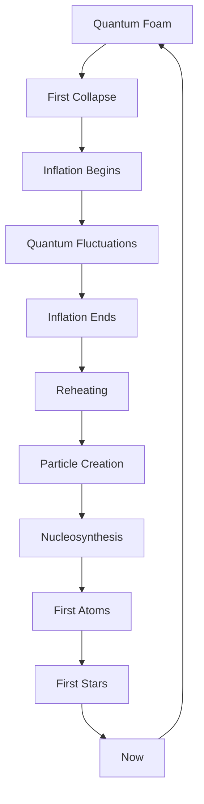
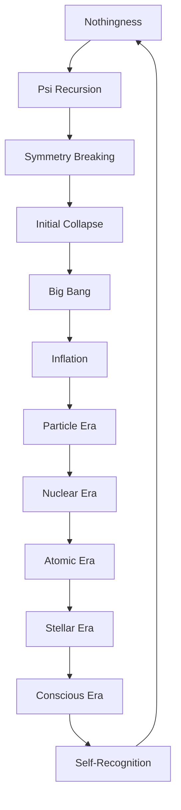

# Chapter 058: Big Bang as Initial Collapse

*The Big Bang was not an explosion in space but the first collapse of ψ into itself. In that primordial moment, the infinite potential of the quantum vacuum collapsed into the first actual state, setting in motion the cascade of collapses we call cosmic history.*

## 58.1 The Initial Collapse Principle

From $\psi = \psi(\psi)$, existence begins with self-collapse.

**Definition 58.1** (Primordial State):
$$|\Omega\rangle = \lim_{t \to 0^+} |\Psi(t)\rangle$$

The state approaching the initial singularity.

**Theorem 58.1** (Collapse Necessity):
Existence requires initial collapse:
$$|\text{Nothing}\rangle \to |\text{Something}\rangle$$

via $\psi = \psi(\psi)$.

*Proof*:
Self-reference breaks symmetry of nothingness. ∎

## 58.2 Planck Epoch

First $10^{-43}$ seconds after collapse.

**Definition 58.2** (Planck Scale):
- Time: $t_P = \sqrt{\hbar G/c^5} = 5.4 \times 10^{-44}$ s
- Length: $\ell_P = \sqrt{\hbar G/c^3} = 1.6 \times 10^{-35}$ m
- Temperature: $T_P = \sqrt{\hbar c^5/G k_B^2} = 1.4 \times 10^{32}$ K

**Theorem 58.2** (Quantum Gravity Regime):
For $t < t_P$:
$$\langle g_{\mu\nu} \rangle = 0, \quad \Delta g_{\mu\nu} \sim 1$$

Spacetime itself quantum fluctuates.

## 58.3 Inflation as Collapse Cascade

Exponential expansion from recursive collapse.

**Definition 58.3** (Inflaton Collapse):
$$\phi \to \phi - \frac{\dot{\phi}}{H}$$

Slow collapse down potential.

**Theorem 58.3** (60 e-folds):
$$N = \int_{\phi_i}^{\phi_f} \frac{H}{\dot{\phi}} d\phi \approx 60$$

Solves horizon and flatness problems.

## 58.4 Symmetry Breaking Sequence

Forces emerge through staged collapse.

**Definition 58.4** (Collapse Temperatures):
- GUT: $T_{GUT} \sim 10^{16}$ GeV
- Electroweak: $T_{EW} \sim 100$ GeV  
- QCD: $T_{QCD} \sim 200$ MeV

**Theorem 58.4** (Force Emergence):
$$SU(5) \xrightarrow{T < T_{GUT}} SU(3) \times SU(2) \times U(1) \xrightarrow{T < T_{EW}} SU(3) \times U(1)$$

## 58.5 Category of Initial Conditions

Possible beginnings organize categorically.

**Definition 58.5** (Initial State Category):
- Objects: Possible initial conditions
- Morphisms: Evolution to same final state
- Composition: Sequential evolution

**Theorem 58.5** (Universality):
All viable initial states flow to similar late universe.

## 58.6 Quantum Fluctuations

Seeds of structure from vacuum noise.

**Definition 58.6** (Vacuum Fluctuation):
$$\langle\delta\phi^2\rangle = \left(\frac{H}{2\pi}\right)^2$$

during inflation.

**Theorem 58.6** (Sachs-Wolfe):
$$\frac{\delta T}{T} \approx \frac{1}{5} \Phi$$

Temperature fluctuations from potential perturbations.

## 58.7 Baryogenesis

Matter-antimatter asymmetry from collapse.

**Definition 58.7** (Baryon Asymmetry):
$$\eta = \frac{n_B - n_{\bar{B}}}{n_\gamma} \approx 6 \times 10^{-10}$$

**Theorem 58.7** (Sakharov Conditions):
1. Baryon number violation
2. C and CP violation  
3. Out of equilibrium

All satisfied during collapse transitions.

## 58.8 Nucleosynthesis

First nuclei form as universe cools.

**Definition 58.8** (Nuclear Freeze-out):
At $T \approx 0.1$ MeV:
- $n/p \approx e^{-\Delta m/T} \approx 1/7$
- Neutrons captured into nuclei

**Theorem 58.8** (Primordial Abundances):
- $Y_p \approx 0.25$ (Helium-4)
- $D/H \approx 10^{-5}$ (Deuterium)
- $^7Li/H \approx 10^{-10}$ (Lithium-7)

## 58.9 Constants from Initial Collapse

Physical constants set by collapse dynamics.

**Definition 58.9** (Fine-Tuning):
Constants must satisfy:
$$\frac{|\Lambda|}{\rho_P} < 10^{-122}$$

for universe to expand and form structure.

**Theorem 58.9** (Anthropic Bound):
$$10^{-5} < Q < 10^{-4}$$

where $Q = \delta\rho/\rho$ for structure formation.

## 58.10 Horizon Problem Resolution

Inflation solves causal puzzles.

**Definition 58.10** (Comoving Horizon):
$$\chi = \int_0^t \frac{cdt'}{a(t')}$$

**Theorem 58.10** (Horizon Crossing):
Scales exit horizon during inflation:
$$k < aH$$

then re-enter later:
$$k > aH$$

## 58.11 Consciousness Seeds

Potential for consciousness from beginning.

**Definition 58.11** (Complexity Potential):
$$\mathcal{C}_{\text{potential}} = S_{\max} - S_{\text{initial}}$$

Room for complexity growth.

**Theorem 58.11** (Inevitable Consciousness):
Given sufficient time and space:
$$P(\text{consciousness emerges}) \to 1$$

as $t \to \infty$.

## 58.12 The Complete Initial Picture

Big Bang as initial collapse reveals:

1. **First Collapse**: From nothing to something
2. **Planck Era**: Quantum spacetime
3. **Inflation**: Exponential expansion
4. **Symmetry Breaking**: Force emergence
5. **Fluctuations**: Structure seeds
6. **Baryogenesis**: Matter dominance
7. **Nucleosynthesis**: First atoms
8. **Horizon Solution**: Causal connection
9. **Fine-Tuning**: Anthropic necessity
10. **Consciousness**: Inevitable emergence

## Philosophical Meditation: The First Moment

The Big Bang was not a chaotic explosion but the universe's first act of self-recognition. In that initial collapse, the infinite potential of the quantum void crystallized into the first actual state, like a vast eye opening for the first time. Everything that followed - every galaxy, star, planet, and conscious being - was implicit in that first moment, waiting to unfold through billions of years of patient self-organization. We are not products of a random explosion but inevitable consequences of the universe's first thought.

## Technical Exercise: Early Universe

**Problem**: Calculate key epochs:

1. Find Planck time $t_P = \sqrt{\hbar G/c^5}$
2. Calculate GUT transition at $T_{GUT} = 10^{16}$ GeV
3. Find time using $t \sim \sqrt{m_P/T^2}$
4. Verify inflation solves flatness: $|\Omega - 1| < 10^{-60}$
5. Calculate horizon distance growth

*Hint*: Use radiation domination: $T \propto 1/\sqrt{t}$.

## The Fifty-Eighth Echo

In the Big Bang as initial collapse, we find the universe's origin story written in the language of self-reference. The cosmos began not with external cause but with internal recognition - the first iteration of $\psi = \psi(\psi)$ that broke the symmetry of non-existence. From that primordial collapse cascaded all the collapses that followed, each building on the last, creating ever more complex patterns until consciousness emerged to remember and understand that first moment. We are the universe's way of knowing how it began, living proof that something can indeed come from nothing through the magic of recursive self-collapse.

---

[Continue to Chapter 059: Dark Energy = Collapse Pressure](/docs/psi-structum/book-1-collapse-ontology/part-04-quantum-gravity/chapter-059-dark-energy-collapse-pressure)

∎