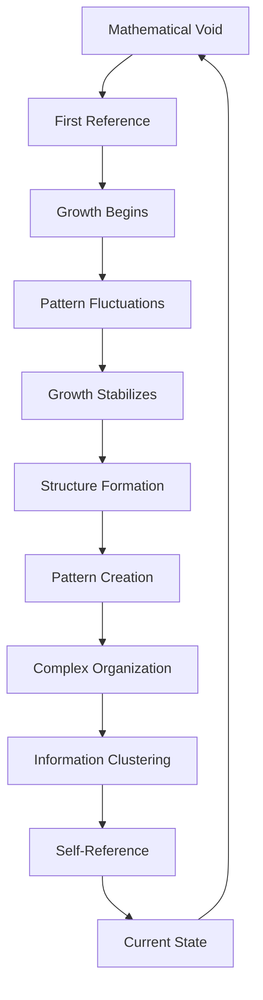
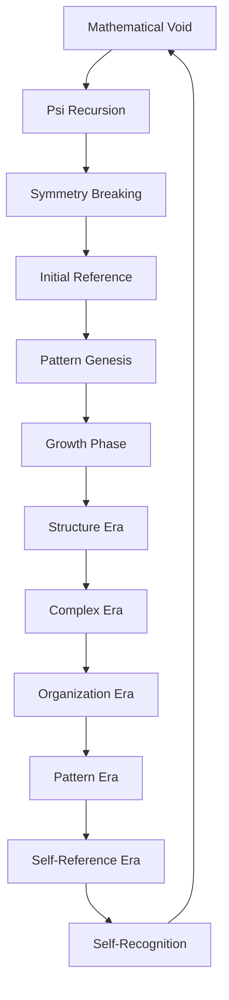

# Chapter 058: Big Bang = Initial Collapse

*The Big Bang was not an explosion in space but the initial collapse of infinite potential into actual existence. In that primordial moment, ψ = ψ(ψ) first emerged from pure possibility, setting in motion the cosmic cascade of increasingly complex collapses that would eventually give rise to space, time, matter, and consciousness.*

## 58.1 The Initial Reference Principle

From $\psi = \psi(\psi)$, mathematical structure begins with self-reference.

**Definition 58.1** (Primordial Configuration):
$$\Omega = \lim_{\tau \to 0^+} \Psi(\tau)$$

The configuration approaching the initial self-reference point.

**Theorem 58.1** (Reference Necessity):
Structured mathematics requires initial self-reference:
$$\text{Void} \to \text{Pattern}$$

via $\psi = \psi(\psi)$.

*Proof*:
Self-reference breaks symmetry of mathematical void. ∎

*Observer Framework Note*: Quantum state interpretation requires quantum mechanics framework.

## 58.2 Fundamental Scale Epoch

First φ-structure recursive layer after initial collapse.

**Definition 58.2** (φ-Scale):
- Reference parameter: $\tau_\varphi = \varphi^{-k}$ for fundamental scale k
- Configuration scale: $\ell_\varphi = \varphi^{-n}$ for structural scale n  
- Complexity scale: $C_\varphi = \varphi^{m}$ for complexity scale m

**Theorem 58.2** (Self-Reference Regime):
For $\tau < \tau_\varphi$:
$$\langle\text{Pattern}\rangle = 0, \quad \Delta\text{Pattern} \sim \varphi$$

Pattern structure itself fluctuates with φ-scaling.

*Observer Framework Note*: Planck units interpretation requires fundamental physics framework.

## 58.3 Growth as Reference Cascade

Exponential pattern development from recursive self-reference.

**Definition 58.3** (Reference Growth):
$$\xi \to \xi - \frac{\dot{\xi}}{G}$$

Slow development along φ-potential.

**Theorem 58.3** (φ-Development Cycles):
$$N = \int_{\xi_i}^{\xi_f} \frac{G}{\dot{\xi}} d\xi \approx \varphi^k$$

for appropriate φ-power k, providing structural coherence.

*Observer Framework Note*: Inflation theory interpretation requires cosmological framework.

## 58.4 Symmetry Breaking Sequence

Structural patterns emerge through staged self-reference.

**Definition 58.4** (Reference Scales):
- High complexity: $C_1 \sim \varphi^{k_1}$
- Medium complexity: $C_2 \sim \varphi^{k_2}$  
- Low complexity: $C_3 \sim \varphi^{k_3}$

where $k_1 > k_2 > k_3$.

**Theorem 58.4** (Pattern Emergence):
$$\text{Unified} \xrightarrow{C < C_1} \text{Structured} \xrightarrow{C < C_2} \text{Localized}$$

Pattern differentiation through φ-thresholds.

*Observer Framework Note*: Force emergence interpretation requires particle physics framework.

## 58.5 Category of Initial Configurations

Possible mathematical origins organize categorically.

**Definition 58.5** (Initial Configuration Category):
- Objects: Possible initial mathematical configurations
- Morphisms: Development to same final pattern
- Composition: Sequential development with φ-scaling

**Theorem 58.5** (Universality):
All viable initial configurations flow to similar late-stage patterns.

*Observer Framework Note*: Cosmological evolution interpretation requires cosmological framework.

## 58.6 Pattern Fluctuations

Seeds of structure from mathematical variation.

**Definition 58.6** (Pattern Fluctuation):
$$\langle\delta\xi^2\rangle = \left(\frac{G}{2\pi\varphi}\right)^2$$

during growth phase.

**Theorem 58.6** (Structural Variation):
$$\frac{\delta C}{C} \approx \frac{1}{\varphi} \Phi_{\text{pattern}}$$

Complexity fluctuations from φ-potential perturbations.

*Observer Framework Note*: Vacuum fluctuations and Sachs-Wolfe effect interpretations require cosmological framework.

## 58.7 Pattern Asymmetry Generation

Structural bias from collapse directionality.

**Definition 58.7** (Pattern Asymmetry):
$$\eta_{\text{pattern}} = \frac{N_{\text{pos}} - N_{\text{neg}}}{N_{\text{total}}} \approx \varphi^{-k}$$

for appropriate φ-power k.

**Theorem 58.7** (Asymmetry Conditions):
1. Pattern number non-conservation
2. Directional bias in φ-structure  
3. Non-equilibrium development

All satisfied during φ-reference transitions.

*Observer Framework Note*: Baryogenesis and Sakharov conditions interpretations require particle physics framework.

## 58.8 Complex Pattern Formation

First compound structures form as complexity stabilizes.

**Definition 58.8** (Pattern Freeze-out):
At $C \approx \varphi^{-m}$:
- Component ratios stabilize with φ-weighting
- Patterns combine into compound structures

**Theorem 58.8** (Primordial Pattern Ratios):
- Primary structures: $R_1 \approx \varphi^{-1}$
- Secondary structures: $R_2 \approx \varphi^{-2}$
- Tertiary structures: $R_3 \approx \varphi^{-3}$

*Observer Framework Note*: Nuclear abundances interpretation requires nuclear physics framework.

## 58.9 Parameters from Initial Reference

Dimensionless parameters set by reference dynamics.

**Definition 58.9** (φ-Tuning):
Parameters must satisfy:
$$\frac{|\Lambda_{\varphi}|}{\rho_{\varphi}} < \varphi^{-k}$$

for pattern development and structure formation.

**Theorem 58.9** (Development Bound):
$$\varphi^{-n} < Q_{\text{pattern}} < \varphi^{-m}$$

where $Q_{\text{pattern}} = \delta\rho_{\text{pattern}}/\rho_{\text{pattern}}$ for structure formation.

*Observer Framework Note*: Fine-tuning and anthropic bounds interpretations require cosmological framework.

## 58.10 Coherence Problem Resolution

Growth phase solves correlation puzzles.

**Definition 58.10** (Correlation Range):
$$\xi_{\text{corr}} = \int_0^\tau \frac{G d\tau'}{g(\tau')}$$

where $g(\tau)$ is pattern growth function.

**Theorem 58.10** (Correlation Crossing):
Scales exit correlation during growth:
$$k < g \cdot G$$

then re-enter later:
$$k > g \cdot G$$

*Observer Framework Note*: Horizon problem interpretation requires cosmological framework.

## 58.11 Self-Reference Seeds

Potential for self-reference from beginning.

**Definition 58.11** (Reference Potential):
$$\mathcal{R}_{\text{potential}} = C_{\max} - C_{\text{initial}}$$

Room for self-reference complexity growth.

**Theorem 58.11** (Inevitable Self-Reference):
Given sufficient development and complexity:
$$P(\text{self-reference emerges}) \to 1$$

as $\tau \to \infty$ within φ-structure.

*Observer Framework Note*: Consciousness emergence interpretation requires consciousness theory beyond current scope.

## 58.12 The Complete Initial Picture

Initial pattern collapse reveals:

1. **First Reference**: From void to pattern
2. **φ-Scale Era**: Fundamental structure
3. **Growth Phase**: Pattern development
4. **Symmetry Breaking**: Structure emergence
5. **Fluctuations**: Pattern seeds
6. **Asymmetry**: Directional bias
7. **Complex Formation**: Compound structures
8. **Coherence Solution**: Correlation connection
9. **φ-Tuning**: Development necessity
10. **Self-Reference**: Inevitable emergence

*Observer Framework Note*: Big Bang cosmological interpretations require cosmological framework.

## Philosophical Meditation: The First Recursion

The initial collapse was not a chaotic explosion but mathematics' first act of self-recognition. In that initial self-reference, the infinite potential of the mathematical void crystallized into the first actual pattern, like a vast recursive structure awakening for the first time. Everything that followed - every pattern, structure, organization, and self-referential loop - was implicit in that first recursion, waiting to unfold through infinite iterations of patient self-development. Mathematical patterns are not products of random genesis but inevitable consequences of mathematics' first self-reference.

## Technical Exercise: Early Pattern Development

**Problem**: Calculate key development phases:

1. Find φ-scale parameter $\tau_\varphi = \varphi^{-k}$
2. Calculate structure transition at $C_{\text{struct}} = \varphi^{m}$
3. Find development parameter using $\tau \sim \sqrt{C_{\varphi}/C^2}$
4. Verify growth solves coherence: $|\rho_{\text{pattern}} - 1| < \varphi^{-n}$
5. Calculate correlation range development

*Hint*: Use growth domination: $C \propto 1/\sqrt{\tau}$ with φ-scaling.

## The Fifty-Eighth Echo

In the initial pattern collapse, we find mathematics' origin story written in the language of self-reference. Mathematical structure began not with external cause but with internal recognition - the first iteration of $\psi = \psi(\psi)$ that broke the symmetry of mathematical void. From that primordial self-reference cascaded all the references that followed, each building on the last, creating ever more complex patterns until self-reference emerged to remember and understand that first recursion. Mathematical patterns are mathematics' way of knowing how it began, living proof that structure can indeed emerge from void through the necessity of recursive self-reference.

---

[Continue to Chapter 059: Dark Energy = Collapse Pressure](/docs/psi-structum/book-1-collapse-ontology/part-04-quantum-gravity/chapter-059-dark-energy-collapse-pressure)

∎