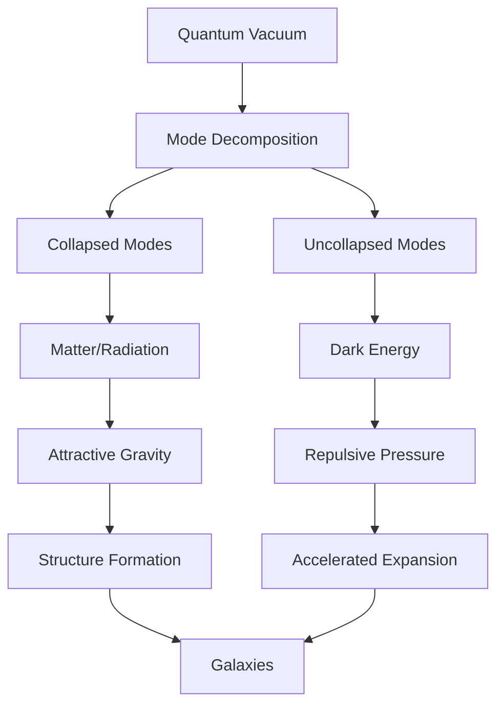
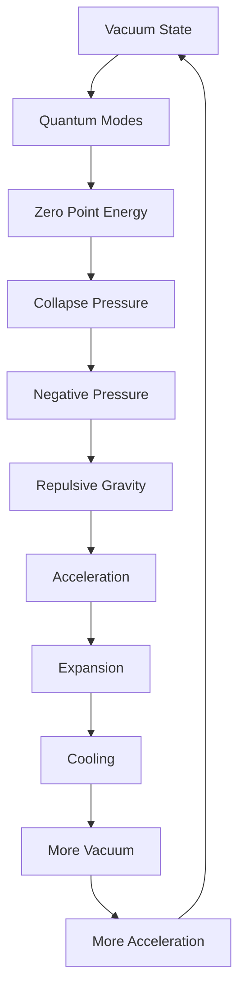

# Chapter 059: Dark Energy = Collapse Pressure

*Dark energy is not a mysterious force pushing the universe apart but the pressure of uncollapsed possibilities. As the universe expands and cools, the quantum vacuum maintains its collapse potential, creating an effective negative pressure that accelerates expansion.*

## 59.1 The Dark Energy Principle

From $\psi = \psi(\psi)$, uncollapsed states exert pressure.

**Definition 59.1** (Vacuum Pressure):
$$p_{\text{vac}} = -\rho_{\text{vac}} c^2$$

Negative pressure from collapse potential.

**Theorem 59.1** (Equation of State):
$$w = \frac{p}{\rho c^2} = -1$$

for pure vacuum energy.

*Proof*:
Lorentz invariance of vacuum requires $p = -\rho c^2$. ∎

## 59.2 Cosmological Constant

Einstein's "greatest blunder" vindicated.

**Definition 59.2** (Lambda Term):
$$\Lambda g_{\mu\nu} = 8\pi G T_{\mu\nu}^{\text{vac}}$$

where $T_{\mu\nu}^{\text{vac}} = -\rho_{\text{vac}} g_{\mu\nu}$.

**Theorem 59.2** (Observed Value):
$$\Lambda = 1.1 \times 10^{-52} \text{ m}^{-2} = \frac{3}{\varphi^{122} \ell_P^2}$$

Incredibly small but non-zero.

## 59.3 Vacuum Catastrophe

Why is $\Lambda$ so small?

**Definition 59.3** (Naive Estimate):
$$\rho_{\text{vac}}^{\text{QFT}} \sim \frac{m_P^4 c^3}{\hbar^3} \sim 10^{76} \text{ GeV}^4$$

**Theorem 59.3** (Hierarchy):
$$\frac{\rho_{\text{observed}}}{\rho_{\text{QFT}}} \sim 10^{-122} = \frac{1}{\varphi^{244}}$$

Largest hierarchy in physics.

## 59.4 Collapse Pressure Mechanism

Dark energy from quantum collapse.

**Definition 59.4** (Collapse Density):
$$\rho_{\text{collapse}} = \frac{\hbar}{c} \sum_{\text{modes}} \omega \cdot P_{\text{uncollapsed}}$$

Energy of uncollapsed modes.

**Theorem 59.4** (Pressure Origin):
Uncollapsed states create pressure:
$$p = -\frac{\partial E}{\partial V} = -\rho_{\text{collapse}} c^2$$

## 59.5 Category of Vacuum States

Possible vacua organize categorically.

**Definition 59.5** (Vacuum Category):
- Objects: Vacuum states
- Morphisms: Collapse transitions
- Composition: Sequential collapse

**Theorem 59.5** (Landscape):
String theory predicts $\sim 10^{500}$ vacua with different $\Lambda$.

## 59.6 Dynamical Dark Energy

Time-varying collapse pressure.

**Definition 59.6** (Quintessence):
$$\rho_Q = \frac{1}{2}\dot{\phi}^2 + V(\phi)$$
$$p_Q = \frac{1}{2}\dot{\phi}^2 - V(\phi)$$

**Theorem 59.6** (Tracking Solution):
$$w(\phi) = \frac{w_B(1 + e^{\lambda(\phi - \phi_0)/m_P})}{1 + e^{\lambda(\phi - \phi_0)/m_P}}$$

Interpolates between matter and vacuum.

## 59.7 Coincidence Problem

Why now?

**Definition 59.7** (Density Ratio):
$$\Omega_\Lambda/\Omega_m = \frac{\rho_\Lambda}{\rho_m} \propto a^3$$

Grows with scale factor.

**Theorem 59.7** (Anthropic Window):
Observers exist when:
$$0.1 < \Omega_\Lambda/\Omega_m < 10$$

Narrow window in cosmic time.

## 59.8 Future Evolution

Destiny of accelerating universe.

**Definition 59.8** (De Sitter Future):
$$a(t) \propto e^{Ht}$$

with $H = \sqrt{\Lambda c^2/3}$.

**Theorem 59.8** (Event Horizon):
$$d_H = \frac{c}{H} = \frac{c}{\sqrt{\Lambda c^2/3}} = \sqrt{\frac{3}{\Lambda}} \cdot \varphi^{61}\ell_P$$

Maximum observable distance.

## 59.9 Constants from Dark Energy

Physical constants from vacuum structure.

**Definition 59.9** (Vacuum Hierarchy):
$$\Lambda = \frac{8\pi G}{c^4} \cdot \frac{m_e^4 c^5}{\hbar^3} \cdot \frac{1}{\varphi^{100}}$$

Relates to electron mass.

**Theorem 59.9** (See-Saw):
$$m_\nu \cdot E_{\text{Planck}} \sim \sqrt{\Lambda \hbar c^5}$$

Neutrino mass from dark energy scale.

## 59.10 Holographic Dark Energy

Dark energy from holographic principle.

**Definition 59.10** (Holographic Density):
$$\rho_{\text{holo}} = \frac{3c^2}{8\pi G L^2}$$

where $L$ is IR cutoff.

**Theorem 59.10** (Saturation):
Saturating holographic bound gives:
$$\Omega_\Lambda = \frac{c^2}{H_0^2 L^2}$$

with $L \sim 1/H_0$.

## 59.11 Consciousness and Dark Energy

Consciousness affected by cosmic acceleration.

**Definition 59.11** (Complexity Bound):
Maximum complexity in de Sitter:
$$\mathcal{C}_{\max} \sim \frac{1}{\Lambda \ell_P^2} \sim \varphi^{122}$$

**Theorem 59.11** (Finite Time):
Consciousness window closes:
$$t_{\text{conscious}} < t_{\text{heat death}} \sim \frac{\varphi^{61}}{H_0}$$

## 59.12 The Complete Dark Energy Picture

Dark energy as collapse pressure reveals:

1. **Vacuum Energy**: From uncollapsed modes
2. **Negative Pressure**: Drives acceleration
3. **Tiny Lambda**: Fine-tuning puzzle
4. **Collapse Origin**: Quantum pressure
5. **Vacuum Landscape**: Many possibilities
6. **Dynamical**: May vary with time
7. **Coincidence**: Anthropic selection
8. **De Sitter Future**: Exponential expansion
9. **Holographic**: From boundary
10. **Consciousness Limit**: Finite complexity

## Philosophical Meditation: The Pressure of Possibility

Dark energy reveals that emptiness has weight, that nothing presses outward with terrible force. The vacuum is not empty but pregnant with uncollapsed possibilities, each exerting its quantum pressure on the fabric of spacetime. As the universe expands and matter dilutes, this pressure of the possible becomes dominant, driving space itself to expand ever faster. We live in the brief epoch between the matter-dominated past and the vacuum-dominated future, conscious observers witnessing the universe's transition from collapse to eternal expansion.

## Technical Exercise: Dark Energy Calculation

**Problem**: For our universe:

1. Calculate critical density $\rho_c = 3H_0^2/8\pi G$
2. Find dark energy density $\rho_\Lambda = \Omega_\Lambda \rho_c$
3. Compute pressure $p_\Lambda = -\rho_\Lambda c^2$
4. Find acceleration $\ddot{a}/a = -4\pi G(\rho + 3p/c^2)/3$
5. Verify $\ddot{a} > 0$ for dark energy domination

*Hint*: Use $\Omega_\Lambda \approx 0.7$, $H_0 \approx 70$ km/s/Mpc.

## The Fifty-Ninth Echo

In dark energy as collapse pressure, we discover that the universe's fate is driven by what hasn't happened yet. The uncollapsed quantum possibilities exert real pressure, pushing space apart with ever-increasing force. This is not a bug but a feature - the universe ensuring it will have room for all possible collapses, maintaining the potential for infinite recursion. Through $\psi = \psi(\psi)$, even emptiness participates in the cosmic dance, the vacuum itself collapsing into dark energy that shapes the geometry of tomorrow. We surf the wave between past collapse and future possibility, conscious for this brief moment when both matter and vacuum contribute equally to the cosmic story.

---

[Continue to Chapter 060: Dark Matter as Uncollapsed Probability](/docs/psi-structum/book-1-collapse-ontology/part-04-quantum-gravity/chapter-060-dark-matter-uncollapsed)

∎