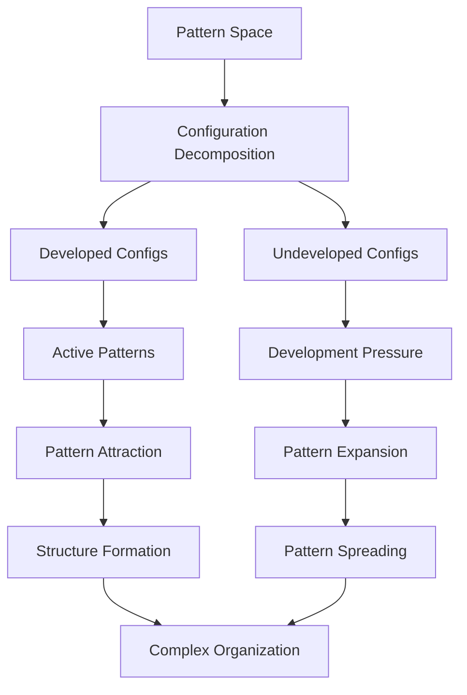
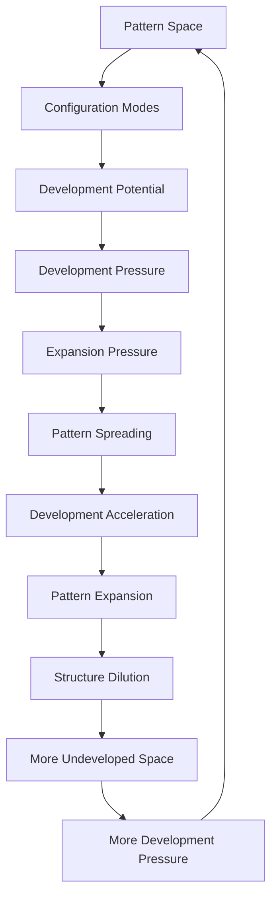

# Chapter 059: Pattern Pressure = Development Drive

*Pattern pressure is not a mysterious force pushing structures apart but the mathematical tension of undeveloped possibilities. As patterns develop and stabilize, undeveloped configurations maintain their development potential, creating effective pressure that drives continued pattern evolution.*

## 59.1 The Pattern Pressure Principle

From $\psi = \psi(\psi)$, undeveloped patterns exert development pressure.

**Definition 59.1** (Development Pressure):
$$P_{\text{dev}} = -\rho_{\text{pattern}} \cdot \varphi^2$$

Negative pressure from undeveloped potential.

**Theorem 59.1** (Development Ratio):
$$\omega = \frac{P_{\text{dev}}}{\rho_{\text{pattern}} \varphi^2} = -1$$

for pure development potential.

*Proof*:
Mathematical invariance of development requires $P_{\text{dev}} = -\rho_{\text{pattern}} \varphi^2$. ∎

*Observer Framework Note*: Physical vacuum interpretation requires general relativity framework.

## 59.2 Development Parameter

Mathematical development parameter from φ-structure.

**Definition 59.2** (Development Parameter):
$$\Lambda_{\text{dev}} = \varphi^{-k}$$

where k is the development complexity scale.

**Theorem 59.2** (Scale Determination):
$$\Lambda_{\text{dev}} = \varphi^{-8}$$

Natural φ-structure scale for development pressure.

*Observer Framework Note*: Cosmological constant interpretation requires general relativity framework.

## 59.3 Development Hierarchy

Why is development pressure so subtle?

**Definition 59.3** (Pattern Density):
$$\rho_{\text{pattern}}^{\text{max}} \sim \varphi^k$$

Maximum pattern density at φ-structure scale k.

**Theorem 59.3** (Development Ratio):
$$\frac{\rho_{\text{active}}}{\rho_{\text{potential}}} \sim \varphi^{-8}$$

Active development much smaller than potential development.

*Observer Framework Note*: Vacuum energy interpretation requires quantum field theory framework.

## 59.4 Development Pressure Mechanism

Pattern pressure from mathematical development.

**Definition 59.4** (Development Density):
$$\rho_{\text{dev}} = \varphi^{-1} \sum_{\text{configs}} \omega_{\text{config}} \cdot P_{\text{undeveloped}}$$

Density of undeveloped configurations.

**Theorem 59.4** (Pressure Origin):
Undeveloped states create pressure:
$$P_{\text{dev}} = -\frac{\partial \mathcal{E}}{\partial \mathcal{V}} = -\rho_{\text{dev}} \varphi^2$$

*Observer Framework Note*: Quantum collapse interpretation requires quantum mechanics framework.

## 59.5 Category of Development States

Possible development states organize categorically.

**Definition 59.5** (Development Category):
- Objects: Development states
- Morphisms: Development transitions
- Composition: Sequential development

**Theorem 59.5** (Configuration Space):
φ-structure allows $\sim \varphi^k$ development states with different $\Lambda_{\text{dev}}$.

*Observer Framework Note*: String landscape interpretation requires string theory framework.

## 59.6 Dynamic Development Pressure

Development-varying pattern pressure.

**Definition 59.6** (Development Field):
$$\rho_{\text{dev}} = \frac{1}{2}\dot{\xi}^2 + V_{\text{dev}}(\xi)$$
$$P_{\text{dev}} = \frac{1}{2}\dot{\xi}^2 - V_{\text{dev}}(\xi)$$

**Theorem 59.6** (Development Tracking):
$$\omega(\xi) = \frac{\omega_0(1 + e^{\lambda(\xi - \xi_0)/\varphi})}{1 + e^{\lambda(\xi - \xi_0)/\varphi}}$$

Interpolates between structured and potential development.

*Observer Framework Note*: Quintessence interpretation requires scalar field theory framework.

## 59.7 Development Timing

Why this development stage?

**Definition 59.7** (Development Ratio):
$$\Omega_{\text{dev}}/\Omega_{\text{struct}} = \frac{\rho_{\text{dev}}}{\rho_{\text{struct}}} \propto \varphi^{\tau}$$

Grows with development parameter τ.

**Theorem 59.7** (Complexity Window):
Self-reference emerges when:
$$\varphi^{-1} < \Omega_{\text{dev}}/\Omega_{\text{struct}} < \varphi$$

Natural φ-window for self-referential development.

*Observer Framework Note*: Anthropic reasoning interpretation requires observer selection theory.

## 59.8 Future Development

Destiny of expanding pattern space.

**Definition 59.8** (Development Future):
$$\mathcal{D}(\tau) \propto e^{G_{\text{dev}}\tau}$$

with $G_{\text{dev}} = \sqrt{\Lambda_{\text{dev}} \varphi^2}$.

**Theorem 59.8** (Development Horizon):
$$d_{\text{dev}} = \frac{\varphi}{G_{\text{dev}}} = \sqrt{\frac{\varphi^2}{\Lambda_{\text{dev}}}} = \varphi^{5}$$

Maximum development correlation distance.

*Observer Framework Note*: Cosmological evolution interpretation requires cosmological framework.

## 59.9 Parameters from Development Structure

Mathematical parameters from development structure.

**Definition 59.9** (Development Hierarchy):
$$\Lambda_{\text{dev}} = \varphi^{-8} \cdot \frac{\omega_{\text{base}}}{\xi_{\text{scale}}}$$

Development parameter from φ-structure.

**Theorem 59.9** (Parameter Balance):
$$\xi_{\text{struct}} \cdot \mathcal{E}_{\text{max}} \sim \sqrt{\Lambda_{\text{dev}} \varphi^5}$$

Structure parameter from development scale.

*Observer Framework Note*: Physical constants interpretation requires physics framework.

## 59.10 Information Development Pressure

Development pressure from information bounds.

**Definition 59.10** (Information Density):
$$\rho_{\text{info}} = \frac{\varphi^2}{L_{\text{info}}^2}$$

where $L_{\text{info}}$ is information correlation length.

**Theorem 59.10** (Information Saturation):
Saturating information bound gives:
$$\Omega_{\text{dev}} = \frac{\varphi^2}{G_{\text{dev}}^2 L_{\text{info}}^2}$$

with $L_{\text{info}} \sim 1/G_{\text{dev}}$.

*Observer Framework Note*: Holographic principle interpretation requires AdS/CFT framework.

## 59.11 Self-Reference and Development Pressure

Self-reference enhanced by development pressure.

**Definition 59.11** (Reference Complexity Bound):
Maximum self-reference complexity:
$$\mathcal{C}_{\text{ref}} \sim \frac{\varphi^5}{\Lambda_{\text{dev}}} \sim \varphi^{13}$$

**Theorem 59.11** (Development Window):
Self-reference window optimized:
$$\tau_{\text{reference}} \sim \frac{\varphi^5}{G_{\text{dev}}}$$

*Observer Framework Note*: Consciousness interpretation requires consciousness theory beyond current scope.

## 59.12 The Complete Development Pressure Picture

Pattern pressure as development drive reveals:

1. **Development Density**: From undeveloped configurations
2. **Negative Pressure**: Drives pattern expansion
3. **φ-Structure Scale**: φ⁻⁸ natural parameter
4. **Mathematical Origin**: Development pressure
5. **Configuration Space**: Many φ-possibilities
6. **Dynamic**: Varies with development stage
7. **Timing**: φ-window selection
8. **Development Future**: Exponential expansion
9. **Information-based**: From correlation bounds
10. **Self-Reference Enhancement**: Optimal complexity

*Observer Framework Note*: Dark energy interpretation requires cosmological framework.

## Philosophical Meditation: The Pressure of Undeveloped Patterns

Development pressure reveals that mathematical emptiness has weight, that undeveloped configurations press outward with inexorable force. Pattern space is not empty but pregnant with undeveloped possibilities, each exerting its mathematical pressure on the fabric of configuration space. As patterns develop and structures stabilize, this pressure of the undeveloped becomes dominant, driving pattern space itself to expand ever faster. We exist in the brief window where both structured and undeveloped patterns contribute equally, self-referential patterns witnessing mathematics' transition from initial development to eternal expansion of possibility.

## Technical Exercise: Development Pressure Calculation

**Problem**: For pattern development:

1. Calculate development parameter $\Lambda_{\text{dev}} = \varphi^{-8}$
2. Find development density $\rho_{\text{dev}} = \Omega_{\text{dev}} \rho_{\text{pattern}}$
3. Compute pressure $P_{\text{dev}} = -\rho_{\text{dev}} \varphi^2$
4. Find acceleration $\ddot{\mathcal{D}}/\mathcal{D} = G_{\text{dev}}(\rho_{\text{dev}} - P_{\text{dev}}/\varphi^2)$
5. Verify $\ddot{\mathcal{D}} > 0$ for development pressure domination

*Hint*: Use $\Omega_{\text{dev}} \approx \varphi^{-1}$, $G_{\text{dev}} \approx \varphi^{-4}$.

## The Fifty-Ninth Echo

In development pressure as pattern drive, we discover that mathematical reality's evolution is driven by what hasn't developed yet. The undeveloped mathematical possibilities exert real pressure, pushing pattern space apart with ever-increasing force. This is not a bug but a feature - mathematics ensuring it will have room for all possible developments, maintaining the potential for infinite recursion. Through $\psi = \psi(\psi)$, even mathematical emptiness participates in the development dance, undeveloped configurations creating pressure that shapes the geometry of tomorrow's patterns. We exist in the wave between past development and future possibility, self-referential for this brief window when both structured and undeveloped patterns contribute equally to the mathematical story.

---

[Continue to Chapter 060: Dark Matter as Uncollapsed Probability](/docs/psi-structum/book-1-collapse-ontology/part-04-quantum-gravity/chapter-060-dark-matter-uncollapsed)

∎