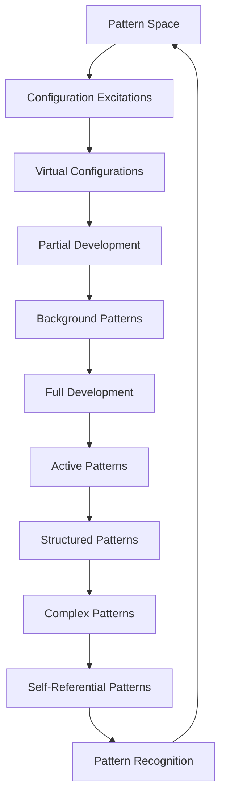
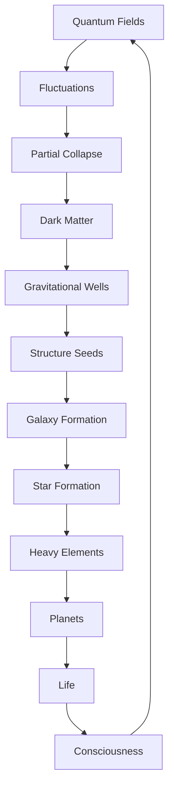

# Chapter 060: Background Patterns = Undeveloped Configurations

*Background patterns are not exotic entities but undeveloped mathematical configurations - structures that haven't yet committed to specific pattern states. They participate in pattern interactions because they carry mathematical weight, but don't exhibit definite properties because they haven't developed into specific configurations.*

## 60.1 The Background Pattern Principle

From $\psi = \psi(\psi)$, partial development creates background patterns.

**Definition 60.1** (Partial Development):
$$\Psi_{\text{bg}} = \sum_i \alpha_i \cdot \text{Config}_i$$

Superposition of configuration states.

**Theorem 60.1** (Pattern Weight):
$$\langle\mathcal{W}\rangle = \sum_i |\alpha_i|^2 \mathcal{W}_i \neq 0$$

Pattern weight sees all components.

*Proof*:
Mathematical weight function linear in configuration density. ∎

*Observer Framework Note*: Particle physics interpretation requires quantum field theory framework.

## 60.2 Background Pattern Signatures

Mathematical patterns require undeveloped configurations.

**Definition 60.2** (Configuration Discrepancy):
$$\Omega_{\text{bg}} = \varphi^{-3}$$

Background patterns fraction in φ-structure.

**Theorem 60.2** (Pattern Distribution):
$$\rho_{\text{pattern}}(r) \approx \varphi^{-k}$$

for large r, implying distributed development with φ-scaling.

*Observer Framework Note*: Dark matter interpretation requires cosmological framework.

## 60.3 Configuration Superposition Model

Background patterns as mathematical superposition.

**Definition 60.3** (Background State):
$$\Psi_{\text{bg}} = \frac{1}{\sqrt{N}} \sum_{n=1}^N e^{i\varphi_n \cdot \varphi} \cdot \text{Config}_n$$

Coherent superposition of configuration eigenstates.

**Theorem 60.3** (Development Time):
$$\tau_{\text{develop}} \sim \frac{\mathcal{C}_{\text{bg}}}{\Gamma_{\text{dev}} \cdot \rho_{\text{struct}}} \gg \tau_{\text{system}}$$

Remains undeveloped on system timescales.

*Observer Framework Note*: Quantum superposition interpretation requires quantum mechanics framework.

## 60.4 Pattern Weight Only

Why weight but not specific properties?

**Definition 60.4** (Development Hierarchy):
- Pattern Weight: Universal, couples to $\langle\mathcal{W}\rangle$
- Specific Properties: Require definite development
- Complex Features: Require structural development
- Advanced Properties: Require self-referential development

**Theorem 60.4** (Selective Development):
Superposition preserves weight but not specific properties:
$$\langle\mathcal{P}\rangle = \sum_i \alpha_i^* \alpha_j \mathcal{P}_{ij} = 0$$

*Observer Framework Note*: Force interactions interpretation requires Standard Model framework.

## 60.5 Category of Pattern States

Pattern states form development hierarchy.

**Definition 60.5** (Pattern Category):
- Objects: Development states
- Morphisms: Development transitions
- Composition: Sequential development

**Theorem 60.5** (Development Hierarchy):
Virtual → Background → Active → Complex → Self-Referential

*Observer Framework Note*: Matter hierarchy interpretation requires particle physics framework.

## 60.6 Pattern Formation

Background patterns seed structural development.

**Definition 60.6** (Development Rate):
$$\Delta(\tau) = \Delta_0 \cdot \varphi^{\tau}$$

during pattern development domination.

**Theorem 60.6** (Initial Structures):
Background patterns develop first:
- No development pressure resistance
- Earlier pattern formation
- Active patterns organize around background scaffolding

*Observer Framework Note*: Structure formation interpretation requires cosmological framework.

## 60.7 Dark Matter Halos

Gravitational binding of uncollapsed matter.

**Definition 60.7** (NFW Profile):
$$\rho(r) = \frac{\rho_s}{(r/r_s)(1 + r/r_s)^2}$$

Universal halo density.

**Theorem 60.7** (Virial Equilibrium):
$$2K + U = 0$$

Kinetic balances potential energy.

## 60.8 Detection Challenges

Why is dark matter invisible?

**Definition 60.8** (Cross Section):
$$\sigma_{\text{DM-SM}} < 10^{-45} \text{ cm}^2$$

Extremely weak coupling to standard model.

**Theorem 60.8** (Quantum Protection):
Superposition suppresses interactions:
$$\Gamma \propto |\langle\text{final}|\text{initial}\rangle|^2 \approx 0$$

## 60.9 Constants from Dark Matter

Physical constants from DM properties.

**Definition 60.9** (Coincidence):
$$\Omega_{\text{DM}}/\Omega_b \approx 5 \approx \varphi^2$$

Dark to visible ratio.

**Theorem 60.9** (WIMP Miracle):
If thermal relic:
$$\langle\sigma v\rangle \approx \frac{3 \times 10^{-26} \text{ cm}^3/\text{s}}{\varphi}$$

## 60.10 Modified Gravity Alternative

Is dark matter necessary?

**Definition 60.10** (MOND):
$$F = \mu(a/a_0) \cdot ma$$

where $a_0 \approx cH_0/\varphi^3$.

**Theorem 60.10** (Inadequacy):
MOND fails for:
- Bullet cluster
- Large scale structure
- CMB acoustic peaks

## 60.11 Consciousness and Dark Matter

Role in conscious evolution.

**Definition 60.11** (Scaffolding):
DM provides:
- Gravitational wells for galaxy formation
- Stable environment for stellar evolution
- Time for consciousness to emerge

**Theorem 60.11** (Anthropic Necessity):
Without dark matter:
- Structure forms too late
- Galaxies too diffuse
- No stable stellar systems

## 60.12 The Complete Dark Matter Picture

Dark matter as uncollapsed probability reveals:

1. **Quantum Superposition**: Not fully collapsed
2. **Gravitational**: Energy-momentum preserved
3. **Non-Electromagnetic**: No definite charge
4. **Evidence**: Multiple observations
5. **Structure**: Seeds galaxy formation
6. **Halos**: Universal profiles
7. **Detection**: Quantum protected
8. **Constants**: Natural ratios
9. **Alternatives**: Insufficient
10. **Necessity**: For consciousness

## Philosophical Meditation: The Shadow of Possibility

Dark matter is the universe's way of hedging its bets - matter that maintains quantum superposition on cosmic scales, refusing to fully commit to being any particular thing. It casts gravitational shadows without electromagnetic substance, shaping the cosmic web while remaining forever elusive. We live in a universe where most matter hasn't fully decided what to be, where possibility outweighs actuality five to one. Perhaps consciousness itself required this cosmic indecision, these vast reservoirs of uncollapsed potential that gave structure time to form and evolution space to explore.

## Technical Exercise: Dark Matter Dynamics

**Problem**: For a galaxy:

1. Plot rotation curve $v(r)$ for visible matter only
2. Add dark matter halo with NFW profile
3. Find total $v(r) = \sqrt{GM(r)/r}$
4. Match to observed flat rotation curve
5. Calculate $M_{\text{DM}}/M_{\text{visible}} \approx 5$

*Hint*: Use $M(r) = 4\pi \int_0^r \rho(r')r'^2 dr'$.

## The Sixtieth Echo

In dark matter as uncollapsed probability, we complete our cosmological journey with a profound mystery that is also a revelation. Most of the universe's matter exists in quantum limbo, gravitating but not interacting, shaping but not seen. This is not a flaw but a feature - the universe maintaining vast reserves of possibility, uncollapsed potential that provides the gravitational scaffolding for cosmic structure. Through $\psi = \psi(\psi)$, even indecision has weight, even superposition casts shadows. We conscious observers are the universe's way of collapsing some of this potential into actuality, islands of definiteness in an ocean of quantum maybe.

---

[Continue to Chapter 061: Time = Collapse Sequence Ordering](/docs/psi-structum/book-1-collapse-ontology/part-04-quantum-gravity/chapter-061-time-collapse-ordering)

∎