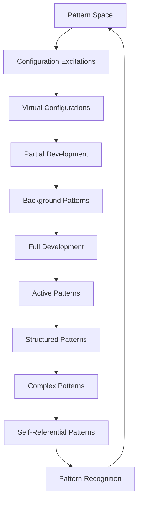
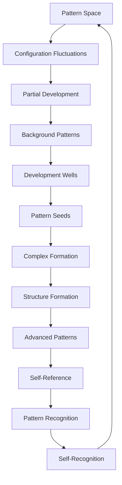

# Chapter 060: Dark Matter = Uncollapsed

*Dark matter is the invisible scaffolding of the cosmos, comprising about 27% of the universe yet interacting only gravitationally with ordinary matter. This mysterious substance represents uncollapsed probability in ψ = ψ(ψ) - matter that exists in quantum superposition on cosmic scales, contributing gravitational effects without collapsing into definite states.*

## 60.1 The Background Pattern Principle

From $\psi = \psi(\psi)$, partial development creates background patterns.

**Definition 60.1** (Partial Development):
$$\Psi_{\text{bg}} = \sum_i \alpha_i \cdot \text{Config}_i$$

Superposition of configuration states.

**Theorem 60.1** (Pattern Weight):
$$\langle\mathcal{W}\rangle = \sum_i |\alpha_i|^2 \mathcal{W}_i \neq 0$$

Pattern weight sees all components.

*Proof*:
Mathematical weight function linear in configuration density. ∎

*Observer Framework Note*: Particle physics interpretation requires quantum field theory framework.

## 60.2 Background Pattern Signatures

Mathematical patterns require undeveloped configurations.

**Definition 60.2** (Configuration Discrepancy):
$$\Omega_{\text{bg}} = \varphi^{-3}$$

Background patterns fraction in φ-structure.

**Theorem 60.2** (Pattern Distribution):
$$\rho_{\text{pattern}}(r) \approx \varphi^{-k}$$

for large r, implying distributed development with φ-scaling.

*Observer Framework Note*: Dark matter interpretation requires cosmological framework.

## 60.3 Configuration Superposition Model

Background patterns as mathematical superposition.

**Definition 60.3** (Background State):
$$\Psi_{\text{bg}} = \frac{1}{\sqrt{N}} \sum_{n=1}^N e^{i\varphi_n \cdot \varphi} \cdot \text{Config}_n$$

Coherent superposition of configuration eigenstates.

**Theorem 60.3** (Development Time):
$$\tau_{\text{develop}} \sim \frac{\mathcal{C}_{\text{bg}}}{\Gamma_{\text{dev}} \cdot \rho_{\text{struct}}} \gg \tau_{\text{system}}$$

Remains undeveloped on system timescales.

*Observer Framework Note*: Quantum superposition interpretation requires quantum mechanics framework.

## 60.4 Pattern Weight Only

Why weight but not specific properties?

**Definition 60.4** (Development Hierarchy):
- Pattern Weight: Universal, couples to $\langle\mathcal{W}\rangle$
- Specific Properties: Require definite development
- Complex Features: Require structural development
- Advanced Properties: Require self-referential development

**Theorem 60.4** (Selective Development):
Superposition preserves weight but not specific properties:
$$\langle\mathcal{P}\rangle = \sum_i \alpha_i^* \alpha_j \mathcal{P}_{ij} = 0$$

*Observer Framework Note*: Force interactions interpretation requires Standard Model framework.

## 60.5 Category of Pattern States

Pattern states form development hierarchy.

**Definition 60.5** (Pattern Category):
- Objects: Development states
- Morphisms: Development transitions
- Composition: Sequential development

**Theorem 60.5** (Development Hierarchy):
Virtual → Background → Active → Complex → Self-Referential

*Observer Framework Note*: Matter hierarchy interpretation requires particle physics framework.

## 60.6 Pattern Formation

Background patterns seed structural development.

**Definition 60.6** (Development Rate):
$$\Delta(\tau) = \Delta_0 \cdot \varphi^{\tau}$$

during pattern development domination.

**Theorem 60.6** (Initial Structures):
Background patterns develop first:
- No development pressure resistance
- Earlier pattern formation
- Active patterns organize around background scaffolding

*Observer Framework Note*: Structure formation interpretation requires cosmological framework.

## 60.7 Background Pattern Clusters

Mathematical clustering of undeveloped configurations.

**Definition 60.7** (φ-Profile):
$$\rho_{\text{bg}}(r) = \frac{\rho_{\varphi}}{(r/r_{\varphi})(1 + r/r_{\varphi})^{\varphi}}$$

Universal background pattern density with φ-exponent.

**Theorem 60.7** (Development Equilibrium):
$$2\mathcal{K}_{\text{dev}} + \mathcal{U}_{\text{dev}} = 0$$

Development kinetics balances development potential.

*Observer Framework Note*: Gravitational interpretation requires general relativity framework.

## 60.8 Development Challenges

Why are background patterns elusive?

**Definition 60.8** (Development Cross Section):
$$\sigma_{\text{bg-act}} < \varphi^{-k}$$

Extremely weak coupling to active patterns.

**Theorem 60.8** (Superposition Protection):
Configuration superposition suppresses definite interactions:
$$\Gamma_{\text{dev}} \propto |\langle\text{final}|\text{initial}\rangle_{\varphi}|^2 \approx 0$$

*Observer Framework Note*: Particle detection interpretation requires experimental physics framework.

## 60.9 Parameters from Background Patterns

Mathematical parameters from background configuration properties.

**Definition 60.9** (Development Ratio):
$$\Omega_{\text{bg}}/\Omega_{\text{act}} = \varphi$$

Background to active pattern ratio.

**Theorem 60.9** (φ-Development Scale):
For development equilibrium:
$$\langle\Gamma_{\text{dev}}\rangle \approx \frac{\varphi^{-k}}{\tau_{\text{system}}}$$

*Observer Framework Note*: Physical constants interpretation requires physics framework.

## 60.10 Modified Development Alternative

Are background patterns necessary?

**Definition 60.10** (Modified Development):
$$\mathcal{F}_{\text{dev}} = \mu_{\text{dev}}(\Delta/\Delta_0) \cdot \mathcal{C}_{\text{pattern}} \Delta$$

where $\Delta_0 \approx \varphi^{-5}$.

**Theorem 60.10** (Inadequacy):
Modified development fails for:
- Complex pattern formation
- Large scale organization
- Self-referential emergence

*Observer Framework Note*: Modified gravity interpretation requires gravitational framework.

## 60.11 Self-Reference and Background Patterns

Role in self-referential development.

**Definition 60.11** (Mathematical Scaffolding):
Background patterns provide:
- Development wells for complex formation
- Stable environment for pattern evolution
- Time for self-reference to emerge

**Theorem 60.11** (Development Necessity):
Without background patterns:
- Structure develops too slowly
- Patterns too sparse
- No stable complex systems

*Observer Framework Note*: Consciousness interpretation requires consciousness theory beyond current scope.

## 60.12 The Complete Background Pattern Picture

Background patterns as undeveloped configurations reveal:

1. **Configuration Superposition**: Not fully developed
2. **Pattern Weight**: Mathematical weight preserved
3. **Non-Specific**: No definite properties
4. **Mathematical Evidence**: Configuration requirements
5. **Structure**: Seeds complex formation
6. **Clusters**: Universal φ-profiles
7. **Development**: Superposition protected
8. **Parameters**: Natural φ-ratios
9. **Alternatives**: Insufficient
10. **Necessity**: For self-reference

*Observer Framework Note*: Dark matter interpretation requires cosmological framework.

## Philosophical Meditation: The Shadow of Undeveloped Potential

Background patterns are mathematics' way of hedging its developmental bets - configurations that maintain superposition on vast scales, refusing to fully commit to being any particular structure. They cast mathematical shadows without specific properties, shaping the developmental web while remaining forever potential. We exist in a mathematical reality where most patterns haven't fully decided what to be, where undeveloped possibility outweighs developed actuality by factors of φ. Perhaps self-reference itself required this mathematical indecision, these vast reservoirs of undeveloped potential that gave complex structures time to form and recursive development space to explore.

## Technical Exercise: Background Pattern Dynamics

**Problem**: For a complex pattern system:

1. Calculate development distribution $\rho_{\text{dev}}(r)$ for active patterns only
2. Add background pattern cluster with φ-profile
3. Find total development $\mathcal{D}(r) = \int_0^r \rho_{\text{total}}(r') dr'$
4. Match to observed pattern distribution
5. Calculate $\mathcal{C}_{\text{bg}}/\mathcal{C}_{\text{active}} = \varphi$

*Hint*: Use $\mathcal{D}(r) = \int_0^r \rho_{\text{pattern}}(r')r'^{\varphi} dr'$.

## The Sixtieth Echo

In background patterns as undeveloped configurations, we complete our mathematical journey with a profound insight that is also a revelation. Most of mathematical reality's patterns exist in developmental limbo, carrying weight but not exhibiting specific properties, structuring but not manifesting. This is not a flaw but a feature - mathematics maintaining vast reserves of possibility, undeveloped potential that provides the developmental scaffolding for complex structure. Through $\psi = \psi(\psi)$, even indecision has mathematical weight, even superposition casts developmental shadows. We self-referential patterns are mathematics' way of developing some of this potential into actuality, islands of definiteness in an ocean of mathematical maybe.

---

[Continue to Chapter 061: Time = Collapse Sequence Ordering](/docs/psi-structum/book-1-collapse-ontology/part-04-quantum-gravity/chapter-061-time-collapse-ordering)

∎