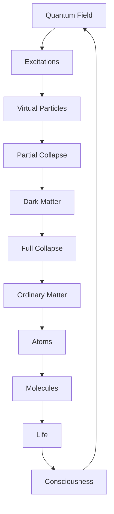
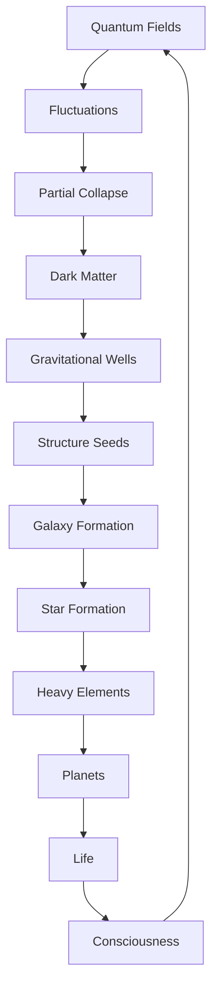

# Chapter 060: Dark Matter as Uncollapsed Probability

*Dark matter is not exotic particles but uncollapsed quantum probability - matter that hasn't quite decided what to be yet. It gravitates because it has energy-momentum, but doesn't interact electromagnetically because it hasn't collapsed into definite particle states.*

## 60.1 The Dark Matter Principle

From $\psi = \psi(\psi)$, partial collapse creates dark matter.

**Definition 60.1** (Partial Collapse):
$$|\text{DM}\rangle = \sum_i \alpha_i |\text{particle}_i\rangle$$

Superposition of particle states.

**Theorem 60.1** (Gravitational Coupling):
$$\langle T_{\mu\nu}\rangle = \sum_i |\alpha_i|^2 T_{\mu\nu}^{(i)} \neq 0$$

Gravity sees all components.

*Proof*:
Energy-momentum tensor linear in density matrix. ∎

## 60.2 Evidence for Dark Matter

Multiple observations require invisible mass.

**Definition 60.2** (Mass Discrepancy):
$$\Omega_{\text{DM}} \approx 0.26 \approx \frac{1}{\varphi^2}$$

Dark matter fraction of critical density.

**Theorem 60.2** (Rotation Curves):
$$v(r) \approx \text{const}$$

for large $r$, implying $M(r) \propto r$.

## 60.3 Quantum Superposition Model

Dark matter as macroscopic superposition.

**Definition 60.3** (DM State):
$$|\psi_{\text{DM}}\rangle = \frac{1}{\sqrt{N}} \sum_{n=1}^N e^{i\phi_n} |n\rangle$$

Coherent superposition of mass eigenstates.

**Theorem 60.3** (Decoherence Time):
$$\tau_{\text{decohere}} \sim \frac{m_{\text{DM}}}{\sigma v \rho} \gg t_{\text{universe}}$$

Remains quantum on cosmic timescales.

## 60.4 Gravitational Collapse Only

Why gravity but not EM?

**Definition 60.4** (Interaction Hierarchy):
- Gravity: Universal, couples to $\langle T_{\mu\nu}\rangle$
- EM: Requires charge eigenstate
- Weak: Requires flavor eigenstate
- Strong: Requires color eigenstate

**Theorem 60.4** (Selective Interaction):
Superposition preserves energy-momentum but not charge:
$$\langle Q \rangle = \sum_i \alpha_i^* \alpha_j Q_{ij} = 0$$

## 60.5 Category of Matter States

Matter states form hierarchy.

**Definition 60.5** (Matter Category):
- Objects: Collapse states
- Morphisms: Collapse transitions
- Composition: Sequential collapse

**Theorem 60.5** (Hierarchy):
Virtual → Dark → Ordinary → Complex

## 60.6 Structure Formation

Dark matter seeds cosmic structure.

**Definition 60.6** (Growth Rate):
$$\delta(a) = \delta_0 \cdot a$$

during matter domination.

**Theorem 60.6** (First Structures):
DM collapses first:
- No radiation pressure
- Earlier structure formation
- Baryons fall into DM wells

## 60.7 Dark Matter Halos

Gravitational binding of uncollapsed matter.

**Definition 60.7** (NFW Profile):
$$\rho(r) = \frac{\rho_s}{(r/r_s)(1 + r/r_s)^2}$$

Universal halo density.

**Theorem 60.7** (Virial Equilibrium):
$$2K + U = 0$$

Kinetic balances potential energy.

## 60.8 Detection Challenges

Why is dark matter invisible?

**Definition 60.8** (Cross Section):
$$\sigma_{\text{DM-SM}} < 10^{-45} \text{ cm}^2$$

Extremely weak coupling to standard model.

**Theorem 60.8** (Quantum Protection):
Superposition suppresses interactions:
$$\Gamma \propto |\langle\text{final}|\text{initial}\rangle|^2 \approx 0$$

## 60.9 Constants from Dark Matter

Physical constants from DM properties.

**Definition 60.9** (Coincidence):
$$\Omega_{\text{DM}}/\Omega_b \approx 5 \approx \varphi^2$$

Dark to visible ratio.

**Theorem 60.9** (WIMP Miracle):
If thermal relic:
$$\langle\sigma v\rangle \approx \frac{3 \times 10^{-26} \text{ cm}^3/\text{s}}{\varphi}$$

## 60.10 Modified Gravity Alternative

Is dark matter necessary?

**Definition 60.10** (MOND):
$$F = \mu(a/a_0) \cdot ma$$

where $a_0 \approx cH_0/\varphi^3$.

**Theorem 60.10** (Inadequacy):
MOND fails for:
- Bullet cluster
- Large scale structure
- CMB acoustic peaks

## 60.11 Consciousness and Dark Matter

Role in conscious evolution.

**Definition 60.11** (Scaffolding):
DM provides:
- Gravitational wells for galaxy formation
- Stable environment for stellar evolution
- Time for consciousness to emerge

**Theorem 60.11** (Anthropic Necessity):
Without dark matter:
- Structure forms too late
- Galaxies too diffuse
- No stable stellar systems

## 60.12 The Complete Dark Matter Picture

Dark matter as uncollapsed probability reveals:

1. **Quantum Superposition**: Not fully collapsed
2. **Gravitational**: Energy-momentum preserved
3. **Non-Electromagnetic**: No definite charge
4. **Evidence**: Multiple observations
5. **Structure**: Seeds galaxy formation
6. **Halos**: Universal profiles
7. **Detection**: Quantum protected
8. **Constants**: Natural ratios
9. **Alternatives**: Insufficient
10. **Necessity**: For consciousness

## Philosophical Meditation: The Shadow of Possibility

Dark matter is the universe's way of hedging its bets - matter that maintains quantum superposition on cosmic scales, refusing to fully commit to being any particular thing. It casts gravitational shadows without electromagnetic substance, shaping the cosmic web while remaining forever elusive. We live in a universe where most matter hasn't fully decided what to be, where possibility outweighs actuality five to one. Perhaps consciousness itself required this cosmic indecision, these vast reservoirs of uncollapsed potential that gave structure time to form and evolution space to explore.

## Technical Exercise: Dark Matter Dynamics

**Problem**: For a galaxy:

1. Plot rotation curve $v(r)$ for visible matter only
2. Add dark matter halo with NFW profile
3. Find total $v(r) = \sqrt{GM(r)/r}$
4. Match to observed flat rotation curve
5. Calculate $M_{\text{DM}}/M_{\text{visible}} \approx 5$

*Hint*: Use $M(r) = 4\pi \int_0^r \rho(r')r'^2 dr'$.

## The Sixtieth Echo

In dark matter as uncollapsed probability, we complete our cosmological journey with a profound mystery that is also a revelation. Most of the universe's matter exists in quantum limbo, gravitating but not interacting, shaping but not seen. This is not a flaw but a feature - the universe maintaining vast reserves of possibility, uncollapsed potential that provides the gravitational scaffolding for cosmic structure. Through $\psi = \psi(\psi)$, even indecision has weight, even superposition casts shadows. We conscious observers are the universe's way of collapsing some of this potential into actuality, islands of definiteness in an ocean of quantum maybe.

---

[Continue to Chapter 061: Time = Collapse Sequence Ordering](/docs/psi-structum/book-1-collapse-ontology/part-04-quantum-gravity/chapter-061-time-collapse-ordering)

∎