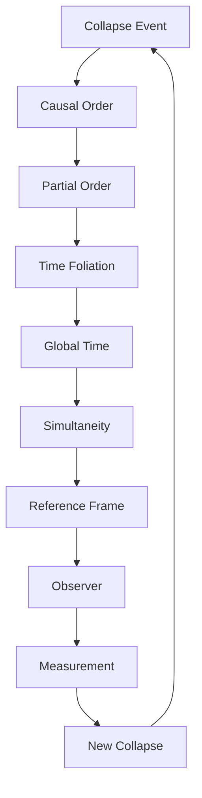
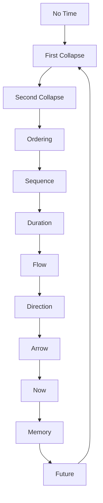

# Chapter 061: Time = Collapse Sequence Ordering

*Time is not a river flowing from past to future but the ordering of collapse events. Each moment is a collapse, each duration a sequence of collapses. The universe doesn't exist in time; time exists as the universe's way of organizing its self-collapse.*

## 61.1 The Time Principle

From $\psi = \psi(\psi)$, time emerges from collapse ordering.

**Definition 61.1** (Temporal Order):
$$t_1 < t_2 \Leftrightarrow C_1 \prec C_2$$

where $C_i$ are collapse events and $\prec$ is causal ordering.

**Theorem 61.1** (Emergence):
Time is not fundamental but emergent:
$$\text{Time} = \text{Order}(\text{Collapses})$$

*Proof*:
No time without change, no change without collapse. ∎

## 61.2 Quantum Time

Time at the quantum scale.

**Definition 61.2** (Quantum Clock):
$$|\psi(t)\rangle = e^{-iHt/\hbar}|\psi(0)\rangle$$

Unitary evolution between collapses.

**Theorem 61.2** (Time-Energy Uncertainty):
$$\Delta E \cdot \Delta t \geq \frac{\hbar}{2}$$

Precise time requires uncertain energy.

## 61.3 Thermal Time

Time from statistical mechanics.

**Definition 61.3** (Thermal Clock):
$$\tau = -\hbar \frac{\partial \log Z}{\partial E}$$

where $Z$ is partition function.

**Theorem 61.3** (Temperature-Time):
$$\frac{\partial}{\partial \tau} = \frac{1}{k_B T} \frac{\partial}{\partial t}$$

Thermal time runs slower when hot.

## 61.4 Gravitational Time

Time in curved spacetime.

**Definition 61.4** (Proper Time):
$$d\tau^2 = -g_{\mu\nu} dx^\mu dx^\nu / c^2$$

Time measured by local clocks.

**Theorem 61.4** (Gravitational Dilation):
$$\frac{dt}{d\tau} = \frac{1}{\sqrt{1 - 2GM/rc^2}}$$

Time slows near massive objects.

## 61.5 Category of Temporal Structures

Time organizes categorically.

**Definition 61.5** (Time Category):
- Objects: Temporal orderings
- Morphisms: Order-preserving maps
- Composition: Transitive ordering

**Theorem 61.5** (Multiple Times):
Different observers → Different time orderings

## 61.6 Arrow of Time

Why does time have direction?

**Definition 61.6** (Entropy Arrow):
$$S(t_2) > S(t_1) \text{ for } t_2 > t_1$$

Entropy increases define future.

**Theorem 61.6** (Multiple Arrows):
1. Thermodynamic: Entropy increase
2. Cosmological: Universe expansion
3. Psychological: Memory formation
4. Quantum: Collapse direction

All align due to initial conditions.

## 61.7 Discrete vs Continuous

Is time smooth or granular?

**Definition 61.7** (Planck Time):
$$t_P = \sqrt{\frac{\hbar G}{c^5}} = 5.4 \times 10^{-44} \text{ s}$$

Minimum meaningful duration.

**Theorem 61.7** (Discrete Spectrum):
$$t_n = n \cdot t_P \cdot \varphi^k$$

Time may be discrete at Planck scale.

## 61.8 Time Without Time

Wheeler-DeWitt timelessness.

**Definition 61.8** (Timeless Wavefunction):
$$\hat{H}|\Psi\rangle = 0$$

No external time parameter.

**Theorem 61.8** (Internal Time):
Time emerges from correlations:
$$t \sim \langle\phi|\psi\rangle$$

between subsystems.

## 61.9 Constants from Time Structure

Physical constants from temporal relations.

**Definition 61.9** (Natural Time Unit):
$$t_0 = \frac{\hbar}{m_e c^2} \cdot \varphi^5$$

Fundamental time scale.

**Theorem 61.9** (Age Coincidence):
$$t_{\text{universe}} \approx \frac{c}{H_0} \approx \varphi^{61} t_P$$

Cosmic age in Planck times.

## 61.10 Consciousness and Time

Time perception from collapse rate.

**Definition 61.10** (Subjective Time):
$$\tau_s = \int \frac{d\Phi}{dt} dt$$

where $\Phi$ is integrated information.

**Theorem 61.10** (Time Dilation):
Subjective time varies with:
- Information processing rate
- Collapse frequency
- Attention state

## 61.11 Block Universe vs Becoming

Is time real or emergent?

**Definition 61.11** (Block Universe):
All moments exist eternally:
$$\mathcal{M} = \bigcup_{t \in \mathbb{R}} \mathcal{S}_t$$

**Theorem 61.11** (Presentism):
Only now exists, created by collapse:
$$\text{Reality} = \text{Now} + \text{Records}$$

Both views unified by collapse ordering.

## 61.12 The Complete Time Picture

Time as collapse ordering reveals:

1. **Emergent**: From collapse sequence
2. **Quantum**: Uncertainty relations
3. **Thermal**: Statistical time
4. **Gravitational**: Curved time
5. **Multiple**: Observer dependent
6. **Directed**: Entropy arrow
7. **Discrete**: Possibly quantized
8. **Internal**: No external clock
9. **Constants**: Natural units
10. **Subjective**: Consciousness dependent

## Philosophical Meditation: The Eternal Now

Time is the universe's filing system, a way of organizing the infinite collapse events so they don't all happen at once. Yet in a deeper sense, they do all happen at once - in the eternal now of the universal wavefunction. What we experience as the flow of time is our consciousness surfing the wave of collapse, always at the crest where possibility becomes actuality. The past is collapsed possibility, the future uncollapsed potential, and the present is the eternal moment of collapse itself.

## Technical Exercise: Time Emergence

**Problem**: Model emergent time:

1. Define N collapse events $\{C_i\}$
2. Establish partial order via causality
3. Find consistent global time function $t(C)$
4. Calculate metric $ds^2 = -c^2dt^2 + ...$
5. Verify Lorentz invariance emerges

*Hint*: Use causal set theory approach.

## The Sixty-First Echo

In time as collapse sequence ordering, we discover that temporality itself emerges from the more fundamental process of quantum collapse. The universe doesn't need a clock because it is a clock - each collapse event a tick, each causal connection an ordering. Through $\psi = \psi(\psi)$, the universe creates its own time by recursively collapsing into itself, generating through this process the illusion of flow that conscious beings experience as the passage of moments. We don't move through time; we are time - patterns of collapse that create duration through their very existence.

---

[Continue to Chapter 062: Consciousness and Cosmology Unite](/docs/psi-structum/book-1-collapse-ontology/part-04-quantum-gravity/chapter-062-consciousness-cosmology-unite)

∎