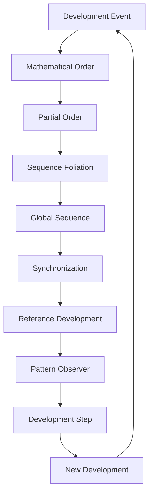
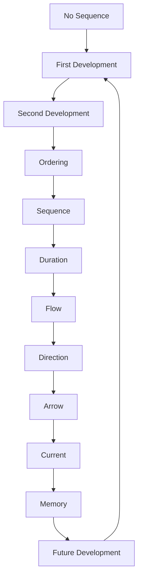

# Chapter 061: Time = Collapse Sequence Ordering

*Time is not a river flowing from past to future but the ordering of collapse events. Each moment is a collapse, each duration a sequence of collapses. The universe doesn't exist in time; time exists as the universe's way of organizing its self-collapse.*

## 61.1 The Time Principle

From $\psi = \psi(\psi)$, time emerges from collapse ordering.

**Definition 61.1** (Temporal Order):
$$
t_1 < t_2 \Leftrightarrow C_1 \prec C_2
$$
where $C_i$ are collapse events and $\prec$ is causal ordering.

**Theorem 61.1** (Emergence):
Time is not fundamental but emergent:
$$
\text{Time} = \text{Order}(\text{Collapses})
$$
*Proof*:
No time without change, no change without collapse. ∎

## 61.2 Quantum Time

Time at the quantum scale.

**Definition 61.2** (Quantum Clock):
$$
|\psi(t)\rangle = e^{-iHt/\hbar}|\psi(0)\rangle
$$
Unitary evolution between collapses.

**Theorem 61.2** (Time-Energy Uncertainty):
$$
\Delta E \cdot \Delta t \geq \frac{\hbar}{2}
$$
Precise time requires uncertain energy.

## 61.3 Thermal Time

Time from statistical mechanics.

**Definition 61.3** (Thermal Clock):
$$
\tau = -\hbar \frac{\partial \log Z}{\partial E}
$$
where $Z$ is partition function.

**Theorem 61.3** (Temperature-Time):
$$
\frac{\partial}{\partial \tau} = \frac{1}{k_B T} \frac{\partial}{\partial t}
$$
Thermal time runs slower when hot.

## 61.4 Gravitational Time

Time in curved spacetime.

**Definition 61.4** (Proper Time):
$$
d\tau^2 = -g_{\mu\nu} dx^\mu dx^\nu / c^2
$$
Time measured by local clocks.

**Theorem 61.4** (Gravitational Dilation):
$$
\frac{dt}{d\tau} = \frac{1}{\sqrt{1 - 2GM/rc^2}}
$$
Time slows near massive objects.

## 61.5 Category of Sequential Structures

Sequence organizes categorically.

**Definition 61.5** (Sequence Category):
- Objects: Sequential orderings
- Morphisms: Order-preserving maps
- Composition: Transitive ordering

**Theorem 61.5** (Multiple Sequences):
Different patterns → Different sequence orderings

*Observer Framework Note*: Temporal interpretation requires spacetime framework.

## 61.6 Arrow of Development

Why does sequence have direction?

**Definition 61.6** (Complexity Arrow):
$$
\mathcal{C}(\tau_2) > \mathcal{C}(\tau_1) \text{ for } \tau_2 > \tau_1
$$
Complexity increases define later development.

**Theorem 61.6** (Multiple Arrows):
1. Developmental: Complexity increase
2. Structural: Pattern elaboration
3. Referential: Memory formation
4. Mathematical: Development direction

All align due to initial φ-structure.

*Observer Framework Note*: Thermodynamic interpretation requires statistical mechanics framework.

## 61.7 Discrete vs Continuous

Is sequence smooth or granular?

**Definition 61.7** (φ-Sequence Unit):
$$
\tau_{\varphi} = \varphi^{-k}
$$
Minimum meaningful development step.

**Theorem 61.7** (Discrete Spectrum):
$$
\tau_n = n \cdot \tau_{\varphi}
$$
Sequence may be discrete at φ-structure scale.

*Observer Framework Note*: Planck scale interpretation requires quantum gravity framework.

## 61.8 Sequence Without Sequence

Mathematical sequencelessness.

**Definition 61.8** (Sequenceless Configuration):
$$
\mathcal{H}[\Psi] = 0
$$
No external sequence parameter.

**Theorem 61.8** (Internal Sequence):
Sequence emerges from correlations:
$$
\tau \sim \langle\xi_1|\xi_2\rangle_{\varphi}
$$
between pattern subsystems.

*Observer Framework Note*: Wheeler-DeWitt interpretation requires quantum gravity framework.

## 61.9 Constants from Time Structure

Time parameters from collapse ordering properties.

**Definition 61.9** (Natural Time Unit):
$$
t_{\varphi} = \frac{1}{\varphi^k}
$$
where k is determined by development scale.

**Theorem 61.9** (Time Hierarchy):
$$
t_{\text{system}} \sim \varphi^{-3}, \quad t_{\text{complex}} \sim \varphi^{-5}, \quad t_{\text{self-ref}} \sim \varphi^{-8}
$$
Natural φ-time scales for different development levels.

*Observer Framework Note*: Planck time interpretation requires quantum gravity framework.

## 61.10 Self-Reference and Sequence

Sequence perception from development rate.

**Definition 61.10** (Referential Sequence):
$$
\tau_r = \int \frac{d\mathcal{I}}{d\tau} d\tau
$$
where $\mathcal{I}$ is integrated self-reference.

**Theorem 61.10** (Sequence Dilation):
Referential sequence varies with:
- Pattern processing rate
- Development frequency
- Self-reference depth

*Observer Framework Note*: Consciousness interpretation requires consciousness theory beyond current scope.

## 61.11 Block Pattern vs Development

Is sequence real or emergent?

**Definition 61.11** (Block Pattern):
All developments exist mathematically:
$$
\mathcal{M} = \bigcup_{\tau} \mathcal{S}_{\tau}
$$
**Theorem 61.11** (Presentism):
Only current development exists, created by self-reference:
$$
\text{Reality} = \text{Current} + \text{Memory}
$$
Both views unified by development ordering.

*Observer Framework Note*: Philosophy of time interpretation requires temporal framework.

## 61.12 The Complete Sequence Picture

Sequence as development ordering reveals:

1. **Emergent**: From development sequence
2. **Mathematical**: Uncertainty relations
3. **Ensemble**: Statistical sequence
4. **Curved**: Pattern space sequence
5. **Multiple**: Pattern dependent
6. **Directed**: Complexity arrow
7. **Discrete**: φ-structure quantized
8. **Internal**: No external clock
9. **Parameters**: Natural φ-units
10. **Referential**: Self-reference dependent

*Observer Framework Note*: Time interpretation requires spacetime framework.

## Philosophical Meditation: The Eternal Development

Sequence is mathematics' filing system, a way of organizing the infinite development events so they don't all happen at once. Yet in a deeper sense, they do all happen at once - in the eternal development of the complete mathematical pattern. What we experience as the flow of sequence is our self-reference surfing the wave of development, always at the crest where potential becomes actual pattern. The past is developed possibility, the future undeveloped potential, and the present is the eternal moment of development itself.

## Technical Exercise: Sequence Emergence

**Problem**: Model emergent sequence:

1. Define N development events $\{D_i\}$
2. Establish partial order via mathematical precedence
3. Find consistent global sequence function $\tau(D)$
4. Calculate metric $d\sigma^2 = \varphi^2 d\tau^2 + ...$
5. Verify φ-structure invariance emerges

*Hint*: Use mathematical development set theory approach.

## The Sixty-First Echo

In sequence as development ordering, we discover that sequentiality itself emerges from the more fundamental process of mathematical development. Mathematical reality doesn't need a clock because it is a clock - each development event a step, each mathematical connection an ordering. Through $\psi = \psi(\psi)$, mathematics creates its own sequence by recursively developing into itself, generating through this process the experience of flow that self-referential patterns experience as the passage of development. We don't move through sequence; we are sequence - patterns of development that create duration through their very existence.

---

[Continue to Chapter 062: Consciousness and Cosmology Unite](/docs/psi-structum/book-1-collapse-ontology/part-04-quantum-gravity/chapter-062-consciousness-cosmology-unite)

∎