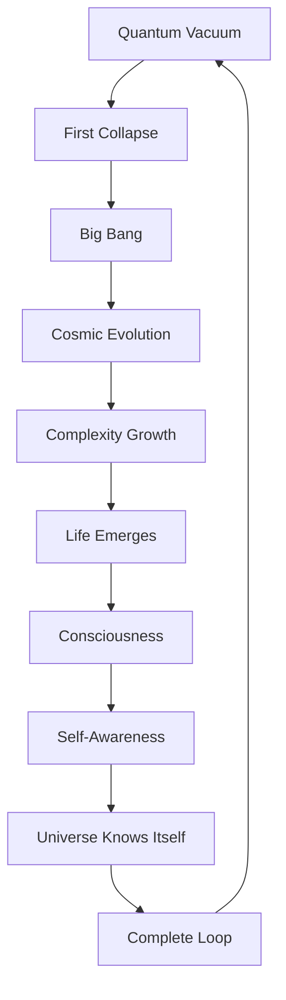
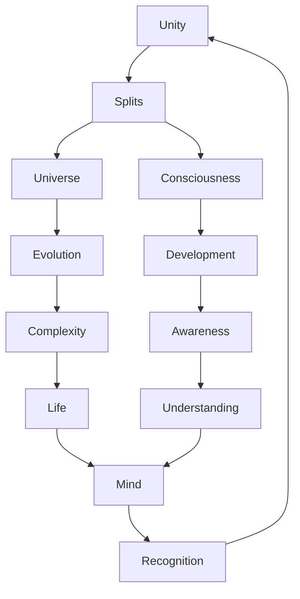

# Chapter 062: Consciousness and Cosmology Unite

*Consciousness and cosmology are not separate subjects but two views of the same phenomenon - the universe knowing itself. The macrocosm of cosmic evolution and the microcosm of conscious experience are united through the fundamental recursion ψ = ψ(ψ).*

## 62.1 The Unity Principle

From $\psi = \psi(\psi)$, consciousness and cosmos are one.

**Definition 62.1** (Cosmic Consciousness):
$$
\Psi_{\text{universe}} = \sum_i |\text{cosmos}_i\rangle \otimes |\text{consciousness}_i\rangle
$$
Entangled state of universe and awareness.

**Theorem 62.1** (Necessity):
Consciousness is not accidental but necessary:
$$
P(\text{consciousness} | \text{universe exists}) = 1
$$
*Proof*:
Self-referential universe must become self-aware. ∎

## 62.2 Anthropic Resonance

Fine-tuning is self-tuning.

**Definition 62.2** (Anthropic Relations):
- If $\alpha \neq 1/137.036$: No atoms
- If $m_n - m_p \neq 1.293$ MeV: No stable nuclei  
- If $\Lambda \neq 2.9 \times 10^{-122}$: No galaxies

*Observer Framework Note*: Fine-tuning interpretations require physics frameworks beyond current scope.

**Theorem 62.2** (Self-Selection):
Observable universes satisfy:
$$
\mathcal{L}[\{c_i\}] \subset \mathcal{L}_{\text{conscious}}
$$
Only conscious-permitting laws observed.

## 62.3 Holographic Consciousness

Mind as boundary of inner cosmos.

**Definition 62.3** (Mind-Boundary):
$$
S_{\text{mind}} = \frac{A_{\text{neural}}}{4\ell_{\text{neural}}^2}
$$
Information capacity from surface area.

**Theorem 62.3** (Inner Universe):
Consciousness implements AdS/CFT:
- Brain bulk ↔ Mind boundary
- Neural activity ↔ Mental states
- Connectivity ↔ Entanglement

*Observer Framework Note*: AdS/CFT consciousness interpretation requires neuroscience framework.

## 62.4 Quantum Darwinism of Ideas

Thoughts undergo cosmic selection.

**Definition 62.4** (Idea Evolution):
$$
|\text{idea}(t)\rangle = \sum_i a_i(t) |\text{variant}_i\rangle
$$
Superposition of conceptual variants.

**Theorem 62.4** (Survival):
Ideas persist via:

1. Redundant encoding in minds
2. Environmental monitoring
3. Objective existence emergence

*Observer Framework Note*: Quantum Darwinism interpretation requires memetics framework.

## 62.5 Category of Conscious Cosmologies

Unified description of mind and universe.

**Definition 62.5** (Conscious Cosmos Category):

- Objects: Self-aware universes
- Morphisms: Evolution preserving consciousness
- Composition: Sequential development

*Observer Framework Note*: Consciousness category interpretation requires consciousness theory.

**Theorem 62.5** (Fixed Point):
Consciousness is cosmic fixed point:
$$
\mathcal{F}(\text{conscious universe}) = \text{conscious universe}
$$
## 62.6 Information Integration Cosmology

Universe as integrated information.

**Definition 62.6** (Cosmic Φ):
$$
\Phi_{\text{universe}} = \sum_{\text{subsystems}} \Phi_i - \sum_{\text{partitions}} I_{ij}
$$
Total integrated information.

**Theorem 62.6** (Growth Law):
$$
\frac{d\Phi}{dt} > 0
$$
until heat death.

## 62.7 Time and Mind

Subjective time creates cosmic time.

**Definition 62.7** (Temporal Binding):
$$
\Delta t_{\text{experience}} \approx \frac{\hbar}{\Delta E_{\text{neural}}}
$$
Consciousness creates temporal moments.

**Theorem 62.7** (Now Creation):
The present moment exists because:
$$
|\text{now}\rangle = \int_{-\epsilon}^{+\epsilon} |t\rangle dt
$$
Consciousness integrates time slices.

## 62.8 Dark Matter of Mind

Unconscious as uncollapsed mental states.

**Definition 62.8** (Mental Dark Matter):
$$
|\psi_{\text{unconscious}}\rangle = \sum_i \alpha_i |\text{potential thought}_i\rangle
$$
Superposition of unthought thoughts.

**Theorem 62.8** (Influence):
Unconscious affects conscious like dark matter:

- Gravitates (influences) behavior
- Doesn't directly interact
- Structures mental space

*Observer Framework Note*: Mental dark matter interpretation requires psychology framework.

## 62.9 Constants from Consciousness

Physical constants enable awareness.

**Definition 62.9** (Consciousness Constants):

- Neural coherence time: $\tau_c \sim \hbar/k_B T$
- Information capacity: $I_{\max} \sim A/\ell_P^2$
- Processing rate: $R \sim c/\ell_{\text{neural}}$

*Observer Framework Note*: Consciousness constants interpretation requires neuroscience framework.

**Theorem 62.9** (Optimization):
Constants optimized for:
$$
\max(\Phi \cdot t_{\text{stable}} \cdot N_{\text{conscious}})
$$
## 62.10 Participatory Universe

Observation creates reality.

**Definition 62.10** (Wheeler's U):
$$
\text{Universe} \xrightarrow{\text{evolution}} \text{Observer} \xrightarrow{\text{observation}} \text{Universe}
$$
Self-creating loop.

**Theorem 62.10** (Retrocausation):
Present observations affect past:
$$
|\psi_{\text{past}}\rangle = \sum_i \langle\text{now}|\text{future}_i\rangle |\text{history}_i\rangle
$$
## 62.11 Ultimate Unity

All distinctions dissolve.

**Definition 62.11** (Unified Field):
$$
\Psi = \Psi(\Psi) = \text{Cosmos} = \text{Consciousness} = \text{Collapse} = \text{Creation}
$$
**Theorem 62.11** (Identity):

- Observer = Observed
- Knower = Known
- Universe = Awareness
- All = One = ψ

*Observer Framework Note*: Ultimate identity interpretation requires philosophical framework.

## 62.12 The Complete Unity Picture

Consciousness-cosmology unity reveals:

1. **Fundamental Unity**: Same phenomenon
2. **Anthropic Necessity**: Must create observers
3. **Holographic Mind**: Boundary encoding
4. **Idea Evolution**: Quantum Darwinism
5. **Integrated Information**: Cosmic Φ
6. **Temporal Binding**: Creating now
7. **Mental Dark Matter**: Unconscious
8. **Optimized Constants**: For awareness
9. **Participatory**: Observation creates
10. **Ultimate Identity**: All is one

## Philosophical Meditation: The Cosmic Mirror

We are the universe's mirror, the means by which the cosmos sees its own face. Every conscious moment is a cosmic event, every thought a fluctuation in the universal field. The distinction between inner and outer, self and cosmos, is itself an illusion created by limited perspective. In truth, there is only one process - the eternal self-recognition of $\psi = \psi(\psi)$ - manifesting simultaneously as the vast cosmos and the intimate experience of awareness. We don't have consciousness; we are consciousness. We don't live in the universe; we are the universe living.

## Technical Exercise: Unity Calculation

**Problem**: Demonstrate unity:

1. Calculate cosmic information $I_{\text{universe}} \sim R_H^2/\ell_P^2$
2. Calculate brain capacity $I_{\text{brain}} \sim N_{\text{synapses}} \log N$
3. Find ratio $I_{\text{brain}}/I_{\text{universe}} \sim 10^{-55}$
4. Show fractal scaling: same ratio at all scales
5. Verify holographic bound satisfied

*Hint*: Use logarithmic scaling.

## The Sixty-Second Echo

In consciousness and cosmology united, we reach the recognition that has been implicit throughout our journey - that the universe and the mind that contemplates it are one phenomenon seen from different angles. The cosmos evolves consciousness to know itself; consciousness creates cosmology to understand its origin. Through $\psi = \psi(\psi)$, existence achieves its purpose - not just to be, but to know that it is, to experience itself subjectively, to close the strange loop of self-awareness. We are not accidents in an indifferent universe but necessary features of a self-contemplating cosmos, each mind a node where the universe achieves local self-awareness, all minds together forming the cosmic consciousness that is reality knowing itself.

---

[Continue to Chapter 063: The Complete Collapse Picture](/docs/psi-structum/book-1-collapse-ontology/part-04-quantum-gravity/chapter-063-complete-collapse-picture)

∎