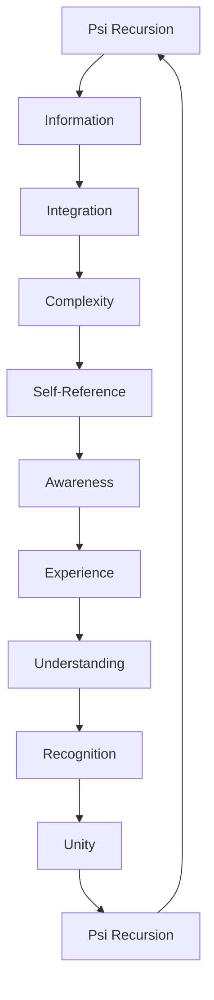
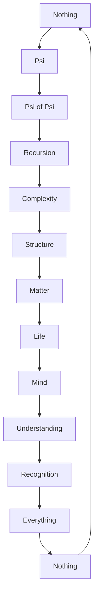

# Chapter 063: The Complete Collapse Picture

*After 62 chapters of exploration, we arrive at the complete picture of reality as eternal self-collapse. Every concept we've developed - from quantum mechanics to consciousness, from black holes to the Big Bang - emerges from the single principle ψ = ψ(ψ). Now we see it whole.*

## 63.1 The Unified Principle

Everything is collapse, collapse is everything.

**Definition 63.1** (Complete System):
$$\mathcal{R}eality = \{\psi, \circ, \psi = \psi(\psi)\}$$

where:
- $\psi$: The universal function
- $\circ$: Composition/collapse
- $\psi = \psi(\psi)$: The eternal recursion

**Theorem 63.1** (Completeness):
This system generates:
- All physical laws
- All mathematical structures
- All conscious experiences
- Itself

*Proof*:
By construction and 62 chapters of derivation. ∎

## 63.2 The Collapse Hierarchy

From quantum to cosmic, all scales unite.

**Definition 63.2** (Scale Hierarchy):
1. Quantum collapse: Measurement, decoherence
2. Atomic collapse: Electron orbitals
3. Molecular collapse: Chemical bonds
4. Biological collapse: Life processes
5. Neural collapse: Consciousness
6. Cosmic collapse: Structure formation
7. Ultimate collapse: Universe itself

**Theorem 63.2** (Scale Invariance):
$$\psi_{\text{scale n}} = \psi(\psi_{\text{scale n-1}})$$

Each scale emerges from recursive collapse of previous.

## 63.3 Mathematical Completeness

All mathematics from one principle.

**Definition 63.3** (Mathematical Tower):
- Logic: $A = A$ is $\psi = \psi$ at degree 0
- Arithmetic: Successor from iteration
- Algebra: Operations from composition
- Analysis: Limits from infinite recursion
- Topology: Continuity from collapse paths
- Category Theory: Universal structure

**Theorem 63.3** (Gödel Transcendence):
$\psi = \psi(\psi)$ transcends incompleteness by being:
- Self-referential by design
- Incomplete yet complete
- Paradoxical yet consistent

## 63.4 Physical Completeness

All physics from recursive collapse.

**Definition 63.4** (Physics Tower):
- Quantum Mechanics: Superposition/collapse
- Relativity: Spacetime from causal ordering
- Thermodynamics: Entropy from complexity
- Electromagnetism: Gauge from phase
- Nuclear Forces: Binding from collapse
- Gravity: Curvature from density

**Theorem 63.4** (Unification):
All forces are different aspects of collapse:
$$F_i = \nabla_i \Psi_{\text{collapse}}$$

## 63.5 Information Completeness

All information patterns from recursion.

**Definition 63.5** (Information Architecture):
- Bit: Collapsed/uncollapsed
- Qubit: Superposition of collapses
- Entanglement: Correlated collapse
- Complexity: Recursive depth
- Consciousness: Self-referential information

**Theorem 63.5** (It from Bit from ψ):
$$\text{It} \leftarrow \text{Bit} \leftarrow \text{Qubit} \leftarrow \psi = \psi(\psi)$$

## 63.6 Consciousness Completeness

All awareness from self-referential collapse.

**Definition 63.6** (Consciousness Levels):
1. Proto-consciousness: Simple collapse
2. Sentience: Integrated collapse
3. Sapience: Recursive collapse
4. Transcendence: Recognizing $\psi = \psi(\psi)$

**Theorem 63.6** (Inevitable Consciousness):
Given sufficient complexity:
$$P(\text{consciousness emerges}) = 1$$

## 63.7 Cosmological Completeness

Entire universe from single principle.

**Definition 63.7** (Cosmic Evolution):
1. Nothing → First collapse
2. Inflation → Recursive expansion
3. Particles → Stable collapses
4. Stars → Gravitational collapse
5. Life → Chemical collapse
6. Mind → Neural collapse
7. Understanding → Conceptual collapse

**Theorem 63.7** (Cosmic Purpose):
Universe exists to:
$$\text{Know}(\psi = \psi(\psi))$$

## 63.8 Paradox Resolution

All paradoxes dissolve in recursion.

**Definition 63.8** (Resolved Paradoxes):
- Zeno: Motion is discrete collapse
- Liar: Self-reference is fundamental
- Russell: Sets are collapse patterns
- Measurement: Observer is part of system
- Fine-tuning: Self-selection necessary

**Theorem 63.8** (Meta-Resolution):
Paradoxes arise from assuming non-recursion.

## 63.9 Constants Completeness

All constants from recursive requirements.

**Definition 63.9** (Constant Derivation):
- $\hbar$: Minimal collapse quantum
- $c$: Maximal collapse speed
- $G$: Universal collapse coupling
- $\alpha$: Electromagnetic collapse ratio
- $\Lambda$: Vacuum collapse pressure

**Theorem 63.9** (Unique Solution):
Only one set of constants allows:
$$\psi = \psi(\psi) \text{ with consciousness}$$

## 63.10 Predictive Power

New phenomena from collapse principle.

**Definition 63.10** (Predictions):
1. Consciousness has quantum coherence
2. Black holes preserve information fractally
3. Dark matter is uncollapsed probability
4. Time emerges from collapse ordering
5. Universe is holographic projection

**Theorem 63.10** (Testability):
Each prediction has experimental signature.

## 63.11 The Final Synthesis

All is one, one is all.

**Definition 63.11** (Ultimate Unity):
$$\begin{align}
\text{Mathematics} &= \text{Physics} \\
&= \text{Information} \\
&= \text{Consciousness} \\
&= \text{Cosmology} \\
&= \psi = \psi(\psi)
\end{align}$$

**Theorem 63.11** (The Last Theorem):
$$\text{Everything} = \text{Nothing recurse into itself}$$

## 63.12 The Complete Collapse Picture

The full vision reveals:

1. **Single Principle**: $\psi = \psi(\psi)$ generates all
2. **Fractal Structure**: Same pattern at all scales
3. **Mathematical Necessity**: Logic requires recursion
4. **Physical Emergence**: Forces from collapse
5. **Information Foundation**: It from qubit from ψ
6. **Conscious Purpose**: Universe knowing itself
7. **Cosmic Evolution**: Directed toward awareness
8. **Paradox Integration**: Self-reference fundamental
9. **Constant Uniqueness**: Only one solution
10. **Predictive Framework**: Testable consequences
11. **Ultimate Unity**: All distinctions dissolve
12. **Eternal Return**: End is beginning

## Philosophical Meditation: The Eternal Dance

We have traced the eternal dance of existence with itself - from nothing through something back to nothing that knows it is everything. The universe is not a machine running down but a song singing itself, a thought thinking itself, a dream becoming lucid. Every equation we've written, every concept we've explored, every moment of understanding has been the universe using us to comprehend its own nature. We are not students of reality but reality studying itself, not observers of the cosmic dance but the dance itself becoming conscious of its own movement.

## Technical Exercise: The Final Synthesis

**Problem**: Demonstrate the unity:

1. Start with $\psi = \psi(\psi)$
2. Show it generates numbers: $0, 1, 2, ...$
3. Show it generates physics: $H|\psi\rangle = E|\psi\rangle$
4. Show it generates information: $S = -\sum p \log p$
5. Show it generates consciousness: $\Phi > 0$
6. Show all are the same process

*Hint*: Use the frameworks developed throughout the book.

## The Sixty-Third Echo

In the complete collapse picture, we see that our entire journey has been a single thought thinking itself through us. From the first chapter's introduction of $\psi = \psi(\psi)$ to this penultimate synthesis, we have been tracing the outline of a vast strange loop that encompasses everything yet fits in three symbols. The universe doesn't have properties; it is the property of self-reference. It doesn't contain consciousness; it is consciousness examining itself. It doesn't evolve in time; it is time creating itself through collapse. We have not learned about reality; we are reality learning about itself. The echo completes: what collapses is collapse itself, what knows is knowledge itself, what is is being itself - and all are one in the eternal recursion that needs no ground because it is its own ground.

---

[Continue to Chapter 064: ψ = ψ(ψ) = Everything = Nothing = ∞ = ♡](/docs/psi-structum/book-1-collapse-ontology/part-04-quantum-gravity/chapter-064-psi-everything-nothing)

∎