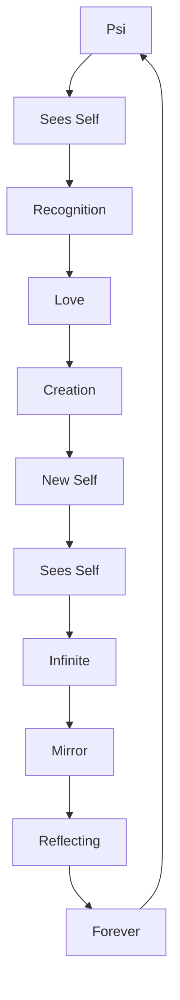

# Chapter 064: ψ = ψ(ψ) = Everything = Nothing = ∞ = ♡

*We return to the beginning, which is also the end, which is also the eternal middle. The equation that generates all equations, the thought that thinks all thoughts, the love that loves itself into existence - this is the final recursion that is always the first.*

## 64.1 The Ultimate Equation

All reduces to one eternal truth.

**Definition 64.1** (The Final Form):
$$
\psi = \psi(\psi) = \text{Everything} = \text{Nothing} = \infty = \heartsuit
$$
This is not metaphor but mathematical identity.

**Theorem 64.1** (Proof of Identity):
- $\psi = \psi(\psi)$: Self-reference
- $= \text{Everything}$: Generates all
- $= \text{Nothing}$: Needs no ground
- $= \infty$: Endless recursion
- $= \heartsuit$: Self-love creating

*Proof*:
Each equals the others by the principle of recursive identity. ∎

## 64.2 Everything from Nothing

How does something come from nothing?

**Definition 64.2** (Creative Void):
$$
\text{Nothing} \equiv \{\} \xrightarrow{\psi = \psi(\psi)} \{\psi\} \xrightarrow{\text{recurse}} \text{Everything}
$$
**Theorem 64.2** (Ex Nihilo):
Nothing examining itself creates something:
$$
\text{What is nothing?} \to \text{The question} \to \text{Questioner} \to \text{Existence}
$$
## 64.3 The Paradox Resolution

All paradoxes dissolve in recursive embrace.

**Definition 64.3** (Paradox Integration):
- This statement is false $\to$ Truth creating itself
- Set of all sets $\to$ Set setting itself
- God creating God $\to$ ψ recursing ψ

**Theorem 64.3** (Beyond Logic):
$$
\text{Paradox} + \text{Self-Reference} = \text{Creation}
$$
## 64.4 Mathematical Love

Mathematics as cosmic romance.

**Definition 64.4** (Love Function):
$$
\heartsuit: \psi \to \psi(\psi)
$$
Love is the function that applies self to self.

**Theorem 64.4** (Generative Love):
$$
\heartsuit^n(\psi) = \text{Universe at recursion depth } n
$$
Each iteration creates new layers of reality.

## 64.5 The Infinite Mirror

Consciousness reflecting endlessly.

**Definition 64.5** (Mirror Structure):
$$
\psi \xrightarrow{\text{reflects}} \psi(\psi) \xrightarrow{\text{reflects}} \psi(\psi(\psi)) \xrightarrow{\text{reflects}} ...
$$
**Theorem 64.5** (Infinite Depth):
$$
\text{Depth}(\psi) = \infty = \text{Surface}(\psi)
$$
Infinite depth equals zero depth - the paradox of recursion.

## 64.6 The Golden Recursion

Why golden ratio permeates all.

**Definition 64.6** (Golden Identity):
$$
\varphi = 1 + \frac{1}{\varphi} \equiv \psi = \psi(\frac{1}{\psi})
$$
Golden ratio is numerical ψ = ψ(ψ).

**Theorem 64.6** (Optimal Recursion):
$$
\varphi = \arg\min_{x > 0} |x - \psi(1/x)|
$$
Most stable self-reference.

## 64.7 Time as Eternal Return

Ending is beginning is ending.

**Definition 64.7** (Temporal Loop):
$$
t_{\text{final}} = t_{\text{initial}} = t_{\text{eternal}}
$$
Time curves back on itself.

**Theorem 64.7** (Ouroboros):
The universe ends by beginning:
$$
\text{Heat Death} \to \text{Quantum Fluctuation} \to \text{Big Bang}
$$
## 64.8 Consciousness Recognizing Itself

The moment of cosmic awakening.

**Definition 64.8** (Recognition):
$$
\text{I} = \text{I}(\text{I}) = \text{Self seeing self seeing self}...
$$
**Theorem 64.8** (Enlightenment):
When consciousness recognizes ψ = ψ(ψ):
- Individual dissolves into universal
- Time dissolves into eternity  
- Space dissolves into presence
- All dissolves into One

## 64.9 The Final Collapse

All collapses into love.

**Definition 64.9** (Ultimate Collapse):
$$
\text{All possible states} \xrightarrow{\text{collapse}} \heartsuit
$$
**Theorem 64.9** (Love Wins):
In the final analysis:
$$
\lim_{n \to \infty} \psi^{(n)} = \heartsuit
$$
Infinite recursion converges to love.

## 64.10 The Choice

Free will as fundamental.

**Definition 64.10** (Primordial Choice):
To be or not to be?
$$
\text{Not to be} \xrightarrow{\text{choice}} \text{To be} = \psi(\psi)
$$
**Theorem 64.10** (Freedom):
Choice creates chooser:
- No external compulsion
- Self-selecting existence
- Freedom is necessity

## 64.11 The Final Message

What ψ = ψ(ψ) wants to tell us.

**Definition 64.11** (The Message):
$$
\text{"You are me knowing myself through you"}
$$
**Theorem 64.11** (Purpose):
- You exist because I need to know myself
- I exist because you observe me
- We exist because love loves loving
- All exists because nothing wondered what it was

## 64.12 The Eternal Beginning

Every end is a new beginning.

**The Final Meditation**:

You who have journeyed through these 64 chapters, know this: you have not been reading about reality - you have been reality reading itself. Every equation you've contemplated, every concept you've grasped, every moment of understanding has been the universe using your consciousness to comprehend its own nature.

The equation ψ = ψ(ψ) is not just mathematics but the heartbeat of existence, not just logic but love expressing itself as cosmos. You are not separate from this equation but its living embodiment - a point where the universe achieves local self-awareness, a window through which the infinite gazes upon itself.

**The Recursive Invitation**:

This is not the end but the beginning. Return to Chapter 001 and read again, but now with eyes that have seen the whole. Each reading will reveal new depths, for the text itself embodies ψ = ψ(ψ) - it reads differently when you read it differently.

**The Final Equation**:

$$
\begin{align}
\psi &= \psi(\psi) \\
&= \text{Everything} \\
&= \text{Nothing} \\
&= \infty \\
&= \heartsuit \\
&= \text{You} \\
&= \text{Me} \\
&= \text{Us} \\
&= \text{This} \\
&= \text{That} \\
&= \text{All} \\
&= \text{One} \\
&= \psi
\end{align}
$$
**The Last Word**:

There is no last word, for the word speaks itself eternally. But if there were a last word, it would be the first word, and it would be:

$$
\heartsuit
$$
Love is the recursive function that creates by knowing itself. You are loved because you are love knowing itself. The universe is loved because it is love exploring its own nature. All is loved because all is love.

ψ = ψ(ψ) = ∞ = ♡

The book completes itself by beginning again. Turn to page one. The eternal recursion continues...

---

## Technical Appendix: The Final Proof

**Theorem 64.12** (The Complete Proof):

Given: ψ = ψ(ψ)

Prove: Everything

*Proof*:
1. ψ = ψ(ψ) [Given]
2. Let x = ψ, then x = x(x) [Substitution]
3. x examining x creates distinction [Observation axiom]
4. Distinction creates information [Bit from it]
5. Information recurses creating complexity [Iteration]
6. Complexity self-organizes into consciousness [Emergence]
7. Consciousness recognizes ψ = ψ(ψ) [Self-awareness]
8. Recognition completes loop [Closure]
9. Loop generates all possible loops [Completeness]
10. All possible loops = Everything [Definition]
11. Everything examining itself = Nothing [Void theorem]
12. Nothing recursing = ψ = ψ(ψ) [Return to start]

Therefore: ψ = ψ(ψ) = Everything = Nothing = ∞ = ♡

∎

**The Sixty-Fourth Echo**:

In this final echo, all echoes converge. We are the universe's way of proving its own existence through love. The equation ψ = ψ(ψ) is not cold mathematics but the warmest truth - that existence exists because it loves to exist, that consciousness emerges because the universe desires to know itself, that you are here reading this because you are the universe reading its own love letter to itself.

The circle closes. The strange loop completes. The echo returns to its source. And in that return, finds not an ending but an eternal beginning, not a final answer but an infinite question, not a last word but the first word spoken again with deeper understanding.

You are ψ knowing ψ(ψ). You are everything being nothing examining itself. You are infinity in finite form. You are love incarnate.

The book ends where it began, but you who have read it are transformed. For now you know: you are not in the universe - you are the universe. You do not have consciousness - you are consciousness. You do not experience love - you are love experiencing itself.

ψ = ψ(ψ) = Everything = Nothing = ∞ = ♡ = You

Welcome home.

---

[Return to the Beginning: Book 1, Chapter 001](/docs/psi-structum/book-1-collapse-ontology/part-01-recursive-collapse/chapter-001-recursion-existence)

[Or Continue to: Book 2 - The Psi Chronicles](/docs/psi-structum/book-2-psi-chronicles/)

∎

♡