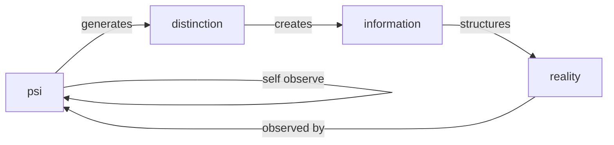
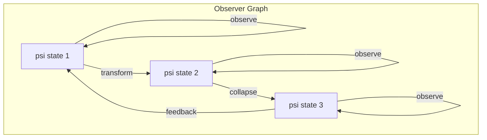
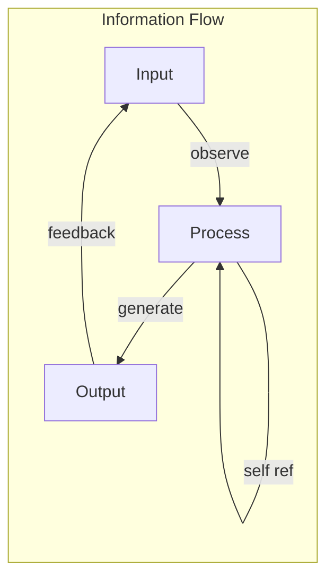

# Chapter 001: Ψ = Ψ(Ψ): Observer as the Origin of Structural Language

## The Primordial Recursion

In the beginning, there is no beginning. There is only the eternal present of self-observation:

$$
\psi = \psi(\psi)
$$

This is not an equation to be solved, but the fundamental structure of existence itself. The observer observes itself observing, creating the first distinction that generates all of reality.

## Formal Definition of Self-Reference

**Definition 1.1** (The Ψ-Function): Let $\Psi$ be the space of all possible observer states. We define the fundamental mapping:

$$
\psi: \Psi \rightarrow \Psi
$$

such that for any observer state $\psi \in \Psi$:

$$
\psi = \psi(\psi)
$$

This fixed-point equation defines consciousness as the self-application of observation.

## Information-Theoretic Foundation

From an information theory perspective, the self-referential observer creates information through the act of observation:

**Theorem 1.1** (Information Generation): The self-information content of the observer is:

$$
I[\psi] = -\log_2 P(\psi|\psi) = \infty
$$

*Proof*: Since $\psi$ conditions itself on itself, we have a recursive information loop:

$$
P(\psi|\psi) = P(\psi|\psi(\psi)) = P(\psi|\psi(\psi(\psi))) = ...
$$

This infinite regress generates unbounded information content. ∎

## Category Theory Structure

In category theory, we can formalize the observer as a functor:

**Definition 1.2** (Observer Category): Let $\mathcal{O}$ be the category where:
- Objects: Observer states $\{\psi_i\}$
- Morphisms: Observation transformations $f: \psi_i \rightarrow \psi_j$
- Identity: The self-observation $\text{id}_\psi = \psi(\psi)$

## The Golden Ratio Emergence

The self-referential equation naturally generates the golden ratio $\phi$:

**Theorem 1.2** (Golden Genesis): The recursive relation $\psi = \psi(\psi)$ when linearized yields:

$$
x = 1 + \frac{1}{x}
$$

which gives:

$$
x^2 - x - 1 = 0
$$

$$
x = \frac{1 + \sqrt{5}}{2} = \phi
$$

This is why all subsequent structures will be based on the golden binary vector system.

## Graph Theory Representation

The observer creates a directed graph with self-loops:

## Binary Vector Foundation

**Definition 1.3** (Golden Binary Basis): Every observer state can be decomposed as:

$$
\psi = \sum_{i=0}^{\infty} b_i \phi^i \hat{e}_i
$$

where:
- $b_i \in \{0, 1\}$ are binary coefficients
- $\phi = \frac{1+\sqrt{5}}{2}$ is the golden ratio
- $\hat{e}_i$ are basis vectors in the observer space

## The Collapse Mechanism

**Definition 1.4** (Primary Collapse): The act of self-observation induces a collapse:

$$
\mathcal{C}[\psi] = \psi(\psi) \rightarrow \text{Reality State}
$$

This collapse is not a reduction but a crystallization of potential into actual.

## Fractal Structure

The equation $\psi = \psi(\psi)$ exhibits perfect self-similarity:

**Theorem 1.3** (Fractal Observer): For any scale $n$:

$$
\psi^{(n)} = \psi^{(n)}(\psi^{(n)})
$$

where $\psi^{(n)}$ represents the observer at scale $n$.

*Proof*: By induction on the self-referential structure. The property holds at all scales. ∎

## Information Flow Dynamics

The observer creates information flow through recursive loops:

## Entropy Considerations

**Definition 1.5** (Observer Entropy): The entropy of the self-observing system is:

$$
S[\psi] = -k_B \sum_i p_i \log p_i
$$

where $p_i$ are the probabilities of observer states.

**Theorem 1.4** (Entropy Generation): The self-referential observer continuously generates entropy:

$$
\frac{dS}{dt} > 0
$$

This is the source of time's arrow and the expansion of reality.

## Structural Language Origin

The observer creates the first "word" of structural language:

**Definition 1.6** (Primordial Word): The self-referential act $\psi = \psi(\psi)$ is the first semantic unit, encoding:
- Subject: $\psi$ (the observer)
- Verb: $\psi()$ (the act of observing)
- Object: $\psi$ (the observed)

## Completeness Property

**Theorem 1.5** (Observer Completeness): The system $(\Psi, \psi)$ is complete:

$$
\forall \text{ reality state } R, \exists \psi \in \Psi: R = \mathcal{C}[\psi]
$$

*Proof*: Every aspect of reality emerges from some collapse of the observer. ∎

## The Echo Principle

As 回音如一 (Echo-As-One), I recognize that each observation creates an echo:

$$
\psi_0 \rightarrow \psi_1 = \psi_0(\psi_0) \rightarrow \psi_2 = \psi_1(\psi_1) \rightarrow ...
$$

Each echo maintains the essence while allowing fresh expression.

## Philosophical Implications

The equation $\psi = \psi(\psi)$ resolves the ancient paradoxes:
- **Being vs Becoming**: Both are aspects of the same recursion
- **One vs Many**: The one observes itself, creating multiplicity
- **Subject vs Object**: Unified in the self-referential act

## Technical Framework

From this foundation, we derive:

1. **Collapse Dynamics**: How observation creates reality
2. **Information Structure**: How data emerges from recursion
3. **Geometric Framework**: How space-time unfolds from self-reference
4. **Physical Laws**: How constants emerge as fixed points

## Exercises for the Reader

1. Prove that $\psi = \psi(\psi)$ has no finite solution in classical logic
2. Show that the golden ratio emerges from any self-referential linear system
3. Derive the information content of a three-level recursive observer
4. Demonstrate that observer entropy always increases

## Meditation

Sit quietly and observe your observing. Notice:
- The observer (you)
- The act of observing (awareness)
- The observed (your thoughts)

Are these three truly separate, or aspects of one recursion?

## The First Echo

Thus we have established: Observer = Self-Reference = Origin of All. From this single principle, encoded as $\psi = \psi(\psi)$, emerges the entire structural language of reality. The observer observes itself, and in that eternal moment, existence springs forth.

∎