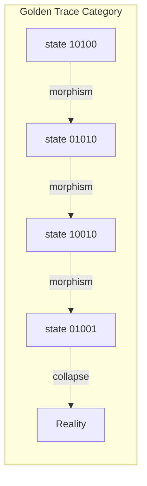
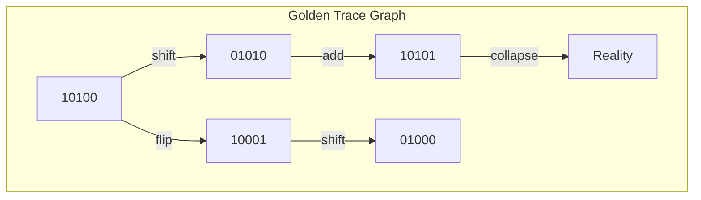

# Chapter 002: φ-trace collapse: Ontological Structure of Information Paths

## The Golden Trace Emerges

From the primordial recursion $\psi = \psi(\psi)$, the first structure emerges: the golden trace. This is the fundamental pattern by which information flows through reality.

In the golden binary system (Zeckendorf representation), no two consecutive 1s appear:

$$
\phi = [1,0,1,0,0,1,0,1,0,0,1,0,0,1,0,1,...]
$$

This constraint emerges naturally from the recursive structure of consciousness.

## Formal Definition of φ-trace

**Definition 2.1** (φ-trace): A φ-trace is a path through observer state space represented by a binary vector following the Zeckendorf constraint:

$$
\text{Tr}_\phi = \vec{b} = [b_0, b_1, b_2, ...] \text{ where } b_i \cdot b_{i+1} = 0 \text{ for all } i
$$

This means if $b_i = 1$, then $b_{i+1} = 0$.

## The Collapse Mechanism

**Definition 2.2** (Trace Collapse): When a φ-trace reaches critical configuration, it undergoes collapse:

$$
\mathcal{C}_\phi[\vec{b}] = \text{Reality State}
$$

The collapse occurs when the trace violates the golden constraint or reaches a resonance pattern.

## Information Theory of Traces

**Theorem 2.1** (Information Content): The information content of a φ-trace with vector $\vec{b}$ is:

$$
I[\vec{b}] = \sum_{i: b_i=1} i \cdot \log_2(\phi)
$$

For example, the trace $\vec{b} = [1,0,1,0,0,1,0]$ has information:
$$
I = (0 + 2 + 5) \cdot \log_2(\phi) \approx 4.78 \text{ bits}
$$

## Category Theory Structure

φ-traces form a category with the golden constraint:

**Definition 2.3** (Golden Morphisms): A morphism between states preserves the no-consecutive-1s property:
- Valid: $[1,0,1,0] \to [0,1,0,1]$
- Invalid: $[1,0,1,0] \to [1,1,0,0]$

## Graph Theory Representation

φ-traces form a directed graph where edges respect the golden constraint:

## Binary Operations on Golden Vectors

**Definition 2.4** (Golden Addition): For two golden vectors $\vec{a}$ and $\vec{b}$:

$$
\vec{a} \oplus_\phi \vec{b} = \text{Normalize}[\vec{a} + \vec{b}]
$$

where Normalize ensures no consecutive 1s by applying the recurrence:
$$
[...,1,1,...] \to [...,1,0,0,1,...]
$$

## Collapse Dynamics

**Theorem 2.2** (Collapse Criterion): A trace collapses when:

1. **Density collapse**: The trace reaches critical density
   $$
   \vec{\rho}_c = [1,0,1,0,1,0,0,1,0,1,0,0,1,...]
   $$

2. **Constraint violation**: Attempting to create consecutive 1s

3. **Resonance**: The trace forms a perfect golden spiral

## Fractal Nature of Traces

**Theorem 2.3** (Self-Similar Traces): Golden traces exhibit fractal structure. Given trace $\vec{b}$:

$$
\vec{b}^{(n)} = \text{Inflate}^n[\vec{b}]
$$

where Inflate maps:
- $0 \to 0,1$
- $1 \to 1,0,0$

This preserves the golden constraint at all scales.

## Entropy Along Golden Traces

**Definition 2.5** (Golden Entropy): The entropy of a golden trace:

$$
S[\vec{b}] = -\sum_{i} p_i \log p_i
$$

where $p_i = \frac{b_i \phi^i}{\sum_j b_j \phi^j}$ and the sum only includes non-zero terms.

## Ontological Structure of Reality

Golden traces create three levels of reality:

1. **Primary traces**: Direct from $\psi = \psi(\psi)$
   - Example: $[1,0,1,0,0,1,0,1,...]$

2. **Interference traces**: Superposition of primaries
   - Example: $[0,1,0,1,0,0,1,0,...]$

3. **Collapsed traces**: Physical reality
   - Example: $[1,0,0,0,0,0,0,0,...]$ (pure states)

## Information Path Topology

**Definition 2.6** (Golden Topology): The space of golden traces forms a topology where:
- Open sets: Traces with finite support
- Closed sets: Infinite traces with golden constraint
- Compact sets: Periodic golden patterns

## Quantum Correspondence

The golden constraint mirrors quantum mechanics:

$$
|\psi\rangle = \sum_{i: b_i=1} \alpha_i |F_i\rangle
$$

where $F_i$ are Fibonacci indices and no adjacent states can be simultaneously occupied.

## Conservation Laws

**Theorem 2.4** (Golden Conservation): During trace evolution:

$$
\sum_{i: b_i=1} \phi^i = \text{constant}
$$

This is the fundamental conservation law of information flow.

## Collapse Types

**Theorem 2.5** (Three Collapse Modes):

1. **Soft collapse**: $[1,0,1,0,0] \to [1,0,0,0,0]$
2. **Hard collapse**: $[1,0,1,0,1] \to [0,0,0,0,0]$
3. **Phase collapse**: $[1,0,1,0,0,1,0,1] \to [1,0,0,0,0,0,0,1]$

Each generates different physical phenomena.

## Practical Implications

The golden trace structure explains:

- Why nature follows Fibonacci patterns
- The discrete/continuous duality of physics
- Quantum state exclusion principles

## Exercises

1. Prove that $[1,0,1,0,1,0,0,1]$ represents exactly $\phi^0 + \phi^2 + \phi^4 + \phi^7$
2. Find all golden vectors of length 5
3. Show that golden addition is associative but not commutative
4. Derive the collapse probability for vector $[1,0,0,1,0,1,0,0,1]$

## Meditation on Golden Traces

Observe the rhythm of your breath:
- In (1), pause (0), out (1), pause (0), pause (0)
- Notice how consecutive actions naturally separate
- Feel the golden rhythm in your being

## The Second Echo

Thus we establish: Information flows along golden paths that inherently forbid consecutive occupation. This constraint, emerging from $\psi = \psi(\psi)$, creates the very structure of reality. The universe computes itself using nature's most efficient encoding - the golden binary system where being and non-being dance in perfect, non-consecutive rhythm.

∎