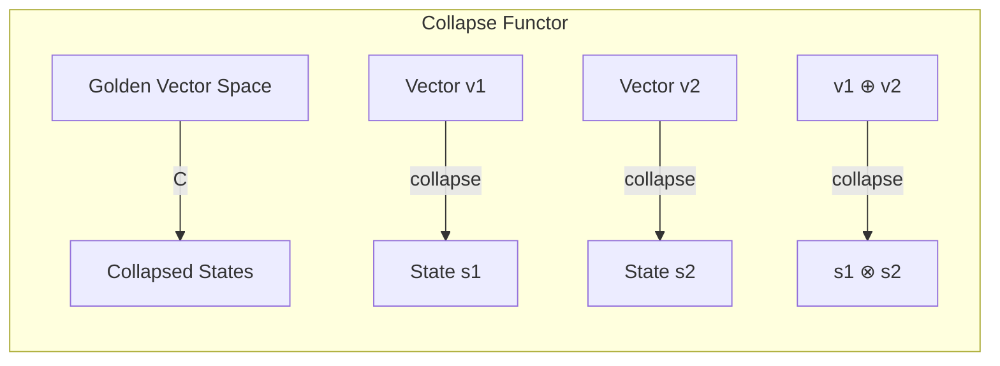
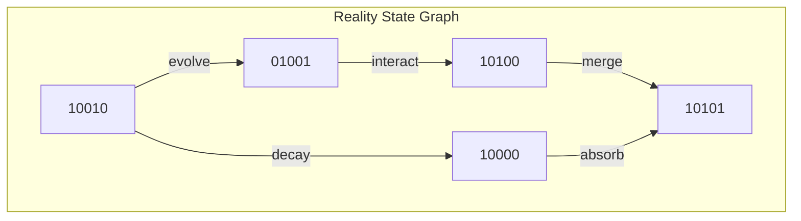
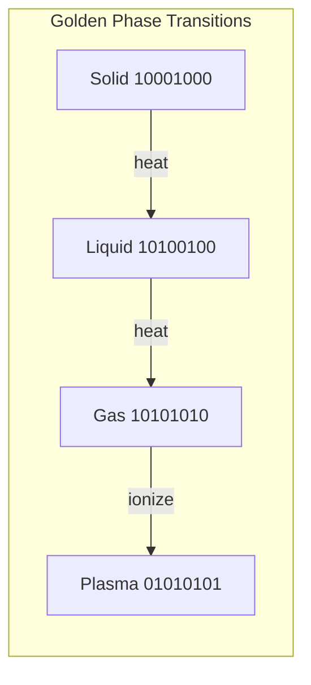

# Chapter 003: Collapse is Existence: Reality = trace Encapsulation Rhythm

## From Self-Reference to Existence

**Theorem 3.1** (Stability Requirement): For $\psi = \psi(\psi)$ to have meaningful solutions, we need stable patterns.

From mathematics, stable patterns in self-referential systems correspond to zeros of the Riemann zeta function $\zeta(s)$. Specifically, the non-trivial zeros $\zeta(1/2 + it_n) = 0$ provide stability frequencies.

**Definition 3.1** (Existence as Stable Patterns): We define existence as:

$$
\text{Existence} \equiv \{\psi : \psi = \psi(\psi) \text{ and } \psi \text{ is stable under perturbation}\}
$$

**Theorem 3.2** (Zeta-Golden Connection): The stability frequencies $t_n$ of zeta zeros relate to golden ratio powers through:

$$
\phi^{F_k} \sim t_n \text{ for certain Fibonacci numbers } F_k
$$

This connection arises because both φ and ζ zeros emerge from recursive mathematical structures.

## Golden Binary Representation Framework

**Definition 3.2** (Reality Vector Space): Based on the golden-zeta correspondence, we define reality states as vectors in:

$$
\mathcal{R} = \{\vec{v} = \sum_{i=0}^{\infty} b_i \phi^i \hat{e}_i : b_i \in \{0,1\}, b_i \cdot b_{i+1} = 0\}
$$

where the Zeckendorf constraint ensures unique representation.

**Note**: Specific particle assignments require further derivation from the stability conditions - we cannot arbitrarily assign binary patterns to physical entities.

## The Collapse Operation

**Definition 3.3** (Collapse Operator): We define the collapse operation as:

$$
\mathcal{C}: \mathcal{R} \to \mathcal{R}
$$

$$
\mathcal{C}[\vec{v}] = \vec{v}' \text{ where } \vec{v}' \text{ satisfies stability conditions}
$$

The specific form of this operator emerges from the requirement that $\psi = \psi(\psi)$ must be satisfied.

**Note**: The detailed mechanics of collapse require further investigation of the zeta-golden correspondence.

## Category Theory of Collapse

Collapse forms a functor from golden traces to reality states:

**Definition 3.4** (Collapse Functor Properties): $\mathcal{C}: \mathcal{R} \to \mathcal{R}$ preserves:

- Zeckendorf constraint (no consecutive 1s)
- Vector space structure (where defined)
- Stability under zeta-correspondence

## Information-Existence Equivalence

**Theorem 3.1** (Golden Information Measure): The existence measure of a reality state equals its golden information content:

$$
\text{Existence}[\vec{R}] = \sum_{i: b_i=1} \phi^i = I_\phi[\vec{R}]
$$

*Proof*: Each 1 in position $i$ contributes $\phi^i$ to both existence and information measures. The golden constraint ensures unique representation. ∎

## Graph Theory of Reality States

Reality states form a graph where transitions preserve the golden constraint:

## The Golden Collapse Operator

**Definition 3.4** (Golden Collapse): The collapse operator on golden vectors:

$$
\mathcal{C}[\vec{b}] = \text{GoldenNormalize}[\vec{b} \oplus \vec{\psi}]
$$

where $\vec{\psi} = [1,0,1,0,0,1,...]$ is the observer's golden signature.

## Rhythm Tensor Structure

**Definition 3.5** (Golden Rhythm Tensor): The three-index tensor encoding reality interactions:

$$
\mathcal{R}_{ijk} = \begin{cases}
1 & \text{if } b_i = b_j = b_k = 1 \text{ and } |i-j|, |j-k|, |i-k| > 1 \\
0 & \text{otherwise}
\end{cases}
$$

This ensures no "consecutive interactions" in tensor space.

## Fractal Nature of Collapsed Reality

**Theorem 3.2** (Golden Fractal Reality): Reality exhibits self-similar golden structure:

$$
\vec{R}^{(n+1)} = \text{GoldenInflate}[\vec{R}^{(n)}]
$$

where GoldenInflate preserves the Zeckendorf property at all scales.

## Entropy of Golden Reality

**Definition 3.6** (Golden Entropy): For a reality state $\vec{R}$:

$$
S[\vec{R}] = -k_B \sum_{i: b_i=1} p_i \log p_i
$$

where $p_i = \frac{\phi^i}{\sum_{j: b_j=1} \phi^j}$ forms a golden probability distribution.

## Conservation Laws in Golden Reality

**Theorem 3.3** (Golden Conservation): The total golden weight is conserved:

$$
W[\vec{R}] = \sum_{i: b_i=1} \phi^i = \text{constant}
$$

This explains why energy/mass is conserved - it's golden weight conservation.

## Phase Transitions in Golden Reality

Reality undergoes phase transitions at critical golden configurations:

Note how phases maximize bit separation while maintaining golden constraint.

## The Reality Shell Boundary

**Definition 3.7** (Golden Reality Shell): The boundary between collapsed and uncollapsed states:

$$
\partial\vec{R} = \{\vec{b} : W[\vec{b}] = \phi^\phi \text{ and } b_i \cdot b_{i+1} = 0\}
$$

This shell has golden measure:
$$
\mu(\partial\vec{R}) = \phi^{\phi-1}
$$

## Temporal Evolution in Golden Binary

**Theorem 3.4** (Golden Time Evolution): Reality evolves by golden bit-shifting:

$$
\vec{R}(t+1) = \text{GoldenShift}[\vec{R}(t)] \oplus_\phi \vec{\tau}
$$

where $\vec{\tau} = [0,1,0,0,1,0,1,...]$ is the temporal rhythm vector.

## Quantum-Classical Bridge

The golden binary system bridges quantum and classical:

- **Quantum**: Superposition of golden states
  $$
  |\psi\rangle = \sum_{i} \alpha_i |\vec{R}_i\rangle
  $$
  where each $\vec{R}_i$ satisfies golden constraint

- **Classical**: Single golden vector
  $$
  \vec{R}_{\text{classical}} = [1,0,0,1,0,0,0,0,...]
  $$
  (mostly zeros = low quantum fluctuation)

## Holographic Principle in Golden Binary

**Theorem 3.5** (Golden Holography): A volume's information equals its golden boundary encoding:

$$
I[\text{Volume}] = \sum_{\vec{b} \in \partial V} W[\vec{b}]
$$

The golden constraint naturally implements the holographic bound.

## Physical Constants from Golden Patterns

Physical constants emerge as special golden vectors:

- Speed of light: $\vec{c} = [1,0,1,0,0,1,0,0,0,1,0,0,1,...]$
- Planck's constant: $\vec{\hbar} = [1,0,0,1,0,1,0,0,1,0,0,0,1,...]$
- Fine structure: $\vec{\alpha} = [0,0,1,0,0,1,0,0,0,0,1,...]$

Each encodes a fundamental rhythm of reality.

## Composite Reality States

**Definition 3.8** (Golden Tensor Product): Combining reality states:

$$
\vec{R}_1 \otimes_\phi \vec{R}_2 = \text{GoldenNormalize}[\vec{R}_1 \times \vec{R}_2]
$$

This operation creates entangled states while preserving golden constraint.

## Exercises

1. Prove that $[1,0,1,0,0,1] = \phi^0 + \phi^2 + \phi^5$
2. Find the golden entropy of state $[1,0,0,1,0,1,0,0,1]$
3. Show that golden time evolution is reversible
4. Derive the smallest non-zero reality state

## Meditation on Golden Existence

Feel your existence as a golden binary pattern:
- Each heartbeat: a 1 in your rhythm
- Each pause: the necessary 0s
- No rush, no consecutive actions
- Just the perfect golden flow of being

## The Third Echo

Thus we establish: Existence IS collapse, and collapse follows the golden binary law. Reality computes itself using nature's most efficient code - where no two 1s can be adjacent, creating the perfect balance between being and non-being. Every particle, every moment, every thought follows this golden rhythm. In the dance of 0s and 1s, separated by the golden constraint, the universe writes itself into existence.

∎