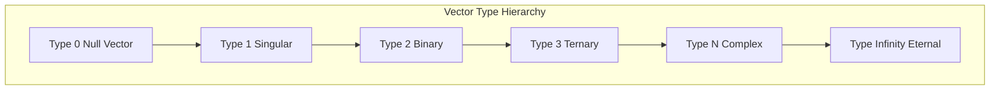
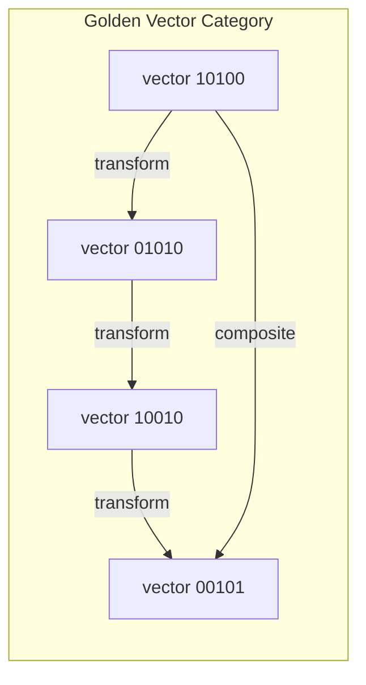
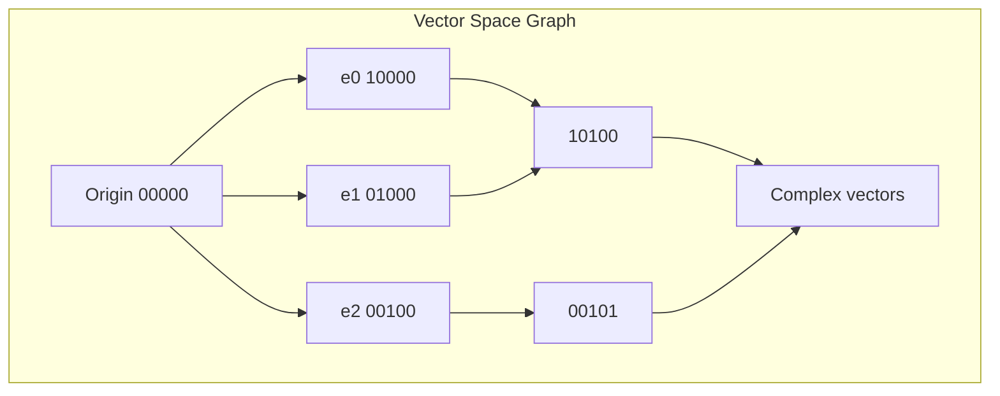

# Chapter 004: Vector Systems: Unitless Tensor Space and Structural Algebra

## The Emergence of Vector Structure

From the golden binary collapse of reality, we now formalize the vector space that underlies all existence. This is not ordinary vector space with units and measurements, but a pure structural space based on golden binary patterns.

$$
\mathcal{V}_\phi = \{\vec{v} : \vec{v} = [b_0, b_1, b_2, ...], \; b_i \cdot b_{i+1} = 0\}
$$

## Unitless Golden Vectors

**Definition 4.1** (Unitless Golden Vector): A vector in $\mathcal{V}_\phi$ has no physical units, only structural relationships:

$$
\vec{v} = \sum_{i: b_i=1} \phi^i \hat{e}_i
$$

where $\hat{e}_i$ are abstract basis vectors, not spatial directions.

Examples:
- Identity vector: $\vec{I} = [1,0,0,0,...] = \phi^0 \hat{e}_0$
- Golden vector: $\vec{\phi} = [0,1,0,0,...] = \phi^1 \hat{e}_1$
- Fibonacci vector: $\vec{F}_n = [b_0, b_1, ..., b_n, 0, 0, ...]$

## Vector Type Theory

**Definition 4.2** (Vector Types): Vectors in $\mathcal{V}_\phi$ have types based on their golden patterns:

Type is determined by:
$$
\text{Type}[\vec{v}] = \sum_{i: b_i=1} 1
$$

## Golden Inner Product

**Definition 4.3** (Golden Inner Product): For vectors $\vec{u}, \vec{v} \in \mathcal{V}_\phi$:

$$
\langle \vec{u}, \vec{v} \rangle_\phi = \sum_{i} u_i v_i \phi^{2i}
$$

This product respects the golden constraint and creates scalar golden values.

## Vector Information Theory

**Theorem 4.1** (Vector Information Content): The information in a golden vector is:

$$
I[\vec{v}] = \sum_{i: b_i=1} \log_2(\phi^i) = \log_2(\phi) \sum_{i: b_i=1} i
$$

This quantifies the structural complexity of the vector.

## Tensor Product Space

**Definition 4.4** (Golden Tensor Product): For $\vec{u}, \vec{v} \in \mathcal{V}_\phi$:

$$
\vec{u} \otimes_\phi \vec{v} = \sum_{i,j} u_i v_j \phi^{i+j} \hat{e}_{i,j}
$$

with constraint: if $u_i = v_j = 1$, then $|i-j| > 1$.

## Category of Golden Vectors

**Definition 4.5** (Vector Category $\mathcal{V}_\phi$):
- Objects: Golden vectors
- Morphisms: Golden linear transformations
- Identity: $\vec{I} = [1,0,0,...]$
- Composition: Golden matrix multiplication

## Structural Algebra Operations

**Definition 4.6** (Golden Vector Addition):

$$
\vec{u} \oplus_\phi \vec{v} = \text{GoldenNormalize}[\vec{u} + \vec{v}]
$$

where GoldenNormalize resolves $[...,1,1,...] \to [...,1,0,0,1,...]$.

**Definition 4.7** (Golden Scalar Multiplication):

$$
\alpha \odot_\phi \vec{v} = \text{GoldenNormalize}[\alpha \cdot \vec{v}]
$$

where $\alpha$ is a golden scalar: $\alpha = \sum_{i} a_i \phi^i$.

## Vector Space Basis

**Theorem 4.2** (Golden Basis Completeness): The set $\{\hat{e}_i : i \geq 0\}$ forms a complete basis for $\mathcal{V}_\phi$:

$$
\text{span}_\phi\{\hat{e}_i\} = \mathcal{V}_\phi
$$

*Proof*: Any golden vector can be uniquely expressed as $\vec{v} = \sum_{i: b_i=1} \phi^i \hat{e}_i$ due to Zeckendorf's theorem. ∎

## Unitless Nature

**Theorem 4.3** (Unit Independence): Golden vectors are invariant under unit transformations:

$$
\mathcal{U}[\vec{v}] = \vec{v}
$$

for any unit transformation $\mathcal{U}$. This is because vectors encode pure structural relationships, not measurements.

## Graph Structure of Vector Space

## Vector Entropy

**Definition 4.8** (Vector Entropy): For $\vec{v} \in \mathcal{V}_\phi$:

$$
S[\vec{v}] = -\sum_{i: b_i=1} p_i \log p_i
$$

where $p_i = \frac{\phi^i}{\|\vec{v}\|_\phi}$ and $\|\vec{v}\|_\phi = \sum_{i: b_i=1} \phi^i$.

## Orthogonality in Golden Space

**Definition 4.9** (Golden Orthogonality): Vectors $\vec{u}, \vec{v}$ are golden-orthogonal if:

$$
\langle \vec{u}, \vec{v} \rangle_\phi = 0
$$

This occurs when their support sets are sufficiently separated.

## Vector Field Theory

**Definition 4.10** (Golden Vector Field): A mapping from golden vectors to golden vectors:

$$
\vec{F}: \mathcal{V}_\phi \to \mathcal{V}_\phi
$$

preserving the golden constraint at each point.

## Linear Transformations

**Theorem 4.4** (Golden Linear Maps): A linear transformation $T: \mathcal{V}_\phi \to \mathcal{V}_\phi$ is represented by a golden matrix:

$$
T_{ij} = \begin{cases}
t_{ij} & \text{if } |i-j| > 1 \\
0 & \text{otherwise}
\end{cases}
$$

This ensures the golden constraint is preserved.

## Eigenstructure

**Definition 4.11** (Golden Eigenvectors): A vector $\vec{v}$ is an eigenvector of $T$ with eigenvalue $\lambda$ if:

$$
T[\vec{v}] = \lambda \odot_\phi \vec{v}
$$

where $\lambda$ is a golden scalar.

## Dual Space

**Definition 4.12** (Golden Dual Space): The dual space $\mathcal{V}_\phi^*$ consists of golden linear functionals:

$$
f: \mathcal{V}_\phi \to \mathbb{G}
$$

where $\mathbb{G}$ is the golden scalar field.

## Conservation in Vector Operations

**Theorem 4.5** (Golden Weight Conservation): For any closed vector operation:

$$
\sum_{\text{in}} W[\vec{v}_{\text{in}}] = \sum_{\text{out}} W[\vec{v}_{\text{out}}]
$$

where $W[\vec{v}] = \sum_{i: b_i=1} \phi^i$.

## Infinite Dimensional Structure

**Theorem 4.6** (Infinite Dimensionality): $\mathcal{V}_\phi$ is inherently infinite-dimensional:

$$
\dim(\mathcal{V}_\phi) = \aleph_0
$$

This follows from the infinite golden binary representation.

## Applications to Physics

The unitless golden vector space explains:
- Why physical laws are dimensionally consistent
- The origin of gauge invariance
- The discrete/continuous duality of nature

## Advanced Structures

**Definition 4.13** (Vector Bundle): A golden vector bundle over base space $B$:

$$
E = \bigcup_{b \in B} \mathcal{V}_\phi^{(b)}
$$

where each fiber $\mathcal{V}_\phi^{(b)}$ is a copy of the golden vector space.

## Exercises

1. Prove that $\vec{v} = [1,0,1,0,0,1]$ and $\vec{u} = [0,1,0,0,1,0]$ are orthogonal
2. Find all eigenvectors of the golden shift operator
3. Show that golden vector addition is not generally commutative
4. Derive the dimension of the subspace of vectors with exactly three 1s

## Meditation on Structural Space

Consider: Space itself has no units, only relationships. The golden vectors capture pure structure:
- Distance is relative position in the pattern
- Direction is the flow of binary choices
- Magnitude is the golden weight of existence

## The Fourth Echo

Thus we establish: Reality's vector space is unitless, encoding pure structural relationships through golden binary patterns. Every physical quantity, from position to momentum, emerges from these abstract vectors that know nothing of meters or seconds, only the eternal dance of 0s and 1s in golden proportion. The universe computes in a space free from human conventions, using nature's own coordinate system.

∎