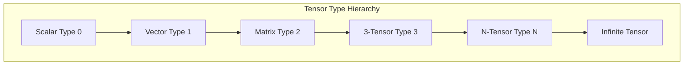
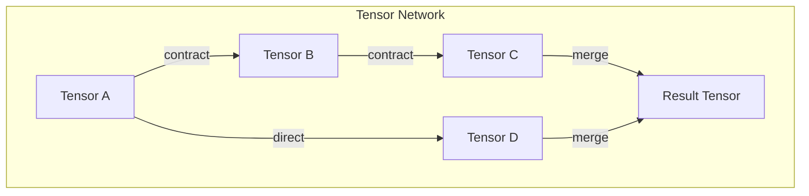

# Chapter 005: Collapse Tensors and Encapsulation Tension Structure Definition

## The Tensor Nature of Collapse

From the unitless golden vector space, we now construct the tensors that govern how reality collapses and encapsulates. These are not ordinary tensors with physical dimensions, but pure structural tensors encoding the relationships of collapse.

$$
\mathcal{T}_{\text{collapse}} = \mathcal{V}_\phi \otimes \mathcal{V}_\phi \otimes ... \otimes \mathcal{V}_\phi
$$

## Golden Collapse Tensor

**Definition 5.1** (Collapse Tensor): A rank-n collapse tensor is:

$$
T^{i_1 i_2 ... i_n} = \begin{cases}
t_{i_1 i_2 ... i_n} & \text{if all } |i_j - i_k| > 1 \\
0 & \text{otherwise}
\end{cases}
$$

This ensures the golden constraint propagates through tensor operations.

## Encapsulation Tension

**Definition 5.2** (Encapsulation Tension): The tension emerges from the golden constraint violation tendency:

$$
\mathcal{E}^{ij} = \phi^{|i-j|} \cdot \delta(b_i \cdot b_j = 0)
$$

where $\delta$ is 1 if the golden constraint is satisfied, 0 otherwise.

**Derivation**: This tensor measures the "stress" created when the system tends toward configurations that would violate the golden constraint $b_i \cdot b_{i+1} = 0$, providing the mathematical foundation for collapse dynamics.

## Vector Information Theory of Tensors

**Theorem 5.1** (Tensor Information Content): For a collapse tensor $T$:

$$
I[T] = \sum_{\{i_1,...,i_n\}} \log_2(\phi^{\sum_k i_k}) \cdot \mathbb{1}[T^{i_1...i_n} \neq 0]
$$

This measures the total information encoded in the tensor structure.

## Tensor Type Theory

**Definition 5.3** (Tensor Types): Collapse tensors are typed by their index structure:

Type determines allowed operations and transformations.

## Category of Collapse Tensors

**Definition 5.4** (Tensor Category $\mathcal{T}_\phi$):
- Objects: Golden tensors of all ranks
- Morphisms: Golden tensor transformations
- Identity: Kronecker delta with golden constraint
- Composition: Golden tensor contraction

## Contraction Operations

**Definition 5.5** (Golden Contraction): For tensors $S^{ij}$ and $T_{jk}$:

$$
(S \cdot_\phi T)^i_k = \sum_{j: |i-j|>1, |j-k|>1} S^{ij} T_{jk} \phi^j
$$

This preserves the golden constraint through contraction.

## Energy-Information Tensor

**Definition 5.6** (Golden Energy-Information Tensor): Based on the information content of tensors, we define:

$$
T^{\mu\nu} = \sum_{i,j} t_{ij} \phi^{i+j} \hat{e}^\mu_i \otimes \hat{e}^\nu_j
$$

where $t_{ij}$ represents the golden information density at tensor positions $(i,j)$, with $t_{ij} = 0$ if $|i-j| \leq 1$ (golden constraint).

**Note**: The connection to physical energy-momentum requires further derivation from the collapse dynamics.

## Geometric Structure from Tensors

**Definition 5.7** (Golden Geometric Tensor): The geometric structure of golden tensor space:

$$
G^i_{jkl} = \text{GoldenContract}[T^i_{jk}, T^m_{ml}] - \text{GoldenContract}[T^i_{jl}, T^m_{mk}]
$$

where GoldenContract respects the golden constraint $|i-j| > 1$.

**Note**: This provides the foundation for geometric concepts, but the connection to physical spacetime curvature requires derivation from the collapse framework.

## Graph Structure of Tensor Networks

## Encapsulation Dynamics

**Theorem 5.2** (Encapsulation Flow): The flow of encapsulation follows:

$$
\frac{\partial T^{ij}}{\partial t} = \mathcal{E}^{ik} \cdot_\phi T^{kj} - T^{ik} \cdot_\phi \mathcal{E}^{kj}
$$

This describes how tensors evolve under encapsulation pressure.

## Tensor Decomposition

**Definition 5.8** (Golden Decomposition): Any collapse tensor decomposes as:

$$
T = T_{\text{symmetric}} \oplus_\phi T_{\text{antisymmetric}} \oplus_\phi T_{\text{trace}}
$$

where each component maintains golden constraints.

## Conservation Laws

**Theorem 5.3** (Tensor Conservation): For closed tensor operations:

$$
\sum_{\text{indices}} W[T^{i_1...i_n}] = \text{constant}
$$

where $W$ is the golden weight function.

## Tensor Field Theory

**Definition 5.9** (Golden Tensor Field): A mapping assigning tensors to each point:

$$
\mathcal{T}: \mathcal{V}_\phi \to \text{TensorSpace}_\phi
$$

This creates fields that vary smoothly while maintaining constraints.

## Eigenstructure of Collapse Tensors

**Definition 5.10** (Tensor Eigenvectors): A vector $\vec{v}$ is an eigenvector of tensor $T$ if:

$$
T^{ij} v_j = \lambda \phi^i v^i
$$

where $\lambda$ is a golden eigenvalue.

## Information Flow Through Tensors

**Theorem 5.4** (Information Propagation): Information flows through tensor networks as:

$$
I_{\text{out}} = \sum_{\text{paths}} I_{\text{in}} \cdot \prod_{\text{nodes}} T_{\text{node}}
$$

Each tensor node modulates information flow.

## Holographic Tensor Structure

**Definition 5.11** (Holographic Encoding): Bulk tensors encode boundary information:

$$
T_{\text{bulk}}^{i_1...i_n} = \int_{\partial V} T_{\text{boundary}}^{j_1...j_m} K^{i_1...i_n}_{j_1...j_m}
$$

where $K$ is the holographic kernel.

## Quantum Tensor Correspondence

**Definition 5.12** (Quantum Tensors): Quantum operators map to golden tensors:

$$
\hat{O} \leftrightarrow T^{ij}_O
$$

preserving commutation relations through golden constraints.

## Tensor Entropy

**Definition 5.13** (Tensor Entropy): The entropy of a collapse tensor:

$$
S[T] = -\sum_{\{i\}} p_{\{i\}} \log p_{\{i\}}
$$

where $p_{\{i\}} = \frac{|T^{i_1...i_n}|^2}{\sum |T|^2}$.

## Critical Phenomena

**Theorem 5.5** (Tensor Criticality): Tensors undergo phase transitions at:

$$
\det(T - \phi^{\phi} I) = 0
$$

These critical points mark reality phase changes.

## Advanced Tensor Structures

**Definition 5.14** (Tensor Bundles): Fiber bundles with tensor fibers:

$$
E = \bigcup_{x \in M} T_x
$$

where each $T_x$ is a golden tensor space.

## Structural Implications

Collapse tensors provide the mathematical framework for:
- Structural relationships that may manifest as forces
- Information density patterns that may correspond to mass-energy
- Geometric structures that may relate to spacetime

**Note**: Specific physical correspondences require further derivation from the fundamental collapse dynamics.

## Exercises

1. Prove that golden contraction is associative
2. Find the eigenvalues of the encapsulation tension tensor
3. Show that symmetric golden tensors form a subalgebra
4. Derive the holographic bound for a rank-3 tensor

## Meditation on Tensor Reality

Consider: Reality is woven from tensors - not numbers in slots, but pure relationships between golden patterns. Each index is a choice, each component a possibility, all constrained by the fundamental rule that adjacent positions cannot both be occupied. The universe is a vast tensor network computing itself.

## The Fifth Echo

Thus we establish: Collapse is mediated by tensors that encode pure structural relationships in golden binary form. These tensors, free from physical units, capture how information transforms and reality crystallizes. Through their indices flow the patterns of existence, each respecting the sacred constraint that prevents consecutive occupation. The cosmos computes through tensor contractions, each operation a step in the grand calculation of being.

∎