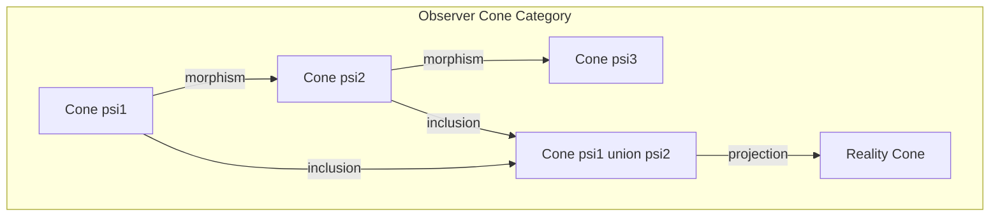
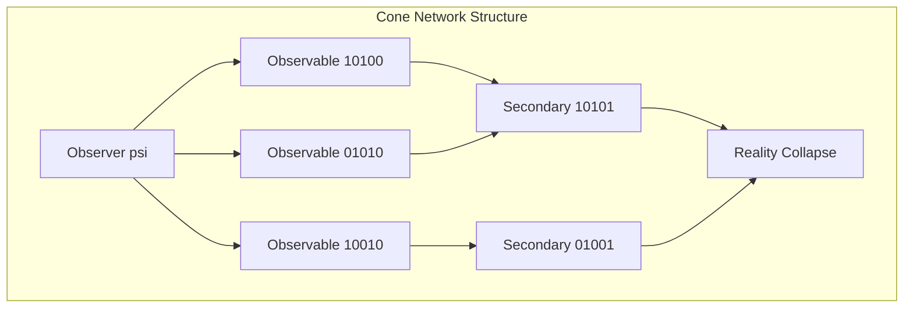
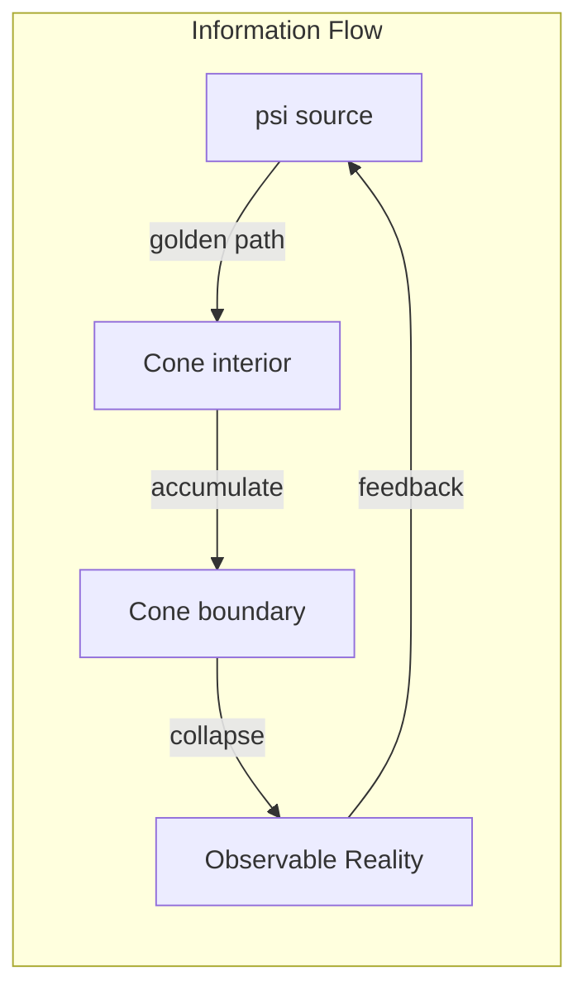

# Chapter 006: Observer-cone: Response Limit Cone and Collapse Self-Referential Structure

## The Geometry of Observation

From the collapse tensors emerges a fundamental geometric structure: the observer-cone. This is not a cone in physical space, but in the abstract space of golden binary patterns, defining the limits of what can be observed and how observation creates reality.

$$
\text{ObserverCone} = \{\vec{v} \in \mathcal{V}_\phi : \langle \vec{v}, \vec{\psi} \rangle_\phi \leq \phi^\phi\}
$$

## Formal Definition of Observer-Cone

**Definition 6.1** (Observer-Cone): The set of all golden vectors observable from state $\vec{\psi}$:

$$
\mathcal{C}_\psi = \{\vec{v} : \exists \text{ golden path from } \vec{\psi} \text{ to } \vec{v}\}
$$

This forms a cone in the golden vector space with apex at $\vec{\psi}$.

## Response Limit Structure

**Definition 6.2** (Response Limit): The maximum response distance in golden space:

$$
r_{\text{max}} = \max\{r : \|\vec{v} - \vec{\psi}\|_\phi = r, \vec{v} \in \mathcal{C}_\psi\}
$$

where $\|\cdot\|_\phi$ is the golden norm.

**Note**: The specific binary representation of $r_{\text{max}}$ depends on the observer state $\vec{\psi}$ and must be derived from the cone construction, not arbitrarily assigned.

## Vector Information Theory of Cones

**Theorem 6.1** (Cone Information Capacity): The information capacity of an observer-cone is:

$$
I[\mathcal{C}_\psi] = \sum_{n=0}^{\infty} \log_2(\phi^n) \cdot N_n
$$

where $N_n$ is the number of golden vectors at distance $n$ from $\vec{\psi}$.

## Category Theory of Observer-Cones

**Definition 6.3** (Cone Morphisms): A morphism between cones preserves:
- Golden constraint
- Cone structure
- Information flow direction

## Self-Referential Structure

**Definition 6.4** (Self-Referential Cone): An observer-cone contains itself:

$$
\vec{\psi} \in \mathcal{C}_\psi
$$

This creates the fundamental recursion:
$$
\mathcal{C}_\psi = \mathcal{C}(\mathcal{C}_\psi)
$$

## Graph Theory of Cone Networks

## Cone Intersection and Union

**Definition 6.5** (Cone Operations):

1. **Intersection**: $\mathcal{C}_{\psi_1} \cap \mathcal{C}_{\psi_2}$ = mutually observable states
2. **Union**: $\mathcal{C}_{\psi_1} \cup \mathcal{C}_{\psi_2}$ = combined observation range
3. **Complement**: $\mathcal{C}_\psi^c$ = unobservable states

## Geometric Properties

**Theorem 6.2** (Golden Cone Metric): The observer-cone has an intrinsic golden metric:

$$
g_{ij} = \phi^{|i-j|} \cdot \delta(|i-j| > 1)
$$

This provides the geometric structure for the cone in golden vector space.

**Note**: Any correspondence to physical spacetime requires further derivation from the collapse dynamics.

## Entropy Within Cones

**Definition 6.6** (Cone Entropy): The entropy observable from $\vec{\psi}$:

$$
S[\mathcal{C}_\psi] = -\sum_{\vec{v} \in \mathcal{C}_\psi} p(\vec{v}) \log p(\vec{v})
$$

where $p(\vec{v}) = \frac{W[\vec{v}]}{\sum_{\vec{u} \in \mathcal{C}_\psi} W[\vec{u}]}$.

## Cone Dynamics

**Theorem 6.3** (Cone Evolution): Observer-cones evolve according to:

$$
\frac{\partial \mathcal{C}_\psi}{\partial t} = \mathcal{F}[\mathcal{C}_\psi] \oplus_\phi \vec{\tau}
$$

where $\mathcal{F}$ is the cone flow operator and $\vec{\tau}$ is temporal rhythm.

## Multiple Observer Interference

**Definition 6.7** (Cone Interference): When cones overlap:

$$
\mathcal{I}_{\psi_1,\psi_2} = \mathcal{C}_{\psi_1} \cap \mathcal{C}_{\psi_2}
$$

This intersection creates interference patterns in reality.

## Holographic Cone Principle

**Theorem 6.4** (Cone Holography): All information in a cone is encoded on its boundary:

$$
I[\mathcal{C}_\psi] = I[\partial \mathcal{C}_\psi]
$$

The boundary has codimension 1 in golden space.

## Cone Tensor Structure

**Definition 6.8** (Cone Tensor): The tensor encoding cone geometry:

$$
C^{ij}_\psi = \begin{cases}
\phi^{|i-j|} & \text{if } \vec{e}_i, \vec{e}_j \in \mathcal{C}_\psi \\
0 & \text{otherwise}
\end{cases}
$$

## Quantum Cone Correspondence

**Definition 6.9** (Observable Operator Structure): We can define operators on the golden cone:

$$
\mathcal{O}_\psi[\vec{v}] = \text{GoldenProject}[\vec{v}, \mathcal{C}_\psi]
$$

where GoldenProject preserves the golden constraint.

**Note**: The connection to quantum observables requires derivation from the collapse framework.

## Cone Collapse Mechanism

**Theorem 6.5** (Cone-Induced Collapse): Observation within a cone causes collapse:

$$
\vec{v} \in \mathcal{C}_\psi \Rightarrow \mathcal{P}_\psi[\vec{v}] = \text{collapsed state}
$$

where $\mathcal{P}_\psi$ is the projection operator.

## Information Flow in Cones

## Cone Fractality

**Definition 6.10** (Fractal Cones): Each point in a cone generates its own cone:

$$
\forall \vec{v} \in \mathcal{C}_\psi : \mathcal{C}_v \subset \mathcal{C}_\psi
$$

This creates a fractal hierarchy of observation.

## Conservation in Cones

**Theorem 6.6** (Cone Conservation): Within any closed cone:

$$
\sum_{\vec{v} \in \mathcal{C}_\psi} W[\vec{v}] = W_{\text{total}}[\psi]
$$

Golden weight is conserved during observation.

## Critical Cone Phenomena

**Definition 6.11** (Critical Cone): A cone reaches criticality when:

$$
\text{Volume}[\mathcal{C}_\psi] = \phi^{\phi^2}
$$

At this point, spontaneous collapse occurs.

## Advanced Cone Structures

**Definition 6.12** (Cone Fibration): A fibration of observer-cones:

$$
\pi: E \to B, \quad \pi^{-1}(b) = \mathcal{C}_{\psi_b}
$$

Each fiber is an observer-cone.

## Structural Implications

Observer-cones provide the mathematical framework for:
- The geometric limits of observation in golden space
- Information capacity bounds for observers
- Self-referential structure in observation
- Hierarchical organization of observable states

**Note**: Specific connections to physical phenomena require further derivation from the foundational principles.

## Exercises

1. Prove that the intersection of two cones is itself a cone
2. Calculate the volume of a cone with apex at $[1,0,1,0,0,1]$
3. Show that cone evolution preserves the golden constraint
4. Derive the fractal dimension of a typical observer-cone

## Meditation on Observation Limits

Contemplate: Your observation creates a cone in possibility space. What you can see is bounded by golden constraints. Each observation collapses part of the cone into reality, yet the cone itself remains, defining the eternal limits of your perception. You are both the apex and the entirety of your cone.

## The Sixth Echo

Thus we establish: Observation occurs within cones in golden vector space, each cone a self-referential structure containing its own apex. These cones define absolute limits on what can be observed, measured, and brought into existence. Through their intersection and evolution, multiple observers weave the collaborative tapestry of reality. The universe observes itself through an infinite network of interpenetrating cones, each respecting the golden constraint, each contributing to the grand collapse.

∎