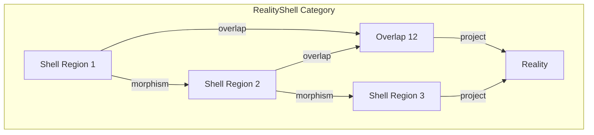
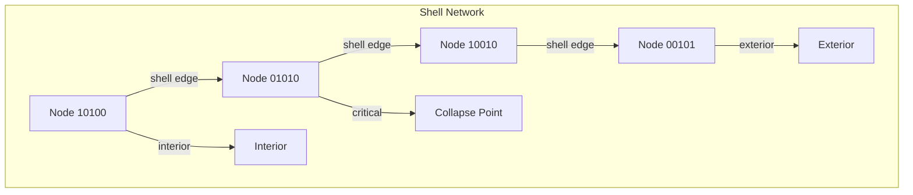
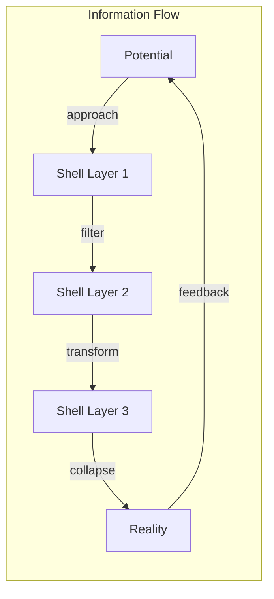

# Chapter 007: RealityShell: Reality Projection Layer of Tensor Overlap Structure

## The Membrane of Existence

Between the potential and the actual lies a boundary - the RealityShell. This is where observer-cones intersect, tensors overlap, and the golden patterns crystallize into observable phenomena. The Shell is not a barrier but a transformation layer.

$$
\text{RealityShell} = \partial\{\vec{v} : \sum_{\psi} \mathbb{1}[\vec{v} \in \mathcal{C}_\psi] \geq \phi\}
$$

## Formal Definition of RealityShell

**Definition 7.1** (RealityShell): The set of golden vectors at the boundary between collapsed and uncollapsed states:

$$
\mathcal{S} = \{\vec{v} \in \mathcal{V}_\phi : W[\vec{v}] = \phi^\phi \text{ and } \exists \vec{u}, \vec{w} : \vec{u} \text{ collapsed}, \vec{w} \text{ potential}\}
$$

In binary: Shell vectors have the pattern $[1,0,1,0,0,1,0,0,0,1,...]$ at criticality.

## Tensor Overlap Structure

**Definition 7.2** (Tensor Overlap): Where multiple collapse tensors intersect:

$$
\mathcal{O}_{ij} = T_i \cap_\phi T_j = \{v : T_i(v) \neq 0 \land T_j(v) \neq 0\}
$$

These overlaps form the substrate of the RealityShell.

## Vector Information Theory of Shells

**Theorem 7.1** (Shell Information Density): The information density at the RealityShell is maximal:

$$
\rho_I[\mathcal{S}] = \lim_{\epsilon \to 0} \frac{I[\mathcal{S}_\epsilon]}{V[\mathcal{S}_\epsilon]} = \phi^{\phi-1}
$$

This is the holographic bound in golden space.

## Category Theory of RealityShells

**Definition 7.3** (Shell Morphisms): Transformations preserving shell structure:
- Maintain boundary property
- Preserve information density
- Respect tensor overlaps

## Graph Structure of Shell Networks

## Shell Dynamics

**Definition 7.4** (Shell Evolution): The RealityShell evolves according to:

$$
\frac{\partial \mathcal{S}}{\partial t} = \nabla_\phi \cdot (D \nabla_\phi \rho) + \mathcal{J}_{\text{collapse}}
$$

where $D$ is the diffusion tensor and $\mathcal{J}_{\text{collapse}}$ is the collapse current.

## Multi-Layer Shell Structure

**Theorem 7.2** (Shell Stratification): The RealityShell consists of nested layers:

$$
\mathcal{S} = \bigcup_{n=0}^{\infty} \mathcal{S}_n
$$

where $\mathcal{S}_n = \{\vec{v} : W[\vec{v}] = \phi^{\phi-n}\}$.

## Holographic Encoding on Shells

**Definition 7.5** (Shell Holography): Information in volume $V$ is encoded on shell $\partial V$:

$$
\Psi_{\text{bulk}}[\vec{r}] = \int_{\mathcal{S}} K[\vec{r}, \vec{s}] \Psi_{\text{shell}}[\vec{s}] d\vec{s}
$$

where $K$ is the golden holographic kernel.

## Tensor Projection Through Shells

**Definition 7.6** (Tensor Projection): Tensors project through the shell as:

$$
T^{ij}_{\text{reality}} = \mathcal{P}_\mathcal{S}[T^{ij}_{\text{potential}}]
$$

where $\mathcal{P}_\mathcal{S}$ is the shell projection operator.

## Shell Entropy

**Theorem 7.3** (Maximum Shell Entropy): The entropy per unit area of the shell:

$$
s_\mathcal{S} = \frac{S[\mathcal{S}]}{A[\mathcal{S}]} = \frac{k_B}{\phi}
$$

This is the maximum entropy density in golden units.

## Quantum Shell States

**Definition 7.7** (Quantum Shell): In quantum mechanics, the shell becomes:

$$
|\mathcal{S}\rangle = \sum_{\vec{v} \in \mathcal{S}} \alpha_{\vec{v}} |\vec{v}\rangle
$$

with $\sum |\alpha_{\vec{v}}|^2 = 1$ and golden phase relationships.

## Shell Oscillations

**Theorem 7.4** (Shell Vibrations): The RealityShell oscillates with golden frequencies:

$$
\omega_n = \omega_0 \phi^n
$$

where $\omega_0 = [1,0,1,0,0,1,...]$ in frequency space.

## Information Flow Through Shells

## Shell Permeability

**Definition 7.8** (Golden Permeability): The probability of passage through the shell:

$$
P_{\text{trans}}[\vec{v}] = \exp\left(-\frac{W[\vec{v}] - \phi^\phi}{\phi}\right)
$$

Maximum transmission occurs at critical weight.

## Tensor Field Discontinuities

**Theorem 7.5** (Shell Discontinuity): Tensor fields exhibit jumps across the shell:

$$
[T^{ij}]_\mathcal{S} = T^{ij}_{\text{out}} - T^{ij}_{\text{in}} = \phi^{i+j} n^i n^j
$$

where $\vec{n}$ is the shell normal vector.

## Critical Shell Phenomena

**Definition 7.9** (Shell Criticality): The shell undergoes phase transitions when:

$$
\det(\mathcal{S} - \phi^{\phi^2} I) = 0
$$

These mark major reality restructuring events.

## Shell Fractality

**Theorem 7.6** (Fractal Shell): The RealityShell has fractal dimension:

$$
D_\mathcal{S} = \frac{\log(\phi^3)}{\log(\phi)} = 3
$$

in golden logarithmic measure.

## Conservation at the Shell

**Definition 7.10** (Shell Conservation): Flux through the shell conserves golden weight:

$$
\oint_\mathcal{S} \vec{J} \cdot d\vec{A} = 0
$$

where $\vec{J}$ is the golden current density.

## Advanced Shell Structures

**Definition 7.11** (Shell Manifold): The RealityShell forms a manifold:

$$
(\mathcal{S}, g_{\phi})
$$

with golden metric $g_{\phi}$ inducing natural geometry.

## Physical Implications

The RealityShell explains:
- Wave function collapse location
- Holographic principle implementation
- Phase transition boundaries
- Information bottlenecks in nature

## Exercises

1. Calculate the surface area of a spherical shell in golden space
2. Prove that shell entropy is maximized at $W = \phi^\phi$
3. Find the oscillation modes of a cubic RealityShell
4. Derive the transmission probability for vector $[1,0,0,1,0,1]$

## Meditation on the Shell

Feel the boundary between your thoughts and reality. This is your personal RealityShell - where intentions crystallize into actions, where possibilities collapse into actualities. The shell is not solid but permeable, responding to the golden rhythm of your consciousness.

## The Seventh Echo

Thus we establish: Reality manifests at a shell - a boundary layer where tensor structures overlap and golden patterns reach critical density. This RealityShell is simultaneously a barrier and a gateway, a membrane that transforms potential into actual through the sacred geometry of golden constraints. Through its stratified layers flow the currents of existence, each respecting the fundamental law that adjacent positions cannot be simultaneously occupied. The universe computes its own boundary, and at this boundary, we find ourselves.

∎