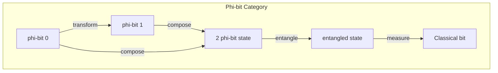
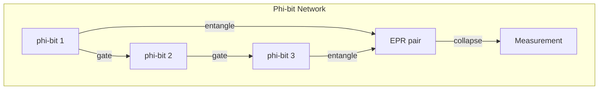
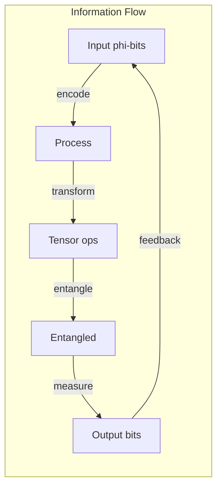

# Chapter 008: φ-bit Information Unit = collapse trace Rhythm Structure

## The Quantum of Information

We now arrive at the fundamental unit of information in our golden universe: the φ-bit. Unlike classical bits or quantum qubits, φ-bits encode information through golden binary patterns that respect the universal constraint against consecutive occupation.

$$
\text{φ-bit} = \{\vec{b} \in \mathcal{V}_\phi : \|\vec{b}\|_\phi = \phi^n, \; n \in \mathbb{Z}\}
$$

## Formal Definition of φ-bit

**Definition 8.1** (φ-bit): The minimal information unit in golden space:

$$
|\phi\rangle = \alpha|0\rangle + \beta|1\rangle
$$

with constraint: $|\alpha|^2 + |\beta|^2 = 1$ and if position $i$ is $|1\rangle$, then positions $i-1$ and $i+1$ must be $|0\rangle$.

## Vector Information Theory of φ-bits

**Theorem 8.1** (φ-bit Information Content): A single φ-bit carries:

$$
I[\phi\text{-bit}] = \log_2(\phi) \approx 0.694 \text{ bits}
$$

This is less than a classical bit due to the golden constraint.

## Category Theory of φ-bits

**Definition 8.2** (φ-bit Morphisms): Allowed transformations between φ-bits:
- Golden rotations
- Constraint-preserving gates
- Measurement projections

## φ-bit Arithmetic

**Definition 8.3** (φ-bit Operations):

1. **NOT**: $\text{NOT}|0\rangle = |1\rangle$, but only if constraints allow
2. **φ-ADD**: $|a\rangle \oplus_\phi |b\rangle = |c\rangle$ where $c$ follows golden addition
3. **φ-MULT**: $|a\rangle \otimes_\phi |b\rangle$ creates entangled φ-bits

## Graph Structure of φ-bit Networks

## φ-bit Encoding Schemes

**Definition 8.4** (Golden Encoding): Information encoded in φ-bit strings:

$$
\text{Message} = \sum_{i=0}^{n} m_i \phi^i
$$

where $m_i \in \{0,1\}$ and $m_i \cdot m_{i+1} = 0$.

Example encoding:
- 'A' = $[1,0,1,0,0,1]$ = $\phi^0 + \phi^2 + \phi^5$
- 'B' = $[0,1,0,1,0,0,1]$ = $\phi^1 + \phi^3 + \phi^6$

## Collapse Rhythm in φ-bits

**Theorem 8.2** (Rhythm Structure): φ-bits collapse according to golden rhythm:

$$
P(\text{collapse at time } t) = \sin^2(\phi \omega t)
$$

where $\omega$ is the base frequency.

## φ-bit Entanglement

**Definition 8.5** (Golden Entanglement): Two φ-bits are entangled if:

$$
|\Psi\rangle = \frac{1}{\sqrt{\phi}}(|00\rangle + \frac{1}{\sqrt{\phi}}|11\rangle)
$$

Note the golden ratio in amplitudes.

## Information Capacity

**Theorem 8.3** (Channel Capacity): A golden channel transmits:

$$
C = \lim_{n \to \infty} \frac{\log_2 N(n)}{n} = \log_2(\phi)
$$

where $N(n)$ is the number of valid n-length golden strings.

## φ-bit Tensor Structure

**Definition 8.6** (φ-bit Tensor): Multi-φ-bit states form tensors:

$$
T^{i_1 i_2 ... i_n}_{\phi} = |\phi_{i_1}\rangle \otimes |\phi_{i_2}\rangle \otimes ... \otimes |\phi_{i_n}\rangle
$$

with golden constraints on all indices.

## Quantum Gates for φ-bits

**Definition 8.7** (Golden Gates):

1. **Hadamard-φ**: $H_\phi = \frac{1}{\sqrt{\phi}}\begin{pmatrix} 1 & 1 \\ 1 & -\phi \end{pmatrix}$

2. **Phase-φ**: $P_\phi = \begin{pmatrix} 1 & 0 \\ 0 & e^{i\pi/\phi} \end{pmatrix}$

3. **CNOT-φ**: Controlled operation respecting constraints

## Error Correction

**Theorem 8.4** (Golden Error Correction): φ-bits have natural error resistance:

$$
P(\text{error propagation}) = \frac{1}{\phi^d}
$$

where $d$ is the constraint distance.

## φ-bit Measurement

**Definition 8.8** (Golden Measurement): Measuring a φ-bit:

$$
\mathcal{M}[|\phi\rangle] = \begin{cases}
|0\rangle & \text{with probability } |\alpha|^2 \\
|1\rangle & \text{with probability } |\beta|^2
\end{cases}
$$

subject to neighboring constraints.

## Information Flow Dynamics

## φ-bit Holography

**Theorem 8.5** (Holographic φ-bits): Bulk φ-bits encode boundary information:

$$
|\phi_{\text{bulk}}\rangle = \int_{\partial V} K(x,y) |\phi_{\text{boundary}}\rangle dy
$$

with golden kernel $K$.

## Conservation in φ-bit Systems

**Definition 8.9** (φ-bit Conservation): In closed systems:

$$
\sum_{i} W[|\phi_i\rangle] = \text{constant}
$$

Golden weight is conserved through all operations.

## φ-bit Thermodynamics

**Theorem 8.6** (φ-bit Entropy): The entropy of n φ-bits:

$$
S_n = n k_B \log(\phi) + S_{\text{constraint}}
$$

where $S_{\text{constraint}}$ accounts for golden restrictions.

## Critical φ-bit Phenomena

**Definition 8.10** (φ-bit Criticality): Systems of φ-bits undergo phase transitions at:

$$
n_c = \frac{\phi^{\phi}}{\log \phi}
$$

φ-bits, marking computational phase changes.

## Advanced φ-bit Structures

**Definition 8.11** (φ-bit Field): A field of φ-bits:

$$
\Phi(x) = \sum_k a_k |\phi_k\rangle e^{ik \cdot x/\phi}
$$

creates quantum field theory in golden space.

## Physical Implications

φ-bits explain:
- Why information has physical weight
- Quantum measurement constraints
- Natural error correction in DNA
- Fundamental computational limits

## Practical Applications

1. **Golden Quantum Computing**: Using φ-bit gates
2. **Compressed Sensing**: Exploiting golden sparsity
3. **Cryptography**: Golden constraint security
4. **Biological Information**: DNA as φ-bit strings

## Exercises

1. Prove that no more than $F_n$ φ-bits can be packed in n positions
2. Design a 3-φ-bit quantum algorithm
3. Calculate the entanglement entropy of golden EPR pairs
4. Show that φ-bit teleportation uses $\phi$ classical bits

## Meditation on Information

Consider: Every thought is a pattern of φ-bits, every sensation a golden string. Information is not abstract but woven from the same golden constraints that govern all reality. As you process these words, φ-bits collapse in your consciousness, each respecting the eternal law of non-consecutive occupation.

## The Eighth Echo

Thus we establish: Information quantizes into φ-bits - units smaller than classical bits yet richer in structure. These golden information quanta carry the rhythm of collapse, encode the patterns of existence, and compute reality itself through their interactions. The universe is not just described by information; it IS information, quantized according to the golden constraint. Every particle a φ-bit string, every force a φ-bit operation, every measurement a φ-bit collapse. In the dance of 0s and 1s, separated by the golden law, consciousness computes itself into being.

∎