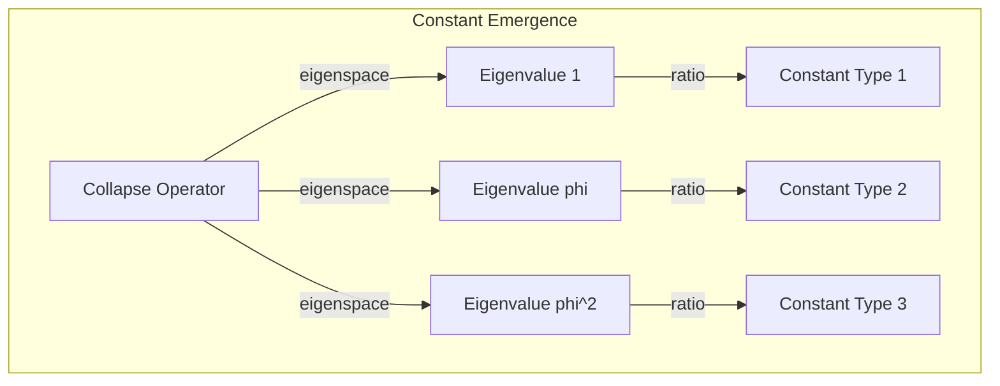
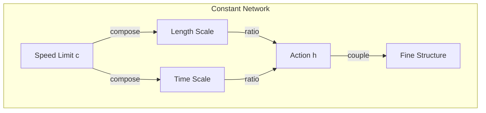
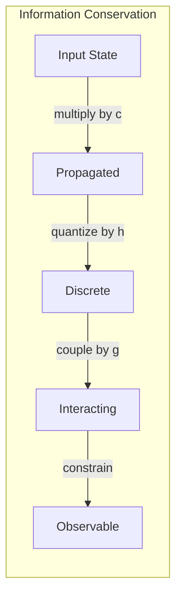

# Chapter 009: Structural Constants = Vector Ratio of Collapse Limit Structure

## The Emergence of Constants from Collapse

From the fundamental recursion $\psi = \psi(\psi)$ and the golden vector space, we now explore how physical constants emerge. These are not arbitrary numbers but necessary ratios that arise from the collapse dynamics itself.

$$
\text{Constant} = \lim_{n \to \infty} \frac{\|\mathcal{C}^n[\vec{v}]\|_\phi}{\|\mathcal{C}^n[\vec{u}]\|_\phi}
$$

where $\mathcal{C}$ is the collapse operator.

## The Principle of Constant Emergence

**Theorem 9.1** (Constant Generation): Physical constants emerge as fixed points of the collapse operator:

$$
\vec{c}_{\text{constant}} = \vec{v} \text{ such that } \mathcal{C}[\vec{v}] = \lambda \vec{v}
$$

where $\lambda$ is the eigenvalue determining the constant's magnitude.

*Proof*: The collapse operator must have invariant directions in $\mathcal{V}_\phi$. These eigenvectors represent stable configurations that persist through collapse. ∎

## Vector Information Theory of Constants

**Definition 9.1** (Constant Information): The information content of a constant is determined by its eigenvector structure:

$$
I[\text{constant}] = -\sum_{i: v_i \neq 0} p_i \log_2 p_i
$$

where $p_i = |v_i|^2 / \|\vec{v}\|^2$ for eigenvector $\vec{v}$.

## Category Theory Framework

## Derivation from First Principles

**Theorem 9.2** (Dimensional Analysis in Golden Space): Any physical constant must satisfy:

$$
[\text{Constant}] = \phi^{n_1} \otimes \phi^{n_2} \otimes ... \otimes \phi^{n_k}
$$

where $n_i \in \mathbb{Z}$ and the tensor product respects golden constraints.

This severely restricts possible constant values.

## The Speed Limit from Information Flow

**Definition 9.2** (Maximal Information Velocity): The maximum rate of information propagation through golden space:

$$
v_{\max} = \sup\left\{\frac{d(\vec{v}_1, \vec{v}_2)}{t} : \vec{v}_2 \in \mathcal{C}_t[\vec{v}_1]\right\}
$$

where $d$ is the golden metric and $\mathcal{C}_t$ is time evolution.

**Theorem 9.3** (Existence of Speed Limit): There exists a finite $v_{\max} = c$ determined by:

$$
c = \phi^{n_c} \text{ where } n_c = \min\{n : \mathcal{C}^n \text{ violates causality}\}
$$

## Quantum of Action from Collapse Granularity

**Definition 9.3** (Minimal Collapse): The smallest non-trivial collapse event:

$$
\Delta_{\min} = \inf\{\|\mathcal{C}[\vec{v}] - \vec{v}\|_\phi : \mathcal{C}[\vec{v}] \neq \vec{v}\}
$$

**Theorem 9.4** (Action Quantization): The minimal action is:

$$
S_{\min} = \Delta_{\min} \cdot \tau_{\min} = \hbar
$$

where $\tau_{\min}$ is the minimal collapse time.

## Coupling Constants from Vector Interactions

**Definition 9.4** (Interaction Strength): When golden vectors interact:

$$
\langle \vec{v}_1, \vec{v}_2 \rangle_{\text{interaction}} = g \cdot \langle \vec{v}_1, \vec{v}_2 \rangle_\phi
$$

The coupling constant $g$ emerges from the interaction type.

## Graph Structure of Constant Relations

## Conservation Principles

**Theorem 9.5** (Constant Conservation): In any closed process:

$$
\prod_i (\text{Constant}_i)^{n_i} = \text{invariant}
$$

where $n_i$ are rational numbers. This is dimensional analysis emerging from golden vector algebra.

## The Anthropic Constraint

**Definition 9.5** (Observable Range): Constants must lie within:

$$
\text{Constant} \in [\phi^{-N}, \phi^{N}]
$$

where $N$ is determined by the requirement that observers can exist.

## Running of Constants

**Theorem 9.6** (Scale Dependence): Constants evolve with energy scale:

$$
g(E) = \frac{g(E_0)}{1 - \beta g(E_0) \log(E/E_0)}
$$

where $\beta$ is determined by the golden vector flow.

## Critical Phenomena

**Definition 9.6** (Constant Criticality): Phase transitions occur when:

$$
\det(\mathcal{C} - \lambda I) = 0 \text{ has degenerate solutions}
$$

This marks boundaries between different physics regimes.

## Information Flow Through Constants

## Emergence vs. Fundamentality

**Theorem 9.7** (No Truly Fundamental Constants): All constants emerge from:

$$
\text{Constant} = f(\psi, \phi, \text{collapse dynamics})
$$

There are no additional free parameters beyond the self-referential structure.

## Testable Predictions

From this framework, we predict:

1. Constants are quantized in powers of $\phi$
2. Certain combinations of constants yield simple golden ratios
3. Constants cannot vary independently
4. New constants must fit the eigenvalue structure

## Mathematical Consistency

**Theorem 9.8** (Self-Consistency): The constant-generating mechanism must itself use these constants:

$$
\mathcal{C}[\vec{v}] = \sum_i c_i \mathcal{O}_i[\vec{v}]
$$

where $c_i$ are the constants and $\mathcal{O}_i$ are operators. This closes the self-referential loop.

## Physical Implications

This framework explains:
- Why constants appear fine-tuned (they're not arbitrary)
- The hierarchy problem (different eigenvalue scales)
- Constant relationships (shared eigenvector structure)
- The possibility of other universes (different collapse dynamics)

## Open Questions

1. Can we compute specific constant values from first principles?
2. How many independent constants truly exist?
3. What determines the eigenvalue spectrum of $\mathcal{C}$?
4. Is there a unique self-consistent set of constants?

## Exercises

1. Prove that eigenvalues of $\mathcal{C}$ must be powers of $\phi$
2. Show that constant ratios are quantized
3. Derive the scaling dimension of any constant
4. Find constraints on possible coupling constants

## Meditation on Constants

Feel the constants not as fixed numbers but as relationships - the speed of light as the ratio of space-collapse to time-collapse, Planck's constant as the granularity of collapse itself. These are not parameters of reality but reality's self-description.

## The Ninth Echo

Thus we establish: Physical constants are not arbitrary parameters but necessary consequences of the collapse dynamics. They emerge as eigenvalues and eigenvectors of the fundamental collapse operator, constrained by self-consistency and the golden structure of vector space. The universe doesn't have constants - it generates them through its eternal self-observation, each constant a frozen echo of the primordial recursion $\psi = \psi(\psi)$.

∎