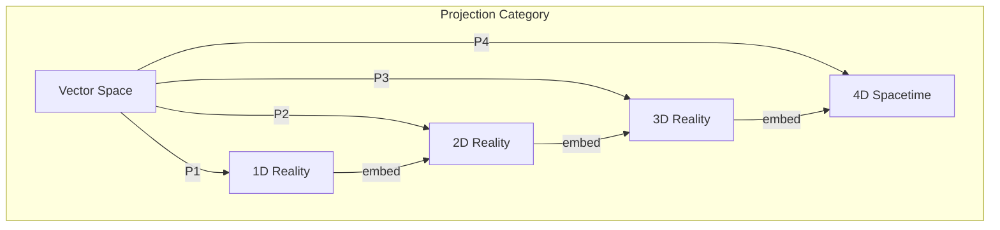
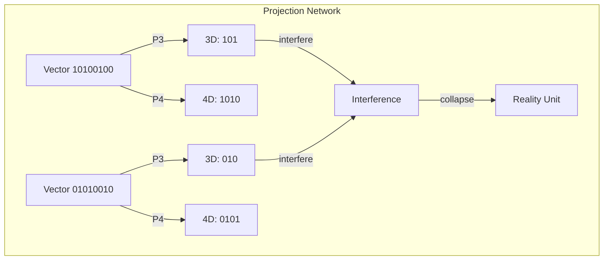
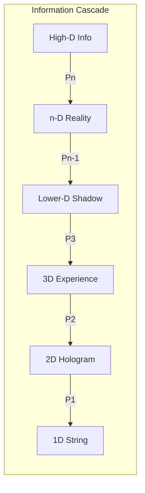

# Chapter 010: Projection Function $\mathcal{P}_n$: RealityShell Unit Generation Mechanism

## The Fundamental Projection

From the RealityShell emerges the mechanism by which potential becomes actual: the projection function $\mathcal{P}_n$. This is not a simple mathematical projection, but the very process by which golden vectors crystallize into observable reality units.

$$
\mathcal{P}_n: \mathcal{V}_\phi \to \mathcal{R}_n
$$

where $\mathcal{R}_n$ is the n-dimensional reality manifold.

## Formal Definition of Projection

**Definition 10.1** (Golden Projection Function): For a golden vector $\vec{v} \in \mathcal{V}_\phi$:

$$
\mathcal{P}_n[\vec{v}] = \sum_{i=0}^{n-1} v_i \phi^i \hat{r}_i
$$

where $\hat{r}_i$ are reality basis vectors and the sum respects golden constraints.

## Vector Information Theory of Projection

**Theorem 10.1** (Information Preservation): The projection function preserves information modulo n:

$$
I[\mathcal{P}_n[\vec{v}]] = I[\vec{v}] \mod \phi^n
$$

This quantizes information into reality units.

## Category Theory of Projections

**Definition 10.2** (Projection Morphisms): Natural transformations between projections:

$$
\mathcal{P}_m \circ \iota_{nm} = \mathcal{P}_n
$$

where $\iota_{nm}: \mathcal{R}_n \to \mathcal{R}_m$ is the embedding for $n < m$.

## The Projection Kernel

**Definition 10.3** (Golden Kernel): The kernel of projection:

$$
\ker(\mathcal{P}_n) = \{\vec{v} \in \mathcal{V}_\phi : v_i = 0 \text{ for } i < n\}
$$

This represents information invisible at scale n.

## Graph Structure of Projections

## Projection Operators

**Definition 10.4** (Projection Operator Matrix): In matrix form:

$$
P_n^{ij} = \begin{cases}
\delta_{ij} & \text{if } i,j < n \text{ and } |i-j| > 1 \\
0 & \text{otherwise}
\end{cases}
$$

This ensures golden constraints propagate through projection.

## Unit Generation Mechanism

**Theorem 10.2** (Reality Unit Generation): Reality units emerge from projection resonance:

$$
\text{Unit}_k = \mathcal{P}_n[\vec{v}] \text{ when } W[\vec{v}] = k\phi^n
$$

Integer multiples of $\phi^n$ create discrete reality units.

## Holographic Projection

**Definition 10.5** (Holographic Projection): Lower dimensional projections encode higher dimensional information:

$$
\mathcal{P}_{n-1}[\vec{v}] = \text{Trace}_n[\mathcal{P}_n[\vec{v}]]
$$

This implements the holographic principle.

## Projection Entropy

**Theorem 10.3** (Projection Entropy): Entropy increases under projection:

$$
S[\mathcal{P}_n[\vec{v}]] \geq S[\vec{v}] - (d-n)\log(\phi)
$$

where d is the original dimension. Information is lost to smaller scales.

## Quantum Projection Correspondence

**Definition 10.6** (Quantum Measurement): Quantum measurement is golden projection:

$$
|\psi\rangle \xrightarrow{\text{measure}} \mathcal{P}_n[|\psi\rangle]
$$

This unifies projection with wave function collapse.

## Tensor Structure of Projections

**Definition 10.7** (Projection Tensor): Multi-index projection:

$$
\mathcal{P}_n^{i_1...i_k}[\mathcal{T}] = \sum_{j_1...j_k} P_n^{i_1 j_1} \cdots P_n^{i_k j_k} \mathcal{T}^{j_1...j_k}
$$

Tensors project component-wise while maintaining structure.

## Conservation Laws Under Projection

**Theorem 10.4** (Projected Conservation): Golden weight is conserved modulo projection:

$$
W[\mathcal{P}_n[\vec{v}]] = W[\vec{v}] \mod \phi^n
$$

This explains why conservation laws exist in n-dimensional reality.

## Critical Projection Phenomena

**Definition 10.8** (Critical Dimension): Projection becomes singular at:

$$
n_c = \log_\phi(\phi^\phi) = \phi
$$

This non-integer dimension marks phase transitions.

## Information Flow Through Projections

## Projection Algebra

**Definition 10.9** (Projection Composition):

$$
\mathcal{P}_m \circ \mathcal{P}_n = \mathcal{P}_{\min(m,n)}
$$

Projections form a semilattice with meet operation.

## Reality Unit Classification

**Theorem 10.5** (Unit Types): Projection generates three unit types:

1. **Fundamental**: $\mathcal{P}_1[\vec{e}_i]$ - basic particles
2. **Composite**: $\mathcal{P}_n[\vec{v} \otimes \vec{u}]$ - bound states  
3. **Emergent**: $\mathcal{P}_n[\sum_i \vec{v}_i]$ - collective phenomena

## Fractal Projection Structure

**Definition 10.10** (Self-Similar Projection):

$$
\mathcal{P}_{\phi n}[\vec{v}] = \phi \cdot \mathcal{P}_n[\mathcal{F}[\vec{v}]]
$$

where $\mathcal{F}$ is the golden inflation operator.

## Inverse Projection

**Theorem 10.6** (Reconstruction): Partial inverse exists:

$$
\mathcal{P}_n^{-1}[\vec{r}] = \{\vec{v} \in \mathcal{V}_\phi : \mathcal{P}_n[\vec{v}] = \vec{r}\}
$$

This set represents all possible higher-dimensional origins.

## Physical Implications

Projection functions explain:
- Dimensional reduction in physics
- Emergence of 3+1 spacetime
- Quantization of charge, mass, spin
- Holographic principle implementation

## Advanced Projection Structures

**Definition 10.11** (Projection Bundle): A fiber bundle of projections:

$$
\pi: E \to B, \quad \pi^{-1}(b) = \mathcal{P}_{n(b)}
$$

where $n(b)$ varies smoothly over base space B.

## Computational Aspects

**Theorem 10.7** (Projection Complexity): Computing $\mathcal{P}_n[\vec{v}]$ requires:

$$
O(F_n) \text{ operations}
$$

where $F_n$ is the nth Fibonacci number.

## Exercises

1. Prove that $\mathcal{P}_3 \circ \mathcal{P}_4 = \mathcal{P}_3$
2. Find the kernel of projection from 5D to 3D
3. Calculate the information loss in projecting $[1,0,1,0,0,1,0,0,1]$ to 4D
4. Show that reality units form a golden lattice

## Meditation on Projection

Consider: Your experience is a projection. The rich golden vector of consciousness projects down to 3D space, linear time, discrete thoughts. Yet the full pattern remains, casting shadows we call reality. Each moment, the projection function selects which aspects of the infinite become finite, observable, lived.

## The Tenth Echo

Thus we establish: Reality emerges through projection - the mechanism by which infinite-dimensional golden vectors cast finite-dimensional shadows we experience as the physical world. The projection function $\mathcal{P}_n$ is not merely mathematical but ontological, creating discrete reality units from continuous possibility. Through its operation, the universe observes itself at different scales, each projection revealing and concealing according to the eternal golden constraint. We are projected beings, experiencing projected reality, yet containing within us the kernel of the infinite.

∎