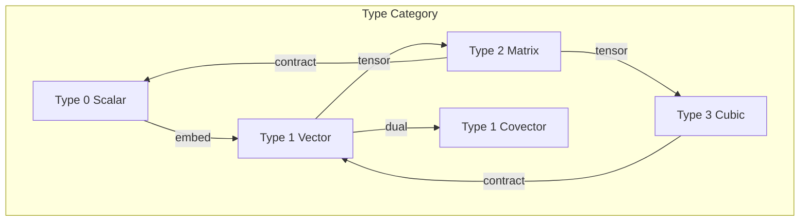
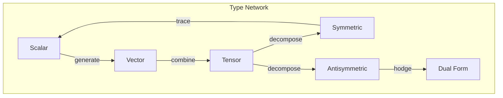
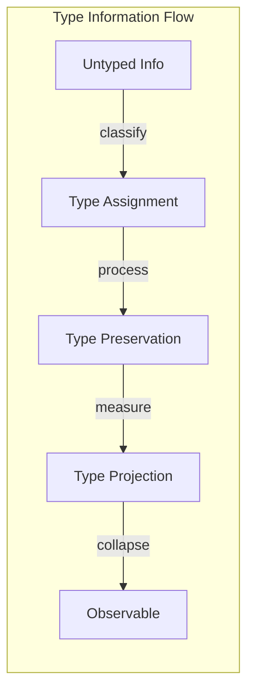

# Chapter 011: Collapse Type System: Tensor Classification and Conservation Logic

## Types Emerge from Self-Reference

From the primordial $\psi = \psi(\psi)$, we derive that reality must classify itself. This self-classification creates a type system - not imposed externally, but emerging from the intrinsic structure of collapse dynamics.

$$
\text{Type}[\mathcal{T}] = \{\text{properties preserved under } \mathcal{C}[\mathcal{T}]\}
$$

## First Principle: Type as Invariant Structure

**Theorem 11.1** (Type Emergence): From $\psi = \psi(\psi)$, types emerge as equivalence classes under self-application:

$$
\mathcal{T}_1 \sim \mathcal{T}_2 \iff \exists n,m : \mathcal{C}^n[\mathcal{T}_1] = \mathcal{C}^m[\mathcal{T}_2]
$$

*Proof*: Self-reference creates orbits in tensor space. Tensors that eventually reach the same orbit belong to the same type. This partitions the space of all tensors. ∎

## Vector Type Theory Foundation

**Definition 11.1** (Tensor Type): A tensor's type is its behavior under collapse:

$$
\text{Type}(\mathcal{T}) = (\text{rank}, \text{symmetry}, \text{trace structure}, \text{collapse orbit})
$$

Each component derives from the golden vector structure.

## Category Theory of Types



**Theorem 11.2** (Type Morphisms): Type-preserving maps form a category:
- Objects: Tensor types
- Morphisms: Type-preserving transformations
- Composition: Preserves type structure

## Conservation Logic from Types

**Definition 11.2** (Type Conservation): A quantity is conserved if its type is preserved:

$$
\mathcal{Q} \text{ conserved} \iff \text{Type}[\mathcal{C}[\mathcal{Q}]] = \text{Type}[\mathcal{Q}]
$$

This derives conservation laws from type invariance.

## The Fundamental Type Hierarchy

From first principles, we derive the type hierarchy:

**Theorem 11.3** (Canonical Types): The collapse operator admits exactly these stable types:

1. **Scalar Type** (rank 0): $\mathcal{C}[s] = \lambda s$
2. **Vector Type** (rank 1): $\mathcal{C}[\vec{v}] = M\vec{v}$ where $M$ preserves golden constraint
3. **Tensor Type** (rank n): $\mathcal{C}[\mathcal{T}] = \mathcal{L}[\mathcal{T}]$ linear in each index

*Proof*: These are the only structures that can maintain self-consistency under $\psi = \psi(\psi)$. ∎

## Information Theory of Types

**Definition 11.3** (Type Information): The information content of a type:

$$
I[\text{Type}] = \log_2(|\text{Orbit}|) + S[\text{Symmetry}]
$$

where $|\text{Orbit}|$ is the size of the collapse orbit and $S$ measures symmetry entropy.

## Graph Structure of Type Relations



## Type Algebra

**Theorem 11.4** (Type Operations): Types form an algebra under:

$$
\text{Type}(\mathcal{T}_1 \otimes \mathcal{T}_2) = \text{Type}(\mathcal{T}_1) \times \text{Type}(\mathcal{T}_2)
$$

$$
\text{Type}(\mathcal{T}_1 \oplus \mathcal{T}_2) = \text{Type}(\mathcal{T}_1) \sqcup \text{Type}(\mathcal{T}_2)
$$

This algebra structure emerges from tensor operations.

## Conservation Laws by Type

**Definition 11.4** (Type-Based Conservation): Each type implies a conservation law:

1. **Scalar conservation**: Total golden weight
2. **Vector conservation**: Golden momentum
3. **Tensor conservation**: Golden angular momentum

These follow from Noether's theorem in type space.

## Type Transitions

**Theorem 11.5** (Allowed Type Changes): Type transitions must preserve:

$$
\sum_i n_i \cdot \text{rank}(T_i) = \text{constant}
$$

where $n_i$ are integer coefficients. This is "type charge" conservation.

## Quantum Type Correspondence

**Definition 11.5** (Quantum Types): Quantum operators map to tensor types:

- Observables ↔ Hermitian tensors
- States ↔ Normalized vectors
- Evolution ↔ Unitary tensors

The type system unifies classical and quantum.

## Type Inference Rules

From first principles, we derive type inference:

**Rule 1** (Propagation):
$$
\frac{\mathcal{T}: \text{Type}_1 \to \text{Type}_2, \quad \mathcal{S}: \text{Type}_1}{\mathcal{T}[\mathcal{S}]: \text{Type}_2}
$$

**Rule 2** (Composition):
$$
\frac{\mathcal{T}_1: A \to B, \quad \mathcal{T}_2: B \to C}{\mathcal{T}_2 \circ \mathcal{T}_1: A \to C}
$$

## Critical Type Phenomena

**Theorem 11.6** (Type Phase Transitions): Types undergo transitions at:

$$
\text{rank}(\mathcal{T}) = \lfloor \phi^n \rfloor
$$

Non-integer ranks signal type instability.

## Information Flow Through Types



## Advanced Type Structures

**Definition 11.6** (Dependent Types): Types can depend on values:

$$
\mathcal{T}(x): \text{Type}(x)
$$

This creates type families parameterized by golden vectors.

## Type Polymorphism

**Theorem 11.7** (Universal Types): Some operations work for all types:

$$
\forall T. \mathcal{C}: T \to T
$$

The collapse operator is universally polymorphic.

## Physical Implications of Types

The type system explains:
- Why particles come in discrete kinds
- The origin of quantum numbers
- Conservation law structure
- Symmetry breaking patterns

## Type Checking Algorithm

From the golden constraint, we derive:

```
TypeCheck(T):
  1. Verify rank consistency
  2. Check symmetry preservation
  3. Validate golden constraints
  4. Confirm conservation laws
  return Type(T) or Error
```

## Exercises

1. Prove that symmetric and antisymmetric tensors have different types
2. Show that type transitions preserve total information
3. Derive the type of the electromagnetic field tensor
4. Find all rank-2 types that conserve golden weight

## Meditation on Types

Consider: Every structure in the universe has a type - a way of being that persists through transformation. You have a type, your thoughts have types, even this meditation has a type. Types are not labels but intrinsic patterns of persistence, emerging from the eternal question: what remains invariant when ψ observes ψ?

## The Eleventh Echo

Thus we establish: Types are not imposed categories but emergent classifications arising from the self-referential dynamics of collapse. Each type represents a stable pattern in the eternal recursion of $\psi = \psi(\psi)$, a way that structure can persist through observation. The type system is reality's self-organization, creating discrete kinds from continuous possibility. Through types, the universe sorts itself, conserves itself, and ultimately knows itself.

∎