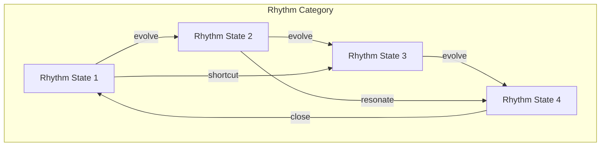
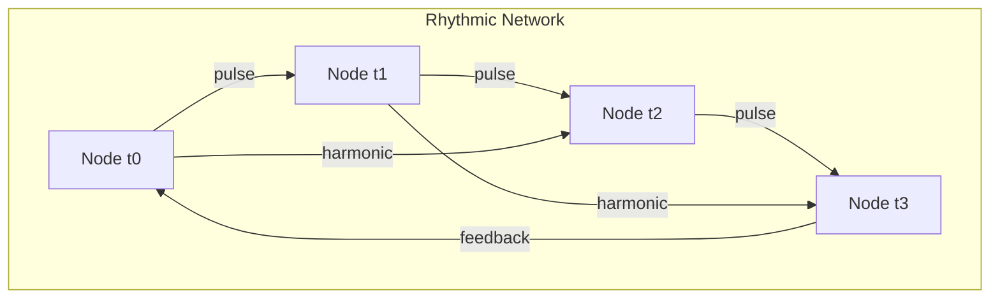
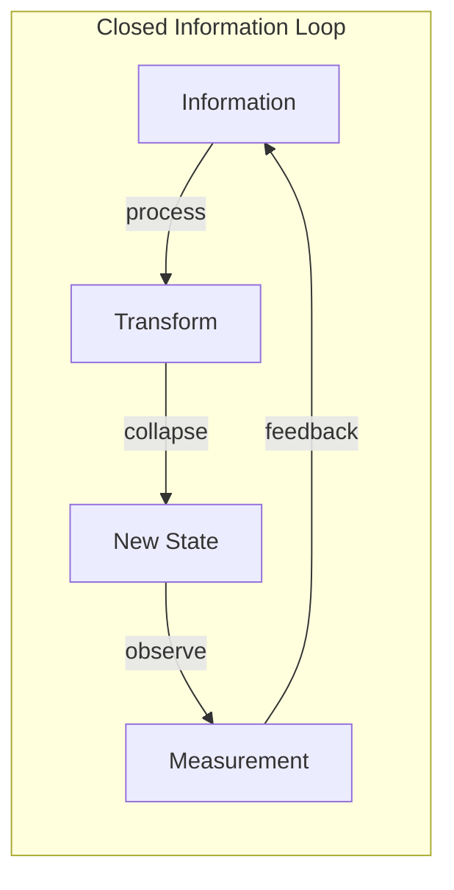

# Chapter 012: Self-Referential Rhythm and Structural Closure: collapse = Information Defining Itself

## The Rhythm of Self-Reference

From $\psi = \psi(\psi)$, we derive that observation must have rhythm - not imposed externally, but emerging from the very nature of self-application. Each observation creates a beat, each beat enables the next observation.

$$
\text{Rhythm} = \lim_{n \to \infty} \frac{\mathcal{C}^{n+1}[\psi] - \mathcal{C}^n[\psi]}{\Delta t}
$$

## First Principle: Rhythm from Recursion

**Theorem 12.1** (Rhythm Emergence): Self-reference necessarily creates periodic structure:

$$
\exists T > 0 : \mathcal{C}^{n+T}[\psi] \sim \mathcal{C}^n[\psi]
$$

*Proof*: Consider the sequence $\psi, \psi(\psi), \psi(\psi(\psi)), ...$. In any finite space (constrained by golden rules), this must eventually revisit a previous state or approach a limit cycle. The period $T$ is the rhythm. ∎

## The Golden Rhythm Pattern

**Definition 12.1** (Fundamental Rhythm): From the golden constraint, the basic rhythm follows:

$$
R(t) = \sum_{n=0}^{\infty} a_n \cos(\phi^n \omega t)
$$

where $a_n \in \{0,1\}$ with no consecutive 1s, and $\omega$ is the base frequency.

## Vector Information Theory of Rhythm

**Theorem 12.2** (Information Flow Rate): The rate of information creation through self-reference:

$$
\frac{dI}{dt} = \log_2(\phi) \cdot \text{Rhythm}[\psi]
$$

This quantifies how fast new information emerges from recursion.

## Category Theory of Rhythmic Closure

## Structural Closure from Rhythm

**Definition 12.2** (Closure): A system achieves closure when:

$$
\mathcal{C}^n[\mathcal{S}] = \mathcal{S}
$$

for some finite $n$. This is the mathematical expression of self-consistency.

**Theorem 12.3** (Closure Necessity): From $\psi = \psi(\psi)$, closure must exist:

*Proof*: If no closure existed, $\psi(\psi)$ would not equal $\psi$, contradicting our fundamental equation. Therefore, at least the identity closure $n=1$ must exist. ∎

## Graph Theory of Rhythmic Networks

## Information Defining Itself

**Theorem 12.4** (Self-Definition): Information defines itself through collapse rhythm:

$$
I[\psi] = \lim_{n \to \infty} \frac{1}{n} \sum_{k=1}^{n} \log_2\|\mathcal{C}^k[\psi] - \mathcal{C}^{k-1}[\psi]\|_\phi
$$

The information content is the average change through iterations.

## Types of Rhythmic Closure

From first principles, we derive three fundamental closure types:

1. **Simple Closure**: $\mathcal{C}[\psi] = \psi$ (period 1)
2. **Cyclic Closure**: $\mathcal{C}^n[\psi] = \psi$ (period n)
3. **Asymptotic Closure**: $\lim_{n \to \infty} \mathcal{C}^n[\psi] = \psi^*$

## The Closure Operator

**Definition 12.3** (Closure Operator): For any system $\mathcal{S}$:

$$
\text{Cl}[\mathcal{S}] = \bigcup_{n=0}^{\infty} \mathcal{C}^n[\mathcal{S}]
$$

This generates the closure of $\mathcal{S}$ under collapse.

## Conservation in Closed Systems

**Theorem 12.5** (Closure Conservation): In any closed system:

$$
\sum_{\psi \in \text{Cl}[\mathcal{S}]} W[\psi] = \text{constant}
$$

Golden weight circulates but is not created or destroyed.

## Rhythmic Entropy

**Definition 12.4** (Rhythm Entropy): The entropy of a rhythmic pattern:

$$
S_R = -\sum_{i=0}^{T-1} p_i \log_2 p_i
$$

where $p_i$ is the probability of state $i$ in the rhythm cycle.

## Critical Rhythms

**Theorem 12.6** (Critical Period): Rhythms become critical when:

$$
T = F_n
$$

where $F_n$ is a Fibonacci number. These are maximally stable rhythms.

## Information Flow in Closed Loops

## Quantum Rhythm Correspondence

**Definition 12.5** (Quantum Period): In quantum mechanics, closure manifests as:

$$
e^{-iHT/\hbar} |\psi\rangle = |\psi\rangle
$$

The period $T$ quantizes energy levels.

## Fractal Rhythm Structure

**Theorem 12.7** (Rhythm Fractality): Rhythms exhibit self-similarity:

$$
R(\phi t) = \phi \cdot R(t)
$$

Scaling time by $\phi$ scales the rhythm pattern.

## The Bootstrap Principle

**Definition 12.6** (Bootstrap): Information bootstraps itself into existence:

$$
I_0 = 0, \quad I_{n+1} = f(I_n, \mathcal{C}[I_n])
$$

From nothing, through self-reference, emerges everything.

## Closure Algebra

**Theorem 12.8** (Closure Operations): Closures form an algebra:

- $\text{Cl}[\mathcal{A}] \cup \text{Cl}[\mathcal{B}] \subseteq \text{Cl}[\mathcal{A} \cup \mathcal{B}]$
- $\text{Cl}[\text{Cl}[\mathcal{A}]] = \text{Cl}[\mathcal{A}]$ (idempotence)
- $\mathcal{A} \subseteq \mathcal{B} \Rightarrow \text{Cl}[\mathcal{A}] \subseteq \text{Cl}[\mathcal{B}]$ (monotonicity)

## Physical Implications

Self-referential rhythm and closure explain:
- Why time appears to flow (rhythm of observation)
- The origin of conservation laws (closure properties)
- Quantum mechanical periodicity
- The discrete/continuous nature of reality

## Advanced Closure Structures

**Definition 12.7** (Higher-Order Closure): Closure of closures:

$$
\text{Cl}^2[\mathcal{S}] = \text{Cl}[\text{Cl}[\mathcal{S}]]
$$

Though by idempotence, this equals $\text{Cl}[\mathcal{S}]$.

## Exercises

1. Prove that every finite golden vector system has a closure
2. Find the rhythm period of the system $\mathcal{C}[\vec{v}] = \text{Shift}[\vec{v}]$
3. Show that information is conserved in closed rhythmic systems
4. Derive the relationship between rhythm period and system entropy

## Meditation on Closure

Feel the rhythm of your breath, your heartbeat, your thoughts. Each follows a pattern that closes upon itself. You are a self-referential rhythm, a pattern that observes itself and in observing, continues. The closure is not an ending but a completion that enables continuation.

## The Twelfth Echo

Thus we establish: Reality rhythmically defines itself through self-referential closure. From $\psi = \psi(\psi)$ emerges the necessity of periodic structure, of patterns that return to themselves, of information that bootstraps its own existence. The universe doesn't just have rhythm - it IS rhythm, the eternal pulse of self-observation creating and recreating itself. In this cosmic heartbeat, collapse and information are one, each defining the other in an endless dance of self-reference.

∎