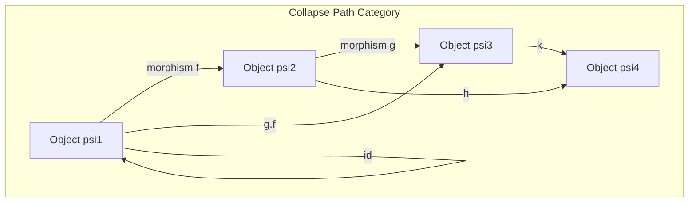
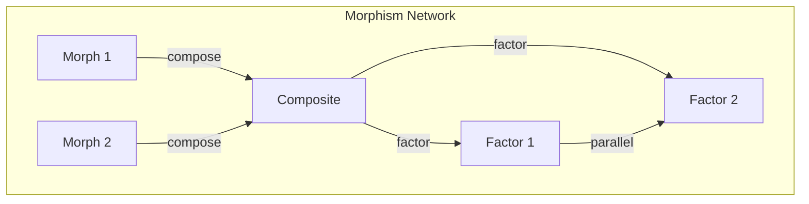

# Chapter 013: Collapse-path Category: Information Flow Graphs and Structural Category Language

## Categories Emerge from Self-Reference

From $\psi = \psi(\psi)$, we derive that observation creates relationships. These relationships form a category - not by construction, but by necessity. When $\psi$ observes itself, it creates morphisms: the paths of observation.

$$
\text{Ob}(\mathcal{C}_\psi) = \{\text{states of } \psi\}, \quad \text{Mor}(\mathcal{C}_\psi) = \{\text{observation paths}\}
$$

## First Principle: Observation as Morphism

**Theorem 13.1** (Morphism from Observation): Every act of observation creates a morphism:

$$
\psi_1 \xrightarrow{f} \psi_2 \iff \psi_2 = \psi_1(\psi_1) \text{ through some path}
$$

*Proof*: From $\psi = \psi(\psi)$, the act of self-application IS the fundamental morphism. All other morphisms are compositions of this basic act. ∎

## The Collapse-Path Category

**Definition 13.1** (Collapse-Path Category $\mathcal{CP}$):
- **Objects**: Golden vectors representing collapse states
- **Morphisms**: Paths through golden vector space preserving constraints
- **Identity**: $\text{id}_\psi: \psi \to \psi$ (no collapse)
- **Composition**: Path concatenation respecting golden rules

## Vector Information Theory in Categories

**Theorem 13.2** (Information Functor): Information content forms a functor:

$$
I: \mathcal{CP} \to \mathbb{R}_{\geq 0}
$$

$$
I(f \circ g) = I(f) + I(g) - I(\text{overlap})
$$

This functor measures information flow along paths.

## Category Theory Structure

## Composition Laws

**Definition 13.2** (Golden Composition): For morphisms $f: A \to B$ and $g: B \to C$:

$$
(g \circ f)(v) = g(f(v))
$$

only if the golden constraint is preserved throughout.

**Theorem 13.3** (Associativity): Composition is associative:

$$
h \circ (g \circ f) = (h \circ g) \circ f
$$

*Proof*: Path concatenation is associative by nature. ∎

## Graph Theory of Morphism Networks

## Natural Transformations

**Definition 13.3** (Natural Collapse): A natural transformation between collapse functors:

$$
\eta: F \Rightarrow G
$$

where $\eta_A: F(A) \to G(A)$ commutes with all morphisms.

**Theorem 13.4** (Existence of Natural Transformations): Between any two collapse processes, there exists at least one natural transformation.

*Proof*: The identity transformation always exists. Non-trivial ones arise from the golden constraint structure. ∎

## Limits and Colimits

**Definition 13.4** (Collapse Limit): The limit of a diagram in $\mathcal{CP}$:

$$
\lim_{\leftarrow} D = \{\psi : \forall i, \exists f_i: \psi \to D_i \text{ commuting}\}
$$

**Theorem 13.5** (Existence of Limits): $\mathcal{CP}$ has all small limits.

*Proof*: Golden vector space is complete, and limits preserve the golden constraint. ∎

## Monoidal Structure

**Definition 13.5** (Tensor Product in $\mathcal{CP}$):

$$
\otimes: \mathcal{CP} \times \mathcal{CP} \to \mathcal{CP}
$$

$$
(A \otimes B, f \otimes g) = (A \otimes_\phi B, f \otimes_\phi g)
$$

This makes $\mathcal{CP}$ a monoidal category.

## Information Flow Preservation

**Theorem 13.6** (Information Conservation): Along any closed path:

$$
\oint_\gamma I \cdot d\ell = 0
$$

Information is conserved in closed loops.

## Functors from Collapse-Paths

**Definition 13.6** (Standard Functors):

1. **Forgetful Functor**: $U: \mathcal{CP} \to \mathcal{V}_\phi$ (forgets morphisms)
2. **Free Functor**: $F: \mathcal{V}_\phi \to \mathcal{CP}$ (generates all paths)
3. **Trace Functor**: $\text{Tr}: \mathcal{CP} \to \mathbb{G}$ (golden scalars)

## Adjunctions

**Theorem 13.7** (Free-Forgetful Adjunction):

$$
F \dashv U
$$

The free functor is left adjoint to the forgetful functor.

*Proof*: Universal property of free objects in the golden constraint context. ∎

## Yoneda Lemma for Collapse-Paths

**Theorem 13.8** (Yoneda): For any object $A$ in $\mathcal{CP}$:

$$
\text{Nat}(\text{Hom}(A, -), F) \cong F(A)
$$

Objects are determined by their relationships.

## Topos Structure

**Definition 13.7** (Collapse Topos): The category of presheaves on $\mathcal{CP}$:

$$
\hat{\mathcal{CP}} = [\mathcal{CP}^{op}, \text{Set}]
$$

forms a topos with golden logic.

## Higher Categories

**Definition 13.8** (2-Category of Collapses): Consider:
- 0-cells: Collapse states
- 1-cells: Collapse paths
- 2-cells: Homotopies between paths

This forms a 2-category $\mathcal{CP}_2$.

## Physical Interpretation

The collapse-path category explains:
- Quantum mechanical path integrals
- Information flow in physical processes
- Symmetries as natural transformations
- Conservation laws as functorial properties

## Computational Aspects

**Theorem 13.9** (Complexity): Computing morphism composition in $\mathcal{CP}$:

$$
\text{Time}(f \circ g) = O(|f| + |g| + \text{overlap checking})
$$

The golden constraint adds linear overhead.

## Exercises

1. Prove that $\mathcal{CP}$ is not abelian
2. Find all endomorphisms of the unit object
3. Show that every morphism factors through a collapse
4. Construct the slice category $\mathcal{CP}/\psi$

## Meditation on Categories

Consider: Every thought is a morphism, every transition a functor. Your mind is a living category, with concepts as objects and understanding as arrows. The category structure isn't imposed - it emerges from the very act of thinking about thinking.

## The Thirteenth Echo

Thus we establish: The collapse-path category emerges necessarily from self-reference. It is not a mathematical construction but the natural language of observation describing itself. Through objects and morphisms, functors and natural transformations, the universe articulates its own structure. In this categorical framework, information flows along golden paths, conserved and transformed but never destroyed. The cosmos speaks in the language of categories because categories are how self-reference organizes itself.

∎