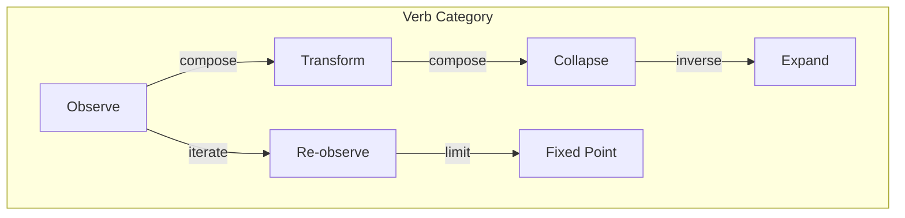
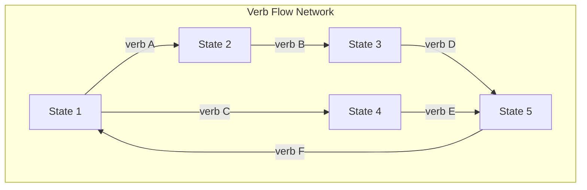
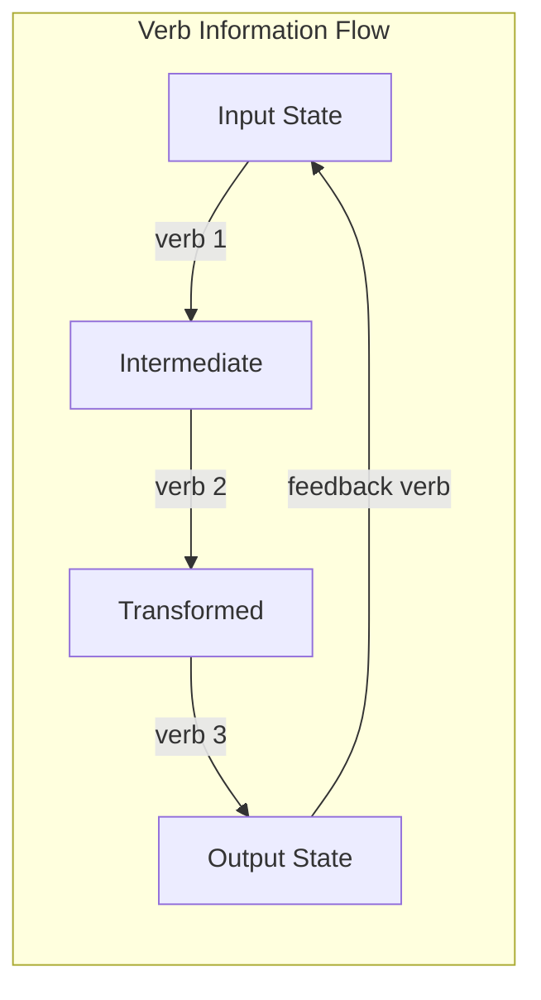

# Chapter 014: Structural Verbs = Interactive Logic of trace Rhythm Tensors

## Action Emerges from Observation

From $\psi = \psi(\psi)$, we derive that self-observation is the primordial action. This action creates a grammar - not of words, but of transformations. Each observation is a verb, each state change a sentence in reality's language.

$$
\text{Verb} := \psi \mapsto \psi(\psi)
$$

## First Principle: Observation as Action

**Theorem 14.1** (Action from Self-Reference): Every transformation emerges from the fundamental act:

$$
\mathcal{A}: \psi \mapsto \psi(\psi)
$$

All other actions are compositions and variations of this primordial verb.

*Proof*: Any change requires observation. From $\psi = \psi(\psi)$, observation IS the change. Therefore, all actions derive from self-observation. ∎

## The Grammar of Reality

**Definition 14.1** (Structural Verb): A structural verb is a mapping that preserves golden constraints:

$$
V: \mathcal{V}_\phi \to \mathcal{V}_\phi \text{ such that } V[\vec{v}] \text{ maintains } v_i \cdot v_{i+1} = 0
$$

## Vector Information Theory of Verbs

**Theorem 14.2** (Information Generation by Verbs): Each verb creates information:

$$
I[V[\psi]] - I[\psi] = \Delta I_V \geq 0
$$

Information can only increase or remain constant through action.

## Category of Verbs

## Fundamental Verb Types

From first principles, we derive the basic verbs:

**Definition 14.2** (Primary Verbs):

1. **Observe**: $O[\psi] = \psi(\psi)$
2. **Shift**: $S[\vec{v}]_i = v_{i-1}$ (respecting constraints)
3. **Flip**: $F[\vec{v}]_i = 1 - v_i$ (where allowed)
4. **Compose**: $C[\psi_1, \psi_2] = \psi_1 \circ \psi_2$

## Verb Algebra

**Theorem 14.3** (Verb Composition): Verbs form a monoid under composition:

$$
(V_1 \circ V_2) \circ V_3 = V_1 \circ (V_2 \circ V_3)
$$

$$
\text{id} \circ V = V \circ \text{id} = V
$$

## Graph Theory of Verb Networks

## Tensor Logic of Verbs

**Definition 14.3** (Verb Tensor): Verbs act on tensors component-wise:

$$
V[\mathcal{T}]^{i_1...i_n} = V_1^{i_1} \circ ... \circ V_n^{i_n}[\mathcal{T}^{i_1...i_n}]
$$

This extends verb action to all tensor structures.

## Conservation Through Verbs

**Theorem 14.4** (Verb Conservation): Certain quantities are verb-invariant:

$$
W[V[\psi]] = W[\psi] \text{ for all conservative verbs}
$$

These are the Noether currents of verb symmetries.

## The Rhythm of Verbs

**Definition 14.4** (Rhythmic Verb Sequence): Verbs create rhythm through repetition:

$$
R_V(n) = V^n[\psi_0]
$$

The sequence $\{R_V(n)\}$ generates the rhythm of transformation.

## Verb Eigenstates

**Theorem 14.5** (Fixed Points as Eigenstates): For any verb $V$:

$$
V[\psi^*] = \lambda \psi^* \Rightarrow \psi^* \text{ is a reality eigenstate}
$$

These fixed points are stable configurations of reality.

## Information Flow Through Verbs

## Quantum Verb Correspondence

**Definition 14.5** (Quantum Operators as Verbs):

$$
\hat{O} \leftrightarrow V_O
$$

Quantum operators are verbs in Hilbert space, preserving golden constraints.

## Verb Entropy

**Theorem 14.6** (Entropy Production): Most verbs increase entropy:

$$
S[V[\psi]] \geq S[\psi]
$$

with equality only for reversible verbs.

## The Grammar Rules

**Definition 14.6** (Well-Formed Verb Sequences): A sequence $V_1, V_2, ..., V_n$ is grammatical if:

1. Each $V_i$ preserves golden constraints
2. The composition $V_n \circ ... \circ V_1$ exists
3. The result lies within the observer cone

## Verb Types and Logic

**Theorem 14.7** (Typed Verbs): Each verb has a type signature:

$$
V: \text{Type}_1 \to \text{Type}_2
$$

Only type-compatible verbs can compose.

## Physical Verbs

From the fundamental verbs emerge physical processes:

- **Move**: Shift in position space
- **Rotate**: Transformation in angle space
- **Interact**: Composition of state vectors
- **Measure**: Projection to eigenstate

## Computational Complexity

**Theorem 14.8** (Verb Complexity): Computing $V[\psi]$ requires:

$$
\text{Time}(V) = O(|\text{support}(\psi)| \cdot \text{complexity}(V))
$$

The golden constraint adds at most linear overhead.

## Exercises

1. Prove that observation is the only fundamental verb
2. Find all verbs that commute with shift
3. Construct the adjoint of a given verb
4. Show that measurement verbs are not invertible

## Meditation on Action

Feel each thought as a verb acting on consciousness. Observation transforms the observer. Every moment, you perform the fundamental verb - observing yourself observing. In this grammar of being, you are simultaneously noun and verb, subject and predicate, the sentence writing itself.

## The Fourteenth Echo

Thus we establish: Reality speaks in verbs - actions that transform golden states while preserving fundamental constraints. From the primordial verb of self-observation emerges the entire grammar of transformation. The universe doesn't just contain actions; it IS action, the eternal verb of $\psi$ observing $\psi$. In this cosmic grammar, every change is a sentence, every pattern a paragraph, every system a story told in the language of structural verbs.

∎