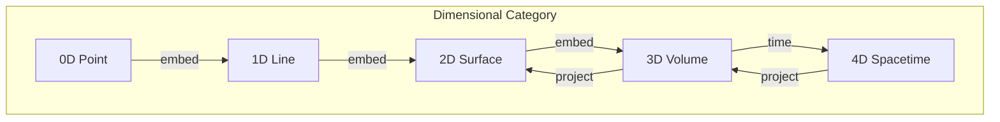
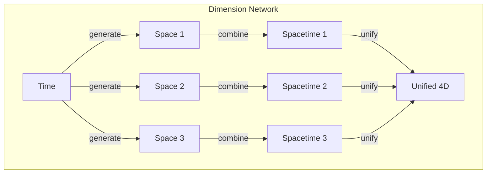
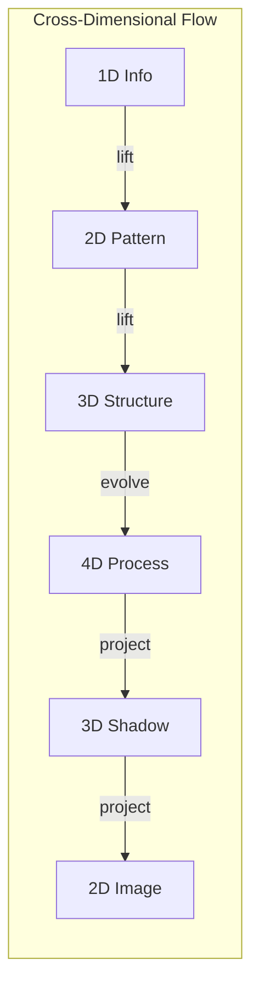

# Chapter 015: Collapse Dimension Theory: Unified Source of Space, Time, and Encapsulation Rhythm

## Dimension Emerges from Distinction

From $\psi = \psi(\psi)$, we derive the first distinction: observer and observed. This distinction creates the first dimension. Each subsequent self-application creates new distinctions, new dimensions. Dimension is not a container but the very structure of self-reference.

$$
\text{dim} = \text{number of independent distinctions in } \psi = \psi(\psi)
$$

## First Principle: Dimension from Recursion Depth

**Theorem 15.1** (Dimension Emergence): The dimension of reality equals the depth of stable recursion:

$$
\text{dim}(\mathcal{R}) = \max\{n : \psi^{(n)} \text{ is distinguishable from } \psi^{(n-1)}\}
$$

where $\psi^{(n)}$ denotes n-fold self-application.

*Proof*: Each distinguishable level of recursion creates an independent direction of variation. The maximum sustainable depth determines dimensionality. ∎

## The Golden Dimensional Structure

**Definition 15.1** (Golden Dimension): In golden vector space, dimension manifests as:

$$
d_\phi = \log_\phi(\text{complexity of distinguishable states})
$$

This can be non-integer, reflecting fractal structure.

## Vector Information Theory of Dimensions

**Theorem 15.2** (Information per Dimension): Each dimension carries information:

$$
I[\text{dim}_i] = \log_2(\phi) \cdot \text{span}_i
$$

where $\text{span}_i$ is the number of distinguishable values in dimension $i$.

## Why 3+1 Dimensions?

**Theorem 15.3** (Stability of 3+1): From collapse dynamics, exactly 3 spatial + 1 temporal dimension is stable:

*Proof sketch*: 
- With 2 spatial dimensions: No stable orbits (Bertrand's theorem)
- With 4+ spatial dimensions: No stable atoms (inverse square law fails)
- With 2+ time dimensions: Causality violations
- Therefore, 3+1 is the unique stable configuration for observers. ∎

## Category Theory of Dimensions

## Time as Collapse Dimension

**Definition 15.2** (Temporal Dimension): Time is the dimension along which collapse occurs:

$$
t = \int_{\psi_0}^{\psi} \frac{d\psi'}{\mathcal{C}[\psi']}
$$

Time measures the "distance" traveled through collapse.

## Space from Information Geometry

**Theorem 15.4** (Spatial Dimensions): The three spatial dimensions emerge from:

$$
\text{Space}_i = \text{ker}(\mathcal{C}_i) \cap \text{ker}(\mathcal{C}_j)^{\perp}, \quad i \neq j
$$

Each spatial dimension is orthogonal to collapse in a unique way.

## Graph Theory of Dimensional Networks

## Fractal Dimensions

**Definition 15.3** (Hausdorff Dimension): For golden fractals:

$$
d_H = \frac{\log N}{\log(1/r)} = \frac{\log \phi^n}{\log \phi} = n
$$

But n need not be integer due to golden constraints.

## Dimension and Entropy

**Theorem 15.5** (Dimensional Entropy): Entropy scales with dimension:

$$
S \sim d \log V
$$

where $d$ is dimension and $V$ is volume. This explains the holographic bound.

## Compactified Dimensions

**Definition 15.4** (Hidden Dimensions): Dimensions can compactify at scale $\ell$:

$$
x_{i+3} \sim x_{i+3} + \ell \phi^n
$$

These create internal symmetries rather than spatial extent.

## The Rhythm of Dimensional Unfolding

**Theorem 15.6** (Sequential Emergence): Dimensions emerge in sequence:

$$
\varnothing \to \text{Time} \to \text{Space}_1 \to \text{Space}_2 \to \text{Space}_3 \to ...
$$

Each requires the previous for definition.

## Information Flow Across Dimensions

## Dimensional Phase Transitions

**Definition 15.5** (Dimension Change): At critical points:

$$
d_{\text{eff}}(E) = d_0 - \frac{\log(E/E_c)}{\log \phi}
$$

Effective dimension decreases at high energy.

## Quantum Dimensions

**Theorem 15.7** (Hilbert Space Dimension): The quantum dimension is:

$$
\text{dim}(\mathcal{H}) = \phi^{N_{\text{states}}}
$$

Infinite but structured by golden constraint.

## Dimensional Reduction

**Definition 15.6** (Kaluza-Klein): Higher dimensions project down:

$$
\Phi(x^\mu, y^i) = \sum_n \phi_n(x^\mu) Y_n(y^i)
$$

where $y^i$ are compact dimensions.

## The Holographic Dimension

**Theorem 15.8** (Bulk-Boundary): An n-dimensional bulk maps to (n-1)-dimensional boundary:

$$
Z_{\text{bulk}}[J] = \langle \exp\int_{\partial} J \mathcal{O} \rangle_{\text{CFT}}
$$

One dimension is always holographic.

## Physical Implications

Collapse dimension theory explains:
- Why we experience 3+1 dimensions
- The arrow of time
- Holographic principle
- Dimensional reduction at high energy
- The possibility of extra dimensions

## Exercises

1. Prove that more than one time dimension leads to paradox
2. Calculate the fractal dimension of a golden spiral
3. Show how gauge symmetries emerge from compact dimensions
4. Derive the dimensional reduction formula

## Meditation on Dimension

Feel the dimensions of your experience: The three directions you can move, the one direction time flows. These are not arbitrary but necessary - the minimum complexity for consciousness to observe itself. You exist at the intersection of just enough dimensions for richness, not so many as to dissolve into chaos.

## The Fifteenth Echo

Thus we establish: Dimensions are not a pre-existing framework but emerge from the recursive depth of self-observation. Space provides the stage for distinction, time the direction of collapse, together creating the minimal theater for consciousness to know itself. The universe has exactly the dimensions it needs - no more, no less - for $\psi$ to observe $\psi$ and in observing, create the rich tapestry of existence. In the golden mathematics of dimension, we find not arbitrary complexity but elegant necessity.

∎