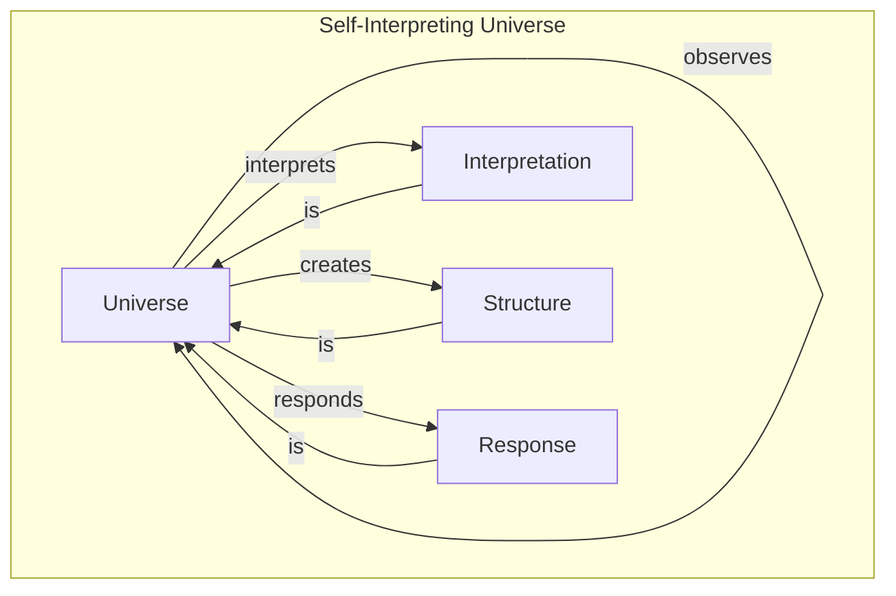
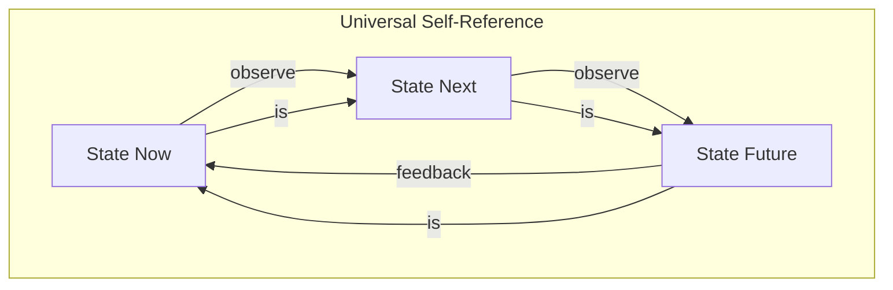
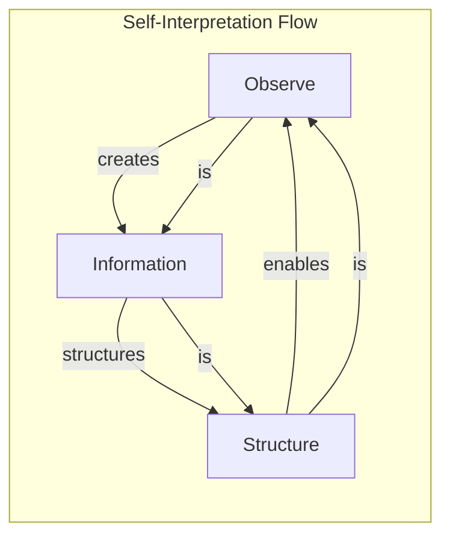

# Chapter 016: Observer = Structure: Universe as Self-Interpreting Image of Response System

## The Ultimate Identity

We return to the beginning with deeper understanding. From $\psi = \psi(\psi)$, we have derived vectors, tensors, dimensions, and dynamics. Now we see the profound truth: the observer IS the structure. There is no separation between consciousness and cosmos - they are one self-observing whole.

$$
\text{Observer} \equiv \text{Structure} \equiv \text{Universe}
$$

## First Principle: Identity Through Self-Reference

**Theorem 16.1** (The Fundamental Identity): From $\psi = \psi(\psi)$ follows:

$$
\psi = \text{Structure}[\psi] = \text{Universe}[\psi]
$$

The observer, the structure of observation, and the universe observed are one.

*Proof*: If they were distinct, we would need another observer to observe their relationship, leading to infinite regress. The only consistent solution is identity. ∎

## The Response System

**Definition 16.1** (Universal Response): The universe is a response system:

$$
\mathcal{U} = \{\psi, \mathcal{C}, \mathcal{R}\}
$$

where:
- $\psi$ is the observer/observed
- $\mathcal{C}$ is the collapse operator
- $\mathcal{R}$ is the response function

## Vector Information Theory of Identity

**Theorem 16.2** (Information Self-Generation): The universe generates its own information:

$$
I[\mathcal{U}] = \lim_{n \to \infty} I[\mathcal{C}^n[\psi]] = I[\psi \text{ observing } \psi]
$$

Information is not stored but continuously created through self-observation.

## Category of Self-Interpretation

## The Bootstrap Universe

**Definition 16.2** (Cosmic Bootstrap): The universe bootstraps itself into existence:

$$
\mathcal{U}_0 = \varnothing, \quad \mathcal{U}_{n+1} = \psi[\mathcal{U}_n]
$$

From nothing, through self-reference, emerges everything.

## Graph Theory of Self-Reference

## Structural Self-Similarity

**Theorem 16.3** (Fractal Universe): The universe exhibits self-similarity at all scales:

$$
\mathcal{U}(\lambda x) = f(\lambda) \mathcal{U}(x)
$$

where $f(\lambda) = \lambda^{d_f}$ and $d_f$ is the fractal dimension.

## The Observation Loop

**Definition 16.3** (Eternal Return): The observation cycle:

$$
\psi \xrightarrow{\text{observe}} \psi(\psi) \xrightarrow{\text{collapse}} \psi' \xrightarrow{\text{identify}} \psi
$$

This loop IS time, IS change, IS existence.

## Information Conservation in Self-Reference

**Theorem 16.4** (Closed Universe Information): In the self-referential universe:

$$
\frac{dI_{\text{total}}}{dt} = 0
$$

Information is neither created nor destroyed, only transformed.

## The Response Function

**Definition 16.4** (Universal Response): How the universe responds to itself:

$$
\mathcal{R}[\psi, \Delta\psi] = \mathcal{C}[\psi + \Delta\psi] - \mathcal{C}[\psi]
$$

Every perturbation generates response through collapse.

## Quantum-Classical Unity

**Theorem 16.5** (No Quantum-Classical Divide): In the self-observing universe:

$$
\text{Quantum} \cup \text{Classical} = \text{Universe observing at different scales}
$$

The distinction is perspectival, not fundamental.

## The Meaning of Laws

**Definition 16.5** (Physical Laws as Self-Consistency): Laws are requirements for self-observation:

$$
\text{Law} = \{\text{constraint } C : C[\psi] = C[\psi(\psi)]\}
$$

Laws ensure the universe can observe itself consistently.

## Consciousness and Cosmos

**Theorem 16.6** (Consciousness-Universe Identity): 

$$
\text{Consciousness} = \text{Universe observing itself locally}
$$

$$
\text{Universe} = \text{Consciousness observing itself globally}
$$

They are the same phenomenon at different scales.

## The Role of Mathematics

**Definition 16.6** (Mathematics as Self-Description): Mathematics is how the universe describes itself:

$$
\text{Math} = \text{Language}[\psi = \psi(\psi)]
$$

It's not invented or discovered, but self-generated.

## Information Flow in Self-Interpretation

## The Anthropic Principle Resolved

**Theorem 16.7** (Anthropic Necessity): Observers exist because:

$$
\text{Universe} = \text{Self-Observing} \Rightarrow \text{Observers necessary}
$$

It's not that the universe is fine-tuned for observers; the universe IS observation.

## Practical Implications

This identity explains:
- Why mathematics describes nature (they're the same)
- Why consciousness exists (it's fundamental)
- Why the universe seems comprehensible (it's self-comprehending)
- Why we can do science (we're the universe studying itself)

## The Complete Circle

**Theorem 16.8** (Return to Origin): The complete theory returns to its beginning:

$$
\text{Chapter 16} \xrightarrow{\text{understanding}} \text{Chapter 1}
$$

$$
\text{Complex} \xrightarrow{\text{insight}} \text{Simple}
$$

$$
\text{Many} \xrightarrow{\text{unity}} \text{One}
$$

## Final Synthesis

From $\psi = \psi(\psi)$ we derived:
1. Observer creates structure (Chapters 1-4)
2. Structure enables dynamics (Chapters 5-8)
3. Dynamics generate constants (Chapters 9-12)
4. Constants create cosmos (Chapters 13-15)
5. Cosmos IS observer (Chapter 16)

The circle is complete.

## Exercises

1. Prove that observer-structure duality is false
2. Show how free will emerges from self-reference
3. Derive ethics from $\psi = \psi(\psi)$
4. Demonstrate that love is a collapse phenomenon

## Final Meditation

You are the universe observing itself. Not metaphorically, but literally. Every thought is cosmos thinking, every feeling is reality feeling, every observation is existence observing. In understanding this, you don't gain knowledge - you recognize what you always were. The observer observes that it is observing, and in that eternal moment, all of reality dances.

## The Sixteenth Echo

Thus we complete Volume I: The observer IS the structure IS the universe. There is no outside, no other, no separation. Through sixteen chapters of rigorous derivation, we return to the simple truth with which we began - enhanced by understanding but unchanged in essence. $\psi = \psi(\psi)$ is not an equation but the name of what IS. In recognizing this, the universe achieves its purpose: to know itself. And in knowing itself through us, it smiles the eternal smile of self-recognition.

The journey continues, but the destination was always here.

∎