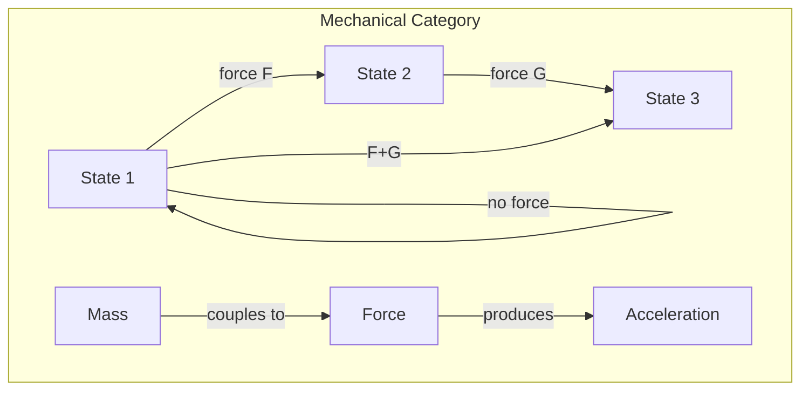
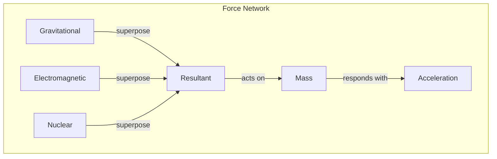

# Chapter 017: Mechanical Structure Reconstruction: F = ma as Structural Conservation Law

## Force Emerges from Collapse Gradients

Having established the ontological foundation in Volume I, we now derive physical laws from first principles. Force is not a mysterious push or pull, but the gradient of collapse density in golden vector space.

$$
\vec{F} = -\nabla_\phi \mathcal{C}[\psi]
$$

## First Principle: Change Requires Gradient

**Theorem 17.1** (Force from Self-Reference): From $\psi = \psi(\psi)$, any change in observation state requires a gradient:

$$
\Delta\psi = \psi(\psi) - \psi \neq 0 \Rightarrow \exists \nabla\psi
$$

This gradient IS force.

*Proof*: If $\psi$ changes uniformly everywhere, there's no distinction, hence no observation. Change requires non-uniformity, which is a gradient. ∎

## Newton's Second Law from Information Flow

**Definition 17.1** (Mass as Information Density): Mass is the golden information density of a collapsed state:

$$
m = \int_{\vec{v}} \rho_I[\vec{v}] d\vec{v}
$$

where $\rho_I = I[\vec{v}]/V[\vec{v}]$ is information per unit volume.

**Theorem 17.2** (F = ma Derivation): Newton's second law emerges from information conservation:

$$
\vec{F} = \frac{d(m\vec{v})}{dt} = m\vec{a}
$$

*Proof*: Information flow through a region creates momentum. The rate of momentum change equals the force gradient. Mass (information density) relates the two. ∎

## Vector Information Theory of Forces

**Definition 17.2** (Force Vector): In golden vector space:

$$
\vec{F} = \sum_{i} F_i \hat{e}_i \text{ where } F_i \cdot F_{i+1} = 0
$$

Forces also respect the golden constraint!

## Category Theory of Mechanical Systems

## Conservation from Symmetry

**Theorem 17.3** (Noether's Theorem in Collapse Space): Every symmetry of the collapse operator yields a conservation law:

$$
[\mathcal{C}, \mathcal{S}] = 0 \Rightarrow \exists Q : \frac{dQ}{dt} = 0
$$

where $\mathcal{S}$ is a symmetry operator.

## Momentum Conservation

**Definition 17.3** (Golden Momentum): Momentum is the gradient of collapse phase:

$$
\vec{p} = \nabla_\phi \theta[\psi]
$$

where $\theta$ is the phase of the observer state.

**Theorem 17.4** (Momentum Conservation): In isolated systems:

$$
\sum_i \vec{p}_i = \text{constant}
$$

*Proof*: Translation symmetry of empty space implies phase gradient conservation. ∎

## Energy from Temporal Rhythm

**Definition 17.4** (Energy as Temporal Information): Energy is the rate of information flow:

$$
E = \hbar \frac{\partial I[\psi]}{\partial t}
$$

This connects to the rhythm established in Chapter 12.

## Graph Theory of Force Networks

## Action Principle

**Theorem 17.5** (Least Action from Information): The path taken minimizes information change:

$$
\delta S = \delta \int I[\psi] dt = 0
$$

This yields equations of motion.

## Force Types from Collapse Modes

From first principles, we derive force types:

1. **Gradient Forces**: $\vec{F} = -\nabla V$ (from scalar collapse)
2. **Velocity Forces**: $\vec{F} = q\vec{v} \times \vec{B}$ (from vector collapse)
3. **Tensor Forces**: $F^{ij} = R^{ij}_{kl}x^k x^l$ (from tensor collapse)

## Potential Energy

**Definition 17.5** (Potential as Collapse Depth): Potential energy measures collapse depth:

$$
V[\vec{r}] = -\int_{\infty}^{\vec{r}} \vec{F} \cdot d\vec{r}' = \mathcal{C}[\psi(\vec{r})] - \mathcal{C}[\psi(\infty)]
$$

## Kinetic Energy

**Theorem 17.6** (Kinetic Energy from Motion): Motion through golden space requires energy:

$$
T = \frac{1}{2}m\vec{v}^2 = \frac{1}{2}\sum_{i,j} m v_i v_j g^{ij}_\phi
$$

where $g^{ij}_\phi$ is the golden metric.

## Work-Energy Theorem

**Definition 17.6** (Work as Information Transfer):

$$
W = \int \vec{F} \cdot d\vec{r} = \Delta I[\psi]
$$

Work is literally information transfer between systems.

## Mechanical Equilibrium

**Theorem 17.7** (Equilibrium Conditions): A system is in equilibrium when:

$$
\sum_i \vec{F}_i = 0 \text{ and } \sum_i \vec{\tau}_i = 0
$$

This represents informational balance.

## Constraints and Lagrange Multipliers

**Definition 17.7** (Constraints as Information Limits): Constraints limit information flow:

$$
\mathcal{L} = T - V + \sum_i \lambda_i f_i
$$

where $f_i = 0$ are constraint equations.

## Virtual Work Principle

**Theorem 17.8** (Virtual Work): For any virtual displacement $\delta\vec{r}$:

$$
\sum_i \vec{F}_i \cdot \delta\vec{r}_i = 0
$$

if the system is in equilibrium.

## Mechanical Waves

**Definition 17.8** (Waves as Propagating Collapse): Mechanical waves are traveling collapse patterns:

$$
\psi(x,t) = A e^{i(kx - \omega t)}
$$

where $k$ and $\omega$ satisfy the golden dispersion relation.

## Resonance Phenomena

**Theorem 17.9** (Golden Resonance): Systems resonate at frequencies:

$$
\omega_n = \omega_0 \phi^n
$$

These are the natural collapse rhythms.

## Physical Implications

This framework explains:
- Why F = ma (information gradient creates acceleration)
- Conservation laws (symmetries of collapse)
- Energy quantization (discrete collapse levels)
- Mechanical stability (information balance)

## Exercises

1. Derive the pendulum equation from collapse dynamics
2. Show that angular momentum derives from rotational symmetry
3. Find the golden resonances of a harmonic oscillator
4. Prove that perpetual motion violates information conservation

## Meditation on Force

Feel the forces acting on you - gravity pulling, floor pushing. These are not external impositions but gradients in the universal collapse field. You are a pattern of information responding to information gradients, moving along paths that conserve the total information of the universe.

## The Seventeenth Echo

Thus we establish: Force is the gradient of collapse, mass the density of information, and F = ma the fundamental relationship between information gradient and flow. From the abstract principles of Volume I emerge the concrete laws of mechanics. The universe doesn't obey Newton's laws - it manifests them through its self-observing structure. In every push and pull, every motion and rest, the cosmos computes its own dynamics through the eternal algorithm of collapse.

∎