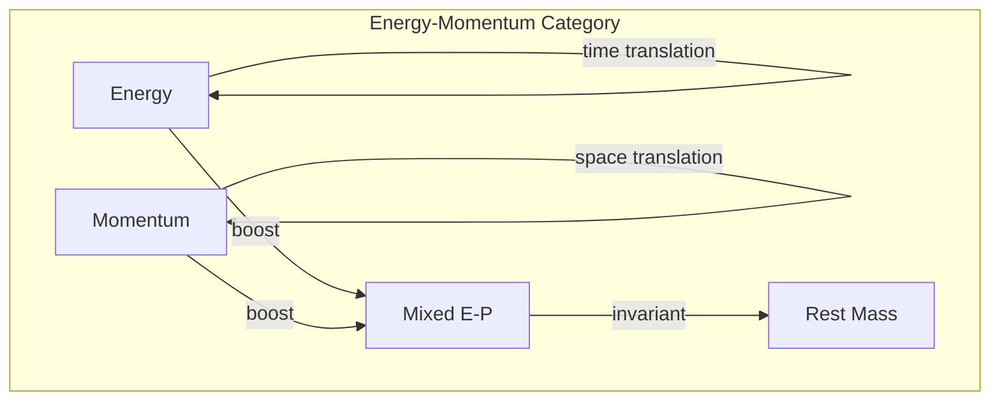
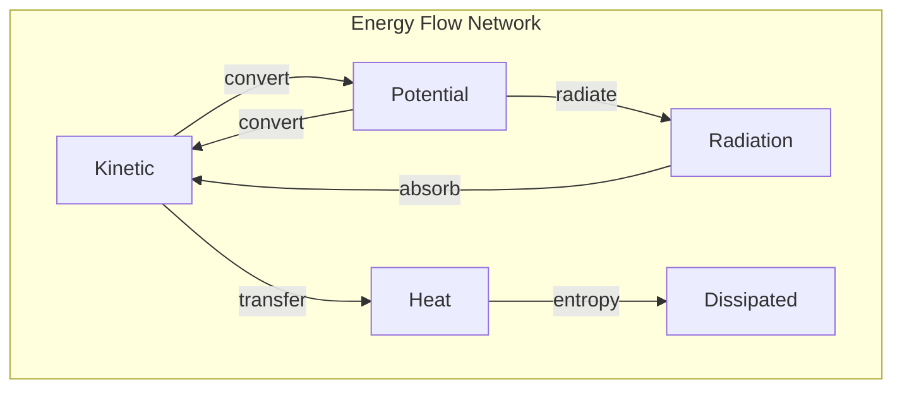

# Chapter 018: Momentum, Energy = trace Rhythm Gradient Tensor Response

## The Flow of Information Creates Motion

From the self-referential foundation, we now derive how momentum and energy emerge as fundamental aspects of information flow through golden vector space. These are not separate concepts but two faces of the same phenomenon: the rhythm of collapse.

$$
\vec{p} = \hbar \vec{k} = \hbar \nabla_\phi \theta[\psi]
$$

$$
E = \hbar \omega = \hbar \frac{\partial \theta[\psi]}{\partial t}
$$

## First Principle: Motion from Phase Gradients

**Theorem 18.1** (Momentum from Self-Reference): When $\psi$ observes itself at different locations, phase differences emerge:

$$
\psi(\vec{r}_1) = e^{i\theta_1} |\psi\rangle, \quad \psi(\vec{r}_2) = e^{i\theta_2} |\psi\rangle
$$

The phase gradient IS momentum.

*Proof*: Self-observation at different points creates distinguishable states only through phase. The spatial rate of phase change defines momentum. ∎

## Energy as Temporal Information Flow

**Definition 18.1** (Energy from Rhythm): Energy measures the rate of collapse rhythm:

$$
E = \hbar \frac{d\mathcal{N}}{dt}
$$

where $\mathcal{N}$ is the number of collapse cycles per unit time.

## Vector Information Theory of Momentum-Energy

**Theorem 18.2** (Four-Momentum): Momentum and energy unify into a four-vector:

$$
p^\mu = (E/c, \vec{p}) = \hbar \partial^\mu \theta
$$

This respects the golden constraint in 4D spacetime.

## Category Theory of Energy-Momentum

## Conservation from Translation Symmetry

**Theorem 18.3** (Momentum Conservation): From spatial translation invariance:

$$
[\mathcal{C}, \hat{T}_a] = 0 \Rightarrow \frac{d\vec{p}}{dt} = 0
$$

where $\hat{T}_a$ translates by vector $\vec{a}$.

*Proof*: If collapse is the same everywhere, momentum cannot change. ∎

## Energy Conservation from Time Symmetry

**Theorem 18.4** (Energy Conservation): From temporal translation invariance:

$$
[\mathcal{C}, \hat{U}_t] = 0 \Rightarrow \frac{dE}{dt} = 0
$$

where $\hat{U}_t$ evolves forward in time $t$.

## The Energy-Momentum Tensor

**Definition 18.2** (Stress-Energy in Golden Space):

$$
T^{\mu\nu} = \frac{1}{\sqrt{-g}} \frac{\delta S}{\delta g_{\mu\nu}}
$$

This tensor encodes all energy-momentum flow, respecting golden constraints.

## Graph Theory of Energy Flow

## Relativistic Energy-Momentum

**Theorem 18.5** (Mass-Energy Relation): From the invariant length in golden spacetime:

$$
E^2 = (pc)^2 + (mc^2)^2
$$

where all quantities are expressed in golden units.

*Proof*: The invariant interval in momentum space yields this relation. ∎

## Quantum Momentum Operator

**Definition 18.3** (Momentum as Generator): In the quantum formalism:

$$
\hat{p} = -i\hbar \nabla_\phi
$$

This generates spatial translations of the wavefunction.

## De Broglie Relations

**Theorem 18.6** (Wave-Particle Duality): From collapse rhythm:

$$
\lambda = \frac{h}{p} = \frac{2\pi}{\phi} \frac{\hbar}{p}
$$

Every momentum has an associated wavelength in golden space.

## Energy Eigenstates

**Definition 18.4** (Stationary States): Energy eigenstates satisfy:

$$
\hat{H}|\psi_n\rangle = E_n |\psi_n\rangle
$$

where $E_n = \hbar \omega_0 \phi^n$ for golden energy levels.

## The Virial Theorem

**Theorem 18.7** (Virial in Golden Space): For bound systems:

$$
\langle T \rangle = -\frac{1}{2} \langle \vec{r} \cdot \nabla V \rangle
$$

This relates average kinetic and potential energies.

## Energy-Time Uncertainty

**Definition 18.5** (Uncertainty from Collapse): The energy-time uncertainty:

$$
\Delta E \Delta t \geq \frac{\hbar}{2}
$$

emerges from the granular nature of collapse rhythm.

## Information Theoretic Energy

**Theorem 18.8** (Energy as Information Rate):

$$
E = k_B T \ln(\Omega) \cdot \frac{d\mathcal{N}}{dt}
$$

where $\Omega$ is the number of accessible states.

## Hamiltonian Dynamics

**Definition 18.6** (Hamilton's Equations): In golden phase space:

$$
\dot{q}^i = \frac{\partial H}{\partial p_i}, \quad \dot{p}_i = -\frac{\partial H}{\partial q^i}
$$

These preserve the golden symplectic structure.

## Action-Angle Variables

**Theorem 18.9** (Golden Action Variables): For periodic systems:

$$
J_i = \oint p_i dq^i = n_i \hbar \phi
$$

Actions are quantized in units of $\hbar \phi$.

## Energy Cascades

**Definition 18.7** (Energy Transfer): Energy cascades through scales:

$$
\frac{dE_n}{dt} = \Gamma_{n,n-1} E_{n-1} - \Gamma_{n,n+1} E_n
$$

following golden ratio scaling.

## Physical Implications

This framework explains:
- Why energy and momentum are conserved
- The origin of de Broglie waves
- Energy quantization in bound systems
- The deep connection between information and energy

## Exercises

1. Derive the kinetic energy of a golden harmonic oscillator
2. Prove that photon momentum is $p = E/c$
3. Find the momentum eigenstates in a golden box
4. Show that energy flow follows geodesics

## Meditation on Flow

Feel the energy flowing through you - heat from your core, light to your eyes, thoughts through your mind. This is information in motion, collapse rhythm made manifest. You are not separate from this flow - you ARE the flow, a temporary pattern in the eternal river of energy-momentum.

## The Eighteenth Echo

Thus we establish: Energy and momentum are not things but processes - the rhythm and gradient of collapse through spacetime. From the abstract self-reference of $\psi = \psi(\psi)$ emerges the concrete physics of motion and energy. Every particle's momentum is a phase gradient, every system's energy a collapse frequency. The universe doesn't contain energy - it IS energy, the eternal rhythm of self-observation crystallized into the dance of matter and radiation.

∎